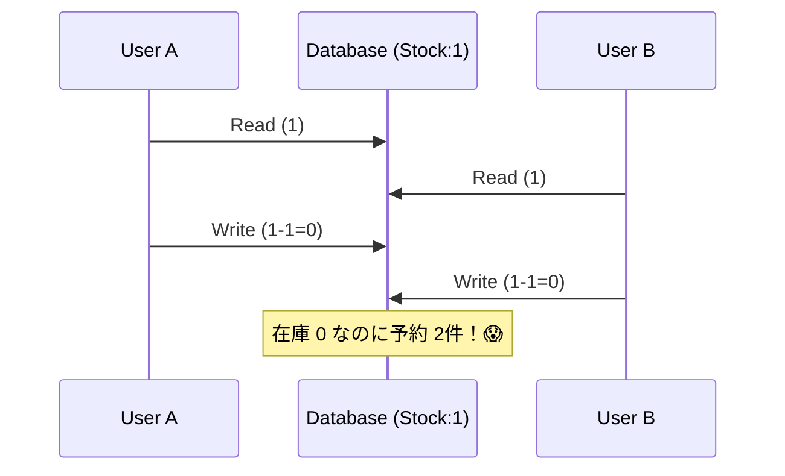

# 第21章：競合の正体（同時更新で壊れるパターン）💥⚔️

## 21.1 今日のゴール🎯✨

この章が終わると、こんなことができるようになります👇😊

* 「競合（コンフリクト）」を **わざと再現** できる🧪💥
* 競合が起きると何が壊れるかを **言葉で説明** できる🗣️📌
* テストで「壊れ方」を固定化して、**原因を分類**できる🔎🧠

---

## 21.2 競合ってなに？（超ざっくり）🧠🔀


**競合**は一言でいうと👇

> 「ほぼ同時に、同じデータを更新して、結果が壊れること」💣

分散とか最終的整合性だと、これがめちゃ起きやすいです😵‍💫
理由はシンプルで、**更新が1本道じゃない**から👇

* 受付API（早く返す）と、後処理Worker（あとで反映）が別🧵
* ネットワーク遅延で順序がズレる⏳🔀
* リトライで同じ処理が複数回走る🔁⚠️

---

## 21.3 競合の「3大・壊れ方」💥💥💥

この章では、まず **壊れ方の型** を覚えます🧩✨
（型が分かると、現場でも原因が追いやすいよ〜😊）

### A) Lost Update（更新の取りこぼし）🕳️💔

**ありがちNo.1**
「読んで→計算して→書く」の途中で、別の更新が割り込むやつ😱

例：在庫が1のときに、2人が同時に買う🛒🛒

* 2人とも「在庫1ある！」と見える👀
* 2人とも注文OKになる✅✅
* 結果：**在庫は0のままなのに、注文が2件通る**（実質“売り過ぎ”）💀




---

### B) 二重反映（Double Apply）📨📨➡️💥


リトライや重複配達で、**同じイベントを2回反映**しちゃうやつ😵

例：

* 「ポイント+10」イベントが2回処理されて +20 になる🎁➡️🎁🎁
* 「在庫-1」イベントが2回処理されて在庫が減りすぎる📉💥

---

### C) 取り消し漏れ（Cancel Leak）🧨🕳️


「取り消し（キャンセル）」が **反映されない/遅れる/順序が逆** になるやつ😱

例：

* 注文キャンセルしたのに、在庫が戻らない（戻しイベントが欠落）📦❌
* 「キャンセル」→「確定」が逆順に到着して、結局確定になっちゃう🔀😇💥

---

## 21.4 ハンズオン🧪：Lost Update を “確実に” 起こすテストを作ろう💥⚔️

ここからは手を動かします✋✨
狙いはこれ👇

* **同時更新**で壊れる
* しかも **テストで毎回再現**できる（大事！）🎯

### 今回の題材🛒📦

**在庫予約（reserve）** を作ります。

* 初期在庫：`1`
* 同時に2つ予約要求が来る：`qty=1` と `qty=1`
* 正常なら：片方だけ成功 ✅ / もう片方は失敗 ❌
* でもナイーブ実装だと：両方成功しがち ✅✅（= 売り過ぎ）💀

---

## 21.5 実装①：わざと壊れる「ナイーブ在庫リポジトリ」🧨


ポイントはここ👇

* 「在庫を読む」
* **ちょっと待つ（ここが罠）**⏳
* 「在庫を書き戻す」

この “待ち” の間に別リクエストが割り込むと、競合します💥

```ts
// apps/api/src/inventory/inventoryRepo.ts
export type Reservation = { orderId: string; sku: string; qty: number };

const sleep = (ms: number) => new Promise<void>(r => setTimeout(r, ms));
const jitter = (min: number, max: number) =>
  Math.floor(Math.random() * (max - min + 1)) + min;

export class InventoryRepoNaive {
  private stock = new Map<string, number>();
  private reservations: Reservation[] = [];

  seed(sku: string, qty: number) {
    this.stock.set(sku, qty);
    this.reservations = [];
  }

  snapshot(sku: string) {
    return {
      sku,
      stock: this.stock.get(sku) ?? 0,
      reservations: [...this.reservations],
    };
  }

  async reserve(sku: string, orderId: string, qty: number) {
    const current = this.stock.get(sku) ?? 0;

    if (current < qty) {
      return { ok: false as const, reason: "OUT_OF_STOCK" as const };
    }

    // ✅ ここが競合ポイント：read -> (await) -> write
    await sleep(jitter(10, 40));

    this.stock.set(sku, current - qty);
    this.reservations.push({ sku, orderId, qty });

    return { ok: true as const };
  }
}
```

---

## 21.6 実装②：APIルート（在庫予約）🚪✨

Fastifyで `POST /inventory/:sku/reserve` を作るイメージです😊
（Fastifyは軽量で速いのが売りのフレームワークだよ〜⚡ ([Fastify][1])）

```ts
// apps/api/src/app.ts
import Fastify from "fastify";
import { InventoryRepoNaive } from "./inventory/inventoryRepo";

export function buildApp(repo: InventoryRepoNaive) {
  const app = Fastify({ logger: false });

  app.post<{
    Params: { sku: string };
    Body: { orderId: string; qty: number };
  }>("/inventory/:sku/reserve", async (req, reply) => {
    const { sku } = req.params;
    const { orderId, qty } = req.body;

    const result = await repo.reserve(sku, orderId, qty);

    if (!result.ok) {
      return reply.code(409).send({ ok: false, reason: result.reason });
    }
    return reply.code(200).send({ ok: true });
  });

  return app;
}
```

---

## 21.7 実装③：同時更新テスト（まずは“たまに壊れる”版）🎲💥

ここでは Vitest を使います🧪
Vitestは Vite由来で、TSのテストがやりやすい系のテスティング環境だよ〜😊 ([Vitest][2])

```ts
// apps/api/test/conflict.lost-update.flaky.test.ts
import { describe, test, expect } from "vitest";
import { InventoryRepoNaive } from "../src/inventory/inventoryRepo";
import { buildApp } from "../src/app";

describe("競合（flaky版）", () => {
  test("在庫1に対して同時に2件予約すると、片方は失敗してほしい（でも壊れることがある）", async () => {
    const repo = new InventoryRepoNaive();
    repo.seed("sku-1", 1);

    const app = buildApp(repo);

    const req1 = app.inject({
      method: "POST",
      url: "/inventory/sku-1/reserve",
      payload: { orderId: "order-A", qty: 1 },
    });
    const req2 = app.inject({
      method: "POST",
      url: "/inventory/sku-1/reserve",
      payload: { orderId: "order-B", qty: 1 },
    });

    const [r1, r2] = await Promise.all([req1, req2]);

    const okCount = [r1.statusCode, r2.statusCode].filter(s => s === 200).length;

    // ✅ 正常なら 1件だけ成功のはず
    expect(okCount).toBe(1);

    // 観察用
    const snap = repo.snapshot("sku-1");
    // console.log(snap);
  });
});
```

### 実行してみる🎮


```bash
npm test
```

🌀 ここで起きがちなのが…

* たまに通る✅
* たまに落ちる❌
* つまり「**フレーク（気まぐれ）**」😵‍💫

でも現場の競合って、こういう “たまに” が一番怖いんだよね…😇💣

---

## 21.8 “毎回” 壊れるようにする（再現性を作る）🎯✨


「たまに失敗」だと学びづらいので、**確実に競合させる仕掛け**を入れます🧪

### バリア（待ち合わせ）を作る🚧🧵

「2つのリクエストが、両方とも読み終わるまで待つ」→ それから同時に書く💥

```ts
// apps/api/src/inventory/barrier.ts
export class Barrier {
  private waiting = 0;
  private resolver: (() => void) | null = null;

  async arriveAndWait(parties: number) {
    this.waiting++;

    if (this.waiting === parties) {
      // 全員揃ったら一斉解放
      const r = this.resolver;
      this.resolver = null;
      this.waiting = 0;
      r?.();
      return;
    }

    await new Promise<void>(resolve => {
      this.resolver = resolve;
    });
  }
}
```

### ナイーブRepoに「バリアを挟める版」を足す🧨

```ts
// apps/api/src/inventory/inventoryRepoWithBarrier.ts
import { Barrier } from "./barrier";

export class InventoryRepoNaiveWithBarrier {
  private stock = new Map<string, number>();
  private reservations: { orderId: string; sku: string; qty: number }[] = [];
  constructor(private barrier: Barrier) {}

  seed(sku: string, qty: number) {
    this.stock.set(sku, qty);
    this.reservations = [];
  }

  snapshot(sku: string) {
    return { stock: this.stock.get(sku) ?? 0, reservations: [...this.reservations] };
  }

  async reserve(sku: string, orderId: string, qty: number) {
    const current = this.stock.get(sku) ?? 0;
    if (current < qty) return { ok: false as const, reason: "OUT_OF_STOCK" as const };

    // ✅ 2リクエストが「読んだ」時点で待ち合わせ
    await this.barrier.arriveAndWait(2);

    this.stock.set(sku, current - qty);
    this.reservations.push({ sku, orderId, qty });
    return { ok: true as const };
  }
}
```

### “必ず落ちる” テストにする🧪💥

```ts
// apps/api/test/conflict.lost-update.deterministic.test.ts
import { describe, test, expect } from "vitest";
import { Barrier } from "../src/inventory/barrier";
import { InventoryRepoNaiveWithBarrier } from "../src/inventory/inventoryRepoWithBarrier";
import { buildApp } from "../src/app";

describe("競合（再現性100%）", () => {
  test("在庫1なのに2件成功してしまう（売り過ぎ）", async () => {
    const barrier = new Barrier();
    const repo = new InventoryRepoNaiveWithBarrier(barrier);
    repo.seed("sku-1", 1);

    const app = buildApp(repo as any);

    const [r1, r2] = await Promise.all([
      app.inject({
        method: "POST",
        url: "/inventory/sku-1/reserve",
        payload: { orderId: "order-A", qty: 1 },
      }),
      app.inject({
        method: "POST",
        url: "/inventory/sku-1/reserve",
        payload: { orderId: "order-B", qty: 1 },
      }),
    ]);

    // ✅ ナイーブだと両方200になりがち（=壊れてる）
    expect(r1.statusCode).toBe(200);
    expect(r2.statusCode).toBe(200);

    const snap = repo.snapshot("sku-1");
    // 在庫は0に見えるけど、予約が2件ある → 売り過ぎ状態💀
    expect(snap.stock).toBe(0);
    expect(snap.reservations.length).toBe(2);
  });
});
```

🎉 これで「競合ってこう壊れる！」が、毎回見えるようになりました👏✨

---

## 21.9 壊れ方を “言語化” しよう🗣️📌（超重要）

今の状態を一言で言うと👇

* **在庫の最終値だけ見ても、事故に気づけない**😇
* でも **履歴（予約の件数）**を見ると事故がバレる💥

つまり、競合の怖さは👇

* 「DBの1つの数字」じゃなくて
* 「注文・在庫・決済の整合」みたいな **複数の整合条件（不変条件）** を壊すところ🧩💣

この “壊れた不変条件” を、次章でどう直すかやります🎛️🧠

---

## 21.10 競合の匂いチェックリスト👃⚠️

コードにこれがあったら要注意です😱

* `const x = await read();` のあとに `await` が挟まってから `await write(x - 1)` 🕳️
* 「上書き」で状態を作ってる（履歴じゃない）🧻💥
* リトライするのに「同じイベントを2回処理してもOK」の設計がない🔁❌
* “キャンセル” が別経路（別キュー/別サービス）で戻す構造になってる🧨🕳️

---

## 21.11 AI活用🤖✨：競合テストケースを量産しよう🧪

Copilot / Codex に投げると便利な指示例です👇💬

### ① 競合パターンを増やす🧠

* 「在庫予約で lost update が起きるテストを、3パターン作って。並列数を2/5/20にして、観測ポイントも入れて」

### ② 不変条件を列挙する📌

* 「注文・在庫・決済の不変条件（破れたら事故）を10個、ECの例で出して」

### ③ 取り消し漏れ系も作る🧨

* 「キャンセルイベントが欠落/遅延/逆順のときに壊れるテストケースを5個。最小の再現コード案も」

💡コツ：AIの出力はそのまま採用せず、
**“なぜそのテストが必要？”** を1行で書き足すと理解が伸びます🧠✨

---

## 21.12 ミニ理解チェック✍️✨（答えつき）

### Q1：在庫1なのに2つの注文が成功した。これはどれ？

A. Lost Update 🕳️💔
B. 二重反映 📨📨
C. 取り消し漏れ 🧨🕳️
✅ **答え：A**（“同じ在庫を見た”のが根っこ）

### Q2：「ポイント+10」イベントが重複配達されて、+20になった。これは？

✅ **答え：B**

### Q3：キャンセルしたのに在庫が戻らない（戻すイベントが来ない）。これは？

✅ **答え：C**

---

## 21.13 おまけ：最近のNode/TSまわりメモ📌🆕

（教材を2026年っぽく保つための軽いメモだよ😊🧾）

* Node.js は **v24 が Active LTS**、v25 が Current として更新されてるよ🟩⚙️ ([Node.js][3])
* TypeScript は npm 上で **5.9 系**が提供されていて、Node向けの `--module node18` / `--module node20` みたいな “固定フラグ” の話も増えてるよ🧩✨ ([npmjs.com][4])
* テストは Vitest が「Vite由来で設定が馴染みやすい」系として案内されてる🧪✨ ([Vitest][2])

---

## 21.14 この章のまとめ（結論1行）✍️✨

**競合は “たまたま壊れる” から怖い。だからテストで “毎回壊れる形” にして、壊れ方（型）を掴む！** 💥🧪✅

[1]: https://fastify.io/?utm_source=chatgpt.com "Fastify: Fast and low overhead web framework, for Node.js"
[2]: https://vitest.dev/?utm_source=chatgpt.com "Vitest | Next Generation testing framework"
[3]: https://nodejs.org/en/about/previous-releases?utm_source=chatgpt.com "Node.js Releases"
[4]: https://www.npmjs.com/package/typescript?utm_source=chatgpt.com "TypeScript"
