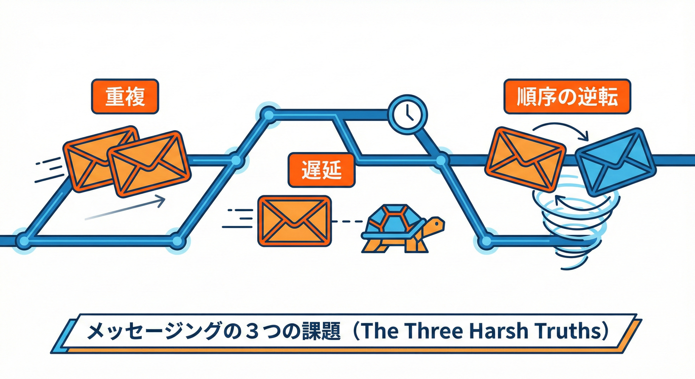
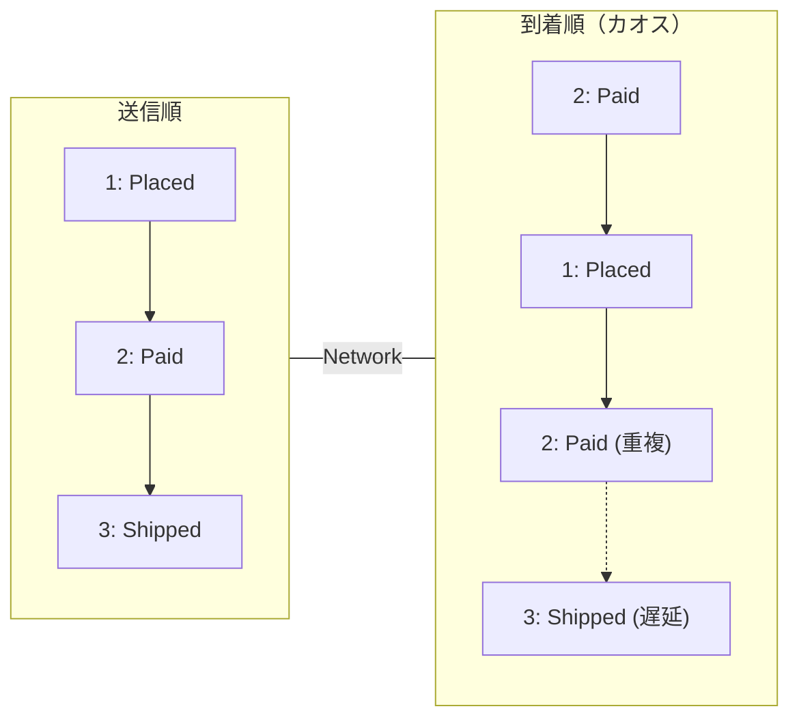

# 第23章：順序問題① 逆順・遅延・重複配達📨🔀

## 23.1 今日のゴール🎯✨

この章を終えると、こんなことができるようになります😊💡

* 「メッセージは **順番どおりに届かない**」を“当たり前”として説明できる📣
* **逆順🔀／遅延⏳／重複📨** がセットで来る理由をイメージできる🧠
* わざと“ぐちゃぐちゃ配達”を起こして、**壊れ方を観察**できる🧪👀
* 直す前に、まず **「どこが壊れる？」** を言語化できる✍️✨

---

## 23.2 まず結論💥（1行で）

分散の世界では **「届く順・届く回数・届くタイミング」** がキレイじゃないのが普通だよ〜😵‍💫📨

---

## 23.3 逆順・遅延・重複の“3点セット”ってなに？🔀⏳📨

 <!-- ref: 343 -->

### ① 逆順（Out-of-order）🔀

送った順と、受け取る順がズレること。

* 例：`支払い完了` が `注文作成` より先に届く😇💳➡️🛒

### ② 遅延（Delay）⏳

届くのが遅れること。

* 例：ネットワークが混雑して、1通だけ 5秒遅れて到着🐢💨

### ③ 重複（Duplicate）📨📨

同じメッセージが2回以上届くこと。

* 例：送った側は「失敗したかも？」と思って再送 → 実は最初のも届いてた😱🔁

> この3つは **別々に起きる** というより、だいたい **一緒に起きがち** です😵‍💫💥





---

## 23.4 現実のメッセージング事情（超ざっくり）🌍📮

 <!-- ref: 344 -->

「順番保証あるんじゃないの？」って思いがちだけど…**保証は“条件つき”** が多いです⚖️

* **AWS SQS（Standard）** は「たまに順不同・重複があり得る」前提で使うタイプだよ📨🔀 ([AWS ドキュメント][1])
* **Kafka** は「同じ partition（だいたい同じキー）内なら順番を読める」けど、全体の順序は別問題🧵 ([kafka.apache.org][2])
* **Google Cloud Pub/Sub** は基本が at-least-once（再配達あり）で、ordering key を使うと順序を頑張れるけど、再配達が起きると“後続も巻き込んで再配達”みたいな現象が起きうるよ📨⏳ ([Google Cloud][3])
* **RabbitMQ** は条件が揃うと順序が保たれる（ただし条件つき）📦📨 ([rabbitmq.com][4])

つまり…
**「順番は保証されることもあるけど、だいたい“限定的”」** って覚え方が安全です🛡️✨

---

## 23.5 ハンズオン：わざと“ぐちゃぐちゃ配達”を起こそう🧪🎛️

この章のハンズオンは、「正しく直す」より **“壊れ方を見て、言語化する”** が目的だよ😊📝

### 作るもの🧰✨

* メッセージ配達を **シャッフル🔀・遅延⏳・重複📨** させるユーティリティ
* それを使って、注文ステータスが壊れるデモ

---

## 23.6 実装①：カオス配達ユーティリティ🧰🤖

 <!-- ref: 345 -->

`apps/worker/src/chaos/chaosDelivery.ts` を作ってね📁✨

```ts
// apps/worker/src/chaos/chaosDelivery.ts
export type Msg<T = unknown> = {
  messageId: string;   // 重複判定に使う（ユニーク想定）
  type: string;
  payload: T;
  createdAt: number;   // “作った時刻” (後で罠になる…)
};

export type ChaosOptions = {
  duplicateRate: number;   // 0.0〜1.0（例: 0.3 = 30%で複製）
  minDelayMs: number;      // 最小遅延
  maxDelayMs: number;      // 最大遅延
  shuffle: boolean;        // true で逆順/順番ぐちゃぐちゃ
  seed?: number;           // デモを再現しやすくする
};

function sleep(ms: number) {
  return new Promise((r) => setTimeout(r, ms));
}

// かんたん seed 乱数（デモ用）🎲
function mulberry32(seed: number) {
  let t = seed >>> 0;
  return () => {
    t += 0x6d2b79f5;
    let x = Math.imul(t ^ (t >>> 15), 1 | t);
    x ^= x + Math.imul(x ^ (x >>> 7), 61 | x);
    return ((x ^ (x >>> 14)) >>> 0) / 4294967296;
  };
}

function shuffleInPlace<T>(arr: T[], rand: () => number) {
  for (let i = arr.length - 1; i > 0; i--) {
    const j = Math.floor(rand() * (i + 1));
    [arr[i], arr[j]] = [arr[j], arr[i]];
  }
}

export async function* chaosDeliver<T>(
  input: Msg<T>[],
  opt: ChaosOptions
): AsyncGenerator<Msg<T>> {
  const rand = mulberry32(opt.seed ?? Date.now());

  // 1) 重複を混ぜる📨📨
  const duplicated: Msg<T>[] = [];
  for (const m of input) {
    duplicated.push(m);
    if (rand() < opt.duplicateRate) {
      duplicated.push({ ...m }); // 同じ messageId のまま複製
    }
  }

  // 2) 順番を崩す🔀
  if (opt.shuffle) shuffleInPlace(duplicated, rand);

  // 3) 遅延しながら流す⏳
  for (const m of duplicated) {
    const delay =
      opt.minDelayMs + Math.floor(rand() * (opt.maxDelayMs - opt.minDelayMs + 1));
    await sleep(delay);
    yield m;
  }
}
```

---

## 23.7 実装②：壊れるデモ（注文ステータス）🛒💥

次に `apps/worker/src/demo/orderChaosDemo.ts` を作るよ〜📁✨

```ts
// apps/worker/src/demo/orderChaosDemo.ts
import { chaosDeliver, type Msg } from "../chaos/chaosDelivery";

type OrderStatus = "NONE" | "PLACED" | "PAID" | "CANCELLED";

type OrderEvent =
  | { orderId: string; kind: "OrderPlaced" }
  | { orderId: string; kind: "PaymentSucceeded" }
  | { orderId: string; kind: "OrderCancelled" };

function now() {
  return Date.now();
}

// 超ざっくり状態（本当はDBのつもり）🗃️
const state = new Map<string, OrderStatus>();

function applyNaive(e: OrderEvent) {
  const current = state.get(e.orderId) ?? "NONE";

  // ❌ ナイーブ実装：来たものをそのまま反映（順序ズレに弱い）
  let next: OrderStatus = current;
  if (e.kind === "OrderPlaced") next = "PLACED";
  if (e.kind === "PaymentSucceeded") next = "PAID";
  if (e.kind === "OrderCancelled") next = "CANCELLED";

  state.set(e.orderId, next);
  return { current, next };
}

// ✅ 応急処置：終端状態を守る（キャンセル後に“支払い完了”が来ても無視）
function applyWithGuard(e: OrderEvent) {
  const current = state.get(e.orderId) ?? "NONE";

  if (current === "CANCELLED") {
    return { current, next: current, ignored: true };
  }

  let next: OrderStatus = current;
  if (e.kind === "OrderPlaced") next = "PLACED";
  if (e.kind === "PaymentSucceeded") next = "PAID";
  if (e.kind === "OrderCancelled") next = "CANCELLED";

  state.set(e.orderId, next);
  return { current, next, ignored: false };
}

async function main() {
  const orderId = "ORDER-001";

  // “本来の正しい順” でイベントは作られてる想定✨
  const events: Msg<OrderEvent>[] = [
    { messageId: "m1", type: "OrderEvent", createdAt: now(), payload: { orderId, kind: "OrderPlaced" } },
    { messageId: "m2", type: "OrderEvent", createdAt: now() + 10, payload: { orderId, kind: "PaymentSucceeded" } },
    { messageId: "m3", type: "OrderEvent", createdAt: now() + 20, payload: { orderId, kind: "OrderCancelled" } },
  ];

  console.log("=== カオス配達スタート 😈📨 ===");

  // 重複対策（超入門）：messageId で重複スキップ
  const processed = new Set<string>();

  // どっちの apply を試す？👇
  const mode: "naive" | "guard" = "naive"; // ← まずは naive で壊そう💥

  // 初期化
  state.set(orderId, "NONE");

  for await (const m of chaosDeliver(events, {
    duplicateRate: 0.4,
    minDelayMs: 0,
    maxDelayMs: 120,
    shuffle: true,
    seed: 1234, // 同じ結果を見たい時に便利🎲
  })) {
    if (processed.has(m.messageId)) {
      console.log(`SKIP duplicate: ${m.messageId} 🧷`);
      continue;
    }
    processed.add(m.messageId);

    const e = m.payload;
    const before = state.get(e.orderId) ?? "NONE";

    const result =
      mode === "naive" ? applyNaive(e) : applyWithGuard(e);

    const after = state.get(e.orderId) ?? "NONE";

    const extra =
      "ignored" in result && result.ignored ? " (IGNORED 🛡️)" : "";

    console.log(
      `${m.messageId} ${e.kind}  ${before} -> ${after}${extra}`
    );
  }

  console.log("=== 結果 ===");
  console.log(`final status: ${state.get(orderId)} ✅`);
}

main().catch((e) => {
  console.error(e);
  process.exit(1);
});
```

---

## 23.8 実行して“壊れ方”を観察しよう👀💥

### まずは「naive」で実行😈

 <!-- ref: 346 -->

`mode: "naive"` のまま実行してみてね！

* たとえば `OrderCancelled` が先に来て、あとから `PaymentSucceeded` が来ると…
  **最終ステータスが PAID になっちゃう** みたいな事故が起きます😱💳✅

### 次に「guard」で実行🛡️✨

 <!-- ref: 347 -->

`mode: "guard"` に変えると、最低限の防御が入って

* `CANCELLED` のあとに来たイベントを無視する
  みたいな挙動になります（応急処置だけど、事故率は下がるよ）😊🧷

---

## 23.9 この章の学びポイント🧠✨（超だいじ）

### ✅ 1) “順番”は前提にしない

「たぶん順番通りだよね」は、分散では危険⚠️🔀
現実の仕組みでも順序保証は限定的（条件つき）になりやすいよ📦 ([kafka.apache.org][2])

### ✅ 2) “重複”はいつでも起きうる

再送・再配達がある世界では、「同じの2回来た」も普通📨📨
だから **messageId で重複排除**（または冪等設計）が必要になる🧷✨ ([Google Cloud Documentation][5])

### ✅ 3) “遅延”はバグを隠す（そして突然出る）

開発中は運よく順番が揃ってても、本番で遅延が入ると突然壊れる😵‍💫⏳
なので **わざと遅延・シャッフルを入れて壊す** のが強い🧪🎛️

---

## 23.10 AI（Copilot/Codex）でやると伸びる使い方🤖✨

 <!-- ref: 348 -->

この章は AI と相性めちゃ良いです😊🌸
（“生成させる”より “仕様を渡してレビューさせる” が特におすすめ👀）

### プロンプト例①：カオス配達を作らせる🧰

* 「TypeScriptで、配列のメッセージを **重複・シャッフル・遅延** して `AsyncGenerator` で返す関数を書いて。seed付き乱数で再現できるようにして。注意点もコメントして」

### プロンプト例②：壊れるケースを増やす💥

* 「注文ステータスが壊れるパターンを10個考えて。どの順序で届くとどんな事故になる？」

---

## 23.11 ミニ理解チェック✅📝（超かんたん）

Q1️⃣ なぜ「逆順」と「重複」は一緒に起きがち？🔀📨
Q2️⃣ `createdAt`（時刻）で順序を直そうとすると、どんな罠がある？🕰️😇
Q3️⃣ `CANCELLED` を“終端状態”にするガードは、どんな事故を減らせる？🛡️

---

## 23.12 おまけ：2026年のTypeScript実行まわり豆知識🫘✨

* Node.js 24 系は LTS（長期サポート）として運用されてるよ🟩 ([Node.js][6])
* TypeScript の安定版は 5.9 系が現行リリースとして提供されてるよ📌 ([GitHub][7])
* Node.js には TypeScript を“そのまま動かす”方向のサポートも整ってきてて、公式ドキュメントでも **tsx** のようなサードパーティを例に案内してるよ🧠💡 ([Node.js][8])

[1]: https://docs.aws.amazon.com/AWSSimpleQueueService/latest/SQSDeveloperGuide/standard-queues.html?utm_source=chatgpt.com "Amazon SQS standard queues"
[2]: https://kafka.apache.org/intro "Introduction | Apache Kafka"
[3]: https://cloud.google.com/pubsub/docs/ordering?utm_source=chatgpt.com "Order messages | Pub/Sub"
[4]: https://www.rabbitmq.com/docs/semantics?utm_source=chatgpt.com "Broker Semantics"
[5]: https://docs.cloud.google.com/pubsub/docs/subscribe-best-practices?utm_source=chatgpt.com "Best practices to subscribe to a Pub/Sub topic"
[6]: https://nodejs.org/en/blog/release/v24.13.0?utm_source=chatgpt.com "Node.js 24.13.0 (LTS)"
[7]: https://github.com/microsoft/typescript/releases "Releases · microsoft/TypeScript · GitHub"
[8]: https://nodejs.org/api/typescript.html?utm_source=chatgpt.com "Modules: TypeScript | Node.js v25.5.0 Documentation"
