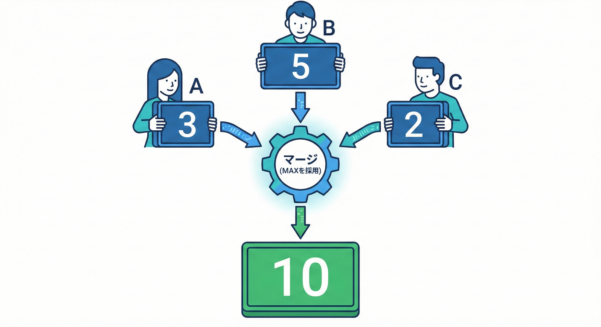
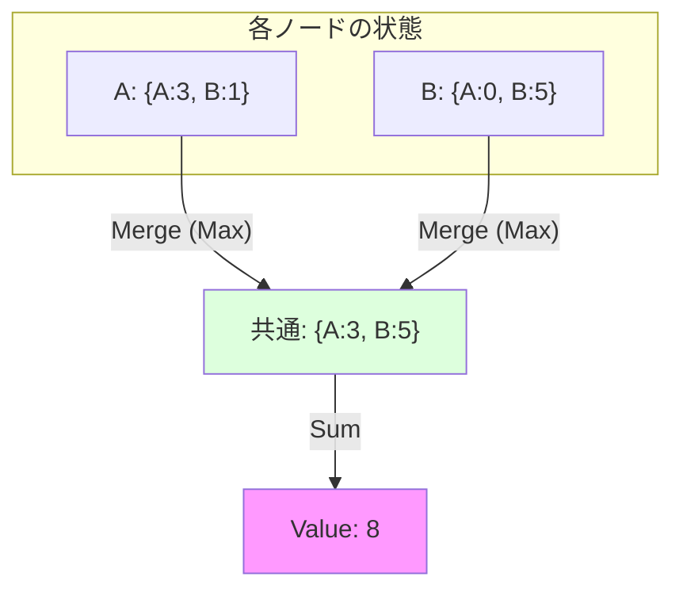

# 第26章：CRDT入門② G-Counter風で“収束体験”🔢🌱

## 結論1行✍️✨

**「各ノードが自分のカウントだけ増やして、マージは“ノードごとの最大値を取る”」にすると、順番がぐちゃぐちゃでも最後に同じ答えへ収束するよ😺🧲**

---

## 1) 今日のゴール🎯💖

この章でできるようになること👇

* **G-Counter（増えるだけカウンタ）**の考え方を、手を動かして理解する🔢✨
* **遅延⏳・逆順🔀・重複📨**があっても「最後に一致する」体験をする🧲🌈
* 「なんで `max` でマージするの？」を説明できるようになる🧠💬 ([Ian Duncan][1])

題材は、ECっぽく **「商品ページの閲覧数👀」や「いいね数👍」** にしよう（増えるだけ＝G-Counterと相性◎）✨

---

## 2) G-Counterってなに？（超やさしく）🧸🔢

 <!-- ref: 362 -->

G-Counterはこういう作戦👇

* ノードA/B/C…みたいに複数の場所がある🌍
* **それぞれが自分のカウントだけ増やす**（他人の分は増やさない）➕
* どこかで状態を交換したら、**ノードごとの値は「大きい方（max）」を採用する**✅
* 全体の答え（合計）は、**全ノードの値を足す**🧮

イメージ（ノード別の“担当分”を持つ）👇

* Aが3回増やした
* Bが5回増やした
* Cが2回増やした
  ➡ 合計は 3+5+2 = 10

マージで `max` を取る理由は超重要💡

 <!-- ref: 363 -->

「カウントは増えるだけ」だから、**より大きい値＝より新しい情報**って見なせるんだよね👑
なので **maxを取れば、増やした分を取りこぼさない**✨ ([Ian Duncan][1])





---

## 3) ハンズオン：TypeScriptで“収束するカウンタ”を作る🛠️💞

### 3-1) 最小セットアップ（コマンド）💻✨

PowerShellでOK👌（フォルダはどこでも）

```powershell
mkdir crdt-gcounter-lab
cd crdt-gcounter-lab
npm init -y
npm i -D typescript tsx @types/node
```

> tsxは「TypeScriptをそのまま実行できる」系の便利ツールだよ⚡
> ただし **tsx自体は型チェックしない**ので、`tsc --noEmit` で型チェックする流れが安全🙆‍♀️ ([nodejs.org][2])

### 3-2) tsconfig.json を用意🧩

TypeScript 5.9 では `module/moduleResolution` に **安定版の `node20`** が追加されてるよ（浮動挙動を避けやすい）🧠✨ ([TypeScript][3])

```json
{
  "compilerOptions": {
    "target": "ES2023",
    "module": "node20",
    "moduleResolution": "node20",
    "strict": true,
    "skipLibCheck": true,
    "noEmit": true
  }
}
```

### 3-3) package.json にスクリプト追加🧪✨

```json
{
  "name": "crdt-gcounter-lab",
  "private": true,
  "type": "module",
  "scripts": {
    "dev": "tsx src/demo.ts",
    "typecheck": "tsc --noEmit"
  },
  "devDependencies": {
    "@types/node": "^24.0.0",
    "tsx": "^4.0.0",
    "typescript": "^5.9.0"
  }
}
```

※ 依存のバージョンは例だよ（手元で入ったものが基本でOK）😊
Node.jsは **v24がActive LTS**（安定運用向き）として案内されてるよ📌 ([nodejs.org][4])

---

## 4) 実装：G-Counter（コア）を作る🔩🔢

### src/gcounter.ts

```ts
export type Snapshot = Record<string, number>;

/**
 * G-Counter（Grow-only Counter）
 * - それぞれのノード（replica）が自分のカウントだけ増やす
 * - merge は replica ごとに max を取る（増えるだけなので max が正しい）
 * - value は全 replica の合計
 */
export class GCounter {
  private readonly counts: Map<string, number>;

  constructor(public readonly replicaId: string, initial?: Snapshot) {
    this.counts = new Map(Object.entries(initial ?? {}));
    if (!this.counts.has(replicaId)) this.counts.set(replicaId, 0);
  }

  /** 自分のカウントを増やす（減らすのは禁止） */
  increment(by = 1): void {
    if (!Number.isInteger(by) || by <= 0) {
      throw new Error("increment(by) は 1以上の整数だけOKだよ🧷");
    }
    const cur = this.counts.get(this.replicaId) ?? 0;
    this.counts.set(this.replicaId, cur + by);
  }

  /** 現在の合計値（全replicaの合計） */
  get value(): number {
    let sum = 0;
    for (const v of this.counts.values()) sum += v;
    return sum;
  }

  /** 外に渡す用：状態スナップショット（通信で送るもの） */
  snapshot(): Snapshot {
    return Object.fromEntries(this.counts.entries());
  }

  /**
   * merge（状態の統合）
   * - replicaごとに max を取る
   * - これにより、順序が違っても・重複しても・何回混ぜても壊れない
   */
  merge(other: Snapshot): void {
    for (const [replica, v] of Object.entries(other)) {
      const cur = this.counts.get(replica) ?? 0;
      this.counts.set(replica, Math.max(cur, v));
    }
    // 念のため、自分のキーが消えないように
    if (!this.counts.has(this.replicaId)) this.counts.set(this.replicaId, 0);
  }
}
```

ここが“収束のカギ”🔑

* merge は **足さない**（足すと二重計上になる😱）
* replicaごとに **max**（「増えるだけ」だから成立） ([Ian Duncan][1])

---

## 5) 実験：遅延⏳・逆順🔀・重複📨でも収束するのを見よう👀✨

### src/demo.ts

```ts
import { GCounter } from "./gcounter.js";

type Msg = { from: string; to: string; payload: Record<string, number> };

function send(queue: Msg[], from: string, to: string, payload: Record<string, number>) {
  queue.push({ from, to, payload });
}

function shuffle<T>(arr: T[]): T[] {
  // ざっくりシャッフル（順序が壊れる体験用）
  return arr
    .map((x) => ({ x, r: Math.random() }))
    .sort((a, b) => a.r - b.r)
    .map((p) => p.x);
}

const A = new GCounter("A");
const B = new GCounter("B");
const C = new GCounter("C");

// それぞれが“自分の分だけ”増やす
A.increment(3); // A担当で+3
B.increment(5); // B担当で+5
C.increment(2); // C担当で+2

console.log("初期:");
console.log("A", A.snapshot(), "value=", A.value);
console.log("B", B.snapshot(), "value=", B.value);
console.log("C", C.snapshot(), "value=", C.value);

let queue: Msg[] = [];

// 送る（でも届く順番は保証しない）
send(queue, "A", "B", A.snapshot());
send(queue, "B", "C", B.snapshot());
send(queue, "C", "A", C.snapshot());

// 重複配達っぽく、同じメッセージをもう1回投げる📨📨
send(queue, "A", "B", A.snapshot());

// 逆順・遅延っぽく、キューをシャッフル
queue = shuffle(queue);

console.log("\n配送開始（順序ぐちゃぐちゃ）:");
for (const msg of queue) {
  const target = msg.to === "A" ? A : msg.to === "B" ? B : C;
  target.merge(msg.payload);

  console.log(`- ${msg.from} -> ${msg.to}`, msg.payload);
  console.log("  A.value", A.value, "B.value", B.value, "C.value", C.value);
}

console.log("\n1回目の配送後:");
console.log("A", A.snapshot(), "value=", A.value);
console.log("B", B.snapshot(), "value=", B.value);
console.log("C", C.snapshot(), "value=", C.value);

// もう1ラウンド（全員が全員に配る）🔁
// これで最終的に全員が同じスナップショットに近づく
queue = [];
send(queue, "A", "B", A.snapshot());
send(queue, "A", "C", A.snapshot());
send(queue, "B", "A", B.snapshot());
send(queue, "B", "C", B.snapshot());
send(queue, "C", "A", C.snapshot());
send(queue, "C", "B", C.snapshot());

queue = shuffle(queue);

console.log("\n2回目の配送:");
for (const msg of queue) {
  const target = msg.to === "A" ? A : msg.to === "B" ? B : C;
  target.merge(msg.payload);
}

console.log("\n最終:");
console.log("A", A.snapshot(), "value=", A.value);
console.log("B", B.snapshot(), "value=", B.value);
console.log("C", C.snapshot(), "value=", C.value);

// 目標：全員の合計が一致（収束！）🧲✨
if (A.value !== B.value || B.value !== C.value) {
  throw new Error("まだ収束してないよ😵 もう1ラウンド回してみて！");
}
console.log("\n収束OK🧲✨ 合計=", A.value);
```

### 実行してみよう🏃‍♀️💨

```powershell
npm run typecheck
npm run dev
```

見どころ👀✨

* 途中はA/B/Cの `value` がズレることがある（当たり前）😌
* でも **何回か状態交換すると一致していく**🧲
* メッセージが **重複しても壊れない**（mergeが `max` なので）🧷✅

---

## 6) いったん“壊す”😈🔨：なぜ「単一の数字をmax」はダメ？

 <!-- ref: 364 -->

もし状態が「ただの数字」1個で、mergeが `max` だったら…👇

* A: 0 → 1（Aで+1）
* B: 0 → 1（Bで+1）
* merge(max) すると **1** にしかならない（本当は2になってほしいのに！）😱

これが「ノード別に分ける」理由だよ💡
G-Counterは **状態を “replicaId → カウント” のMap** にすることで、この落とし穴を避けてる🗺️✨ ([simongui.github.io][5])

---

## 7) “収束する設計”のチェックリスト✅🧲

 <!-- ref: 365 -->

G-Counterを見ながら、CRDTの大事ポイントを言えるようにしよう💖

* **単調に増える**（減らない）📈
* mergeが **交換法則**（順番を入れ替えても同じ）🔀
* mergeが **結合則**（まとめ方を変えても同じ）🧩
* mergeが **冪等**（同じの何回混ぜても同じ）🧷

このへんが揃うと、逆順・遅延・重複に強くなるよ✨ ([Bartosz Sypytkowski][6])

---

## 8) よくあるハマりポイント集😵‍💫🧯

 <!-- ref: 366 -->

* **replicaIdを使い回す**（別ノードなのに同じID）→ 合計が壊れる⚠️
* mergeで **足し算しちゃう** → 重複配達で二重計上📨📨😱
* incrementに0や負数を入れる → G-Counterじゃなくなる（別物）🙅‍♀️
* 「減らしたい」欲が出る → それは **PN-Counter**（次の練習でやろう）➕➖

---

## 9) 練習問題（手を動かす用）📝💪

1. **“閲覧数”をプロダクト別にしたい**📦

* `productId -> GCounter` を持つ形にして、商品ごとに収束させてみよう🧲✨

2. **PN-Counter（増減）を作る**➕➖

 <!-- ref: 367 -->

* `P（増える）` と `N（増える）` の2つのG-Counterを持って、`value = P - N` にする🧠💡 ([Medium][7])

3. **メッセージの順番をもっと地獄にする**👹

* 送信キューに「ランダムで同じメッセージを3回入れる」
* ランダムで欠落も入れる（届かない）
* それでも“何回かラウンドすると収束する”を観察👀✨

---

## 10) AI活用（Copilot / Codex向け）🤖📝

 <!-- ref: 368 -->

この章はAIがめちゃ相性いいよ💖（生成→レビューで使うと強い）👀✨

* **コメント強化**📝
  「この `merge` がなぜ `max` なのか、初心者向けにコメントを追加して」
* **テスト生成**🧪
  「順番をランダムにしても、最終的に value が一致するテストを書いて（重複も混ぜて）」
* **バグ注入→修正**🔨
  「mergeをわざと `+` に変えた版を作って、どんな失敗が起きるかログで説明して」

---

## まとめ🧁✨

* G-Counterは「増えるだけ」だから、**replica別のMapを持って、mergeはmax**が効く🔢🧲
* 遅延⏳・逆順🔀・重複📨があっても、**最終的に同じ値へ収束**できる✅✨
* “収束する”の気持ちよさ、ここで体に入れておこう〜！🌈😺

[1]: https://iankduncan.com/engineering/2025-11-27-crdt-dictionary/?utm_source=chatgpt.com "The CRDT Dictionary: A Field Guide to Conflict-Free ..."
[2]: https://nodejs.org/en/learn/typescript/run "Node.js — Running TypeScript with a runner"
[3]: https://www.typescriptlang.org/docs/handbook/release-notes/typescript-5-9.html "TypeScript: Documentation - TypeScript 5.9"
[4]: https://nodejs.org/en/about/previous-releases?utm_source=chatgpt.com "Node.js Releases"
[5]: https://simongui.github.io/distributed-systems/crdt.html?utm_source=chatgpt.com "Convergent Replicated Data Types"
[6]: https://www.bartoszsypytkowski.com/the-state-of-a-state-based-crdts/?utm_source=chatgpt.com "An introduction to state-based CRDTs"
[7]: https://medium.com/%40m.hassan.def/crdts-in-action-data-consistency-without-consensus-930d30b059be?utm_source=chatgpt.com "CRDTs in Action: Data Consistency Without Consensus"
