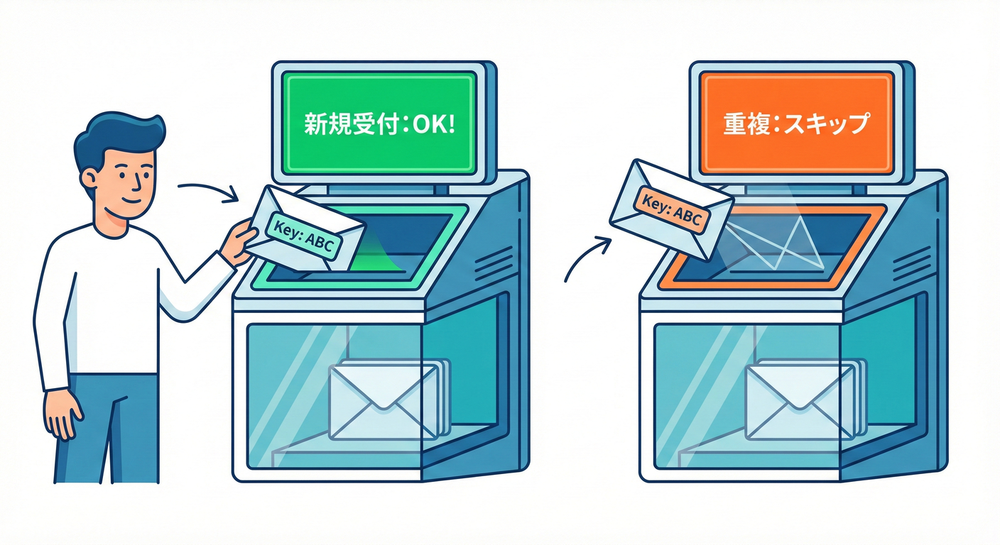
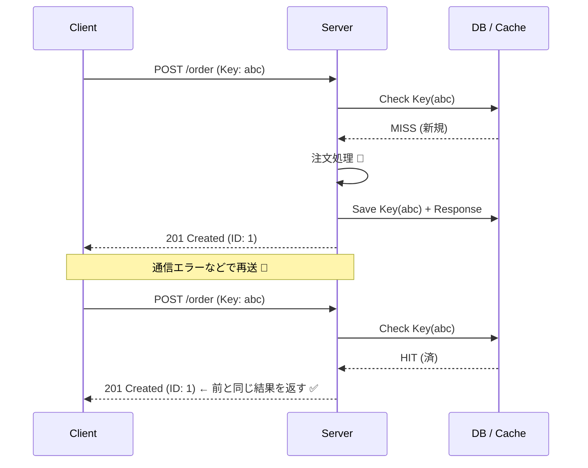

# 第28章：冪等性（同じ要求が何回来ても壊れない）🧷✅

## 結論1行 ✍️

**「同じ“やり直し”が何回届いても、サーバーの結果が1回と同じになるように、`Idempotency-Key`（冪等キー）＋重複排除を入れる」**🧷✨

---

## 1) この章でできるようになること 🎯

* 「二重送信」「リトライ」「タイムアウト後の再送」が起きても壊れない理由が説明できる🧠✨
* `POST /orders` に **冪等キー**を導入して、同じリクエストを2回送っても **注文が1回分**になるようにできる🛒✅
* **同じキーなのに中身が違う**事故（超ありがち😱）を防げる🔒
* テストで「同一キー2回」を自動で検証できる🧪🤖

---

## 2) そもそも「冪等」って何？🧠

 <!-- ref: 375 -->

ざっくり言うと…

**同じリクエストを何回やっても、サーバー側の“最終結果”が1回と同じなら冪等**です🧷✅

HTTPの世界では、`PUT` や `DELETE` は「同じ操作を何回しても結果が同じになりやすい」＝ **冪等なメソッド**として扱われます（定義もあります）📚✨ ([RFCエディター][1])

でも…！

* `POST` は普通「作る」ので、**同じPOSTを2回やると2個できちゃう**ことが多い😵
  → だから `POST` を安全にするには **冪等キー**が定番テクになります🔑 ([Postman Blog][2])

---

## 3) 冪等キー（Idempotency-Key）って何？🔑

`POST` や `PATCH` みたいな「本来は冪等じゃない操作」を、**“やり直しに強くする”**ためのヘッダーが `Idempotency-Key` です🧷✨
IETF（標準化の団体）でも、`POST`/`PATCH` を **fault-tolerant（失敗に強く）**するために使える、という方向で整理されています📄 ([IETF Datatracker][3])

### 超ざっくり動き 🍩

* クライアントが `Idempotency-Key: なんか一意の文字列` を付けて送る
* サーバーはそのキーを保存する
* 同じキーがまた来たら、**「前と同じ結果」を返す**（二重実行しない）

Stripeみたいな決済APIでもこの方式が有名で、
「キーは十分ランダムに」「一定時間（例：24h）保持」「同じキーで違う内容が来たらエラー」みたいな運用が紹介されています💳🧠 ([docs.stripe.com][4])





---

## 4) どこが落とし穴？😱（ここ超大事）

冪等化で事故りやすいポイントを先に潰すよ〜🧯✨

### 落とし穴A：同じキーで“違う内容”を送っちゃう 🧨

 <!-- ref: 376 -->

例：

* 1回目：`amount=1000`
* 2回目：同じ `Idempotency-Key` で `amount=2000`

これ、**通すと地獄**です👻
だからサーバー側で
**「同じキーなら、リクエスト内容も同じじゃないとダメ」**
をチェックします✅（Stripeもこの方針） ([docs.stripe.com][4])

### 落とし穴B：キーの保存が “メモリだけ” 🫠

 <!-- ref: 377 -->

サーバー再起動したら忘れて、また二重実行します🔥
教材ではまず **メモリ実装**で感覚を掴むけど、実戦では **DB/Redis** に置くのが基本だよ〜🏗️✨

### 落とし穴C：並行リクエスト（同時に2回来る）⚔️

 <!-- ref: 378 -->

ほぼ同時に同じキーが飛ぶと、
「まだ保存してないから両方実行」が起きがち😵
→ **キー単位のロック**か **DBのユニーク制約**で守ります🔒✨

---

## 5) ハンズオン：同じ注文IDを2回送っても1回分にする 🛒🧷

ここから実装〜！💪✨
今回は `POST /orders` を冪等化します。

### この章のルール（教材の都合）📌

* `Idempotency-Key` が無い注文は受け付けない（`400`）
* 同じキーの再送は、**前回と同じレスポンス**を返す
* 同じキーで内容が違うなら、**`409`**（衝突）を返す

---

## 6) 依存パッケージ（例）📦✨

APIが Fastify の場合の例です（軽くて人気）⚡
Fastify は npm で継続的に更新されていて、直近でも v5系が最新として配布されています📦 ([npm][5])

PowerShell（例）👇

```bash
cd apps/api
npm i fastify
npm i -D typescript tsx @types/node
npm i async-mutex
```

> ※ `fetch()` は Node.js の組み込みで使えます（Undiciベース）🌊 ([undici.nodejs.org][6])
> ※ Node.js は v24 が Active LTS として案内されています🛡️ ([nodejs.org][7])
> ※ TypeScript は npm 上で 5.9.3 が最新として表示されています📘 ([npm][8])

---

## 7) 実装：IdempotencyStore（重複排除の心臓部）🫀🔑

### `apps/api/src/idempotencyStore.ts`

```ts
import { Mutex } from "async-mutex";
import crypto from "node:crypto";

export type SavedResponse = {
  statusCode: number;
  headers?: Record<string, string>;
  body: unknown;
};

type RecordStatus = "processing" | "completed";

type IdempotencyRecord = {
  id: string;            // scope + "::" + key
  scope: string;         // 例: "POST /orders"
  key: string;           // Idempotency-Key
  requestHash: string;   // リクエスト内容が同じかチェック用
  status: RecordStatus;
  createdAt: number;
  response?: SavedResponse;
};

export function sha256OfJson(value: unknown): string {
  // JSON.stringify は順序差が出ることがあるので、
  // この教材では「同一クライアントが同一JSONを再送する」前提の簡易版にするよ 🙆‍♀️
  const json = JSON.stringify(value);
  return crypto.createHash("sha256").update(json).digest("hex");
}

export class InMemoryIdempotencyStore {
  private records = new Map<string, IdempotencyRecord>();
  private mutexes = new Map<string, Mutex>();

  constructor(private readonly ttlMs: number) {
    // 掃除（TTL切れ削除）🧹
    setInterval(() => this.cleanup(), Math.min(60_000, Math.max(5_000, ttlMs / 4))).unref?.();
  }

  private getMutex(id: string): Mutex {
    const existing = this.mutexes.get(id);
    if (existing) return existing;
    const m = new Mutex();
    this.mutexes.set(id, m);
    return m;
  }

  makeId(scope: string, key: string): string {
    return `${scope}::${key}`;
  }

  async runExclusive<T>(id: string, fn: () => Promise<T>): Promise<T> {
    const mutex = this.getMutex(id);
    return mutex.runExclusive(fn);
  }

  get(id: string): IdempotencyRecord | undefined {
    return this.records.get(id);
  }

  createProcessing(params: { id: string; scope: string; key: string; requestHash: string }): IdempotencyRecord {
    const rec: IdempotencyRecord = {
      id: params.id,
      scope: params.scope,
      key: params.key,
      requestHash: params.requestHash,
      status: "processing",
      createdAt: Date.now(),
    };
    this.records.set(params.id, rec);
    return rec;
  }

  complete(id: string, response: SavedResponse): void {
    const rec = this.records.get(id);
    if (!rec) return;
    rec.status = "completed";
    rec.response = response;
  }

  private cleanup(): void {
    const now = Date.now();
    for (const [id, rec] of this.records) {
      if (now - rec.createdAt > this.ttlMs) {
        this.records.delete(id);
        this.mutexes.delete(id);
      }
    }
  }
}
```

---

## 8) 実装：注文リポジトリ（最小）🛒📚

### `apps/api/src/orderRepo.ts`

```ts
import crypto from "node:crypto";

export type OrderStatus = "PENDING" | "CONFIRMED" | "CANCELLED";

export type Order = {
  id: string;
  status: OrderStatus;
  total: number;
  createdAt: number;
};

export class InMemoryOrderRepo {
  private orders = new Map<string, Order>();

  create(total: number): Order {
    const id = crypto.randomUUID();
    const order: Order = {
      id,
      status: "PENDING",
      total,
      createdAt: Date.now(),
    };
    this.orders.set(id, order);
    return order;
  }

  get(id: string): Order | undefined {
    return this.orders.get(id);
  }

  count(): number {
    return this.orders.size;
  }

  // 状態遷移を「二重適用」しないための最小ガード 🧷
  transition(id: string, from: OrderStatus, to: OrderStatus): { ok: true } | { ok: false; reason: string } {
    const order = this.orders.get(id);
    if (!order) return { ok: false, reason: "not_found" };
    if (order.status !== from) return { ok: false, reason: `invalid_state:${order.status}` };
    order.status = to;
    return { ok: true };
  }
}
```

---

## 9) 実装：`POST /orders` を冪等化する ✅🔑

 <!-- ref: 379 -->

### `apps/api/src/server.ts`

```ts
import Fastify from "fastify";
import { InMemoryIdempotencyStore, sha256OfJson } from "./idempotencyStore.js";
import { InMemoryOrderRepo } from "./orderRepo.js";

type CreateOrderBody = {
  total: number;
  items?: Array<{ sku: string; qty: number }>;
};

export function buildApp() {
  const app = Fastify({ logger: true });

  // 例：冪等記録は 24h 保持（教材の例）🕒
  const idem = new InMemoryIdempotencyStore(24 * 60 * 60 * 1000);
  const orders = new InMemoryOrderRepo();

  app.post<{ Body: CreateOrderBody }>("/orders", async (req, reply) => {
    const scope = "POST /orders";
    const key = req.headers["idempotency-key"];

    if (typeof key !== "string" || key.length === 0) {
      return reply.code(400).send({ error: "Idempotency-Key header is required" });
    }

    const id = idem.makeId(scope, key);

    // リクエスト内容が違うのに同じキーを使ってない？チェック用 🔍
    const requestHash = sha256OfJson(req.body);

    return idem.runExclusive(id, async () => {
      const existing = idem.get(id);

      // すでに見たキーだったら… 🧷
      if (existing) {
        if (existing.requestHash !== requestHash) {
          // 同じキーで違う内容は危険なので拒否 🙅‍♀️
          return reply.code(409).send({ error: "Idempotency-Key conflict (payload mismatch)" });
        }

        if (existing.status === "completed" && existing.response) {
          // 1回目と同じ結果を返す ✅
          if (existing.response.headers) {
            for (const [k, v] of Object.entries(existing.response.headers)) reply.header(k, v);
          }
          return reply.code(existing.response.statusCode).send(existing.response.body);
        }

        // processing の場合（ほぼ同時再送など）
        return reply.code(202).send({ status: "processing", retryAfterMs: 300 });
      }

      // はじめてのキー → まず「処理中」を保存 ✍️
      idem.createProcessing({ id, scope, key, requestHash });

      // ここが「本来の処理」✨（今回は注文を作る）
      const order = orders.create(req.body.total);

      const body = { orderId: order.id, status: order.status };

      // 返す内容も保存（次に同じキーが来たら同じレスポンスを返す）📌
      idem.complete(id, { statusCode: 201, body });

      return reply.code(201).send(body);
    });
  });

  // デバッグ用：件数確認 👀
  app.get("/debug/orders/count", async () => ({ count: orders.count() }));

  return app;
}

// ローカル起動用（必要なら）🚀
if (import.meta.url === `file://${process.argv[1]}`) {
  const app = buildApp();
  app.listen({ port: 3000, host: "127.0.0.1" }).catch((err) => {
    app.log.error(err);
    process.exit(1);
  });
}
```

---

## 10) 動作確認：2回送っても1回分になる？🧪🧷

### ① 1回目（作成される）✨

PowerShell例👇

```powershell
$headers = @{ "Idempotency-Key" = "demo-001" }
$body = @{ total = 1200; items = @(@{ sku="A"; qty=1 }) } | ConvertTo-Json

Invoke-RestMethod -Method Post -Uri http://127.0.0.1:3000/orders -Headers $headers -Body $body -ContentType "application/json"
```

### ② 2回目（同じキー・同じ中身）✅

```powershell
Invoke-RestMethod -Method Post -Uri http://127.0.0.1:3000/orders -Headers $headers -Body $body -ContentType "application/json"
```

👉 **orderId が同じ**なら勝ち🎉（二重作成されてない）

### ③ 件数確認 👀

```powershell
Invoke-RestMethod -Method Get -Uri http://127.0.0.1:3000/debug/orders/count
```

---

## 11) テスト：同一キー2回を自動チェック 🧪🤖

 <!-- ref: 380 -->

### `apps/api/src/server.test.ts`

```ts
import test from "node:test";
import assert from "node:assert/strict";
import { buildApp } from "./server.js";

test("same Idempotency-Key twice returns same result and creates only one order", async () => {
  const app = buildApp();

  const payload = { total: 1200, items: [{ sku: "A", qty: 1 }] };

  const res1 = await app.inject({
    method: "POST",
    url: "/orders",
    headers: { "Idempotency-Key": "test-001" },
    payload,
  });

  assert.equal(res1.statusCode, 201);
  const body1 = res1.json() as { orderId: string; status: string };

  const res2 = await app.inject({
    method: "POST",
    url: "/orders",
    headers: { "Idempotency-Key": "test-001" },
    payload,
  });

  assert.equal(res2.statusCode, 201);
  const body2 = res2.json() as { orderId: string; status: string };

  assert.equal(body1.orderId, body2.orderId);

  const count = await app.inject({ method: "GET", url: "/debug/orders/count" });
  assert.equal(count.statusCode, 200);
  assert.equal(count.json().count, 1);

  await app.close();
});

test("same Idempotency-Key with different payload should be rejected", async () => {
  const app = buildApp();

  const res1 = await app.inject({
    method: "POST",
    url: "/orders",
    headers: { "Idempotency-Key": "test-002" },
    payload: { total: 1000 },
  });
  assert.equal(res1.statusCode, 201);

  const res2 = await app.inject({
    method: "POST",
    url: "/orders",
    headers: { "Idempotency-Key": "test-002" },
    payload: { total: 9999 },
  });
  assert.equal(res2.statusCode, 409);

  await app.close();
});
```

実行👇

```bash
cd apps/api
node --test
```

---

## 12) “実戦”での設計メモ（ここが強くなる）🏋️‍♀️✨

 <!-- ref: 381 -->

教材のメモリ実装を、実戦に寄せるならこう考えるよ〜🧠

* 冪等キーの保存先は **DB or Redis**（再起動・複数台に耐える）🏗️
* `scope（POST /orders）` も一緒に保存する（別APIでキー衝突しない）🧩
* 返したレスポンスも保存して、**同じレスポンスを返す**（クライアントが安心する）😌
* キーは無限に保存しない：**TTL（保存期限）**を決める（例：24h）🕒 ([docs.stripe.com][4])
* 「同じキーなのに違う内容」は **拒否**（事故防止）🧯 ([docs.stripe.com][4])

---

## 13) AI活用コーナー 🤖💡（そのままコピペでOK）

### プロンプト例1：冪等の設計レビュー👀

* 「この `Idempotency-Key` 実装で、同時リクエストや再起動時に壊れる点を指摘して。実戦向け改善案を3つ出して」🤖

### プロンプト例2：payload mismatch の判定改善🔍

* 「JSONの順序差でも同一判定できる“正規化”の方法を提案して。TypeScriptで最小実装も」🤖

### プロンプト例3：テスト追加🧪

* 「`processing`（202）になるケースを再現するテストを書いて。どうすれば再現できる？」🤖

---

## 14) まとめ ✅✨

* `POST` はそのままだと二重作成しがち → **冪等キーで防ぐ**🧷 ([Postman Blog][2])
* `Idempotency-Key` は `POST/PATCH` を失敗に強くするための考え方として整理が進んでるよ📄 ([IETF Datatracker][3])
* **同じキー＝同じ結果**、**同じキーで中身が違うのは拒否**が安全🔒 ([docs.stripe.com][4])
* 次章（第29章）で「配達保証は現実こうなる👻」に行くので、**冪等はその土台**だよ〜🧱✨

[1]: https://www.rfc-editor.org/rfc/rfc9110.html?utm_source=chatgpt.com "RFC 9110: HTTP Semantics"
[2]: https://blog.postman.com/rest-api-best-practices/?utm_source=chatgpt.com "REST API Best Practices: A Developer's Guide to Building ..."
[3]: https://datatracker.ietf.org/doc/draft-ietf-httpapi-idempotency-key-header/?utm_source=chatgpt.com "The Idempotency-Key HTTP Header Field - Datatracker - IETF"
[4]: https://docs.stripe.com/api/idempotent_requests?utm_source=chatgpt.com "Idempotent requests | Stripe API Reference"
[5]: https://www.npmjs.com/package/fastify?utm_source=chatgpt.com "fastify"
[6]: https://undici.nodejs.org/?utm_source=chatgpt.com "Node.js Undici"
[7]: https://nodejs.org/en/about/previous-releases?utm_source=chatgpt.com "Node.js Releases"
[8]: https://www.npmjs.com/package/typescript?utm_source=chatgpt.com "TypeScript"
