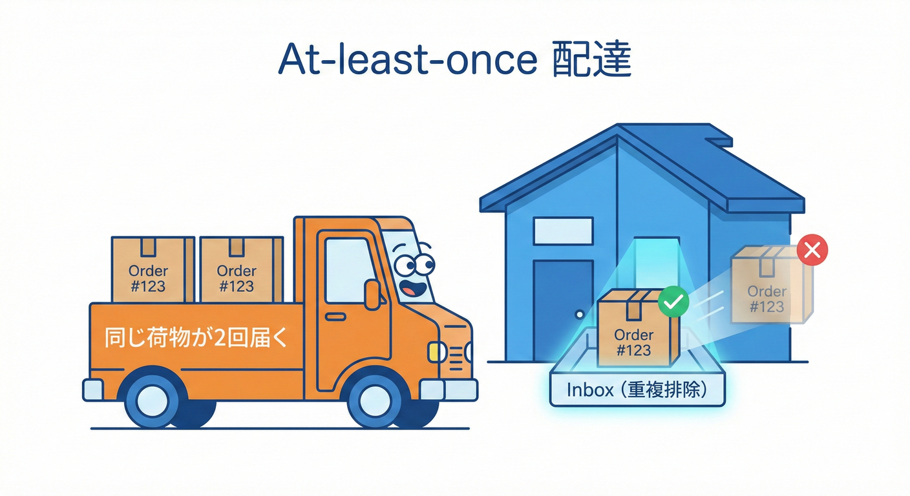

# 第29章：配達保証の現実（Exactly-onceは幻👻）📨

## この章のゴール🎯

* 「**メッセージは1回だけ届く**」と思い込むのをやめる😇
* 現実的な前提「**At-least-once（最低1回）**」で壊れない設計ができるようになる🧷✅
* 「**重複**」だけじゃなく「**欠落**」にも備えて、**再同期（リコンシリエーション）**の発想を持つ🧹🧠



| 保証レベル | 欠落 | 重複 | 速度 |
| :--- | :---: | :---: | :---: |
| At-most-once (最大1回) | あり | なし | 速い⚡ |
| At-least-once (最低1回) | なし | あり | 普通📊 |
| Exactly-once (ちょうど1回) | なし | なし | 遅い🐢 |

> [!TIP]
> 現実の分散システムでは **At-least-once + 冪等性（重複対策）** が最強のコンビだよ！🧷✨

---

# 1) 配達保証の3兄弟👯‍♀️👯‍♂️👯

 <!-- ref: 382 -->

## At-most-once（多くても1回）🫥

* 速い⚡けど、**落ちると消える**（欠落する）可能性がある😱

## At-least-once（最低1回）🔁

* 欠落しにくい（再配達する）✅
* でも **重複が来る**（同じのが2回以上）😇

## Exactly-once（ちょうど1回）✨

* 夢があるけど… **範囲が限定**されがちで、エンドツーエンドでは超むずい👻
* しかも「Exactly-once *delivery*」と「Exactly-once *processing*」は別モノになりがち⚠️（後で説明）

---

# 2) なんでExactly-onceが幻なの？👻🔍

## 典型事故：処理は成功、でもACKが届かない📬💥

 <!-- ref: 383 -->

ざっくり図にするとこう👇

```text
Worker：メッセージ受信 ✅
Worker：DB更新（副作用）✅
Worker：ACK送信 ➜ ネットワーク途切れ❌
Broker：ACK来てないから「未処理扱い」→ もう一回配達🔁
Worker：同じ処理をもう一回…（地獄）😇🔥
```

RabbitMQみたいに「ACKしないと再配達」系は、まさにこの世界で、**再配達（redelivery）**が起きる前提で作られてるよ📨🔁（だから「冪等にしなきゃね」って話になる） ([rabbitmq.com][1])

さらに、auto-ack（自動ACK）だと「配った瞬間に処理済み扱い」になりやすくて、落ちたら**欠落（消失）**になるケースもあるよ😱 ([rabbitmq.com][1])

---

# 3) 「世の中の保証」って実際どうなってるの？🌍📮

 <!-- ref: 384 -->

現場でよく見る例を、超ざっくり並べるね👇（覚えるより“感覚”！）

* **Amazon SQS Standard**：**At-least-once**。重複が起きうる（公式にそう書いてある）📨🔁 ([nodejs.org][2])
* **Amazon SQS FIFO**：重複排除や順序に強い（ただし条件・範囲あり）🧷🧵 ([Redis][3])
* **RabbitMQ（手動ACK）**：ACKされないと再配達＝**At-least-once**寄り📨🔁 ([rabbitmq.com][1])
* **Google Cloud Pub/Sub**：基本は再配達がある（**At-least-once**前提で組む）。加えて “Exactly-once delivery” 機能もある🛰️✨ ([Google Cloud Documentation][4])
* **Kafka**：設定と使い方しだいで At-least-once／Exactly-once（EOS）を狙えるけど、適用範囲がある⚙️✨ ([AWS ドキュメント][5])
* **Redis Pub/Sub**：基本 “fire-and-forget” 系で、欠落しうる（少なくとも「必ず届く」を期待しない）🔥📣

💡 結論：**「重複する」か「欠落する」か、その両方**が現実に起きる前提で設計するのが強い💪✨

---

# 4) 現実に勝つための“4点セット”🧰✨

 <!-- ref: 385 -->

## ① 冪等なコンシューマ（重複に勝つ）🧷✅

* 「同じイベントが何回届いても結果が1回分になる」ようにする
* 具体策：**Inbox（処理済みテーブル）＋ユニーク制約** が王道👑

## ② 再試行は“する前提”（ただし暴走させない）🔁⏳

* 失敗は起きるのでリトライは必要
* でも雪崩（同時リトライ爆発）も起きるので、バックオフとかが必要（第27章の話）❄️

## ③ 欠落に備える「再同期（リコンシリエーション）」🧹

* “イベントが届いてないっぽい”を直せる仕組み
* 具体策：**ソースオブトゥルース（正本）から投影を作り直す**🧱➡️🪞

## ④ 追跡できるようにしておく（次章の観測につながる）🕵️‍♀️🧵

* 相関IDとか、配送回数とか、ログに残す（第30章でがっつり）📈

---

# 5) ハンズオン：同じイベントが3回届いても壊れない🧪📨🔁

ここでは「**注文を受け付ける（正本）**」と「**在庫の予約数（投影）**」を分けて、
さらに「ACKが落ちて再配達」まで再現するよ😈✨

## 5-1. DBを用意する（正本・キュー・Inbox・投影）🗄️✨

 <!-- ref: 386 -->

2026のNodeでは `node:sqlite` が使えるよ（まだ実験扱いだけど、`--experimental-sqlite` なしで使える状態になってる）🧪 ([nodejs.org][2])
Node 24系はActive LTSで、Windows向けインストーラもあるよ🪟✨ ([nodejs.org][6])

`tools/init-db.ts` を作る👇

```ts
import { DatabaseSync } from "node:sqlite";
import { mkdirSync } from "node:fs";
import { dirname } from "node:path";

const DB_PATH = "data/app.db";
mkdirSync(dirname(DB_PATH), { recursive: true });

const db = new DatabaseSync(DB_PATH);

// 正本：注文（ここが“事実”の中心）🧱
db.exec(`
CREATE TABLE IF NOT EXISTS orders (
  order_id TEXT PRIMARY KEY,
  item_id  TEXT NOT NULL,
  qty      INTEGER NOT NULL,
  created_at INTEGER NOT NULL
);
`);

// キュー：配達待ちメッセージ（超簡易Broker）📨
db.exec(`
CREATE TABLE IF NOT EXISTS queue_messages (
  message_id TEXT PRIMARY KEY,
  event_id   TEXT NOT NULL,
  type       TEXT NOT NULL,
  payload    TEXT NOT NULL,
  visible_at INTEGER NOT NULL,
  lease_until INTEGER,
  delivery_count INTEGER NOT NULL DEFAULT 0
);
CREATE INDEX IF NOT EXISTS idx_queue_visible
  ON queue_messages(visible_at, lease_until);
`);

// Inbox：処理済みイベント（重複を1回に潰す🧷）✅
db.exec(`
CREATE TABLE IF NOT EXISTS inbox_processed (
  event_id TEXT PRIMARY KEY,
  processed_at INTEGER NOT NULL
);
`);

// 投影：在庫の予約数（壊れても“作り直せる”前提🪞）✨
db.exec(`
CREATE TABLE IF NOT EXISTS inventory_projection (
  item_id TEXT PRIMARY KEY,
  reserved_qty INTEGER NOT NULL
);
`);

console.log("DB initialized ✅", DB_PATH);
```

> TypeScriptの最新安定版は 5.9.3（2026-01-30 時点の npm 表示）だよ🧠✨ ([npm][7])
> さらに先では TypeScript 7（ネイティブ化）のプレビューも進んでるよ🚀（大規模だと高速化が強い） ([Microsoft Developer][8])

---

## 5-2. API：注文を正本に書いて、イベントをキューに積む🛒📬

`apps/api/src/index.ts`

```ts
import { createServer } from "node:http";
import { randomUUID } from "node:crypto";
import { DatabaseSync } from "node:sqlite";

const db = new DatabaseSync("data/app.db");

function readJson(req: any): Promise<any> {
  return new Promise((resolve, reject) => {
    let buf = "";
    req.on("data", (c: Buffer) => (buf += c.toString("utf-8")));
    req.on("end", () => {
      try {
        resolve(buf ? JSON.parse(buf) : {});
      } catch (e) {
        reject(e);
      }
    });
  });
}

function nowMs() {
  return Date.now();
}

const server = createServer(async (req, res) => {
  try {
    if (req.method === "POST" && req.url === "/orders") {
      const body = await readJson(req);

      const orderId = String(body.orderId ?? randomUUID());
      const itemId = String(body.itemId ?? "coffee-beans");
      const qty = Number(body.qty ?? 1);

      // 1) 正本に書く（ここは“確定した事実”）🧱✅
      {
        const stmt = db.prepare(
          "INSERT INTO orders(order_id, item_id, qty, created_at) VALUES (?, ?, ?, ?)"
        );
        stmt.run(orderId, itemId, qty, nowMs());
      }

      // 2) イベントをキューへ（配達は“そのうち”）📨⏳
      //    eventIdは「同じ事実」を表すID（重複排除のキー）🧷
      const eventId = randomUUID();

      const messageId = randomUUID(); // メッセージ自体のID（再配達でも同じ行が出る想定）
      const payload = { orderId, itemId, qty, eventId };

      {
        const stmt = db.prepare(
          `INSERT INTO queue_messages(message_id, event_id, type, payload, visible_at, lease_until, delivery_count)
           VALUES (?, ?, ?, ?, ?, NULL, 0)`
        );
        stmt.run(messageId, eventId, "OrderPlaced", JSON.stringify(payload), nowMs());
      }

      res.writeHead(201, { "content-type": "application/json" });
      res.end(JSON.stringify({ ok: true, orderId, eventId }));
      return;
    }

    res.writeHead(404);
    res.end("Not Found");
  } catch (e: any) {
    res.writeHead(500, { "content-type": "application/json" });
    res.end(JSON.stringify({ ok: false, error: String(e?.message ?? e) }));
  }
});

server.listen(3000, () => {
  console.log("API listening on http://localhost:3000 🚀");
});
```

---

## 5-3. Worker：At-least-once（再配達）を再現しながら処理する🧑‍🏭📨🔁

 <!-- ref: 387 -->

ポイントはここ👇

* **受信 → 処理 → ACK** は途中で落ちる💥
* だから **Inbox（処理済み）に先に“印”をつける**🧷
* ACKが落ちて再配達されても、Inboxで弾ける✅

`apps/worker/src/index.ts`

```ts
import { DatabaseSync } from "node:sqlite";

const db = new DatabaseSync("data/app.db");

const VISIBILITY_TIMEOUT_MS = 2_000; // 2秒たつと再配達される想定⏳
const ACK_FAIL_RATE = Number(process.env.ACK_FAIL_RATE ?? 0.5); // わざと失敗させる😈

function nowMs() {
  return Date.now();
}

function sleep(ms: number) {
  return new Promise((r) => setTimeout(r, ms));
}

type QueueMessage = {
  message_id: string;
  event_id: string;
  type: string;
  payload: string;
  delivery_count: number;
};

// 受信（leaseを取る＝しばらく他に見えなくする）📨🔒
function receiveOne(): QueueMessage | null {
  const t = nowMs();

  // 取り出せるメッセージを1つ探す👀
  const pick = db.prepare(
    `SELECT message_id, event_id, type, payload, delivery_count
     FROM queue_messages
     WHERE visible_at <= ?
       AND (lease_until IS NULL OR lease_until <= ?)
     ORDER BY visible_at ASC
     LIMIT 1`
  ).get(t, t) as QueueMessage | undefined;

  if (!pick) return null;

  // leaseを更新（再配達タイマー）⏳
  db.exec("BEGIN");
  try {
    db.prepare(
      `UPDATE queue_messages
       SET lease_until = ?, delivery_count = delivery_count + 1
       WHERE message_id = ?`
    ).run(t + VISIBILITY_TIMEOUT_MS, pick.message_id);
    db.exec("COMMIT");
    return pick;
  } catch (e) {
    db.exec("ROLLBACK");
    throw e;
  }
}

// ACK（削除）…でも今回はわざと失敗させる😇💥
function ack(messageId: string) {
  if (Math.random() < ACK_FAIL_RATE) {
    throw new Error("ACK failed (simulated) 📮💥");
  }
  db.prepare("DELETE FROM queue_messages WHERE message_id = ?").run(messageId);
}

// 投影：在庫予約数を増やす🪞📦
function addReserved(itemId: string, qty: number) {
  const row = db.prepare("SELECT reserved_qty FROM inventory_projection WHERE item_id = ?")
    .get(itemId) as { reserved_qty: number } | undefined;

  if (!row) {
    db.prepare("INSERT INTO inventory_projection(item_id, reserved_qty) VALUES (?, ?)")
      .run(itemId, qty);
    return;
  }
  db.prepare("UPDATE inventory_projection SET reserved_qty = ? WHERE item_id = ?")
    .run(row.reserved_qty + qty, itemId);
}

// Inbox：イベントを“1回だけ”通す🧷✅
function tryMarkProcessed(eventId: string): boolean {
  try {
    db.prepare("INSERT INTO inbox_processed(event_id, processed_at) VALUES (?, ?)")
      .run(eventId, nowMs());
    return true; // 初回✨
  } catch {
    return false; // もうやった（重複）🔁
  }
}

async function main() {
  console.log("Worker started 🧑‍🏭🔥  ACK_FAIL_RATE=", ACK_FAIL_RATE);

  while (true) {
    const msg = receiveOne();
    if (!msg) {
      await sleep(200);
      continue;
    }

    const p = JSON.parse(msg.payload) as { orderId: string; itemId: string; qty: number; eventId: string };

    console.log("📨 received", {
      messageId: msg.message_id,
      eventId: p.eventId,
      deliveryCount: msg.delivery_count + 1,
    });

    // ✅ “処理”はトランザクションでまとめるのがコツ
    db.exec("BEGIN");
    try {
      const firstTime = tryMarkProcessed(p.eventId);
      if (firstTime) {
        addReserved(p.itemId, p.qty);
        console.log("✅ applied projection (first time)", { itemId: p.itemId, qty: p.qty });
      } else {
        console.log("🧷 duplicate skipped", { eventId: p.eventId });
      }
      db.exec("COMMIT");
    } catch (e) {
      db.exec("ROLLBACK");
      console.log("💥 processing failed, will be redelivered", String(e));
      continue;
    }

    // ACK（ここが落ちると再配達される😈）
    try {
      ack(msg.message_id);
      console.log("📮 acked", msg.message_id);
    } catch (e) {
      console.log("⚠️ ack failed → expect redelivery", String(e));
      // ackできなかったので、同じメッセージが後でまた来る
      // でもInboxがあるから壊れない🧷✨
    }
  }
}

main().catch((e) => {
  console.error(e);
  process.exit(1);
});
```

---

## 5-4. 動作確認（“3回届いても壊れない”を見る）👀✨

1. DB初期化🗄️

```bash
node tools/init-db.ts
```

2. API起動🚀

```bash
node apps/api/src/index.ts
```

3. Worker起動（ACK失敗率を上げて地獄を作る😈）

```bash
set ACK_FAIL_RATE=0.8
node apps/worker/src/index.ts
```

4. 注文を投げる🛒

```bash
curl -X POST http://localhost:3000/orders -H "content-type: application/json" ^
  -d "{\"orderId\":\"o-001\",\"itemId\":\"coffee-beans\",\"qty\":1}"
```

ログでこうなってたら成功😍

* `ack failed → expect redelivery` が出る
* その後また同じイベントが来ても `duplicate skipped` になって
* `applied projection` は **1回しか出ない**🧷✅

---

# 6) 欠落（消えた）っぽいときの“再同期”🧹✨

 <!-- ref: 388 -->

At-least-onceは「欠落しにくい」寄りだけど、
設計や運用のミス（例えば auto-ack 的な扱い）で欠落は普通に起きうるよ😱 ([rabbitmq.com][1])

だから最終兵器として👇
**「投影は壊れていい。正本から作り直せる」** を持っておくと強い💪✨

`tools/reconcile.ts`（orders から inventory_projection を作り直す）

```ts
import { DatabaseSync } from "node:sqlite";

const db = new DatabaseSync("data/app.db");

// 投影は作り直せる前提なので、一旦消す🧹
db.exec("DELETE FROM inventory_projection");

const rows = db.prepare(
  `SELECT item_id, SUM(qty) AS total
   FROM orders
   GROUP BY item_id`
).all() as { item_id: string; total: number }[];

for (const r of rows) {
  db.prepare("INSERT INTO inventory_projection(item_id, reserved_qty) VALUES (?, ?)")
    .run(r.item_id, Number(r.total ?? 0));
}

console.log("Reconciled ✅", rows);
```

---

# 7) まとめ（この章の“体に入れる”やつ）🧠🧷✨

* **Exactly-onceは“条件つきの範囲限定”になりがち**。エンドツーエンドでは幻になりやすい👻 ([AWS ドキュメント][5])
* 現実は **At-least-once（重複する）** を前提にしよう📨🔁 ([nodejs.org][2])
* 勝ち筋はこれ👇

  * **Inbox（処理済み）で重複排除**🧷✅
  * **再同期（正本から作り直す）**🧹✨

---

## おまけ：Copilot/Codexに投げるプロンプト例🤖📝

* 「SQLiteに `inbox_processed(event_id primary key)` を作って、重複イベントを弾く worker を TypeScript で書いて。BEGIN/COMMITも入れて」
* 「visibility timeout 付きの簡易キュー（lease_until）を SQLite テーブルで実装して。poll→lease→ack の流れを作って」
* 「reconcileスクリプト：orders正本から inventory_projection を再計算して上書きする処理を書いて」

---

次の第30章では、この“重複・遅延・欠落っぽさ”を **ログと相関IDで追える**ようにして、デバッグ力を一気に上げるよ🕵️‍♀️📈

[1]: https://www.rabbitmq.com/docs/confirms "Consumer Acknowledgements and Publisher Confirms | RabbitMQ"
[2]: https://nodejs.org/api/sqlite.html "SQLite | Node.js v25.5.0 Documentation"
[3]: https://redis.io/docs/latest/develop/pubsub/ "Redis Pub/sub | Docs"
[4]: https://docs.cloud.google.com/pubsub/docs/exactly-once-delivery?utm_source=chatgpt.com "Exactly-once delivery | Pub/Sub"
[5]: https://docs.aws.amazon.com/AWSSimpleQueueService/latest/SQSDeveloperGuide/standard-queues.html "Amazon SQS standard queues - Amazon Simple Queue Service"
[6]: https://nodejs.org/en/blog/release/v24.13.0 "Node.js — Node.js 24.13.0 (LTS)"
[7]: https://www.npmjs.com/package/typescript?utm_source=chatgpt.com "TypeScript"
[8]: https://developer.microsoft.com/blog/typescript-7-native-preview-in-visual-studio-2026 "TypeScript 7 native preview in Visual Studio 2026 - Microsoft for Developers"
