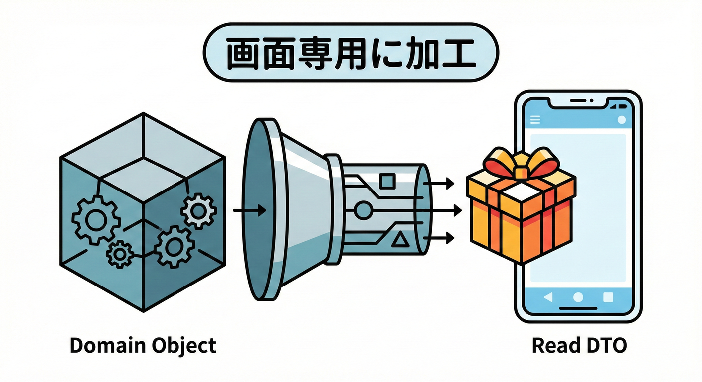
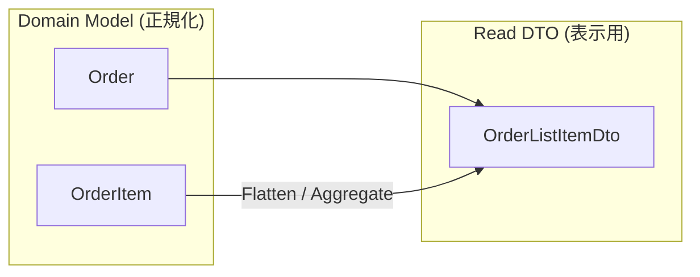

# 第16章：クエリ設計①（GetOrderList：一覧）🔎📋
ここでは **GetOrderList（注文一覧）** を題材に、**“画面が欲しい形が正義”** なクエリ設計を、手を動かしながら作っていくね☺️🧠💕

---

## 16章でできるようになること ✅✨

* 一覧画面にちょうどいい **Read DTO** を設計できる🎁💡
* **Queryは副作用ゼロ** のまま、一覧に必要な形で返せる🧼🚫
* ドメイン（Order）をそのまま返さずに、**表示向けに割り切る**感覚がわかる🙆‍♀️✨
* フィルタ・並び替え・ページングの“最小セット”を作れる📌🔁

---

## まず大事な話：一覧Queryの「正解」はこれ💯✨

### ✅ Queryは「画面が欲しい形」を返す

一覧画面って、だいたいこういう1行が並ぶよね？👀

* 注文ID（短い表示）
* ステータス（ORDERED / PAID…）
* 合計金額（円）
* 点数（itemCount）
* 作成日時
* 表示名（例：`唐揚げ弁当 ほか2点`）🍙✨

ここでのコツは…

### ❌ ドメインをそのまま返さない

`Order` は「業務ルールのかたまり」だから、一覧に必要ない情報まで持ってたり、形がゴツかったりするの😵‍💫
一覧は **“ビュー専用の軽い箱”** でOK！🎁🙂

---

## ありがちな事故あるある😇⚠️（先に潰す！）

* `Order` をそのまま返して、フロント側が地獄になる🫠
* Queryなのに「ついでに既読フラグ更新」とかしちゃう（副作用💥）🙅‍♀️
* 一覧に必要な値を毎回計算して重くなる（のちのち辛い）🐢💦
* DTO名や項目が画面の言葉になってない（読みにくい）📛

---

## 今回作るもの：GetOrderListの完成イメージ🧩✨

* 入力：`status` / `keyword` / `limit` / `offset` / `sort`
* 出力：`items[]` と `total`

---

# ハンズオン：GetOrderListを作ろう〜！✍️💨

## 1) まずは「一覧DTO」を作る🎁✨




ポイント：**一覧の1行 = 1 DTO** だよ〜📋💕

```ts
// src/queries/getOrderList/types.ts

export type OrderStatus = "ORDERED" | "PAID" | "CANCELLED";

export type OrderListItemDto = {
  orderId: string;        // 例: "ord_123"
  status: OrderStatus;    // バッジ表示に使う
  totalYen: number;       // 画面は数値がうれしい
  itemCount: number;      // 例: 3
  createdAt: string;      // ISO文字列（扱いやすい）
  displayTitle: string;   // 例: "唐揚げ弁当 ほか2点"
};

export type GetOrderListQuery = {
  status?: OrderStatus;
  keyword?: string; // メニュー名や注文IDの部分一致とか
  limit?: number;
  offset?: number;
  sort?: "createdAtDesc" | "createdAtAsc";
};

export type GetOrderListResult = {
  items: OrderListItemDto[];
  total: number;
};
```

💡`createdAt` を Date じゃなく文字列にするのは「API越しに壊れにくい」からだよ〜🙂🧊
（このへんはチーム方針でOK！）

---

## 2) Readモデル（Query用の保存形）を決める🧱✨

Read側は **平たく**、**一覧で欲しい情報を持つ** のがコツ！📦✨

```ts
// src/queries/getOrderList/readModel.ts

import { OrderStatus } from "./types";

export type OrderReadModelRow = {
  orderId: string;
  status: OrderStatus;
  totalYen: number;
  itemCount: number;
  createdAt: string;

  // 一覧用に “最初の1品名” を持っておく（投影で作る想定）
  firstItemName: string;
};
```

✅ 「ドメインの正規形」じゃなくていいよ！
一覧で使うなら、こういう “ちょい加工済み” を持っててもOK🙆‍♀️✨

---

## 3) ReadRepository（Query専用の入口）を作る🚪🔎

QueryServiceがDBや配列を直接触ると、だんだん汚くなるの…😵‍💫
だから **ReadRepository** に押し込むよ〜🧹✨

```ts
// src/queries/getOrderList/orderReadRepository.ts

import { GetOrderListQuery } from "./types";
import { OrderReadModelRow } from "./readModel";

export type OrderReadSearchResult = {
  rows: OrderReadModelRow[];
  total: number;
};

export interface OrderReadRepository {
  searchOrderList(query: GetOrderListQuery): Promise<OrderReadSearchResult>;
}
```

---

## 4) QueryService（副作用ゼロ）を作る🧼🚫✨

ここは **「並べ方」「返す形」だけ責任** を持つよ〜！

```ts
// src/queries/getOrderList/getOrderListQueryService.ts

import { GetOrderListQuery, GetOrderListResult, OrderListItemDto } from "./types";
import { OrderReadRepository } from "./orderReadRepository";

const normalizeQuery = (q: GetOrderListQuery) => {
  const limit = Math.min(Math.max(q.limit ?? 20, 1), 100);
  const offset = Math.max(q.offset ?? 0, 0);
  const sort = q.sort ?? "createdAtDesc";
  const keyword = q.keyword?.trim() || undefined;

  return { ...q, limit, offset, sort, keyword };
};

const buildDisplayTitle = (firstItemName: string, itemCount: number) => {
  if (itemCount <= 1) return firstItemName;
  return `${firstItemName} ほか${itemCount - 1}点`;
};

export class GetOrderListQueryService {
  constructor(private readonly repo: OrderReadRepository) {}

  async execute(rawQuery: GetOrderListQuery): Promise<GetOrderListResult> {
    const query = normalizeQuery(rawQuery);

    const { rows, total } = await this.repo.searchOrderList(query);

    const items: OrderListItemDto[] = rows.map((r) => ({
      orderId: r.orderId,
      status: r.status,
      totalYen: r.totalYen,
      itemCount: r.itemCount,
      createdAt: r.createdAt,
      displayTitle: buildDisplayTitle(r.firstItemName, r.itemCount),
    }));

    return { items, total };
  }
}
```

### ✅ ここがえらいポイント💮

* `execute` の中で **更新しない**（ログやメトリクス以外）🧼🚫
* 返す形は **DTOに固定**（画面が使いやすい）🎁✨
* 入力は **normalize** して守る（limitが暴走しない）🛡️

---

## 5) とりあえず動く！in-memory ReadRepository🪶✨

最初は配列でOKだよ〜🙂（ここで詰まると嫌になるから！😆）

```ts
// src/queries/getOrderList/inMemoryOrderReadRepository.ts

import { GetOrderListQuery } from "./types";
import { OrderReadRepository, OrderReadSearchResult } from "./orderReadRepository";
import { OrderReadModelRow } from "./readModel";

export class InMemoryOrderReadRepository implements OrderReadRepository {
  constructor(private readonly rows: OrderReadModelRow[]) {}

  async searchOrderList(query: GetOrderListQuery): Promise<OrderReadSearchResult> {
    let filtered = [...this.rows];

    if (query.status) {
      filtered = filtered.filter((r) => r.status === query.status);
    }

    if (query.keyword) {
      const k = query.keyword.toLowerCase();
      filtered = filtered.filter((r) =>
        r.orderId.toLowerCase().includes(k) || r.firstItemName.toLowerCase().includes(k)
      );
    }

    const sort = query.sort ?? "createdAtDesc";
    filtered.sort((a, b) => {
      if (sort === "createdAtAsc") return a.createdAt.localeCompare(b.createdAt);
      return b.createdAt.localeCompare(a.createdAt);
    });

    const total = filtered.length;

    const limit = query.limit ?? 20;
    const offset = query.offset ?? 0;
    const rows = filtered.slice(offset, offset + limit);

    return { rows, total };
  }
}
```

---

## 6) 使ってみよう！デモ（コンソールでOK）🎬✨

```ts
// src/dev/demoGetOrderList.ts

import { InMemoryOrderReadRepository } from "../queries/getOrderList/inMemoryOrderReadRepository";
import { GetOrderListQueryService } from "../queries/getOrderList/getOrderListQueryService";
import { OrderReadModelRow } from "../queries/getOrderList/readModel";

const seed: OrderReadModelRow[] = [
  {
    orderId: "ord_1001",
    status: "ORDERED",
    totalYen: 780,
    itemCount: 2,
    createdAt: "2026-01-24T09:10:00.000Z",
    firstItemName: "唐揚げ弁当",
  },
  {
    orderId: "ord_1002",
    status: "PAID",
    totalYen: 420,
    itemCount: 1,
    createdAt: "2026-01-24T09:12:00.000Z",
    firstItemName: "おにぎりセット",
  },
];

async function main() {
  const repo = new InMemoryOrderReadRepository(seed);
  const service = new GetOrderListQueryService(repo);

  const result = await service.execute({ sort: "createdAtDesc", limit: 10 });

  console.log(result);
}

main().catch(console.error);
```

---

# AI活用コーナー🤖✨（めちゃ効く！）

## そのままコピペで使えるプロンプト例💬

* 「注文一覧のUI行に必要な項目を10個提案して。初心者向けに理由もつけて」📝✨
* 「Orderドメインをそのまま返すデメリットを、具体例で3つ」⚠️
* 「GetOrderListに足りないフィルタ条件を、学食アプリ想定で列挙して」🍙🔎
* 「DTOの命名が画面の言葉になってるかレビューして」✅

---

## ミニ演習（15分）⏳✍️

1. `status=PAID` のときだけ返すフィルタを追加してみよ〜💳✅
2. `keyword` を「大文字小文字区別なし」で検索できるようにする🔤✨
3. DTOに `statusLabel`（例："支払い済み"）を追加してみる

   * これは **更新じゃない** から QueryでもOKだよ🙆‍♀️💕

---

## 理解チェッククイズ🎯✨

* Q1：一覧Queryで `Order` を返さない方がいい理由は？（2つ言えたら勝ち🏆）
* Q2：QueryServiceの仕事は「業務ルール」？それとも「返す形」？🤔
* Q3：`limit` を normalize するのは何のため？🛡️

---

## 次章の予告👀✨

次は **第17章：集計（GetSalesSummary）📊**！
「CQRSってこういう時に強いんだ〜😍」ってなるやつやるよ〜！

---

## おまけ：最新事情メモ（教材の鮮度）🧊✨

* TypeScript は npm 上で **5.9.3** が latest として案内されてるよ📦✨ ([npm][1])
* Node.js は **24系がLTSで、24.13.0が2026-01-13にリリース**（セキュリティリリース）🔒🧯 ([Node.js][2])
* テストに使う Vitest は **4系**が案内されてて、移行ガイドも更新されてるよ🧪✨ ([Vitest][3])

[1]: https://www.npmjs.com/package/typescript?utm_source=chatgpt.com "typescript"
[2]: https://nodejs.org/en/blog/release/v24.13.0?utm_source=chatgpt.com "Node.js 24.13.0 (LTS)"
[3]: https://vitest.dev/blog/vitest-4?utm_source=chatgpt.com "Vitest 4.0 is out!"
