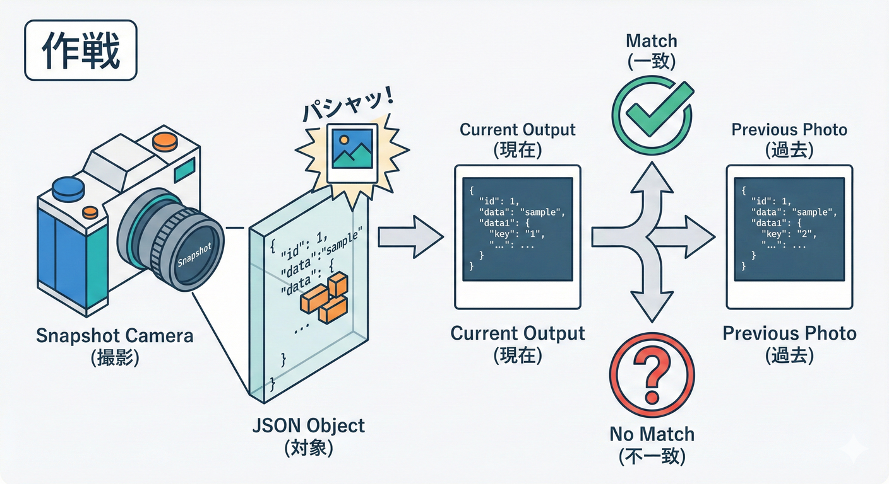
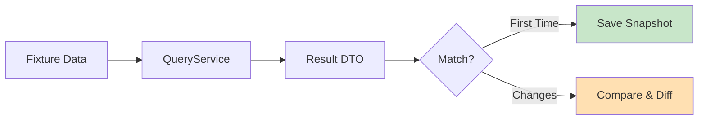

# 第24章　テスト② QueryServiceをテスト（返り値の形）👀🧪
Write（更新）じゃなくて Read（参照）を守るテストなので、ポイントは **「返すDTOの形が壊れてない？」** をしっかり固めることです💎

2026年1月時点だと、TypeScript界隈のユニットテストは **Vitest 4** がかなり定番ポジションです（2025/10にVitest 4がリリース）([Vitest][1])
もちろん **Jest 30** も現役で強いです（2025/06にJest 30）([Jest][2])
この章は **「QueryServiceの返り値検証」** が主役なので、スナップショットが使いやすい Vitest で進めます📸✨([Vitest][3])

---

## この章のゴール🎯✨

* QueryService が返す **一覧DTO / 集計DTO** の形（キー・並び・整形）が崩れたら即気づける✅
* Read側は「画面が欲しい形が正義」なので、**画面の期待値を“テストで固定”** する📌
* 「仕様変更なのかバグなのか」を、差分でサクッと判断できる🧠⚡

---

## QueryServiceテストって、何をテストするの？🤔🧪

### ✅ テストしてOK（むしろやるべき）

* DTOのキーが揃ってる？（例：`id` なのに `orderId` に変わってない？）🔑
* 値が整形されてる？（金額、日付、ステータス表示など）💴🗓️
* 並び順やフィルタが合ってる？（新しい順、支払い済みだけ等）🔽
* 空データでも壊れない？（空配列、0件、境界値）🫙

### ❌ ここではやらない（別章・別テストで）

* DBのSQL自体が正しいか（それはReadRepositoryの責務）🗄️
* APIのルーティングやHTTP周り（後のAPI章で）🌐

---

## 作戦：固定データで「金型」を作る🧁📐




QueryServiceのテストは、イメージとして

* **固定データ（fixture）** を入れる🍱
* **QueryService** を動かす▶️
* **返ってきたDTO** を期待値と比較する👀✅

これでOK！

さらに強いのが👇

* **スナップショットテスト**：返り値まるごと“保存”して差分を見る📸✨([Vitest][3])

  * DTOが「画面の契約」だから、相性めっちゃいいです💘

---

## セットアップ（Vitest）🧪⚙️

### 1) まず入れる（例）

```bash
npm i -D vitest
```

### 2) スクリプト例（`package.json`）

```json
{
  "scripts": {
    "test": "vitest",
    "test:run": "vitest run",
    "test:ui": "vitest --ui",
    "test:update": "vitest -u"
  }
}
```

* `vitest -u` でスナップショット更新できるよ🆙([Vitest][3])
* `--ui` も便利（ぽちぽち実行できる）🖱️([Vitest][4])

### 3) （必要なら）型補完を効かせる

Vitestの **グローバルAPI**（`describe`, `it`, `expect` をimport無しで使うやつ）を使うなら、tsconfigに型を足すやり方が公式にあります🧩([Vitest][5])
ただこの教材では、混乱を避けて **毎回importするスタイル** で行きます（初心者向けで事故らない🫶）

---

## ハンズオン①：GetOrderList（一覧）のテスト📋👀🧪

ここでは “学食モバイル注文” の一覧を想定🍙📱

### 例：DTOとQueryService（最低限の形）

```ts
// src/queries/getOrderList/types.ts
export type OrderStatus = 'ORDERED' | 'PAID'

export type ReadOrderRow = {
  orderId: string
  status: OrderStatus
  orderedAtIso: string // ISO文字列にしちゃう（Readは割り切りOK🎁）
  totalYen: number
  itemCount: number
}

export type OrderListItemDto = {
  id: string
  statusLabel: '未払い' | '支払い済み'
  orderedAtIso: string
  totalYen: number
  itemCount: number
}

export type OrderListDto = {
  items: OrderListItemDto[]
}
```

```ts
// src/queries/getOrderList/ReadOrderRepository.ts
import type { ReadOrderRow } from './types'

export interface ReadOrderRepository {
  listOrders(): Promise<ReadOrderRow[]>
}
```

```ts
// src/queries/getOrderList/GetOrderListQueryService.ts
import type { ReadOrderRepository } from './ReadOrderRepository'
import type { OrderListDto, ReadOrderRow } from './types'

const toStatusLabel = (s: ReadOrderRow['status']): '未払い' | '支払い済み' =>
  s === 'PAID' ? '支払い済み' : '未払い'

export class GetOrderListQueryService {
  constructor(private readonly repo: ReadOrderRepository) {}

  async execute(): Promise<OrderListDto> {
    const rows = await this.repo.listOrders()

    // 例：新しい順にする（テストで守る！）
    const sorted = [...rows].sort((a, b) => b.orderedAtIso.localeCompare(a.orderedAtIso))

    return {
      items: sorted.map((r) => ({
        id: r.orderId,
        statusLabel: toStatusLabel(r.status),
        orderedAtIso: r.orderedAtIso,
        totalYen: r.totalYen,
        itemCount: r.itemCount,
      })),
    }
  }
}
```

---

### テストを書く✅（Shapeテスト＋Snapshot）

```ts
// src/queries/getOrderList/GetOrderListQueryService.test.ts
import { describe, it, expect } from 'vitest'
import { GetOrderListQueryService } from './GetOrderListQueryService'
import type { ReadOrderRepository } from './ReadOrderRepository'
import type { ReadOrderRow } from './types'

class FakeReadOrderRepo implements ReadOrderRepository {
  constructor(private readonly rows: ReadOrderRow[]) {}
  async listOrders(): Promise<ReadOrderRow[]> {
    return this.rows
  }
}

describe('GetOrderListQueryService', () => {
  it('一覧DTOの「形」を守る（キー・型・整形）👀', async () => {
    const repo = new FakeReadOrderRepo([
      {
        orderId: 'o-2',
        status: 'PAID',
        orderedAtIso: '2026-01-10T10:00:00.000Z',
        totalYen: 1200,
        itemCount: 2,
      },
    ])
    const service = new GetOrderListQueryService(repo)

    const dto = await service.execute()

    expect(dto.items).toHaveLength(1)

    const item = dto.items[0]

    // ✅ 1) キーが変わってないか（余計なものが混ざってないか）
    expect(Object.keys(item).sort()).toEqual(
      ['id', 'statusLabel', 'orderedAtIso', 'totalYen', 'itemCount'].sort(),
    )

    // ✅ 2) 値の意味（整形）
    expect(item.id).toBe('o-2')
    expect(item.statusLabel).toBe('支払い済み')
    expect(item.totalYen).toBe(1200)
    expect(item.itemCount).toBe(2)
    expect(item.orderedAtIso).toMatch(/^\d{4}-\d{2}-\d{2}T/)
  })

  it('新しい順で返す🔽', async () => {
    const repo = new FakeReadOrderRepo([
      {
        orderId: 'o-1',
        status: 'ORDERED',
        orderedAtIso: '2026-01-10T09:00:00.000Z',
        totalYen: 500,
        itemCount: 1,
      },
      {
        orderId: 'o-2',
        status: 'PAID',
        orderedAtIso: '2026-01-10T10:00:00.000Z',
        totalYen: 1200,
        itemCount: 2,
      },
    ])
    const service = new GetOrderListQueryService(repo)

    const dto = await service.execute()

    expect(dto.items.map((x) => x.id)).toEqual(['o-2', 'o-1'])
  })

  it('スナップショットで「返り値まるごと」を固定📸✨', async () => {
    const repo = new FakeReadOrderRepo([
      {
        orderId: 'o-1',
        status: 'ORDERED',
        orderedAtIso: '2026-01-10T09:00:00.000Z',
        totalYen: 500,
        itemCount: 1,
      },
    ])
    const service = new GetOrderListQueryService(repo)

    const dto = await service.execute()

    expect(dto).toMatchSnapshot()
  })

  it('0件でも壊れない🫙', async () => {
    const repo = new FakeReadOrderRepo([])
    const service = new GetOrderListQueryService(repo)

    const dto = await service.execute()

    expect(dto).toEqual({ items: [] })
  })
})
```

#### スナップショット更新のしかた🆙

* watch中なら失敗時に `u` を押して更新できるよ⌨️([Vitest][3])
* または `vitest -u` でもOK🧪([Vitest][3])

---

## ハンズオン②：GetSalesSummary（集計）のテスト📊🧪✨

集計は「Read側が得意！」のやつ🥳
だからこそ **返り値の形** をガッチリ守ると安心です🛡️

### 例：集計DTO（めっちゃざっくり）

```ts
// src/queries/getSalesSummary/types.ts
export type SalesSummaryDto = {
  from: string
  to: string
  totalYen: number
  byDay: { date: string; totalYen: number }[]
  topMenus: { menuId: string; menuName: string; qty: number }[]
}
```

### テストのコツ🍀

* 集計結果は「順序」がぶれやすい（同点とか）ので、**テスト前にソートしてからsnapshot** が安定✅
* 小さいfixture（2〜3注文）で十分📦

（ここは章の主旨に合わせて、DTOの金型を作るのが最優先なので、実装例は省略せずに書くなら次の章で投影やRead最適化に合わせて一緒に育てるのが気持ちいい流れだよ〜🌱✨）

---

## よくある事故と回避テク😵‍💫🧯

### 事故①：日付・乱数・IDでスナップショットが毎回変わる🌀

✅ 回避：

* テスト用データは固定（`2026-01-10...`みたいに）🗓️
* “今の時刻”はDTOに入れない（入れるなら固定化する）⏰

### 事故②：スナップショットがデカすぎてレビュー不能📚💥

✅ 回避：

* “画面に必要な項目だけ”にする（Read DTOの割り切り🎁）
* ネスト深いなら、部分だけ検証＋必要箇所だけsnapshot📸

### 事故③：「これは仕様変更？バグ？」で揉める😇

✅ 回避：

* snapshot更新は「差分を読む」前提にする（レビュー文化）👀
* DTOの変更は「画面の契約変更」なので、PRで説明を1行添える📝

---

## AI活用🤖✨（この章と相性よすぎ）

Copilot / Codex にお願いするなら、こんな感じが強いよ💪😆

* 「このQueryServiceの返り値DTOに対して、壊れやすいポイントのテストケースを10個提案して」🧠
* 「fixtureを最小の2パターンに削って、同じカバレッジになるように整理して」✂️
* 「スナップショットが安定するように、ソートや正規化関数を提案して」📸
* 「Object.keys()での形検証を、読みやすいヘルパー関数にして」🧹

---

## まとめ✅🎉（この章で身についたこと）

* QueryServiceテストは **“画面が欲しい形（DTO）” を守る** のが主役👀
* **固定fixture**＋**shape検証**＋**snapshot** が最強セット📦🔑📸([Vitest][3])
* Vitest 4 はスナップショット運用がしやすい（`-u` 更新など）🧪🆙([Vitest][1])

---

## 宿題（ミニ演習）📝✨

1. `GetOrderList` に「合計金額の表示用フォーマット（例：`"¥1,200"`）」を追加してみて💴
2. その変更で **shapeテスト** と **snapshot** がどう変わるか観察👀
3. 「仕様変更として正しい」なら `vitest -u` で更新して、差分を読んで納得できたらOK🙆‍♀️([Vitest][3])

---

次は第25章「同期投影（Writeの後にReadも更新）」へ行くと、Readモデルが“育つ”感じが出てきて楽しくなるよ〜🌱⚡

[1]: https://vitest.dev/blog/vitest-4 "Vitest 4.0 is out! | Vitest"
[2]: https://jestjs.io/blog/2025/06/04/jest-30?utm_source=chatgpt.com "Jest 30: Faster, Leaner, Better"
[3]: https://vitest.dev/guide/snapshot "Snapshot | Guide | Vitest"
[4]: https://vitest.dev/guide/cli "Command Line Interface | Guide | Vitest"
[5]: https://vitest.dev/config/globals?utm_source=chatgpt.com "globals | Config"
