# 第05章：題材スタート（ToDoミニアプリ）をベタに作る📝💖

（※この章は **わざと混ぜ混ぜ** に作るよ😎💥 次の章から「分ける気持ちよさ」を体感する作戦！）

---

## 5-0. この章で作るもの（完成イメージ）🎯✨

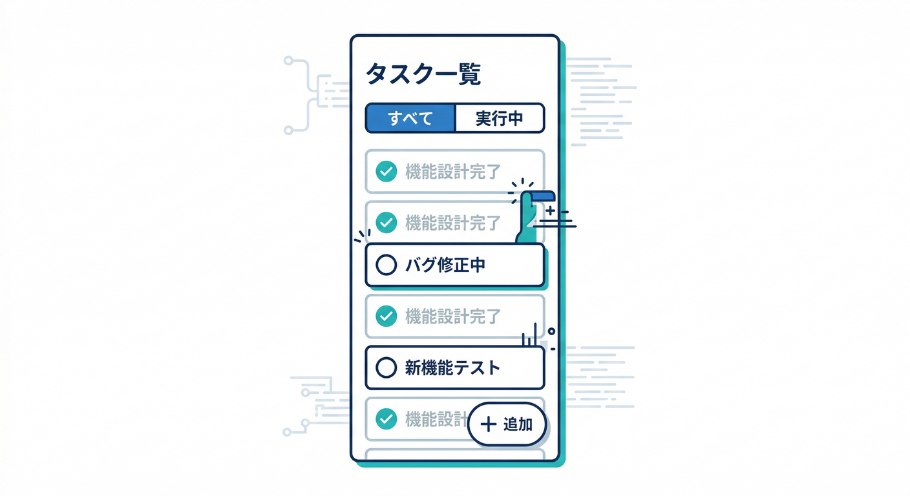

次の機能がある **ミニToDo** を作るよ〜🧸💕

* 追加 ➕
* 完了チェック ✅（戻すのもOK）
* 削除 🗑️
* 一覧表示 📋
* 絞り込み（全て / 未完了 / 完了）🎚️
* ブラウザを閉じても残る（`localStorage`）💾✨

そして大事なのが…
この章のコードは **CQS的には“あえて微妙”** に作ります😇💥
「うわ…混ざっててツラい…」って気持ちを作るのがゴールだよ🫶

---

## 5-1. 今日の“ゴール”🧭🌸

* とりあえず動くToDoを作れる🎉
* どこが “混ざってる” のか説明できるようになる🧠✨
* 次章（分類ゲーム🎯）の素材を準備する📦

---

## 5-2. いまの定番バージョン感（2026/01/20時点）📌✨

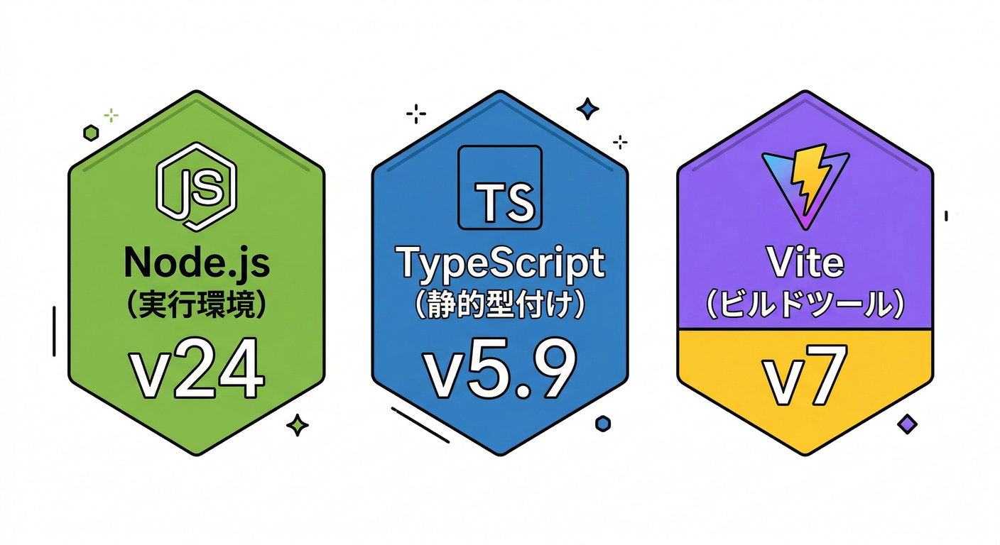

* Node.js は **v24 系が Active LTS**（安定運用向き）💚 ([nodejs.org][1])
* TypeScript は **5.9 系**が現行の安定ラインとして参照しやすいよ📘 ([TypeScript][2])
* Vite は **v7 系**が最新安定ライン（例：v7.3.1 表示あり）⚡ ([GitHub][3])

---

## 5-3. プロジェクトを作る（Vite + vanilla-ts）⚡🪄

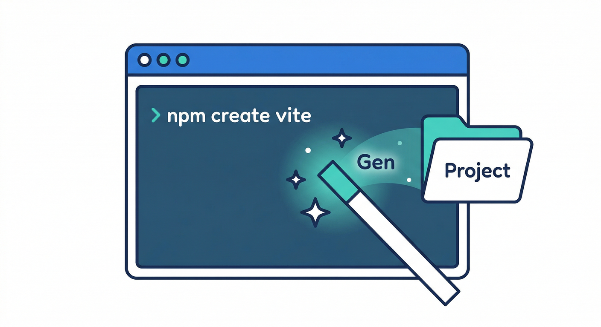

ターミナルで以下を順に実行してね🖥️✨

```bash
npm create vite@latest todo-cqs -- --template vanilla-ts
cd todo-cqs
npm install
npm run dev
```

* `vanilla-ts`（素のTypeScript）テンプレがあるのは公式ガイドにも載ってるよ📎 ([vitejs][4])
* 起動したら表示されたURL（だいたい `http://localhost:5173/`）をブラウザで開けばOKだよ🌐✨

---

## 5-4. まずはテンプレを“上書き”してToDoにする✍️🧁

### ① `src/main.ts` をまるごと置き換え🧩

```ts
type Todo = {
  id: string;
  title: string;
  done: boolean;
  createdAt: number;
  completedAt?: number;
};

type Filter = "all" | "active" | "done";

const STORAGE_KEY = "todo-cqs:v1";
const READ_COUNT_KEY = "todo-cqs:readCount"; // ←わざと“Queryっぽい所”で増やす用😇

let todos: Todo[] = [];
let filter: Filter = "all";

const app = document.querySelector<HTMLDivElement>("#app");
if (!app) throw new Error("#app not found");

boot(); // 起動✨

function boot() {
  // 画面の土台（UI）を先に作っちゃうよ🧱
  app.innerHTML = `
    <div class="wrap">
      <header class="header">
        <h1>ToDo ミニアプリ 📝💖</h1>
        <p class="sub">第5章：まずは“混ぜ混ぜ”で作るよ 😎💥</p>
      </header>

      <section class="panel">
        <div class="row">
          <input id="titleInput" class="input" placeholder="やることを入力してね…" />
          <button id="addBtn" class="btn primary">追加 ➕</button>
        </div>

        <div class="row filters">
          <button data-filter="all" class="btn chip is-on">ぜんぶ 📋</button>
          <button data-filter="active" class="btn chip">未完了 🌱</button>
          <button data-filter="done" class="btn chip">完了 ✅</button>
        </div>

        <div class="row meta">
          <span id="stats" class="stats"></span>
          <button id="clearDoneBtn" class="btn danger ghost">完了を全削除 🧹🗑️</button>
        </div>
      </section>

      <section class="panel">
        <ul id="list" class="list"></ul>
      </section>

      <footer class="footer">
        <span id="readCount" class="read"></span>
      </footer>
    </div>
  `;

  // イベントを付ける🎣
  const titleInput = must<HTMLInputElement>("#titleInput");
  const addBtn = must<HTMLButtonElement>("#addBtn");
  const clearDoneBtn = must<HTMLButtonElement>("#clearDoneBtn");

  addBtn.addEventListener("click", () => {
    addTodoMixed(titleInput.value); // ← 追加・保存・再描画までやる（混ぜる😇）
    titleInput.value = "";
    titleInput.focus();
  });

  titleInput.addEventListener("keydown", (e) => {
    if (e.key === "Enter") {
      addTodoMixed(titleInput.value);
      titleInput.value = "";
    }
  });

  app.addEventListener("click", (e) => {
    const el = e.target as HTMLElement;

    // 絞り込みボタン🎚️
    const filterBtn = el.closest<HTMLButtonElement>("[data-filter]");
    if (filterBtn) {
      const f = filterBtn.dataset.filter as Filter;
      setFilterMixed(f); // ← フィルタ更新＋再描画（混ぜる😇）
      return;
    }

    // 削除🗑️
    const delBtn = el.closest<HTMLButtonElement>("[data-action='delete']");
    if (delBtn) {
      const id = delBtn.dataset.id!;
      deleteTodoMixed(id); // ← 削除＋保存＋再描画（混ぜる😇）
      return;
    }
  });

  app.addEventListener("change", (e) => {
    const el = e.target as HTMLElement;

    // 完了チェック✅
    const checkbox = el.closest<HTMLInputElement>("input[type='checkbox'][data-id]");
    if (checkbox) {
      const id = checkbox.dataset.id!;
      toggleTodoMixed(id, checkbox.checked); // ← 更新＋保存＋再描画（混ぜる😇）
      return;
    }
  });

  clearDoneBtn.addEventListener("click", () => {
    clearDoneMixed(); // ← まとめて消す＋保存＋再描画（混ぜる😇）
  });

  // データ読み込み＋描画（ここも混ぜる😇）
  loadTodosAndRenderMixed();
}

/* -----------------------------
   ここから“わざと混ぜ混ぜ”ゾーン😇💥
------------------------------ */

// ✅ 追加（Command）っぽいのに、戻り値も返して、さらに描画もしちゃう😇
// 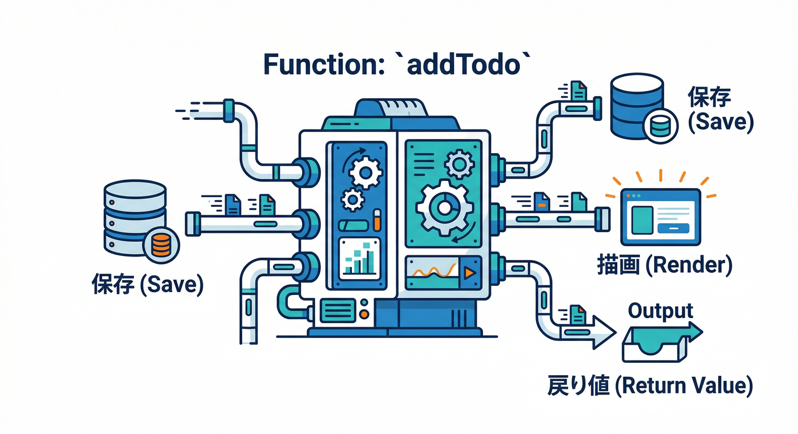
function addTodoMixed(rawTitle: string): Todo[] {
  const title = rawTitle.trim();
  if (!title) return todos;

  const t: Todo = {
    id: crypto.randomUUID(),
    title,
    done: false,
    createdAt: Date.now(),
  };

  todos.unshift(t);

  saveTodosMixed();     // 保存（副作用）💾
  renderMixed();        // 描画（副作用）🖼️
  return todos;         // 戻り値まで返す（混ぜる😇）
}

// ✅ 完了切替（Command）なのに描画までやる😇
function toggleTodoMixed(id: string, done: boolean): Todo[] {
  const t = todos.find(x => x.id === id);
  if (!t) return todos;

  t.done = done;
  t.completedAt = done ? Date.now() : undefined;

  saveTodosMixed();
  renderMixed();
  return todos;
}

// ✅ 削除（Command）も同じく全部入り😇
function deleteTodoMixed(id: string): Todo[] {
  todos = todos.filter(x => x.id !== id);

  saveTodosMixed();
  renderMixed();
  return todos;
}

// ✅ 完了を全削除（Command）も全部入り😇
function clearDoneMixed(): Todo[] {
  todos = todos.filter(x => !x.done);

  saveTodosMixed();
  renderMixed();
  return todos;
}

// ✅ フィルタ変更（Command？）も保存や描画を抱える😇
function setFilterMixed(f: Filter) {
  filter = f;

  // フィルタも永続化してみる（副作用）💾
  localStorage.setItem("todo-cqs:filter", filter);

  renderMixed();
}

// ✅ 読み込み＋描画（Query？）っぽいのに修正や保存もする😇
// 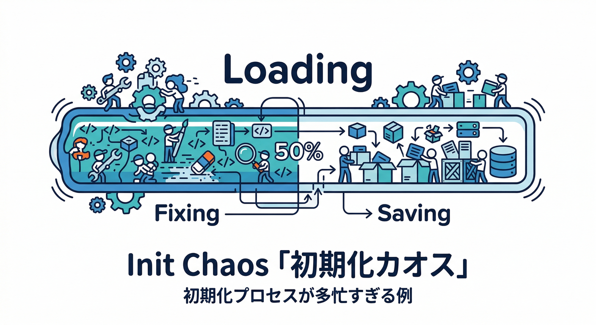
function loadTodosAndRenderMixed() {
  const raw = localStorage.getItem(STORAGE_KEY);
  const saved = raw ? (safeJsonParse<Todo[]>(raw) ?? []) : [];

  // ここで“ついでに”データ整形しちゃう（副作用っぽいこと）🧹
  todos = saved
    .filter(x => typeof x?.title === "string")
    .map(x => ({ ...x, title: x.title.trim() }))
    .filter(x => x.title.length > 0);

  // さらに“整形したから保存し直す”（副作用）😇
  saveTodosMixed();

  // フィルタも復元（地味に混ざる😇）
  const f = localStorage.getItem("todo-cqs:filter") as Filter | null;
  if (f === "all" || f === "active" || f === "done") filter = f;

  renderMixed();
}

// ✅ 保存（副作用）だけど、いつか「ここからQuery呼びたい」とか言い出すと事故る😇
function saveTodosMixed() {
  localStorage.setItem(STORAGE_KEY, JSON.stringify(todos));
}

// ✅ 表示用取得（Queryっぽい）なのに、読んだ回数を増やす副作用を入れる😇💥
// 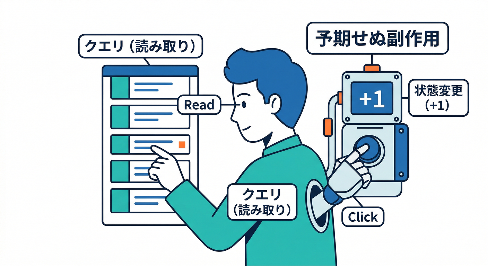
function getVisibleTodosMixed(): Todo[] {
  bumpReadCount(); // ← Queryに副作用ドーン😇
  switch (filter) {
    case "active": return todos.filter(x => !x.done);
    case "done":   return todos.filter(x => x.done);
    default:       return todos;
  }
}

// ✅ 描画（副作用）…だけど中で“Query”を呼ぶので、読んだ回数が増える😇
function renderMixed() {
  const list = must<HTMLUListElement>("#list");
  const stats = must<HTMLSpanElement>("#stats");
  const read = must<HTMLSpanElement>("#readCount");

  // フィルタボタン見た目更新🎚️
  app.querySelectorAll<HTMLButtonElement>("[data-filter]").forEach(btn => {
    btn.classList.toggle("is-on", btn.dataset.filter === filter);
  });

  const visible = getVisibleTodosMixed(); // ← ここで読んだ回数が増える😇
  list.innerHTML = visible.map(renderItemHtml).join("");

  const total = todos.length;
  const doneCount = todos.filter(x => x.done).length;
  const activeCount = total - doneCount;

  stats.textContent = `全 ${total} / 未完了 ${activeCount} / 完了 ${doneCount} 🧮✨`;

  const reads = Number(localStorage.getItem(READ_COUNT_KEY) ?? "0");
  read.textContent = `一覧を読んだ回数（わざと副作用😇）：${reads} 回`;
}

function renderItemHtml(t: Todo): string {
  const safeTitle = escapeHtml(t.title);
  const checked = t.done ? "checked" : "";
  const cls = t.done ? "item done" : "item";

  return `
    <li class="${cls}">
      <label class="left">
        <input type="checkbox" data-id="${t.id}" ${checked} />
        <span class="title">${safeTitle}</span>
      </label>
      <div class="right">
        <button class="btn ghost" data-action="delete" data-id="${t.id}">削除 🗑️</button>
      </div>
    </li>
  `;
}

/* -----------------------------
   便利関数（ここは普通にOKゾーン）🧰✨
------------------------------ */

function must<T extends HTMLElement>(selector: string): T {
  const el = document.querySelector<T>(selector);
  if (!el) throw new Error(`Element not found: ${selector}`);
  return el;
}

function safeJsonParse<T>(raw: string): T | null {
  try { return JSON.parse(raw) as T; } catch { return null; }
}

function escapeHtml(s: string): string {
  return s
    .replaceAll("&", "&amp;")
    .replaceAll("<", "&lt;")
    .replaceAll(">", "&gt;")
    .replaceAll('"', "&quot;")
    .replaceAll("'", "&#039;");
}

function bumpReadCount() {
  const cur = Number(localStorage.getItem(READ_COUNT_KEY) ?? "0");
  localStorage.setItem(READ_COUNT_KEY, String(cur + 1));
}
```

---

### ② `src/style.css` もまるごと置き換え🎀

```css
:root {
  font-family: system-ui, -apple-system, Segoe UI, Roboto, "Noto Sans JP", sans-serif;
  line-height: 1.5;
}

body {
  margin: 0;
  background: #0b1020;
  color: #e9ecf2;
}

.wrap {
  max-width: 760px;
  margin: 0 auto;
  padding: 28px 16px 40px;
}

.header h1 {
  margin: 0 0 6px;
  font-size: 28px;
}

.sub {
  margin: 0 0 18px;
  opacity: 0.85;
}

.panel {
  background: rgba(255,255,255,0.06);
  border: 1px solid rgba(255,255,255,0.12);
  border-radius: 16px;
  padding: 14px;
  margin: 12px 0;
}

.row {
  display: flex;
  gap: 10px;
  align-items: center;
  flex-wrap: wrap;
}

.input {
  flex: 1;
  min-width: 220px;
  padding: 12px 12px;
  border-radius: 12px;
  border: 1px solid rgba(255,255,255,0.18);
  background: rgba(0,0,0,0.25);
  color: #fff;
  outline: none;
}

.btn {
  padding: 10px 12px;
  border-radius: 12px;
  border: 1px solid rgba(255,255,255,0.18);
  background: rgba(255,255,255,0.08);
  color: #fff;
  cursor: pointer;
}

.btn:hover {
  background: rgba(255,255,255,0.12);
}

.primary {
  background: rgba(120, 140, 255, 0.35);
}

.danger {
  background: rgba(255, 90, 120, 0.25);
}

.ghost {
  background: transparent;
}

.chip {
  padding: 8px 10px;
  border-radius: 999px;
}

.is-on {
  border-color: rgba(160, 190, 255, 0.7);
  background: rgba(120, 140, 255, 0.25);
}

.meta {
  justify-content: space-between;
}

.stats {
  opacity: 0.9;
}

.list {
  list-style: none;
  padding: 0;
  margin: 0;
}

.item {
  display: flex;
  justify-content: space-between;
  align-items: center;
  gap: 10px;
  padding: 10px 10px;
  border-radius: 12px;
}

.item:hover {
  background: rgba(255,255,255,0.06);
}

.left {
  display: flex;
  align-items: center;
  gap: 10px;
}

.title {
  font-size: 16px;
}

.done .title {
  text-decoration: line-through;
  opacity: 0.7;
}

.footer {
  margin-top: 10px;
  opacity: 0.8;
  font-size: 13px;
}
```

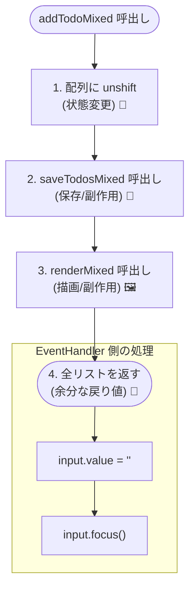

---

## 5-5. 動かしてみよう🎮✨


開発サーバが動いてる状態で（`npm run dev`）…

1. ToDo を追加 ➕
2. チェックして完了 ✅
3. 削除 🗑️
4. 絞り込み（未完了🌱 / 完了✅）
5. ブラウザをリロード 🔄 → **残ってたらOK！** 💾✨

---

## 5-6. この章で“わざと混ぜた”ポイント（CQS的にツラいやつ😇💥）

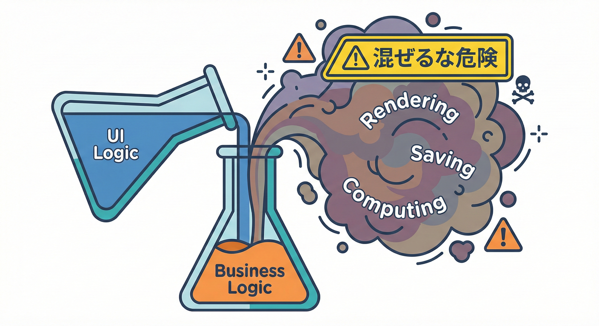

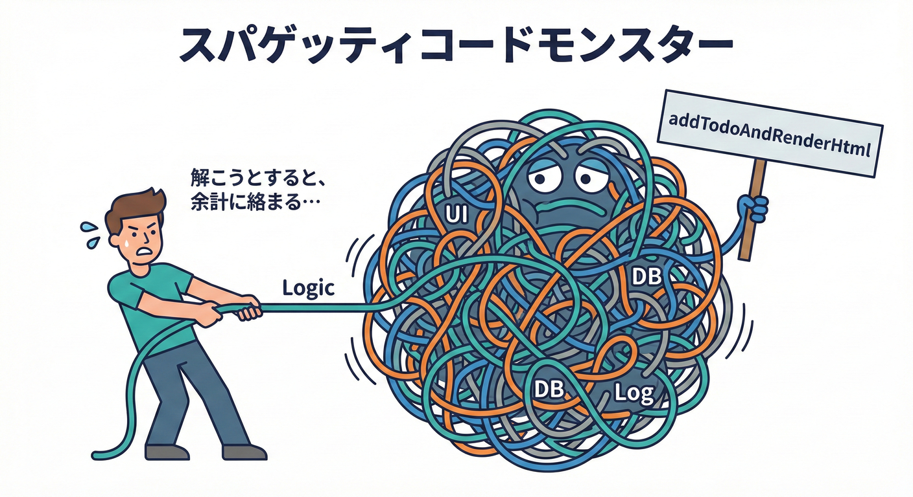

ここが次章以降の“ネタ”だよ〜🎯✨

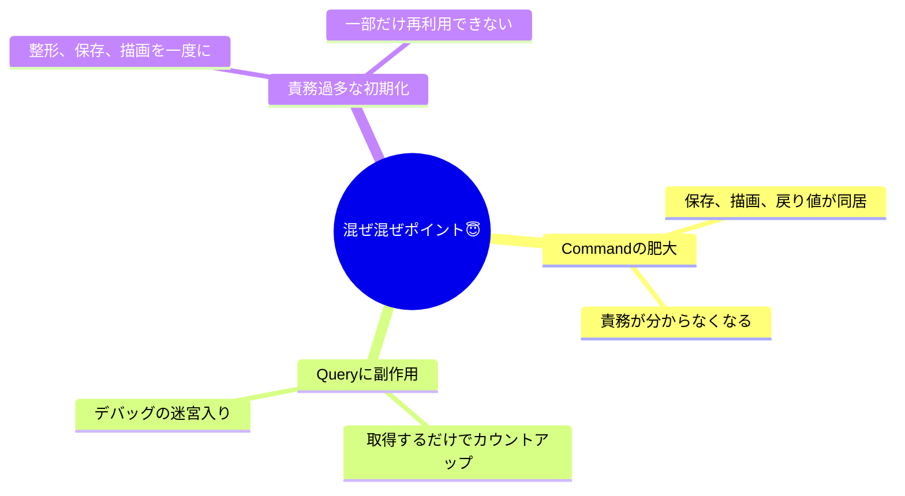


### ❌ ① Command が「保存」も「描画」も「戻り値」も全部やってる

例：`addTodoMixed()` / `toggleTodoMixed()`

* 状態変更（Command）🔧
* 永続化（副作用）💾
* UI描画（副作用）🖼️
* さらに `Todo[]` を返す🎁

→ 「何をした関数？」が説明しづらい😭

### ❌ ② Queryっぽいのに副作用を入れてる

例：`getVisibleTodosMixed()` が `bumpReadCount()` してる📈😇
→ 「見るだけのはず」が **勝手に状態を変える** ので、地味に事故りやすい💥

### ❌ ③ 読み込み処理が “整形→保存→描画” までやってる

`loadTodosAndRenderMixed()` が全部盛り🍔
→ テストや差し替え（DB化とか）したくなった時にしんどい😵‍💫

---

## 5-7. ミニ課題（この章のうちに軽く遊ぶ）🧸📝

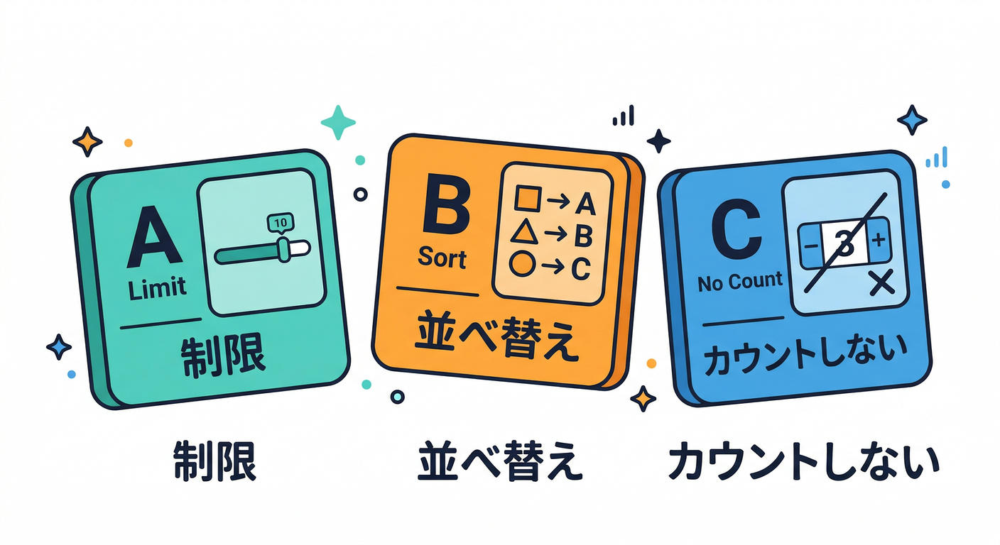

どれも “混ぜ混ぜのまま” でOKだよ😎（次で直すから！）

* 課題A：ToDo を 50文字までに制限してみる✂️
* 課題B：完了を「完了日時順」に並べてみる⏰
* 課題C：`readCount` をやめたら、どこがラクになるか言語化してみる🧠✨

---

## 5-8. AIに頼るミニコーナー🤖🪄（章末の“ちょい足し”）

そのまま貼って使ってOKだよ〜✨

* 「この `main.ts` の中で **Command と Query を分類**して、理由も書いて」🎯
* 「副作用っぽい箇所（localStorage / DOM操作 / Date.now）を **一覧にして**」👀
* 「`addTodoMixed` を “CQSに沿って” 分割するなら、関数名案を10個出して」📛✨
* 「次章の分類クイズ用に、このコードから “これはCommand？Query？” 問題を15問作って」📝🎲

---

次は **第6章：分類ゲーム！これはCommand？Query？🎯✨** に行くと、いま作った“混ぜ混ぜ”がめちゃ効いてくるよ〜😎💖

[1]: https://nodejs.org/en/about/previous-releases?utm_source=chatgpt.com "Node.js Releases"
[2]: https://www.typescriptlang.org/docs/handbook/release-notes/typescript-5-9.html?utm_source=chatgpt.com "Documentation - TypeScript 5.9"
[3]: https://github.com/vitejs/vite/releases?utm_source=chatgpt.com "Releases · vitejs/vite"
[4]: https://vite.dev/guide/?utm_source=chatgpt.com "Getting Started"
