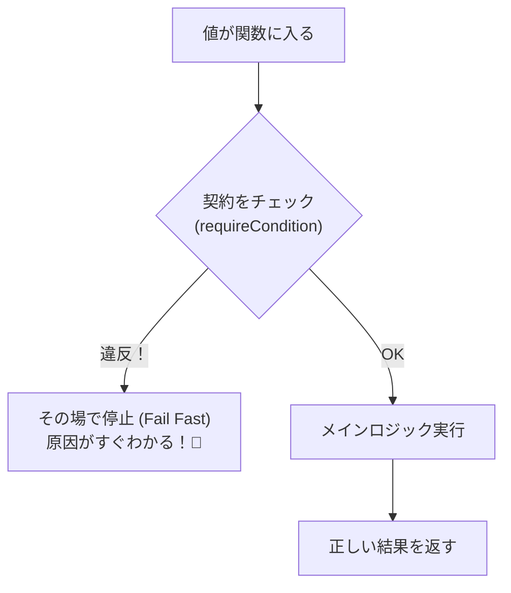
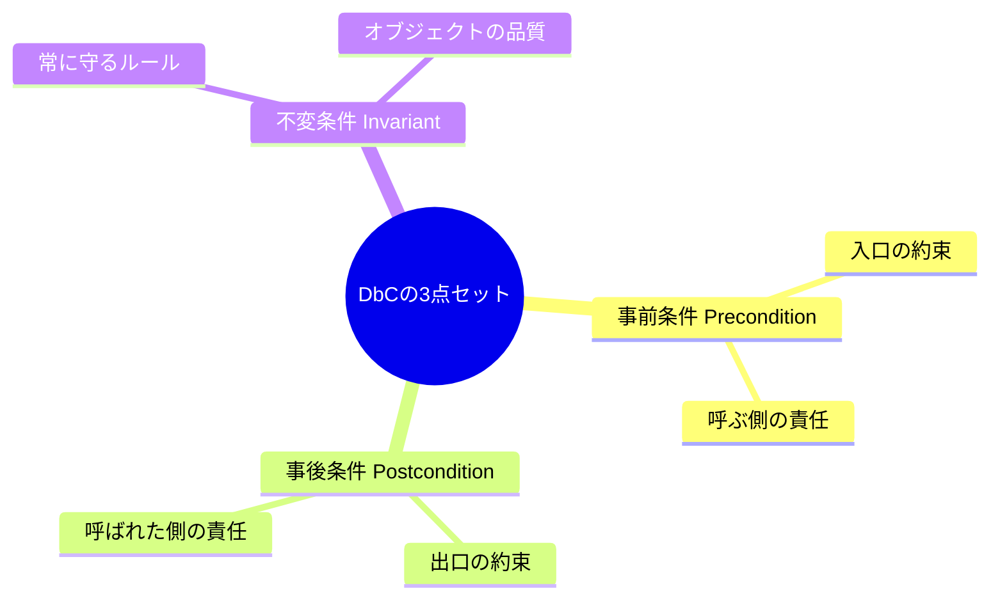
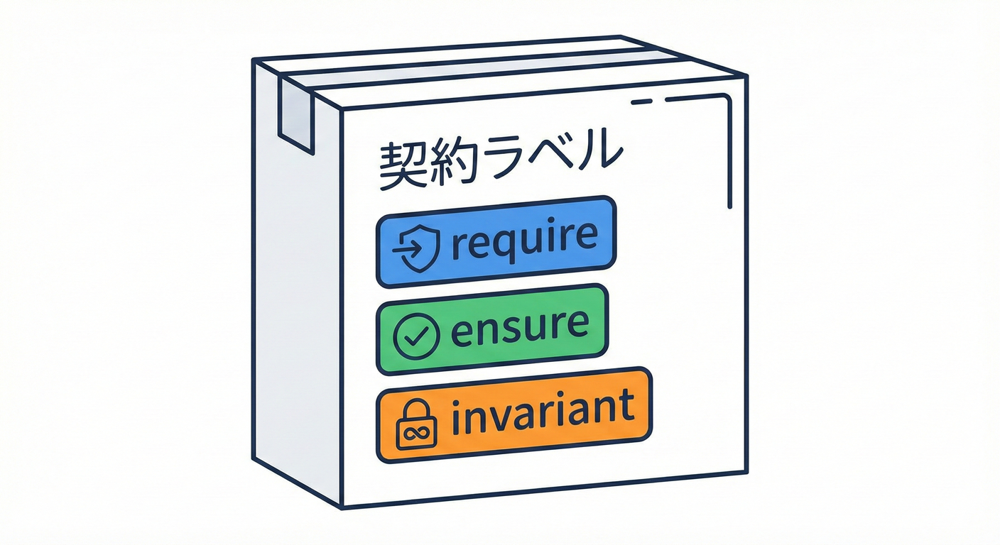

# 第1章　DbCってなに？「約束」でバグを入口で止める🤝🛑

## この章でできるようになること🎯✨

* 「DbC（Design by Contract）」が何を守る考え方なのかを、ふんわりじゃなく説明できる🙂📘
* 「事前条件・事後条件・不変条件」の3点セットを、コードに落とし込める🧩✅
* 「コメントより、実行される約束」がなぜ強いのかを体感できる📝➡️💥
* 小さな関数に“契約”を入れて、バグを入口で止められる🚪🛑✨

---

## 1. DbCは「関数の入口に置く約束」🤝🚪

DbCは、ひとことで言うと……

**「この関数に入ってくる値はこうであってね」**（事前条件）
**「成功したなら結果はこうなるよ」**（事後条件）
**「このオブジェクトは常にこういう状態だよ」**（不変条件）

…という **“約束（契約）”を、実際に動く形で書く設計** です🤝✅

ポイントはここ👇

* **壊れた値を中に入れない**（入口で止める）🚪🛑
* もし約束が守られてないなら、**その場で分かるように落ちる**（Fail Fast）💥⚡
* 「いつ壊れた？」を「入口で壊れてた」に寄せる🔦✨



TypeScriptは「型」でかなり守れます🙂🧷
でも、型だけでは守れない“現実のルール”（範囲・桁数・整合性など）が必ず出てくるので、DbCが効いてきます💪✨

> TypeScriptは「型（types）」で意図を表し、ツールでミスを早めに見つける言語です。([TypeScript][1])

---

## 2. DbCの3点セット🧩✅（超やさしく）

### 2.1 事前条件（Precondition）＝入力の約束📥🚪

「この関数を呼ぶなら、これだけは守ってね！」っていう入口チェック🙂
例：

* 割り算の分母は 0 じゃない
* 文字列は空じゃない
* 数は 1〜100 の範囲

**入口で止めるのが基本**です🚪🛑

---

### 2.2 事後条件（Postcondition）＝結果の約束📤🎁

「成功して返るなら、結果はこうだよ！」っていう品質保証🙂✨
例：

* 戻り値は必ず正の数
* 返す配列は必ず重複なし
* 更新後の残高は計算と一致

---

### 2.3 不変条件（Invariant）＝いつでも守るルール🧱🔒

これは「オブジェクト（やドメインの中心）が壊れないためのルール」です🧱✨
例：

* Money は金額が 0 以上
* Email は “@” を含む
* ユーザーの年齢は負にならない

不変条件は「どこかで守ってる」だと破れやすいので、**1か所（生成時・更新時）に集める**のがコツです📌✨



---

## 3. 「コメント」より「実行される約束」📝➡️✅

コメントって、こうなりがちです👇😵‍💫

* 書いた人は覚えてる
* でも呼ぶ側は守らない
* しかも、守られてないことに気づくのが遅い

### コメントだけの世界（よくある悲劇）😇➡️😱

```ts
// b は 0 じゃないこと（← つい守られない）
export function divide(a: number, b: number) {
  return a / b;
}
```

これ、b が 0 でも動いちゃいます。
その結果が Infinity になったり、次の計算で NaN が混ざったりして、**別の場所で爆発**します💥💥💥
「原因の場所」と「壊れた場所」が離れるのが最悪ポイントです😵‍💫🌀

---

## 4. ミニ例：契約がない関数がどう壊れるか😵‍💫

### 4.1 契約なし版（“壊れても進む”）🚧

```ts
export function discountPrice(price: number, rate: number) {
  // rate は 0〜1 の想定、price は 0以上の想定…のつもり
  return Math.floor(price * (1 - rate));
}

// うっかり
console.log(discountPrice(1000, 2));     // 😇 期待はしないけど…動く
console.log(discountPrice(-500, 0.2));   // 😇 動く
```

動いちゃうのが怖い😱
「どこで止めるべき？」が曖昧になると、壊れた値が奥へ奥へ流れ込みます🚪➡️🏃‍♀️➡️🏃‍♀️💨

---

## 5. まずは“超ミニ契約関数”を作ろう🧩🛠️

TypeScriptでDbCを始めるとき、いちばん簡単で強いのが
**チェック用の小さな関数（アサーション）を用意すること**です🙂✨

### 5.1 contracts.ts を作る📝



```ts
// contracts.ts
export class ContractError extends Error {
  constructor(message: string) {
    super(message);
    this.name = "ContractError";
  }
}

export function requireCondition(condition: unknown, message: string): asserts condition {
  if (!condition) throw new ContractError("Precondition: " + message);
}

export function ensureCondition(condition: unknown, message: string): asserts condition {
  if (!condition) throw new ContractError("Postcondition: " + message);
}

export function invariantCondition(condition: unknown, message: string): asserts condition {
  if (!condition) throw new ContractError("Invariant: " + message);
}
```

ここで大事なのは「名前」🧠✨

* requireCondition → 入口（事前条件）
* ensureCondition → 返す前（事後条件）
* invariantCondition → 常に守る（不変条件）

読むだけで意図が伝わるのが最高です🙂📘✨

---

## 6. 契約あり版：入口で止める🚪🛑✨

さっきの割引を、DbCっぽくしてみます🙂

```ts
import { requireCondition, ensureCondition } from "./contracts";

export function discountPrice(price: number, rate: number) {
  // ✅ 事前条件（入口）
  requireCondition(Number.isFinite(price), "price は数値であること");
  requireCondition(price >= 0, "price は 0以上であること");
  requireCondition(Number.isFinite(rate), "rate は数値であること");
  requireCondition(rate >= 0 && rate <= 1, "rate は 0〜1 の範囲であること");

  const result = Math.floor(price * (1 - rate));

  // ✅ 事後条件（結果）
  ensureCondition(result >= 0, "割引後の価格は 0以上であること");

  return result;
}
```

これでどうなる？🙂👇

* rate = 2 とか来た瞬間に **その場で止まる**🛑💥
* エラー文が「直し方」になってる（rate を 0〜1 にしてね）🧭✨
* “変な値が奥へ流れない” 🚪🛡️

**バグが「入口で分かる」**って、想像以上にラクです🙂🍀

---

## 7. 手を動かす：VS Codeで最小プロジェクトを作る💻✨

### 7.1 TypeScriptをプロジェクトに入れる📦

```bash
mkdir dbc-chapter1
cd dbc-chapter1
npm init -y
npm i -D typescript
npx tsc --init
```

TypeScriptの最新版（安定版）は npm 上で 5.9.3 として配布されています。([npm][2])

### 7.2 VS Codeが使ってるTypeScriptを確認する🔎

VS Codeは、プロジェクトに入ってるTypeScriptを使う設定に切り替えできます🙂✨
コマンドパレットで **“TypeScript: Select TypeScript Version”** を実行して、Workspace版を選べます。([Visual Studio Code][3])

---

## 8. “最新事情”ちょいメモ（2026年1月）🗞️✨

* TypeScript 5.9 では、ECMAScript提案に合わせた import defer などが入り、進化が続いてます。([TypeScript][4])
* さらに将来に向けて、**TypeScript 7（Project Corsa）としてコンパイラをネイティブ化（Go移植）して高速化**が進行中です。VS Code向けプレビューや npm パッケージも用意されています。([Microsoft for Developers][5])
* Node.js は 2026年1月時点で v24 が Active LTS（安定運用向き）として案内されています。([Node.js][6])

この章で覚えるべき本質はこれ👇
**「型で守れる部分＋実行時の契約で守る部分」を分けると、設計が一気に強くなる**💪🧠✨

---

## 9. ミニクイズ🎲🙂（3問）

### Q1️⃣ 事前条件はどこでチェックするのが基本？

A. 関数の最後
B. 関数の入口
C. どこでもOK

👉 答え：**B** 🚪✅（入口で止めると、原因が近い！）

---

### Q2️⃣ 「コメント」より「実行される約束」が強い理由は？

A. コメントはかわいいから
B. 守られてない時に“その場で”止められるから
C. なんとなく

👉 答え：**B** 🛑💥（気づくのが早い＝修正が早い！）

---

### Q3️⃣ 不変条件が一番近いのはどれ？

A. 入力のルール
B. 結果のルール
C. “常に壊れないためのルール”

👉 答え：**C** 🧱🔒（ずっと守る）

---

## 10. 演習🧪✍️（“契約なし→あり”にする）

次の関数に契約を入れて、壊れた値を入口で止めてください🙂✨

### お題：文字列を指定長に切り詰める✂️

```ts
export function clip(text: string, maxLen: number) {
  // text は空じゃない想定
  // maxLen は 1以上の想定
  return text.length <= maxLen ? text : text.slice(0, maxLen);
}
```

✅ 入れてほしい契約の例

* 事前条件：text は空じゃない（空文字は禁止にしてみよう🙂）
* 事前条件：maxLen は 1以上、かつ整数
* 事後条件：返る文字列の長さは maxLen 以下

ヒント：さっきの contracts.ts の requireCondition / ensureCondition を使う🧩✨

---

## 11. 章末チェックリスト✅✨

* [ ] DbCが「壊れた値を中に入れない」考え方だと説明できる🤝🚪
* [ ] 事前条件・事後条件・不変条件の違いが言える🧩🙂
* [ ] 契約があると「入口で止まる」＝原因が近くなると分かる🛑🔦
* [ ] requireCondition / ensureCondition を使って小さな関数に契約を入れられる✍️✅

---

[1]: https://www.typescriptlang.org/?utm_source=chatgpt.com "TypeScript: JavaScript With Syntax For Types."
[2]: https://www.npmjs.com/package/typescript?utm_source=chatgpt.com "TypeScript"
[3]: https://code.visualstudio.com/docs/typescript/typescript-compiling?utm_source=chatgpt.com "Compiling TypeScript"
[4]: https://www.typescriptlang.org/docs/handbook/release-notes/typescript-5-9.html?utm_source=chatgpt.com "Documentation - TypeScript 5.9"
[5]: https://devblogs.microsoft.com/typescript/progress-on-typescript-7-december-2025/?utm_source=chatgpt.com "Progress on TypeScript 7 - December 2025"
[6]: https://nodejs.org/en/about/previous-releases?utm_source=chatgpt.com "Node.js Releases"

