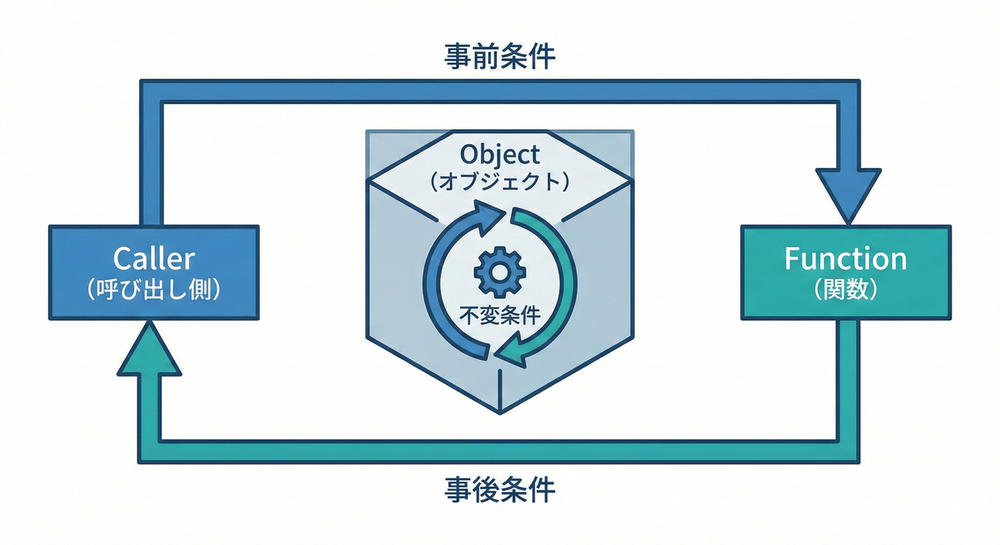
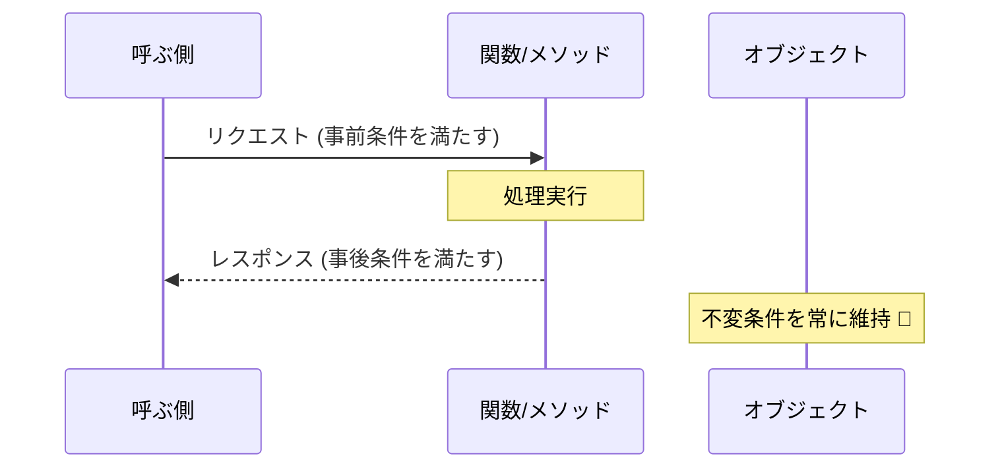
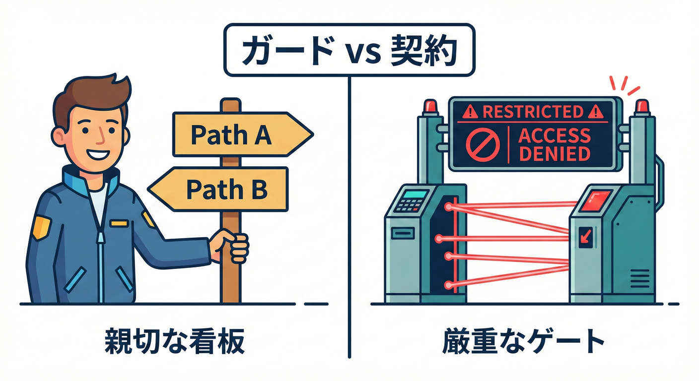
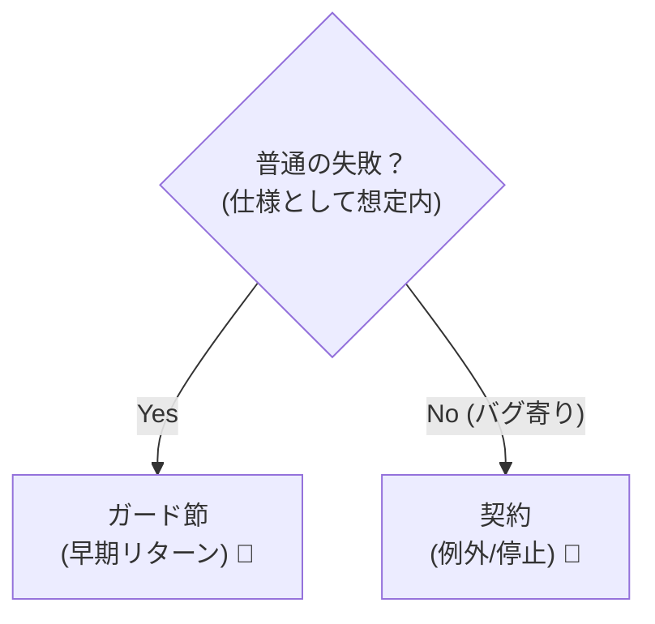

# 第3章　用語をやさしく：事前・事後・不変ってこういう意味📚🙂

## この章でできるようになること🎯✨

* 「事前条件（Precondition）」「事後条件（Postcondition）」「不変条件（Invariant）」を**日本語で説明**できる🙂🗣️
* 「これはどの条件？」を**仕分け**できる✅🧠
* 「ガード節」とDbCの関係を**混同しない**で話せる🚧✨

---

## 3. DbCの「三本柱」🏛️✨


DbCには、設計を守るための3つの強力な道具があります。
点セットはこう覚えるとラクです👇✨

* **事前条件**＝「呼ぶ側が守る約束」📥🤝
* **事後条件**＝「呼ばれた側が守る約束」📤🎁
* **不変条件**＝「いつでも守るルール」🧱🔒

---

## 1) 事前条件（Precondition）＝入力の約束📥✅

### 意味🙂

関数やメソッドを**呼ぶ前に満たしておいてね**という約束です🤝✨
もし破られたら、それはだいたい **呼び出し側のミス（バグ寄り）** になります🧨😵‍💫

### よくある事前条件の例🧺

* `amount > 0`（金額は正）💰➕
* `text.trim().length > 0`（空文字ダメ）📝🚫
* `count <= 100`（上限）📏🔝
* 「このIDは存在する前提」🪪✅

### ミニ例：割り算🧪

```ts
export function divide(a: number, b: number): number {
  if (b === 0) throw new Error("Precondition violated: b must not be 0");
  return a / b;
}
```

* `b !== 0` が **事前条件** です🚪🛑
* これを入口で止めると、バグが奥へ入っていきません✨🧯

---

## 2) 事後条件（Postcondition）＝結果の約束📤✅

### 意味🙂

「この処理が**成功して返ったなら**、結果はこうなってるよね？」という約束です🎁✨
戻り値だけじゃなくて、**副作用（状態の変化）**にも使えます🔁🧠

### よくある事後条件の例🧺

* 「返す配列は重複なし」🧺✅
* 「返す値は必ず0以上」📈✅
* 「残高を減らしたなら、必ず取引履歴も増えている」💳🧾

### ミニ例：0以上を返すことを保証📌

```ts
export function clampToNonNegative(n: number): number {
  const result = n < 0 ? 0 : n;

  // Postcondition: result is always >= 0
  if (result < 0) throw new Error("Postcondition violated: result must be >= 0");

  return result;
}
```

* 「返った値は必ず `>= 0`」が **事後条件**🎁✅

---

## 3) 不変条件（Invariant）＝いつでも守るルール🧱✅

### 意味🙂

オブジェクトやドメイン（例：Money、Email、UserIdなど）が、
**どのタイミングでも絶対に壊れないように守るルール**です🧱🔒

> 不変条件が強いと、「無効な状態」を作れないので超ラクになります🙂✨

### よくある不変条件の例🧺

* Money：`amount >= 0` かつ `currency` 必須💴🔒
* Email：`@` を含む📧✅（※厳密な判定は別として、概念はこれ）
* UserId：空じゃない🪪✅

### ミニ例：Email（作れた＝正しい状態）📩🏗️

```ts
export class Email {
  private constructor(private readonly value: string) {}

  static create(raw: string): Email {
    const v = raw.trim();

    // Invariant: value must be non-empty and contain "@"
    if (v.length === 0) throw new Error("Invariant violated: email must not be empty");
    if (!v.includes("@")) throw new Error('Invariant violated: email must contain "@"');

    return new Email(v);
  }

  toString(): string {
    return this.value;
  }
}
```

* `Email.create()` を通ったら、Emailはいつでも「それっぽい」形のまま🧱✨
* こうすると、他の場所で `@` チェックを何度も書かなくてよくなります🏃‍♀️💨

---

## 4) 3つの関係を「矢印」で覚える🧭✨



イメージ図（超重要）👇🙂

* 呼ぶ側 → **事前条件を満たして呼ぶ**📥
* 呼ばれた側 → **事後条件を満たして返す**📤
* オブジェクト → **不変条件をずっと守る**🧱



```text
Caller ──(Precondition)──> Function/Method ──(Postcondition)──> Caller
                 ↑
              (Invariant)  ← object stays valid always
```

---

## 5) 「ガード節」との関係（似てるけど目的が違う）🚧🙂

### ガード節って？🛡️

「条件が合わないなら早めに戻る」書き方のテクです✨
読みやすさUPのために使うことが多いです📖💕

```ts
export function greet(name?: string): string {
  if (!name) return "Hello, anonymous!"; // ガード節（エラーじゃない分岐）
  return `Hello, ${name}!`;
}
```

### DbC（契約）との違い🤝 vs 🚧



* **ガード節**：読みやすさ・分岐整理のテクニック📖✨
* **契約（DbC）**：守るべき「約束」を明確化して、破られたら止める🚪🛑



同じ `if` を使うことは多いけど、**意味が違う**のがポイントです🙂💡

#### 「見た目は同じ」でも中身は別モノ🍰

**A. ガード節（仕様として普通にありえる）**

```ts
export function findUserName(user: { name?: string }): string {
  if (!user.name) return "(no name)"; // 仕様としてOK
  return user.name;
}
```

**B. 事前条件（破られたらバグ寄り）**

```ts
export function saveUserName(name: string): void {
  if (name.trim().length === 0) {
    throw new Error("Precondition violated: name must not be empty");
  }
  // ここから先は「nameは空じゃない前提」で書ける✨
}
```

> 迷ったらこう考えるとラクです🙂✨
> **「それ、起きるのが普通の失敗？」** → ガード節（戻り値で扱うことが多い）
> **「それ、起きたら呼び方が間違い？」** → 事前条件（契約違反）🧨

---

## 6) ミニ仕分けクイズ🎲✨（その場で答えてOK）

次の条件はどれ？🤔💭
（A: 事前条件 / B: 事後条件 / C: 不変条件 / D: ただの分岐）

1. 「`withdraw(amount)` は `amount > 0`」💸
2. 「`createUser()` が成功したら `user.id` は空じゃない」🪪
3. 「`Money` は常に `amount >= 0`」💴
4. 「`isAdmin` なら管理者画面を返す」👮‍♀️

### 解答✅🎉

1 → A（事前条件）📥
2 → B（事後条件）📤
3 → C（不変条件）🧱
4 → D（ただの分岐）🔀

---

## 7) 演習🧪✍️（手を動かすよ〜！）

### 演習1：事前条件を書いてみる📥✅

仕様：`transfer(from, to, amount)`

* `amount` は1以上
* `from !== to`
* `from` と `to` は空文字NG

```ts
export function transfer(from: string, to: string, amount: number): void {
  // TODO: Preconditionを書こう🙂
}
```

**例（答えの一例）✅**

```ts
export function transfer(from: string, to: string, amount: number): void {
  if (from.trim().length === 0) throw new Error("Precondition violated: from must not be empty");
  if (to.trim().length === 0) throw new Error("Precondition violated: to must not be empty");
  if (from === to) throw new Error("Precondition violated: from and to must be different");
  if (amount < 1) throw new Error("Precondition violated: amount must be >= 1");

  // ... transfer logic
}
```

---

### 演習2：事後条件を1つ足してみる🎁✅

仕様：`clampToNonNegative` に「返す値は **整数**」の保証を足したい（例）🧮
（※本当に必要かは別として、練習です🙂）

```ts
export function clampToNonNegativeInt(n: number): number {
  const result = n < 0 ? 0 : Math.floor(n);

  // TODO: Postcondition（resultは整数）を書こう
  return result;
}
```

**例（答え）✅**

```ts
export function clampToNonNegativeInt(n: number): number {
  const result = n < 0 ? 0 : Math.floor(n);

  if (!Number.isInteger(result)) {
    throw new Error("Postcondition violated: result must be an integer");
  }
  if (result < 0) {
    throw new Error("Postcondition violated: result must be >= 0");
  }

  return result;
}
```

---

### 演習3：不変条件を「作る瞬間」に閉じ込める🧱🔒

仕様：`UserId` は **空文字NG**、前後空白を除いて保存する🪪✨

```ts
export class UserId {
  private constructor(private readonly value: string) {}

  static create(raw: string): UserId {
    // TODO
    return new UserId(raw);
  }

  toString(): string {
    return this.value;
  }
}
```

**例（答え）✅**

```ts
export class UserId {
  private constructor(private readonly value: string) {}

  static create(raw: string): UserId {
    const v = raw.trim();
    if (v.length === 0) throw new Error("Invariant violated: UserId must not be empty");
    return new UserId(v);
  }

  toString(): string {
    return this.value;
  }
}
```

---

## 8) 章末チェックリスト✅🌸

* [ ] 事前条件＝「呼ぶ側の約束」って言える🙂
* [ ] 事後条件＝「成功したならこうなる」って言える🎁
* [ ] 不変条件＝「いつでも守るルール」って言える🧱
* [ ] ガード節は“書き方”、契約は“意味”って区別できる🚧✨

---

## 9) AIに頼るときのミニ指示（コピペOK）🤖✨

```text
次の関数仕様に対して、Precondition / Postcondition / Invariant を候補として列挙して。
それぞれ「なぜそれが契約なのか」を短く説明して、TypeScriptのコード例も添えて。
```

---

## 10) （最新メモ）この教材のTypeScript事情🧷✨

* TypeScriptの安定版は **5.9.3** が「Latest」として公開されています。([npm][1])
* TypeScript 5.9 では `import defer` など、モジュールまわりの改善も入っています（用語理解とは別だけど、今どき事情としてチラ見せ👀✨）。([devblogs.microsoft.com][2])

[1]: https://www.npmjs.com/package/typescript?activeTab=versions&utm_source=chatgpt.com "typescript"
[2]: https://devblogs.microsoft.com/typescript/announcing-typescript-5-9/?utm_source=chatgpt.com "Announcing TypeScript 5.9"

