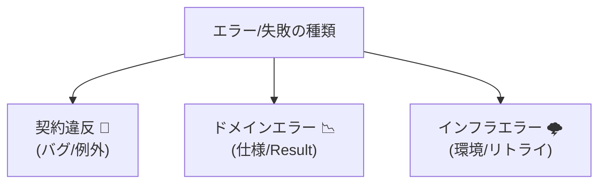

# 第4章　DbCは“設計のど真ん中”にある（他トピックとのつながり）🧠🔗

## この章でわかること🎯✨

* DbC（契約）が「設計の中心」にいる理由がスッと分かる🙂💡
* SoC（関心の分離）と「境界（Boundary）」の考え方がつながる🚧🔌
* テストしやすい設計＝契約が効いてる設計、になる理由がわかる🧪💞
* エラーモデリング（失敗の種類分け）とDbCの相性がわかる🧾🧠
* 依存関係ルール（Dependency Rule）で契約が“効く位置”が分かる🧱➡️🧱

---

## 4.0 まず結論：DbCは「境界の品質保証」だから設計の真ん中にいる🏛️✅

DbCは「この関数・このモジュールに入っていい値」と「出ていく結果の品質」を**約束として実行時に保証**する考え方だよね🤝✨
で、実務の設計で一番大事なのって、だいたいここ👇

* 外から入ってくる値（フォーム/JSON/URL/DB/他サービス）をどう扱う？🌍📥
* どこまでを信じて、どこから疑う？🤔🔍
* 壊れた値が混ざったとき、どの層で止める？🚪🛑

つまりDbCは、**設計の“入口と出口”を整える技術**だから、SoC・テスト・エラー設計・依存関係ルールの全部と直結するよ〜！🔗💥

---

## 4.1 SoC（関心の分離）×DbC：「境界は強く、中は軽く」⚖️🚧

SoCって「役割ごとに分けようね」って話なんだけど、DbCとセットで覚えると超実戦的になるよ🙂✨

### 4. 境界（Boundary）で守る🚧🏰


全部の関数にチェックを書いたら、コードが真っ赤（ノイズだらけ）になっちゃうよね？
* 外部入力を受け取るところ（API/フォーム/CLI/イベント/DB取得直後）📩🧾
* 外部へ出すところ（レスポンス/画面表示/保存/送信）📤📡

ここは **壊れたデータが入りやすい場所**だから、契約を強くするのが鉄則！💪🚪

### “中（ドメイン）”は軽くできる理由🏃‍♀️💨

境界で契約をガッチリ守れたら、中はこうできる👇

* 「ここまで来た値は正しい」前提で読みやすく書ける📖✨
* 余計なif地獄が減る🌋➡️🌿
* ロジックがキレイになってテストもしやすい🧪💕

### ミニ図：契約の置き方（イメージ）🗺️

```text
外部世界 🌍
  ↓（怪しい値が来る😇）
[Boundary] ここで契約を強く！🚧✅  ← 形式/範囲/必須/整合
  ↓（安全な値だけ通す🙂）
[Domain]   ここは軽く！🧠✨         ← ルール中心・読みやすさ優先
  ↓
外部世界へ📤
```


### ちょい最新事情（2026）📌✨

最近のTypeScriptは「新規プロジェクトの初期設定も“モジュール前提”」が色濃いよ〜！
TypeScript 5.9 だと `tsc --init` のデフォルトが `module: "nodenext"` / `target: "esnext"` になってたりするよ📦⚙️ ([TypeScript][1])
→ **モジュール境界が増えるほど、契約（入力/出力の約束）が効く**って感覚を持つと強い💪✨

---

## 4.2 テスタブル設計×DbC：契約はテストの“答え合わせ装置”🧪✅

テストがつらいコードって、だいたいこれ👇

* 入力の条件が曖昧（何を渡していいの？）😵‍💫
* 出力の保証が弱い（成功したら何が成り立つの？）😶
* 失敗の種類が混ざってる（仕様エラー？バグ？通信？）🌪️

DbCを入れると、テストが急にラクになる理由はシンプルで…

### ✅ 契約＝テストの期待値が文章じゃなくて“実行される”から

* 事前条件：ダメ入力を渡したとき、ちゃんと止まる🛑
* 事後条件：成功したとき、必ず成立してることを保証🎁
* 不変条件：オブジェクトが壊れない🧱✨

つまりテストはこうなるよ👇

* 正常系テスト🙂：契約を満たす入力 → 正しい結果
* 契約違反テスト😈：契約を破る入力 → ちゃんと止まる

### “契約がある関数”のテストは短くなる✂️🧪

例：金額計算（超ミニ）💴✨

```ts
export function calcTotal(subtotal: number, taxRate: number): number {
  // Pre ✅
  if (!Number.isFinite(subtotal) || subtotal < 0) throw new Error("subtotal must be >= 0");
  if (!Number.isFinite(taxRate) || taxRate < 0 || taxRate > 1) throw new Error("taxRate must be 0..1");

  const total = subtotal + subtotal * taxRate;

  // Post ✅（丸め方はここでは省略）
  if (!Number.isFinite(total) || total < subtotal) throw new Error("total must be valid and >= subtotal");

  return total;
}
```

この関数のテスト、ほぼ「境界値を置くだけ」になるよね🍎📏✨
（契約が“仕様の骨格”になってるから！）

---

## 4.3 エラーモデリング×DbC：「契約違反」は別枠で扱う🧾🚦


ここ、超大事ポイント！💡
失敗を全部 `throw` で同じにしちゃうと、設計がぐちゃぐちゃになるの🥲

### 失敗はだいたい3種類に分けるのが強い💪✨

* **契約違反**：呼び出し側のミス（プログラミングミス寄り）🧨

  * 例：必須なのに空文字、範囲外、型が違うのに渡してきた
* **ドメインエラー**：仕様として起きうる失敗（ビジネス上の失敗）📉

  * 例：残高不足、予約枠が満員、在庫切れ
* **インフラエラー**：通信/DB/タイムアウトなど環境由来🌩️

  * 例：ネットワーク断、DB死んだ、外部APIが落ちた

DbCはこの中で、特に「契約違反」を**はっきり分離**できるのが強み！🧠✨

### どう分けると気持ちいい？🙂🌸

* 契約違反：例外（throw）で即停止しやすい🛑💥
* ドメインエラー：`Result` みたいに“仕様の失敗”として返すと読みやすい📦🙂
* インフラエラー：リトライ/ログ/監視など運用とセットで扱う📊🔁

（このコース後半で、ここをさらにガッツリやるよ〜🧡）



---

## 4.4 依存関係ルール×DbC：「契約を“中心側”の言葉で書く」🧱🧠

依存関係ルール（ざっくり）：
**外側は内側に依存してOK、内側は外側に依存しない**🙅‍♀️➡️✅

DbC的にはこうなるよ👇

### ✅ 契約は「中心（ドメイン）の言葉」を守るためにある

たとえば「予約人数は1以上」ってルールは、UIの都合じゃなくて**ドメインの都合**だよね？🧠📌
だから、契約（不変条件/事前条件）は「中心の概念」に寄せるほど強い💪✨

### フォルダの置き方イメージ📁🧩

```text
src/
  domain/        ← 中心（ルールの本丸🧠）
    booking.ts   ← 不変条件・ドメインルール（契約）🧱✅
  app/           ← ユースケース（境界の近く🚧）
    createBooking.ts  ← 入口で強い契約（入力変換）📥✅
  infra/         ← DB/HTTPなど🌩️
  ui/            ← 画面🖥️
```

### 最新のモジュール環境だと、この設計がさらに効く📦✨

Node.js は v24 が Active LTS、v25 が Current みたいにバージョンが進む中で、モジュール境界（import/export）を意識した設計がより当たり前になってるよ〜🧩🚀 ([Node.js][2])
TypeScript 5.9 も Node向けの `--module node20` をサポートしてたり、`import defer` みたいに「副作用の実行タイミング」を制御する方向が進んでるよ📦⏳ ([TypeScript][1])
→ **境界で副作用を薄くして、中のロジックを純度高めに保つ**のが、テストも運用もラクにする近道💞🧪

---

## 4.5 まとめ：この章の“つながり”早見表🔗📌

* SoC 🧼：契約は境界で強く、内部は軽く
* テスタブル設計 🧪：契約が“期待値”になるからテストが短くなる
* エラーモデリング 🧾：契約違反を仕様エラーと混ぜない
* 依存関係ルール 🧱：契約は中心（ドメイン）の言葉で書く

---

## 章末ミニ演習🧪✨（10〜20分くらい）

### 演習1：境界に置く契約を選ぶクイズ🎲🧠

次のチェック、**境界でやる？ドメインでやる？両方？** を選んでね🙂👇

1. `email` が空文字じゃない📩🚫
2. `email` の形式がそれっぽい（`@` 含む等）📩🔎
3. `peopleCount >= 1` 🧍‍♀️➕
4. 「予約日が未来」📅➡️🚀
5. 「同じユーザーの同日予約は不可」👤📅🚫

💡目安：

* “外から来たデータの健全性”＝境界で強め🚧✅
* “ビジネスルール”＝ドメインで必ず守る🧱✅
* どっちにも意味があるやつ＝両方（境界は早期エラー、ドメインは最終防衛）🛡️🛡️

### 演習2：あなたのプロジェクトに当てはめメモ📝✨

今作ってる/作ったことある機能を1つ思い出して、これだけ書いてみてね🙂🧡

* 外部入力はどこから来る？（フォーム？API？ファイル？）🌍
* 境界はどこ？🚧
* “ドメインルール”は何？（3つでOK）🧠
* 契約違反と仕様エラー、分けられそう？🧾

---

## 章末チェックリスト✅💖

* [ ] 「境界」を言葉で説明できる🚧
* [ ] 契約を“境界で強く、中で軽く”置く理由がわかる⚖️
* [ ] 契約違反／ドメインエラー／インフラエラーを分けて考えられる🧾
* [ ] 契約は“中心の言葉”で書くほど強いと分かる🧱

---

[1]: https://www.typescriptlang.org/docs/handbook/release-notes/typescript-5-9.html "TypeScript: Documentation - TypeScript 5.9"
[2]: https://nodejs.org/en/about/previous-releases "Node.js — Node.js Releases"

