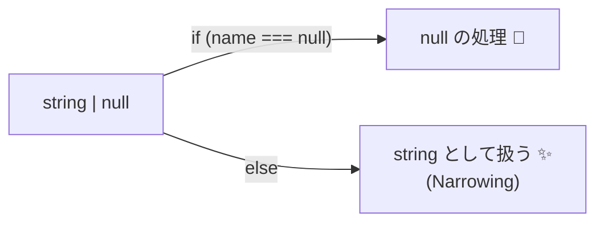
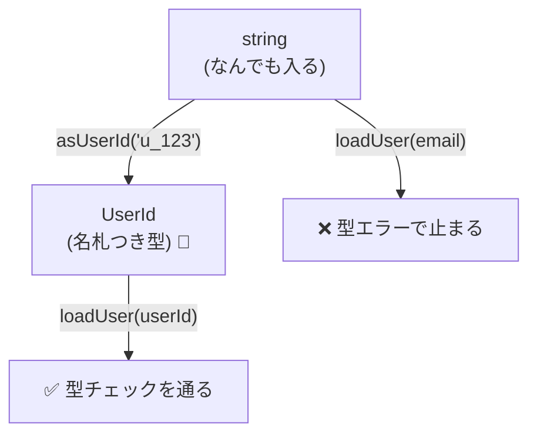

# 第5章　TypeScriptで作る「静的な契約」①：基本の型付け🧷🧱


## 5.0　この章でやること（ゴール）🎯✨

TypeScriptの**型**を使って、DbCの「契約（約束）」のうち、**コンパイル時に守れる範囲**をしっかり体感します🙂🧠

この章のゴールはこの3つ👇

* 「ありえる値」を**型で狭める**（`string | null` / union / literal type）🎯
* 「勝手に変えない」を**型で宣言**する（`readonly`）🧊
* `UserId` / `Currency` みたいな**ドメインの名札（型）**を作れるようになる🪪💴

---

## 5.1　最新メモ（2026-01-25 時点）🗓️🧩

* `typescript` の npm 最新は **5.9.3**（2025-09-30 公開）です📦✨ ([npm][1])
* TypeScript 6.0 は「5.9 → 7 への橋渡し（bridge）」として位置づけられ、7.0（ネイティブ化）へ向けた調整が進む方針が示されています🧱➡️🚀 ([Microsoft for Developers][2])

※この章で扱う「union / literal / readonly / satisfies」などは、今の実務でも“ど真ん中”で使われている安定テクです😊✅

---

## 5.2　「静的な契約」ってなに？🧠🧷

静的な契約＝**型で守る約束**です✨
実行する前に（＝コンパイル時に）「それ、ありえない値だよね？」って弾けるのが強み💪🛑

たとえば👇

* `null` が来るかもしれないなら `string | null` と書く（来ないなら来ない型にする）🚧
* 通貨は `"JPY" | "USD"` みたいに“候補だけ”にする💴
* 値を勝手に変えないなら `readonly` にする🧊

> つまり、型は「入口で壊れた値を入れない」ための第一関門🚪✨
> ただし、**数値の範囲**とか**文字数**みたいな「実行時にしか分からない約束」は次の章以降で扱います🌍🛡️

---

## 5.3　`string | null` / union で「ありえる値」を狭める🎯✅

### 5.3.1　`null` が来るなら、型に書く📝

`null` が来る可能性があるのに `string` とだけ書くと、受け取る側が事故りやすいです😵‍💫💥
なので「来るなら来る」で正直に書くのが契約です🙂🤝

```ts
type DisplayName = string | null;

function greet(name: DisplayName) {
  if (name === null) {
    return "こんにちは！名無しさん🙂";
  }
  return `こんにちは、${name}さん😊`;
}
```

ポイント👇

* `if (name === null)` みたいに分岐すると、TypeScriptが**その中では string だね**って分かってくれます（これを *narrowing* と呼びます）🔍✨



### 5.3.2　union は「選択肢を絞る」最強ワザ⚡

「状態」や「種別」を union にすると、**ありえない分岐**が減ります🧠✨

```ts
type Plan = "FREE" | "PRO" | "ENTERPRISE";

function canExportPdf(plan: Plan) {
  return plan === "PRO" || plan === "ENTERPRISE";
}

// ✅ OK
canExportPdf("PRO");

// ❌ ダメ（候補にない）
canExportPdf("VIP");
```

---

## 5.4　literal type と `as const` で「値をそのまま型にする」🧊✨

### 5.4.1　そのままだと “広がる” 問題（widening）🌪️

TypeScriptは放っておくと、文字列リテラルを `string` に“広げる”ことがあります。

```ts
const currency = "JPY";
// currency の型は "JPY" ではなく string になることが多い
```

ここで `as const` を使うと、「これは変えない前提の固定値だよ🧊」が伝わります！

```ts
const currency = "JPY" as const;
// currency の型が "JPY" になる✨
```

### 5.4.2　`as const` はオブジェクトでも強い🧷

```ts
const appConfig = {
  env: "prod",
  retry: 3,
  region: "jp",
} as const;

// env は "prod"、retry は 3、region は "jp" の型になる✨
```

---

## 5.5　`satisfies` で “形だけチェック” して、型は潰さない🧩✅

`satisfies` は「この形（型）を満たしてる？」をチェックするのに便利です✨
しかも、**型注釈みたいに情報を潰しにくい**のが良いところ🙂🧠
（`satisfies` 自体は TypeScript 4.9 で導入されています） ([TypeScript][3])

例：APIのルート定義で「必須キーが揃ってるか」だけ保証したいとき👇

```ts
type Routes = Record<string, { method: "GET" | "POST"; path: `/${string}` }>;

const routes = {
  getUser: { method: "GET", path: "/users/:id" },
  createUser: { method: "POST", path: "/users" },
  // typo: { method: "PUT", path: "users" }, // ❌ method が候補外 & path が / で始まらない
} satisfies Routes;
```

`satisfies` の気持ちよさ👇

* 「形がOKか」は厳しくチェック✅
* でも `routes.getUser.method` が `"GET"` のまま残りやすい（便利！）✨

---

## 5.6　`readonly` で「勝手に変えない」を契約にする🧊🔒

### 5.6.1　まずはプロパティを `readonly` にする

```ts
type User = {
  readonly id: string;
  readonly name: string;
};

const u: User = { id: "u_1", name: "Mika" };

// ❌ 代入できない（契約違反）
u.name = "Rika";
```

### 5.6.2　配列は `readonly` を忘れがち🍎⚠️

```ts
const items: readonly string[] = ["a", "b", "c"];

// ❌ push できない（勝手に変えない契約）
items.push("d");
```

---

## 5.7　演習：`UserId` と `Currency` を型で表現してみる🪪💴✨


ここから手を動かそう〜！✍️😆
「静的な契約」の定番は **“名札型（ブランディング）”** です🧷



### 5.7.1　`UserId` を “ただの string” から卒業させる🎓

狙い：

* `userId` と `email` を間違えて渡す事故を、型で止める🛑✨

```ts
type Brand<K, T> = K & { readonly __brand: T };

type UserId = Brand<string, "UserId">;

function asUserId(value: string): UserId {
  // ここでは「文字列っぽい」しか守れてない（実行時チェックは後の章で強化🛡️）
  return value as UserId;
}

// 使う側
function loadUser(userId: UserId) {
  return `loading... ${userId}`;
}

const id = asUserId("u_123");
loadUser(id); // ✅ OK

const email = "test@example.com";
// loadUser(email); // ❌ string は UserId じゃない！
```

✅ ここで起きる良いこと

* `string` なら何でもOK、が消える
* “それっぽい値の混入” をかなり減らせる🎯✨

---

### 5.7.2　`Currency` を union で固定する💴🧷

```ts
type Currency = "JPY" | "USD" | "EUR";

type Money = {
  readonly amount: number;
  readonly currency: Currency;
};

function formatMoney(m: Money) {
  return `${m.amount} ${m.currency}`;
}

formatMoney({ amount: 1200, currency: "JPY" }); // ✅
// formatMoney({ amount: 1200, currency: "YEN" }); // ❌ 候補外
```

---

### 5.7.3　ミニ課題（提出物）📮✨

次の3つを作ってみよう🙂✍️（コピペOK、でも理解が最優先！）

1. `ProductId` を `UserId` と同じ方式で作る🪪
2. `Currency` に `"GBP"` を追加して、`Money` が普通に動くようにする💷
3. `readonly` を付け忘れてる箇所を探して直す🔍🧊

---

## 5.8　VS Codeで「型の契約」を目で見るコツ👀✨

型は “読める” ようになると爆速で強くなります🏃‍♀️💨

* 変数にマウスを乗せて型を確認（ホバー）🖱️👀
* 赤波線が出たら、まずカーソル当ててメッセージを読む🧯
* `F2`（リネーム）で、命名の一貫性を守る🪄
* `Ctrl + .`（クイックフィックス）で候補を見る✨

---

## 5.9　この章のまとめ🧁✅

* union（`A | B`）で「ありえる値」を絞る🎯
* literal type と `as const` で「固定値」を契約にする🧊
* `readonly` で「勝手に変えない」を契約にする🔒
* `UserId` / `Currency` みたいな “名札型” は、実務で事故を減らす神テク🪪✨
* ただし、範囲・文字数・整合性みたいな契約は **型だけでは守れない**（次でやるよ🌍🛡️）

---

## 5.10　章末チェックリスト✅🎒

* [ ] `string | null` を見たら、`null` 分岐を書ける🙂
* [ ] union の候補から外れた値が弾かれるのを確認した🛑
* [ ] `as const` で literal が残るのを確認した🧊
* [ ] `readonly` で代入事故が止まるのを確認した🔒
* [ ] `UserId` を “ただの string” から分離できた🪪✨

---

## 5.11　ミニクイズ🎲🙂

Q1. `type A = "x" | "y"` に `"z"` を渡すとどうなる？
Q2. `readonly` の配列に `push` しようとしたらどうなる？
Q3. `UserId` を `string` と混ぜて使えるようにしちゃうと、何が起きる？😵‍💫

（答えは：全部「事故を事前に止めるために、止まる！」です😆🛑✨）

[1]: https://www.npmjs.com/package/typescript?utm_source=chatgpt.com "typescript"
[2]: https://devblogs.microsoft.com/typescript/progress-on-typescript-7-december-2025/?utm_source=chatgpt.com "Progress on TypeScript 7 - December 2025"
[3]: https://www.typescriptlang.org/docs/handbook/release-notes/typescript-5-0.html?utm_source=chatgpt.com "Documentation - TypeScript 5.0"

