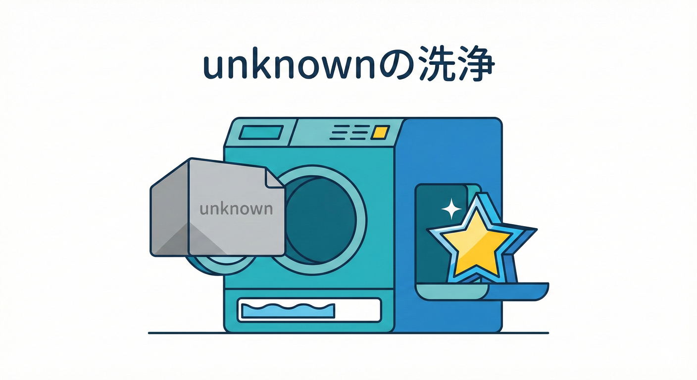
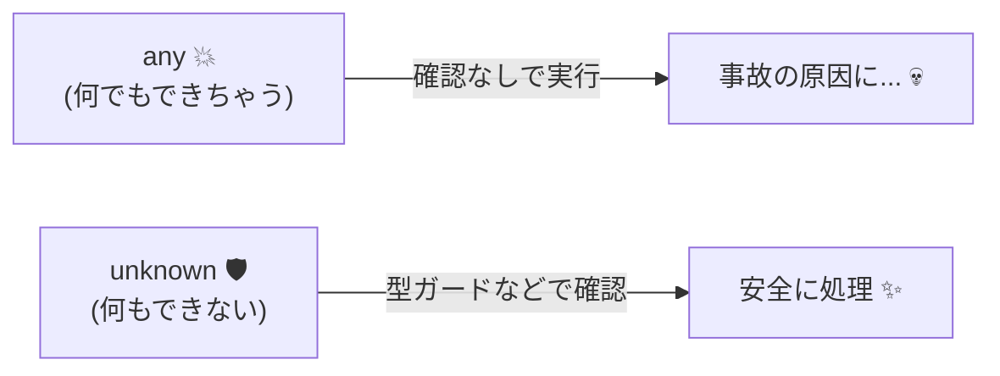
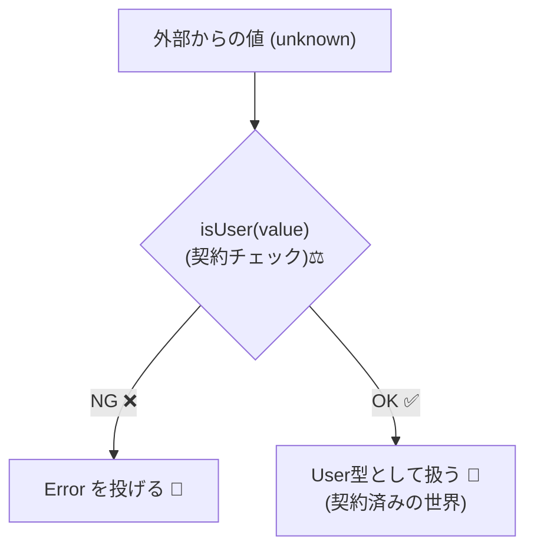

# 第6章　TypeScriptで作る「静的な契約」②：unknownを安全にする🧼🧠

## この章でできるようになること🎯✨

* 「外から来た値」を、まず **unknown** で受けて事故を止められる🚧🛑
* **any** と **unknown** の違いを説明できる🙂
* 型ガード（自作OK）で **unknown → ちゃんとした型** に変換できる🔁✅
* 「契約（DbC）」っぽく、**未確認の値を境界で検査してから中に通す**ができる🚪🧱

---

## 1) なんで unknown が必要なの？🌍💦

アプリはだいたい「外から」データが来ます👇

* JSON（API / ファイル / ローカルストレージ）📦
* フォーム入力📝
* URL クエリ🔗
* 他の人が書いたコードやライブラリ🧩

ここで怖いのは、**見た目はそれっぽいけど中身が違う**こと😵‍💫
DbCでいうと、これは「まだ契約が結ばれてない状態」です🤝❌

だからこの章の合言葉はこれ👇
**外から来た値は、いきなり信じない。まず unknown。** 🚫➡️🧼

---

## 2) any と unknown の違い🧭🤔



「どちらも何でも入る型」だけど、性質が真逆だよ👇

### any：何でもできちゃう（でも事故る）💥

* コンパイラがほぼ口出ししない
* その場ではラクだけど、あとで壊れる😇

### unknown：何もできない（だから安全）🛡️

* いきなりプロパティ参照できない
* まず「確認（チェック）」をしないと進めない
* つまり **「契約が確認できるまで通さない」**が自然に作れる🚪✅



---

## 3) unknown を受ける“境界”を決めよう🚧🧭


DbCの考え方では、**境界（Boundary）で厳しく**が基本です🙂
たとえば👇

* APIレスポンスを受け取る層
* JSON.parse した直後
* フォームの送信ハンドラ
* ルーティング（URLパラメータ）

境界で unknown にして、そこから先（中心ロジック）には **ちゃんとした型だけ**流す✨

---

## 4) まずは最小の型ガード：typeof からいこう🚦✨

### 例：unknown を string にしてから使う🙂

```ts
export function toUpperSafe(input: unknown): string {
  if (typeof input !== "string") {
    throw new Error("文字列を入れてね🙂（stringが必要です）");
  }

  // ここから下は input が string として扱える✅
  return input.toUpperCase();
}
```

ポイント🎯

* if の中で「契約チェック」してるイメージ
* 通った後は、TypeScriptがちゃんと型を絞ってくれる✨

---

## 5) “よくある罠”も一緒に覚えよう🕳️😵‍💫

### 罠①：typeof null は "object" 😭

```ts
export function isObjectLike(value: unknown): value is Record<string, unknown> {
  return typeof value === "object" && value !== null;
}
```

### 罠②：配列は object 扱い（typeof では区別できない）📚

```ts
export function isStringArray(value: unknown): value is string[] {
  return Array.isArray(value) && value.every(v => typeof v === "string");
}
```

### 罠③："in" 演算子は相手が object っぽくないと危ない🧨

```ts
export function hasKey(value: unknown, key: string): value is Record<string, unknown> {
  return typeof value === "object" && value !== null && key in value;
}
```

---

## 6) 自作の型ガードで「読める契約」にする🧩📝

チェックを毎回ベタ書きすると、すぐこうなります👇

* 条件が長い
* 意図が読めない
* コピペ地獄👻

だから **型ガード関数に名前をつける**のが最強です💪✨

### 例：ユーザー入力を “それっぽい形” にする👤✅

目標：unknown を User に変換したい！

```ts
type User = {
  id: string;
  name: string;
};

function isUser(value: unknown): value is User {
  if (typeof value !== "object" || value === null) return false;

  const v = value as Record<string, unknown>;

  return typeof v.id === "string" && typeof v.name === "string";
}

export function parseUser(input: unknown): User {
  if (!isUser(input)) {
    throw new Error("ユーザー情報の形がちがうよ🥲（idとnameが必要）");
  }
  return input;
}
```

ここで起きてること🧠✨

* isUser が「契約チェック」
* parseUser は「契約を結んだ後の世界」🎀



---

## 7) JSONは特に危険！まず unknown に入れよう📦🧯

TypeScriptでは JSON.parse の結果が “強めに信用されがち” なので、意識して unknown に落とすのが安全です🙂

```ts
export function parseJsonUnknown(text: string): unknown {
  return JSON.parse(text) as unknown;
}

export function loadUserFromJson(text: string): { id: string; name: string } {
  const raw = parseJsonUnknown(text);

  // ここで型ガード！
  if (typeof raw !== "object" || raw === null) {
    throw new Error("JSONがオブジェクトじゃないよ🥲");
  }

  const v = raw as Record<string, unknown>;
  if (typeof v.id !== "string" || typeof v.name !== "string") {
    throw new Error("JSONに id / name が入ってないよ🥲");
  }

  return { id: v.id, name: v.name };
}
```

---

## 8) VS Codeでのミニ実験🧪💻

### 手順（小さく試す）

1. 適当なフォルダを作って開く📁
2. ターミナルで TypeScript を用意する（プロジェクトごと）⬇️

```bash
npm init -y
npm i -D typescript
npx tsc --init
```

3. "index.ts" を作って、次のコードを貼る⬇️

```ts
function demo(x: unknown) {
  // console.log(x.toUpperCase()); // ← これは怒られる（安全！）😌

  if (typeof x === "string") {
    console.log(x.toUpperCase()); // ← ここはOK✅
  }
}

demo("hello");
demo(123);
```

4. タイプチェックしてみる⬇️

```bash
npx tsc --noEmit
```

補足（最新の動き）📌

* TypeScript 5.9 の "tsc --init" は、最初から厳しめの設定（strict など）を含む形にアップデートされています。([Microsoft for Developers][1])
* さらに将来（TypeScript 6.0/7.0 系）では、既定設定の見直しや高速化が進む方針が公開されています。([Microsoft for Developers][2])

---

## 9) AI支援（Copilot/Codex）での使い方🤖✨

AIに丸投げすると “動くけど危ない型ガード” も出やすいので、**チェック観点を先に渡す**のがコツです🙂

### コピペ用プロンプト例🧠✍️

* 「TypeScriptで unknown を User 型に安全に変換する関数を書いて。条件：null対策、配列対策、id/name が string のときだけ通す。失敗時は分かりやすい日本語エラー。」

* 「unknown の入力を検証する型ガード関数を作って。条件：object判定、必要キーの存在確認、型チェック。テストしやすい形にして。」

AIが出したコードは、ここだけ見てチェック✅

* null を弾いてる？
* Array を弾いてる？（必要なら）
* エラーメッセージが “直し方” になってる？🧭
* value as Record<string, unknown> の乱用になってない？😵

---

## 章末まとめ📌✨

* unknown は「まだ契約が結ばれてない値」🚫🤝
* だから **チェックを通るまで何もできない** → 事故が減る🛡️
* 型ガードを関数化すると、契約が “読める” ようになる🧩📝
* 境界で unknown → 中心へは正しい型だけ、が気持ちいい設計🚪🧱

---

## 章末チェックリスト✅🌸

* unknown を受けた直後に、typeof / Array.isArray / null対策をしてる？
* 「ベタ書きの長い条件」を、型ガード関数にできてる？
* unknown のまま中心ロジックに流してない？（境界で止めてる？）🚧
* エラー文が「何がダメで、どう直せばいいか」になってる？🧭

---

## 演習🧪✨（手を動かすと一気に身につくよ！）

### 演習1：unknown を string にしてから処理する🚦

* 関数 "trimSafe(input: unknown): string" を作る
* string 以外はエラー
* string なら前後の空白を除去して返す

### 演習2：unknown を “商品データ” にする🛍️

型👇

* Product = { sku: string; price: number }
  課題👇
* isProduct(value: unknown): value is Product を作る
* parseProduct(input: unknown): Product を作る（失敗時は分かりやすいエラー）

### 演習3：unknown の配列を検査する📚

* unknown が "stringの配列" のときだけ通す isStringArray を作る
* それ以外はエラーにする parseStringArray を作る

次の章では、「型だけじゃ守れない（実行時チェックが必要な）契約」の話に進むよ〜！🌍🛡️

[1]: https://devblogs.microsoft.com/typescript/announcing-typescript-5-9/ "Announcing TypeScript 5.9 - TypeScript"
[2]: https://devblogs.microsoft.com/typescript/progress-on-typescript-7-december-2025/ "Progress on TypeScript 7 - December 2025 - TypeScript"

