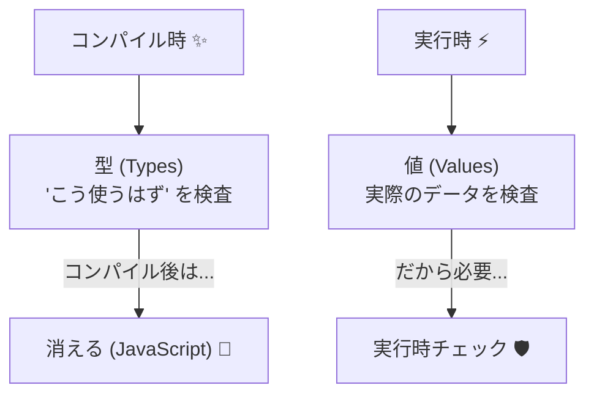
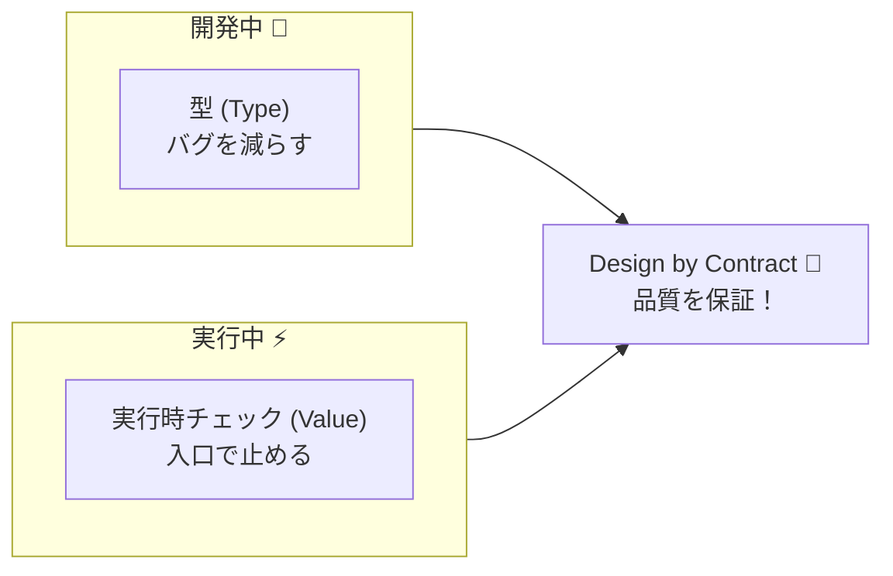

# 第7章　型だけでは守れない契約：実行時チェックが必要な理由🌍🛡️

## この章のゴール🎯

* 「TypeScriptの型だけでは守れない“約束”」がある理由を説明できる🙂✨
* “実行時チェック（runtime check）”が必要になる代表パターンを理解する📌
* 「型＋実行時チェック」の役割分担ができるようになる⚔️✅

---

## 2. 実行時チェックで“入口で止める”🧱🛑


TypeScriptの型はコンパイル時に消えるから、実行時に「契約（事前条件）」を守るための **実体（チェック処理）** が必要になるよ💡
TypeScriptは、コンパイル（変換）されて実行されるとき、**型注釈は消える**よ〜！
つまり、実行中のJavaScriptには「型で守ってくれる仕組み」が基本的に残ってないの🥲
このせいで、**実行時の値が壊れてたら普通に壊れる**（エラーになったり、変な結果になる）ってことが起きるよ。 ([typescriptlang.org][1])

---

## 「型はコンパイル時」「値は実行時」🧠🔁

ざっくりこう覚えると強いよ💪✨

* **型（Type）**：開発中に「こう使うはずだよね？」をチェックする🧷✅
* **値（Value）**：実行中に実際に入ってくるデータ📦⚡（ユーザー入力・API・DB・設定ファイルなど）

型は便利だけど、**実行時に入ってくる値を“保証”はできない**んだ〜😵‍💫



---

## 型だけでは守れない契約①：数値の範囲・制約📏🚫

たとえば、こういう“約束”は型だけじゃ無理👇

* 年齢は **0〜120** の範囲
* 金額は **0以上**
* 割引率は **0.0〜1.0**
* 人数は **1以上の整数**

`number` は「数」ってことしか言えないから、こういう細かい条件は **実行時にチェック**が必要になるよ🧱✅

### 例：型はOKでも値がヤバい😇

```ts
type User = {
  name: string;
  age: number; // ← “number” って言ってるだけ
};

const u: User = { name: "A", age: 999 }; // 型的にはOK 😇
```

---

## 型だけでは守れない契約②：文字数・形式・パターン📝🔎

* パスワードは **8文字以上**
* 郵便番号は **7桁**（または `123-4567` 形式）
* メールは **@ を含む**だけじゃなく、最低限の形式
* IDは **英数字のみ** など

これも型（`string`）だけじゃ表現しきれないよ〜😵

---

## 型だけでは守れない契約③：複数項目の整合性（関係の約束）🧩🧠

ここがめちゃ大事ポイント✨

* `startDate <= endDate` 📅
* `subtotal + tax === total` 💴
* `items.length > 0` のときだけ `total > 0` 🛒
* 「AがtrueならBも必須」みたいな条件分岐🧷

こういう**項目どうしの関係**は、たとえ型が全部合ってても壊れることがあるから、実行時チェックが必要だよ🛡️

---

## 型だけでは守れない契約④：外から来た値は“型がついてない世界”🌍📦

現実のアプリでは、外部からこんなのが来るよね👇

* `JSON.parse(...)` の結果（何が入ってるか不明）🧨
* フォーム入力（全部string）⌨️
* APIレスポンス（仕様通りとは限らない）📡
* `localStorage`（文字列しか入らない）🧺
* 環境変数（文字列）⚙️

こういうのは、まず **unknown** っぽい危険物として扱うのが安全だよ🚧

---

## よくある事故：`as` は“変換”じゃなくて“言い張り”😵‍💫🗣️

TypeScriptの `as` は、実行時の値を変えないよ！
「この型だってことにして！」ってコンパイラにお願いしてるだけ（＝強引に通す）💥

```ts
const x = JSON.parse('{"age": "not a number"}') as { age: number };
// x.age は実行時には "not a number" のまま 😱
console.log(x.age + 1); // "not a number1" とかになって地獄 👻
```

---

## 最新事情ちょいメモ🆕📌（2026/01/25時点）

* TypeScriptの最新安定版は **5.9.3**（GitHubのReleasesでLatest扱い）だよ📦✨ ([GitHub][2])
* Node.js側も「TypeScriptをそのまま実行（型を“削る”だけ）」みたいな流れが進んでるけど、**それは“型チェック”じゃない**ので注意だよ⚠️（次のハンズオンで体感するよ！） ([Node.js][3])

---

## じゃあどうする？「型＋実行時チェック」の二刀流⚔️✅

この章の結論はこれ👇

* **型**：開発中にバグを減らす（補完・リファクタ・静的検査）🧠✨
* **実行時チェック**：実行中に“壊れた値”を入口で止める🚪🛑
* **契約（DbC）**：その“止める条件”を読みやすく、設計として扱う📘💡



---

## ハンズオン🧪✨：型だけだと壊れる→実行時チェックで止める

ここでは「APIから来たデータ」を想定して、わざと壊してみるよ😈➡️😇

### Step 1：まずは“型だけ”で受け取る（危険）💣

`chapter7.ts` を作って、これを書いてね📝

```ts
type CreateUserRequest = {
  name: string;
  age: number; // 0〜120 のはず
};

function createUser(req: CreateUserRequest) {
  // ここでは “reqは正しい” 前提で処理しちゃう
  return {
    displayName: req.name.trim(),
    nextYearAge: req.age + 1,
  };
}

// 外から来たっぽいJSON（わざと壊す）
const raw = '{"name": "  Mika  ", "age": "18"}'; // ageがstring😱
const parsed = JSON.parse(raw);

// 型で押し通してしまう（最悪パターン）
const req = parsed as CreateUserRequest;

console.log(createUser(req));
```

✅ 型エラーは出ないのに、実行結果が変になったりするよ（`"18" + 1` 問題）😵‍💫

---

### Step 2：実行時チェックで“入口で止める”🚪🛑

次は、チェック関数を作って止めよう💪✨

```ts
function assertNonEmptyString(value: unknown, fieldName: string): asserts value is string {
  if (typeof value !== "string") throw new Error(`${fieldName} は文字列である必要があります🙅‍♀️`);
  if (value.trim().length === 0) throw new Error(`${fieldName} は空にできません🙅‍♀️`);
}

function assertIntInRange(
  value: unknown,
  fieldName: string,
  min: number,
  max: number
): asserts value is number {
  if (typeof value !== "number") throw new Error(`${fieldName} は数値である必要があります🙅‍♀️`);
  if (!Number.isInteger(value)) throw new Error(`${fieldName} は整数である必要があります🙅‍♀️`);
  if (value < min || value > max) throw new Error(`${fieldName} は ${min}〜${max} の範囲にしてください🙅‍♀️`);
}

function parseCreateUserRequest(input: unknown): CreateUserRequest {
  if (typeof input !== "object" || input === null) {
    throw new Error("リクエストはオブジェクトである必要があります🙅‍♀️");
  }

  const obj = input as Record<string, unknown>;

  assertNonEmptyString(obj.name, "name");
  assertIntInRange(obj.age, "age", 0, 120);

  return { name: obj.name, age: obj.age };
}

// 実行
const raw = '{"name": "  Mika  ", "age": "18"}';
const parsed = JSON.parse(raw);

try {
  const req = parseCreateUserRequest(parsed); // ここで止める✅
  console.log(createUser(req));
} catch (e) {
  console.error("❌ 入力が契約違反でした:", (e as Error).message);
}
```

🎉 これで「壊れたデータは中に入れない」ができたね！🤝🧱

---

## VS Codeで動かす手順💻⚡（サクッと）

### 1) TypeScriptの型チェック（おすすめ）✅

型チェックは **`tsc`** が担当だよ🧠
（実行とは別物！）

```bash
npx tsc --noEmit
```

### 2) 実行（どっちでもOK）🏃‍♀️💨

**方法A：Node.jsでそのまま実行（Type Stripping）**
Nodeのバージョン次第で `.ts` を直接実行できるよ（ただし“型チェック”はしない）⚠️ ([Node.js][3])

```bash
node chapter7.ts
```

**方法B：tsxで実行（これも型チェックはしない）**
Node公式ドキュメントでも紹介されてるよ📌（でも型チェックは別でやってね⚠️） ([Node.js][4])

```bash
npm i -D tsx
npx tsx chapter7.ts
```

---

## ここまでのまとめ🧠✨

* TypeScriptの型は実行時には守ってくれない🫥⚡ ([typescriptlang.org][1])
* 外から来る値は壊れてる前提で、入口で実行時チェック🚪🛑
* 「型で表せること」と「実行時にしか分からないこと」を分ける⚖️✅

---

## ミニ演習🧪🎀（手を動かすと一気に分かる！）

### 演習1：文字数チェック✍️

`username` を `3〜20文字` にしたい🙂

* `assertStringLength(value, fieldName, min, max)` を作ってね✅

### 演習2：配列の約束🍱

`items` は「空配列禁止」で、各要素は `{ id: string, qty: number }`

* `qty` は `1以上の整数`
* 入口で止めよう🚧🛑

### 演習3：整合性チェック🧾

`subtotal + tax === total` を必ず満たす

* 3つともnumberでも、関係が崩れることあるよね？😵
* 入口で止める関数を作ろう✅

---

## AI活用🤖💡（Copilot / Codex向け）

次みたいに頼むと気持ちよく進むよ✨（コピペOK）

* 「TypeScriptで `assertIntInRange` を作って。`unknown` を受け取って、失敗時は分かりやすいErrorメッセージ。`asserts value is number` を使って。」🤖🛡️
* 「`parseCreateUserRequest(input: unknown)` を作って。`name` と `age` を検証して、`CreateUserRequest` を返す。`any` は禁止。」🚫🧠
* 「上の関数に対して、壊れた入力ケースのテストデータを10個作って（ageが文字列、null、範囲外、nameが空白だけ等）」🧪✨

---

## 章末チェックリスト✅🌟

* [ ] 「型はコンパイル時」「値は実行時」を説明できる🙂
* [ ] `as` は実行時の値を変えないって分かる😵‍💫
* [ ] 外部入力は `unknown` 寄りに扱う意識がある🚧
* [ ] 入口（boundary）で実行時チェックする理由を言える🚪🛑
* [ ] 型チェック（tsc）と実行（node/tsx）を混同しない✅

---

## 次章につながるよ🔗✨

次の第8章からは、いよいよ **事前条件（Precondition）** を「入口で止める技術」として、もっと体系的に書けるようにしていくよ🚪✅🧱

[1]: https://www.typescriptlang.org/docs/handbook/2/basic-types.html?utm_source=chatgpt.com "TypeScript: Documentation - The Basics"
[2]: https://github.com/microsoft/typescript/releases "Releases · microsoft/TypeScript · GitHub"
[3]: https://nodejs.org/en/learn/typescript/run-natively?utm_source=chatgpt.com "Running TypeScript Natively"
[4]: https://nodejs.org/en/learn/typescript/run?utm_source=chatgpt.com "Running TypeScript with a runner"

