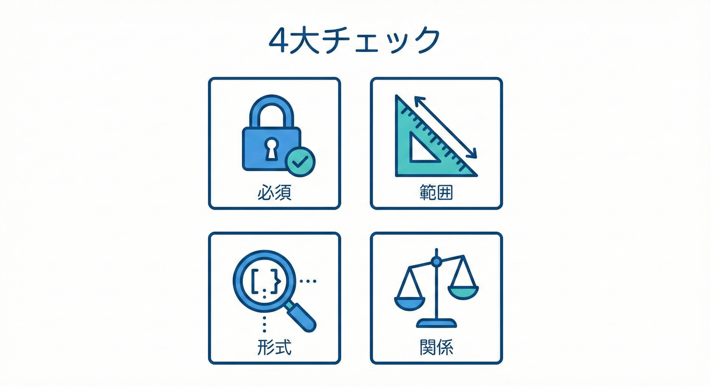
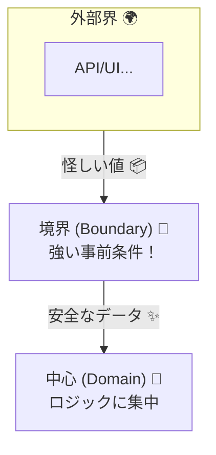

# 第8章　事前条件（Precondition）入門：入口で止める🚪✅

## 8.1 事前条件ってなに？（いちばん大事な一言）💡✨


事前条件（Precondition）は、**「この関数を呼ぶなら、入力はこのルールを守ってね！」**という約束だよ🙂🤝
そして守られてない入力が来たら、**処理を始める前にその場で止める**のが基本！🛑🚪

たとえば👇

* 金額 `amount` は **0より大きい** 💴⬆️
* 文字列 `email` は **空じゃない** 📩✅
* ID `userId` は **形式が正しい** 🪪🔎
* `from` と `to` は **同じじゃない** 🔁🚫

こういうのを入口で止めると、**中のロジックが安心して書ける**ようになるよ😌🧠✨

---

## 8.2 事前条件でチェックする「4大ジャンル」🧱✅



### (1) null / undefined / 空チェック 🕳️🚫

* `null` / `undefined` がダメ
* `""`（空文字）がダメ
* `[]`（空配列）がダメ …など

### (2) 範囲チェック 📏🔢

* `amount > 0`
* `age >= 18`
* `count <= 100` …など

### (3) 形式チェック 🧩🔎

* メールっぽい形？
* UUIDっぽい形？
* 日付文字列がパースできる？ …など

### (4) 関係チェック 🔗⚖️

* `start <= end`
* `fromId !== toId`
* `items合計 === total` …など（※この手は事後条件で見ることも多いよ🎁）

---

## 8.3 どこでチェックするのが正解？📌🚧

結論：**「外から入ってくる境界（boundary）」で強くやる！**💪🚪

境界の例👇

* 画面フォームの入力値
* APIのリクエスト
* ファイル/DB/外部サービスから来る値
* `export` してる関数（他モジュールが呼ぶ）

逆に、同じモジュール内で「ここまで来たら正しい」と言い切れる場所は、チェックを薄くしてもOK🙆‍♀️✨
（入口がガッチリ守れてると、中がスッキリするよ🧼💖）



---

## 8.4 まずは“超シンプル”な事前条件から書こう✍️✨

### 例：送金 `transfer(amount)` 💸🚀

「amount は 0より大きい」を入口で止める！

```ts
// まずはシンプルに：条件NGなら throw で止める
export function transfer(amount: number) {
  if (!(amount > 0)) {
    throw new Error("amount は 0より大きい必要があります💴（例: 100）");
  }

  // ここに来たら amount は必ず正しい！
  // …送金ロジック…
  return { ok: true };
}
```

ポイント👇

* `if` の条件は **否定形**にして「即throw」🛑（ガード節🚧）
* メッセージは **直し方が分かる**ようにする🧭✨

  * ❌「不正です」
  * ✅「amount は 0より大きい必要があります（例: 100）」

---

## 8.5 “ガード節スタイル”が読みやすさ最強🥇📖✨


事前条件は、**関数の最初にまとめて書く**のが超おすすめ！🙂💕

✅おすすめの並び順（基本）

1. **軽いチェック**（null/空/型っぽいもの）⚡
2. **範囲チェック**（min/max）📏
3. **形式チェック**（正規表現など）🧩
4. **重いチェック**（パース、計算、外部アクセス）🐘

---

## 8.6 事前条件を“関数化”すると一気にキレイ🧼🧩

毎回 `if` を書くのがしんどくなってきたら、**小さな関数にして名前をつける**と読みやすいよ✨

```ts
export function requireCondition(condition: unknown, message: string): void {
  if (!condition) throw new Error(message);
}

export function transfer(amount: number) {
  requireCondition(amount > 0, "amount は 0より大きい必要があります💴（例: 100）");

  // ここから安心ゾーン😌
  return { ok: true };
}
```

さらに一歩進めると、TypeScriptには `asserts` で「チェックしたら型も絞れる」仕組みもあるよ🛡️🧠✨
（この本番活用は後の章でがっつりやるよ〜！）

---

## 8.7 VS Codeで手を動かす：最小プロジェクトで試そう🧪💻✨

### ① TypeScriptを入れる（最新版）📦⬇️

VS CodeはTypeScriptの言語機能は入ってるけど、`tsc`（コンパイラ）は別で入れるよ！🧩
`typescript@latest` の最新版は **5.9.3**（本日時点）だよ。([npm][1])

```bash
mkdir dbc-ch8-preconditions
cd dbc-ch8-preconditions
npm init -y
npm i -D typescript@latest
npx tsc --init
```

TypeScriptのインストール方法は公式もここで案内してるよ。([typescriptlang.org][2])

### ② `src/transfer.ts` を作る✍️

```ts
export function requireCondition(condition: unknown, message: string): void {
  if (!condition) throw new Error(message);
}

export function transfer(amount: number) {
  requireCondition(amount > 0, "amount は 0より大きい必要があります💴（例: 100）");
  return { ok: true };
}
```

### ③ 動かしてみる（超ミニ）🏃‍♀️💨

`src/main.ts` を作るよ👇

```ts
import { transfer } from "./transfer";

console.log("OK:", transfer(100));

try {
  transfer(0);
} catch (e) {
  console.log("NG:", (e as Error).message);
}
```

コンパイルして実行👇

```bash
npx tsc
node dist/main.js
```

（※ `tsconfig.json` の `outDir` を `dist` にしたい場合は設定してね🙂）

---

## 8.8 AIに手伝ってもらうときのコツ🤖🧠✨

事前条件はAIが得意！でも**“何を守りたいか”は人間が決める**のが超大事だよ⚖️💕

おすすめ依頼文（コピペOK）👇

* 「`transfer(amount)` の事前条件をガード節で追加して。エラーメッセージは“直し方が分かる文章”にして」📝✨
* 「チェック順は、軽い→重い。例外メッセージは具体例を入れて」📏➡️🐘

AIが出したものは、最後にこれだけ確認👇

* ✅ “この入力のどこが悪いか”が一瞬で分かる？🔦
* ✅ “どう直せばいいか”が書いてある？🧭
* ✅ 本当に入口で止めたいルール？（仕様エラー扱いにすべきもの混ざってない？）🧾

---

## 8.9 演習問題（3つ）🧪🎯

### 演習1：金額のチェックを増やす💴✨

`transfer(amount)` に追加してね👇

* `amount` は整数（小数NG）🚫
* `amount` は `1` 以上 `1_000_000` 以下📏

ヒント：`Number.isInteger(amount)` を使うと便利🙂

### 演習2：IDのチェックを足す🪪🔎

`transfer(fromId, toId, amount)` にして👇

* `fromId` / `toId` は空文字NG🙅‍♀️
* `fromId !== toId` 🔁🚫

### 演習3：メッセージ改善選手権🏆📝

次のメッセージを「直し方が分かる」文章に直してみて👇

* ❌「入力が不正です」
* ❌「エラー」
* ❌「invalid amount」

---

## 8.10 章末チェックリスト✅🧠

* [ ] 事前条件は「入口で止める約束」って説明できる🙂🤝
* [ ] null/空/範囲/形式/関係チェックの違いがわかる🧱
* [ ] ガード節（最初にthrow）で書ける🚧🛑
* [ ] エラーメッセージを「直し方が分かる形」にできる🧭✨
* [ ] チェックを関数化して読みやすくできる🧩📖

---

## 参考（本章の“最新情報”の根拠リンク）🔗🆕

* TypeScriptの最新版（npmの `latest`）が 5.9.3 であること([npm][1])
* TypeScript公式のインストール案内([typescriptlang.org][2])
* VS CodeはTypeScriptサポートはあるが `tsc` は別途インストールが必要([code.visualstudio.com][3])

[1]: https://www.npmjs.com/package/typescript?utm_source=chatgpt.com "TypeScript"
[2]: https://www.typescriptlang.org/download/?utm_source=chatgpt.com "How to set up TypeScript"
[3]: https://code.visualstudio.com/docs/languages/typescript?utm_source=chatgpt.com "TypeScript in Visual Studio Code"

