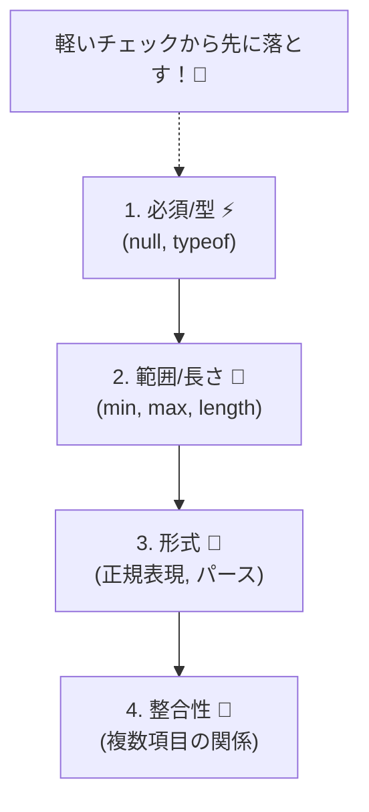
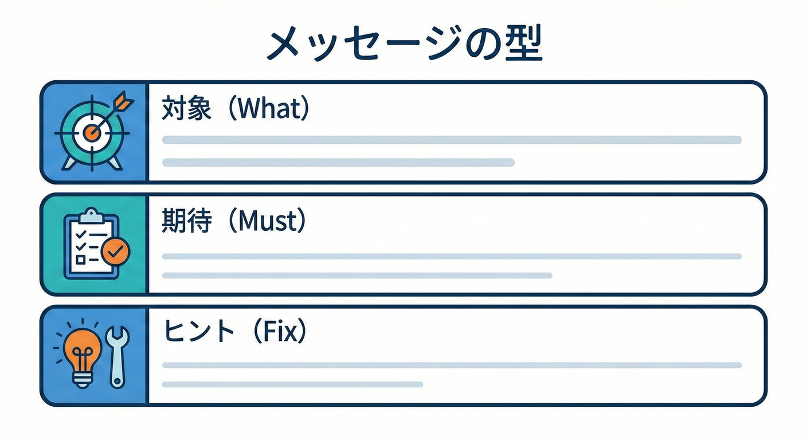

# 第9章　事前条件の書き方：読みやすいチェック順とメッセージ📝✨

## この章でできるようになること🎯

* 事前条件（Precondition）を「読みやすい順番」で書けるようになる🔽✨
* エラー文言を「直し方がわかる形」にできる🧭💡
* `TypeError / RangeError` を使い分けて、失敗の意味をハッキリさせられる🧨✅
* コピペ地獄を避ける「小さな型＆チェックの型（かた）」を持てる🧩🧰

---

## 2026メモ🗓️🧠

* TypeScript は 2025-10-01 に **v5.9.3** がリリースされています（安定版の目安としてここを基準にしてOK）([GitHub][1])
* VS Code の診断（赤波線）を見逃しにくくする拡張として **Error Lens** が定番です👀✨([Visual Studio Marketplace][2])

---

## 1. 事前条件は「入口の説明書」でもある📘🚪

事前条件って「壊れた入力を止める」だけじゃなくて、**関数の使い方を“コードで説明する”**役目もあります🙂✨

* ✅ 読みやすい事前条件 → 呼び出し側が正しく直せる
* ❌ 読みにくい事前条件 → デバッグ時間が爆増する😵‍💫🔧

だからこの章は、**チェックの順番**と**メッセージの書き方**に全振りします💪📝

---

## 2. 「軽いチェック → 重いチェック」の順が基本🔽✨


事前条件を並べるときは、**「コストの低いもの（速いもの）から順にやる」**のが基本だよ🙂
基本はこれ👇

### 2.1 チェック順テンプレ（超実務）🧩

1. **必須チェック**：`null/undefined`、空文字、空配列🚫
2. **型・基本形**：`typeof`、`Number.isFinite`、`Array.isArray` など🧪
3. **範囲・長さ**：`min/max`、`length`、境界値📏
4. **形式**：正規表現、パース、フォーマット（やや重め）🧾
5. **整合性**：複数項目の関係、合計一致、重複なし（重い＆やや複雑）🔗

> コツ：**「読む人の脳がラク」＋「実行もムダが少ない」**順になってるよ🙂🧠✨



---

## 3. 例外の種類を使い分けると、読みやすさが爆上がり💥📌

JS/TS には定番のエラー型があります👇

* `TypeError`：型がおかしい（想定と違う種類）🧩❌
* `RangeError`：範囲がおかしい（数値が大きすぎ/小さすぎなど）📏❌
* `Error`：その他（汎用）。迷うなら一旦これでもOK🙂

Node.js の `assert` は「前提が壊れていたら落とす」用途で使われることもあります（ただしブラウザ前提なら自前で `throw` がシンプル）([Node.js][3])

---

## 4. 良いエラーメッセージの型（かた）🧠🧾



エラーメッセージは、基本この3点セットが強いです👇✨

### 4.1 メッセージの黄金レシピ🏆

* **何が（対象）**：どの引数？どの値？
* **どうあるべき（期待）**：条件を短く断言
* **どう直す（ヒント）**：修正の方向がわかる一言🧭

#### 悪い例😢

* `Invalid input`
* `Error`
* `NG`

#### 良い例🙂✨

* `amount must be a finite number. (e.g. 1.5)`
* `name must be non-empty (trimmed).`
* `page must be between 1 and 100.`

> 値（実際に来た内容）を出すのは便利だけど、ログや画面に出る可能性がある場所では**個人情報っぽい値は出さない**のが安全だよ🔐🫶

---

## 5. まずは「順番が悪い」コードを見てみる👀💥

例：ユーザー登録っぽい関数を想像してね🙂

```ts
type CreateUserInput = {
  name: unknown;
  email: unknown;
  age: unknown;
};

export function createUser(input: CreateUserInput) {
  // ❌ 順番が悪い：いきなり重い/複雑なもの、メッセージも雑
  const email = String(input.email);
  if (!/^[^\s@]+@[^\s@]+\.[^\s@]+$/.test(email)) {
    throw new Error("email invalid"); // 直し方が分からない😵
  }

  const age = Number(input.age);
  if (age < 0 || age > 150) {
    throw new Error("bad age"); // 何がbad？😵‍💫
  }

  const name = String(input.name);
  if (name === "") {
    throw new Error("name"); // 情報ゼロ😇
  }

  return { name, email, age };
}
```

### どこがツラい？😭

* `unknown` を **即 `String()`** してて、原因が消える（`null` も `"null"` になる）🫥
* **形式チェック（正規表現）**が早すぎて、前提の「型/空/必須」が後回し😵‍💫
* メッセージが「直し方不明」ばっかり🧭💔

---

## 6. 改善版：読みやすい順＋直せるメッセージ✨🧩

ここからが本番だよ🙂💪

### 6.1 小さなチェック関数を用意する（読みやすさ最強）🧰✨

```ts
function assertNonEmptyString(value: unknown, name: string): asserts value is string {
  if (typeof value !== "string") {
    throw new TypeError(`${name} must be a string.`);
  }
  if (value.trim().length === 0) {
    throw new RangeError(`${name} must be non-empty (trimmed).`);
  }
}

function assertFiniteNumber(value: unknown, name: string): asserts value is number {
  if (typeof value !== "number") {
    throw new TypeError(`${name} must be a number.`);
  }
  if (!Number.isFinite(value)) {
    throw new RangeError(`${name} must be a finite number.`);
  }
}

function assertIntInRange(value: unknown, name: string, min: number, max: number): asserts value is number {
  assertFiniteNumber(value, name);
  if (!Number.isInteger(value)) {
    throw new RangeError(`${name} must be an integer.`);
  }
  if (value < min || value > max) {
    throw new RangeError(`${name} must be between ${min} and ${max}.`);
  }
}
```

> `asserts` を使うと「ここを通ったら型が確定」して、以降のコードがスッキリするよ🧠✨（Assertion Functions の考え方は TypeScript 3.7 のリリースノートで紹介されています）([TypeScript][4])

### 6.2 改善した `createUser`（順番が気持ちいい）🧼✨

```ts
type CreateUserInput = {
  name: unknown;
  email: unknown;
  age: unknown;
};

export function createUser(input: CreateUserInput) {
  // 1) 必須・型（軽い）
  assertNonEmptyString(input.name, "name");
  assertNonEmptyString(input.email, "email");
  assertIntInRange(input.age, "age", 0, 150);

  // 2) 形式（やや重い）
  // ※この正規表現は“簡易版”だよ（実務は要件に合わせて調整）
  const email = input.email.trim();
  const emailLooksOk = /^[^\s@]+@[^\s@]+\.[^\s@]+$/.test(email);
  if (!emailLooksOk) {
    throw new RangeError("email must look like an email address. (e.g. name@example.com)");
  }

  // 3) ここまで来たら安心して使える🙂✨
  return { name: input.name.trim(), email, age: input.age };
}
```

### ここが良い🙂💡

* **必須＆型**でまず入口を固める🚪🧱
* そのあとに形式（正規表現）をやるから、失敗原因が読みやすい🧠✨
* メッセージが「期待」「例」が入ってて直せる🧭✅

---

## 7. “重いチェック”って何？の具体例🐘💦

「重い」には2種類あります👇

### 7.1 実行コストが重い⚡

* 正規表現（特に複雑）🧾
* JSONパース、日付パース📅
* 暗号化/ハッシュ、巨大配列走査🔍
* ファイル/ネットワーク/DBアクセス（最重量）🌩️

### 7.2 理解コストが重い🧠

* 複数項目の整合性（`start < end` とか）🔗
* 合計一致、重複なし、相互依存ルール🧩

だから、**単発の必須/型/範囲 → 形式 → 整合性**の順が読みやすいよ🙂✨

---

## 8. VS Code で「失敗の見え方」を良くする👀✨

事前条件の学習って、「どこで落ちたか」をすぐ見れると超ラクです🔦🙂
VS Code だと、診断を強調表示する **Error Lens** が人気だよ✨([Visual Studio Marketplace][2])

---

## 9. AI（Copilot/Codex）に手伝わせるプロンプト例🤖💬

チェックやメッセージ改善は、AIが得意なところ✨
そのままコピペで使える例👇🙂

* 「この関数の事前条件を、**軽い→重い**の順に並べ替えて。メッセージは **直し方が分かる**形にして」
* 「`TypeError` と `RangeError` を使い分けて。理由もコメントで短く」
* 「悪いエラーメッセージを5個作ってから、良い形にリライトして（差分が分かるように）」

> 注意：AIは“それっぽい正規表現”を出しがちなので、メール形式などは要件に合わせて人間が最終決定しよ🙂🫶

---

## 10. 演習🧪✨（手を動かすと一気に身につくよ！）

### 問1：メッセージ改善🔧🧾

次のメッセージを「直し方が分かる」形にしてね🙂

1. `invalid`
2. `bad amount`
3. `email error`
4. `name`

✅ 目標：**対象＋期待＋ヒント** を入れる🧭✨

---

### 問2：順番を直す🔁🔽

次のコード、チェック順が微妙です😵‍💫
「軽い→重い」に並べ替えて、例外型もいい感じにしてね🙂

```ts
export function setProfile(name: unknown, bio: unknown) {
  if ((String(bio)).length > 160) throw new Error("bio too long");
  if (typeof name !== "string") throw new Error("name");
  if (!/^[a-z0-9_]+$/i.test(String(name))) throw new Error("name invalid");
  if (typeof bio !== "string") throw new Error("bio");
}
```

---

### 解答例✅✨（まずは“型”を真似してOK）

```ts
export function setProfile(name: unknown, bio: unknown) {
  // 1) 型（軽い）
  if (typeof name !== "string") throw new TypeError("name must be a string.");
  if (typeof bio !== "string") throw new TypeError("bio must be a string.");

  // 2) 必須・長さ（軽い〜中）
  if (name.trim().length === 0) throw new RangeError("name must be non-empty (trimmed).");
  if (bio.length > 160) throw new RangeError("bio must be 160 characters or less.");

  // 3) 形式（やや重い）
  if (!/^[a-z0-9_]+$/i.test(name)) {
    throw new RangeError("name must match /^[a-z0-9_]+$/ (letters, numbers, underscore).");
  }
}
```

---

## 11. 章末チェックリスト✅🧠

* [ ] チェック順は **必須/型 → 範囲/長さ → 形式 → 整合性** になってる？🔽
* [ ] メッセージに **対象＋期待＋ヒント** が入ってる？🧭
* [ ] `TypeError`（型）と `RangeError`（範囲/条件）を雑に混ぜてない？🧩📏
* [ ] “重いチェック”を先にやってない？🐘💦
* [ ] コピペが増えそうなら、小さな `assert...` 関数にできそう？🧰✨

[1]: https://github.com/microsoft/typescript/releases?utm_source=chatgpt.com "Releases · microsoft/TypeScript"
[2]: https://marketplace.visualstudio.com/items?itemName=usernamehw.errorlens&utm_source=chatgpt.com "Error Lens"
[3]: https://nodejs.org/api/assert.html?utm_source=chatgpt.com "Assert | Node.js v25.4.0 Documentation"
[4]: https://www.typescriptlang.org/docs/handbook/release-notes/typescript-3-7.html?utm_source=chatgpt.com "Documentation - TypeScript 3.7"

