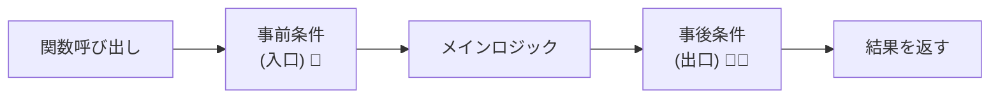
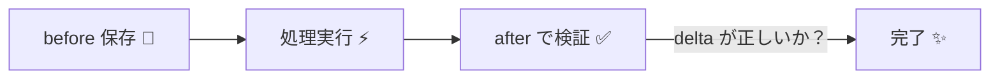

# 第10章　事後条件（Postcondition）入門：結果の品質を保証🎁✅

## 10.1 事後条件ってなに？🙂💡


事後条件（Postcondition）は、**「この処理が成功したなら、必ずこうなってる！」**を約束するルールです🧾✨
つまり、関数の“出口”で品質チェックをする感じです🚪✅

* 事前条件（Precondition）＝入口チェック🚪
* 事後条件（Postcondition）＝出口チェック🚪➡️✅

たとえば「ポイント付与」なら…

* ✅ 成功したなら、**合計ポイントが増えている**
* ✅ 増えた量は、**付与した分と一致している**
* ✅ 変えちゃダメなものは、**変わっていない**

こういうのを**コードで言い切る**のが事後条件です🗣️🔥



---

## 10.2 事後条件が効く“事故”パターンあるある💥😵‍💫

### あるある①：成功したっぽいのに、値が増えてない🫥

* ロジックが途中で抜けて、加算されてない
* 代入先を間違えて、別の変数に入れてた
* 並行処理で上書きされてた（あとで出がち）

👉 **「戻り値だけ見たら成功に見える」**のが怖いところ😱
事後条件があると、出口で即バレします🔦✅

### あるある②：増えてるけど“増え方”が間違ってる📉📈

* +100 のつもりが +10
* 端数処理や丸めでズレ（丸め事故は次章で深掘り🧮✨）

---

## 10.3 事後条件の基本ルール3つ📌✅

### ルール①：「成功したなら」を対象にする🙂

事後条件は **「正常終了したときの保証」** です🎁
例外で落ちた場合は、その時点で“失敗”なので、事後条件を満たす必要はありません🙅‍♀️💥

### ルール②：「観測できる結果」を約束する👀

* 戻り値
* 状態の変化（副作用）
* 変更しないこと（不変系の保証）

### ルール③：重すぎる検証はやりすぎ注意⚖️

事後条件は便利だけど、**毎回DB全件チェック**とかやると重いです🐢💦
まずは「その関数が責任を持つ範囲」で軽く・確実に✅

---

## 10.4 まずは道具づくり：軽い `ensure` を用意しよう🧰✨

“出口チェック”をサクッと書くために、まずは小さな関数を作ります🙂

```ts
export function ensure(condition: unknown, message: string): asserts condition {
  if (!condition) {
    throw new Error(`Postcondition violated: ${message}`);
  }
}
```

ポイント💡

* `asserts condition` を付けると、TypeScript的にも「ここ以降は成り立つ」扱いになります🧠✅
* メッセージは **「何がどうおかしいか」** が分かるように書くとデバッグが速いです🏎️💨

---

## 10.5 事後条件パターン①：戻り値を保証する🎁✅

### 例：ポイント計算（純粋関数）で「必ず増える」を保証🎫⬆️

```ts
import { ensure } from "./ensure";

export function addPoints(current: number, add: number): number {
  // ここでは“入口”は別章（事前条件）でやった前提として、
  // 今回は“出口”の約束に集中するよ🙂

  const result = current + add;

  // ✅ 事後条件：結果は current 以上である（減ってない）
  ensure(result >= current, `result(${result}) must be >= current(${current})`);

  // ✅ 事後条件：増加分が add と一致する
  ensure(result - current === add, `delta(${result - current}) must equal add(${add})`);

  return result;
}
```

ここがキモ💡

* 「増えてること」だけじゃなく、**“増え方が正しいこと”**まで言い切ると強いです💪✨

---

## 10.6 事後条件パターン②：副作用（状態変化）を保証する📤✅


### 例：ウォレットにポイント付与（ミューテートする版）👛🎫

```ts
import { ensure } from "./ensure";

export class PointWallet {
  private _total = 0;

  get total(): number {
    return this._total;
  }

  add(points: number): void {
    const before = this._total;

    // 何かの処理…
    this._total += points;

    const after = this._total;

    // ✅ 事後条件：合計が増えている
    ensure(after > before, `total must increase (before=${before}, after=${after})`);

    // ✅ 事後条件：増えた量が points と一致
    ensure(after - before === points, `delta must be points (delta=${after - before}, points=${points})`);
  }
}
```

コツ💡

* **「before を保存してから処理」→「after で検証」** が超定番です🧠✨
* “副作用”がある処理ほど、事後条件の恩恵が大きいです📈✅



---

## 10.7 事後条件パターン③：「変えちゃダメ」を保証する🧊🚫

ときどき必要なのがコレ👇

* この関数はポイントは変えるけど
* **ユーザーIDやランクは変えない** みたいな保証

```ts
import { ensure } from "./ensure";

type User = {
  id: string;
  rank: "Bronze" | "Silver" | "Gold";
  points: number;
};

export function grant(user: User, add: number): User {
  const beforeId = user.id;
  const beforeRank = user.rank;

  const updated: User = { ...user, points: user.points + add };

  // ✅ 事後条件：ポイントは増えている
  ensure(updated.points > user.points, "points must increase");

  // ✅ 事後条件：id/rank は変わらない（ここ大事！）
  ensure(updated.id === beforeId, "id must not change");
  ensure(updated.rank === beforeRank, "rank must not change");

  return updated;
}
```

「関係ないところが変わってた事故」って、地味に多いです😵‍💫
事後条件で **“影響範囲”を固定**すると強いです🧱✅

---

## 10.8 非同期（async）でも同じ！“await後”に出口チェック⏳✅

```ts
import { ensure } from "./ensure";

export async function fetchAndNormalizeScore(userId: string): Promise<number> {
  const score = await fakeApi(userId); // 0〜100が返る想定

  const normalized = Math.max(0, Math.min(100, score));

  // ✅ 事後条件：正規化した結果は必ず 0〜100
  ensure(normalized >= 0 && normalized <= 100, `normalized must be 0..100, got ${normalized}`);

  return normalized;
}

async function fakeApi(_userId: string): Promise<number> {
  return 120; // わざとバグっぽい値
}
```

---

## 10.9 ミニ実験：わざと壊して「事後条件で止まる」を体感しよう🧪😈

### 手順💻✨

1. `PointWallet.add()` をわざと壊す（例：`+= points` を `+= 0` にする）
2. 適当に呼び出す
3. **「Postcondition violated」** が出たら成功🎉

呼び出し例👇

```ts
import { PointWallet } from "./PointWallet";

const w = new PointWallet();
w.add(10);
console.log(w.total);
```

体感ポイント🙂

* 「バグがどこで起きたか」が、めちゃくちゃ追いやすくなります🔦✨
* **“失敗の仕方がキレイ”**になるのがDbCの気持ちよさです💖

---

## 10.10 AI活用（短い指示でOK）🤖✨

### 事後条件の候補を出してもらうプロンプト例📝

* 「この関数の**成功時に必ず成り立つ条件（事後条件）**を3つ提案して。戻り値・副作用・変更禁止の観点で。」
* 「`before/after` を使った事後条件チェックを入れた実装例をTypeScriptで出して。」
* 「事後条件のエラーメッセージを、原因が分かる形に改善して案を出して。」

⚠️ 大事🙂
AIが出す事後条件は“候補”なので、最後は **仕様として正しいか**を人間が決めます⚖️✅

---

## 10.11 ちょい最新コラム：副作用を遅らせる `import defer` 🕰️📦

最近のTypeScriptでは、モジュールの実行（副作用）を“遅らせる”書き方として `import defer` が追加されています💡
副作用が絡むと「いつ状態が変わるの？」がややこしくなりがちなので、こういう仕組みは設計の助けになります🙂✨ ([TypeScript][1])

---

## 10.12 章末チェックリスト✅✨

* ✅ 事後条件は「成功したなら必ずこうなる」を言い切る
* ✅ 戻り値だけじゃなく、副作用（状態変化）も保証できる
* ✅ `before/after` で検証すると分かりやすい
* ✅ 「変えちゃダメ」も事後条件で固定できる
* ✅ 重すぎる検証はやりすぎ注意（まずは責任範囲で軽く）

---

## 10.13 演習🧪✍️

### 演習1：ポイント付与の事後条件を増やそう🎫✅

`PointWallet.add(points)` に、次の事後条件を追加してね🙂

* ✅ `total` は **負にならない**
* ✅ `total` は **整数のまま**（小数が混ざらない想定）

ヒント💡

* `Number.isInteger(x)` が使えます🧠

---

### 演習2：購入処理の事後条件（合計が一致）🛒💴

次の関数を作って、事後条件で守ってね🙂✨

要件：

* `items` の合計を返す
* ✅ 返した `total` は、各 `price * qty` の合計と一致する
* ✅ `total` は 0 以上

```ts
type Item = { price: number; qty: number };

export function calcTotal(items: Item[]): number {
  // TODO
  return 0;
}
```

---

### 演習3：変更禁止の事後条件🔒🧊

`grant(user, add)` で、`id` と `rank` が絶対に変わらないことを事後条件で保証してね🙂
（章の例を参考にOK！）

---

## 10.14 解答例（サンプル）🧠✨

### 演習2 解答例

```ts
import { ensure } from "./ensure";

type Item = { price: number; qty: number };

export function calcTotal(items: Item[]): number {
  const total = items.reduce((sum, it) => sum + it.price * it.qty, 0);

  ensure(total >= 0, `total must be >= 0, got ${total}`);

  const expected = items.reduce((sum, it) => sum + it.price * it.qty, 0);
  ensure(total === expected, `total must equal expected (total=${total}, expected=${expected})`);

  return total;
}
```

---

### 次章予告📘✨

次の章では、金額・税・丸めの“ズレ事故”を **事後条件で封じる**コツをやります💴🧮✅

[1]: https://www.typescriptlang.org/docs/handbook/release-notes/typescript-5-9.html?utm_source=chatgpt.com "Documentation - TypeScript 5.9"

