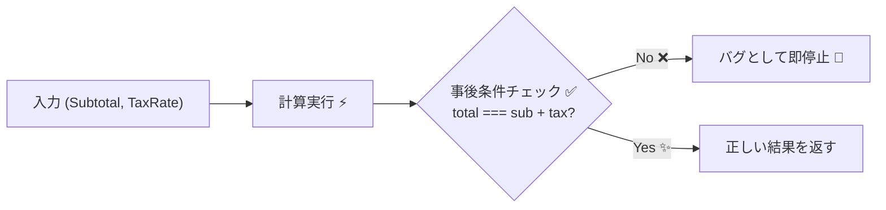
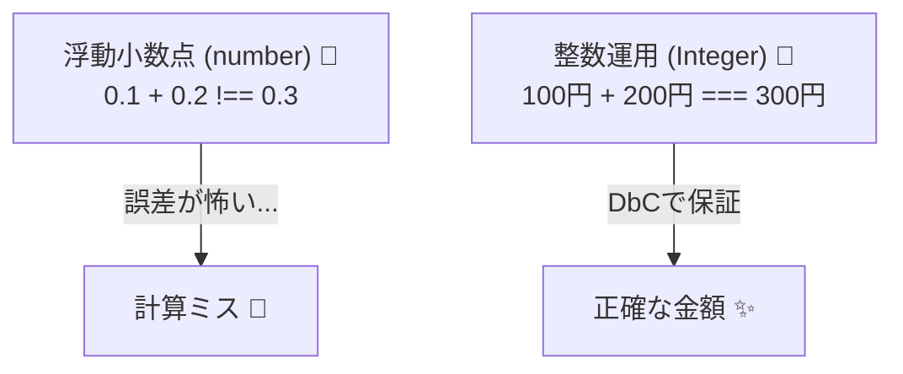
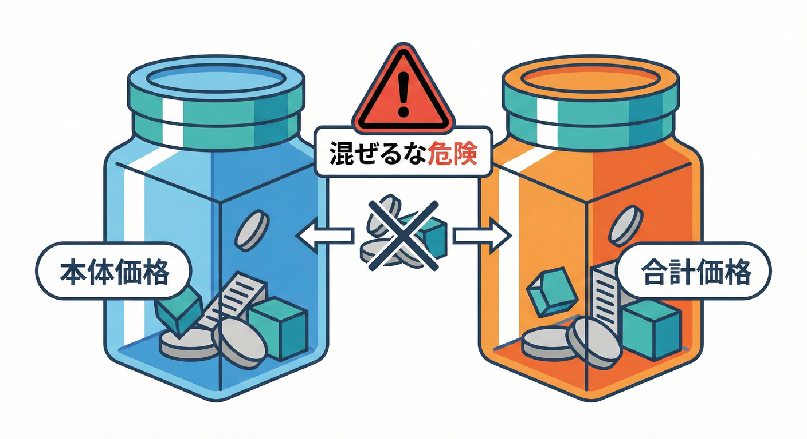

# 第11章　事後条件の実務コツ：整合性・単位・丸めの事故を防ぐ📏🧮

## 11.0 この章でできるようになること🎯✨

* 「計算が合ってるっぽい」じゃなくて「**必ず合ってる**」をコードで言い切れるようになる💪✅
* 金額💴・税🧾・単位📦・丸め🔁で起きがちな事故を、**事後条件（Postcondition）**で止められるようになる🛑✨
* 「どこが壊れてる？」がすぐ分かる、**壊れ方がきれいなロジック**にできる🧠🔦

---

## 11.1 なぜ“金額・税・丸め”は事故りやすいの？💥

### よくある事故あるある😵‍💫

1. **小数が混じって誤差が出る**（0.1 + 0.2 問題）🧪
   JavaScript の `number` は **IEEE 754 の浮動小数点**なので、10進の小数を正確に表せないことがあるよ⚠️ ([MDNウェブドキュメント][1])

2. **単位が混ざって破綻する**（円とドル、税込と税抜、個と箱…）💴💱📦
   数字だけ見てると同じ `number` に見えるのが落とし穴😇

3. **端数処理ルールが曖昧**（四捨五入？切り捨て？合算後？明細ごと？）🔁
   “なんとなく round” が一番危ない💣

4. **整合性が崩れる**（`total !== subtotal + tax`）🧩💔
   ここを事後条件でガチガチにすると、事故が激減するよ✅✨

---

## 11.2 事後条件で守るべき“整合性”の代表パターン集📚✅

### パターンA：合計の一致（超重要）🧾➕

* **期待**：`total = subtotal + tax`
* **事後条件**：戻り値を返す直前に **必ず式で確認**する✅



### パターンB：非負（マイナス禁止）🚫➖

* 金額や数量は、仕様上マイナスがあり得ないなら **必ず止める**🛑
* “たまに -0 になる” とかも潰す🧹

### パターンC：整数・安全な整数（桁がデカい時）🔢🧱

* 金額は「最小単位（円、セント）」で **整数**にするのが基本💴✨
* さらに大きい桁を扱うなら「安全な整数か？」まで見ると安心😊
  JavaScript は安全に表現できる整数範囲が決まってるよ（±(2^53−1)）([MDNウェブドキュメント][1])

### パターンD：丸めルールが“明示されている”🔁📝

* `Math.round()` を置いただけは「意図が読めない」😵
* **関数名で丸め方を表現**すると、未来の自分が助かる🧠✨

---

## 11.3 “金額は整数で持つ”が最強💴🧱🧱


DbCと相性がいい「お金のあつかい」の鉄則はこれです👇

小数で持つと、計算途中で誤差が混ざりやすい⚠️
なのでまずは **円なら円、セントならセント**で整数運用するのが王道だよ👑✨

### 例：請求書の合計を作る（税は切り捨ての例）🧾

* `subtotalYen`：税抜の小計（円）
* `taxYen`：税（円）
* `totalYen`：合計（円）

```ts
type Yen = number;         // ここでは簡易に number だけど、整数運用が前提💴
type Bps = number;         // basis points（1% = 100 bps、100% = 10000 bps）

function ensure(condition: unknown, message: string): asserts condition {
  if (!condition) throw new Error(`POSTCONDITION VIOLATION: ${message}`);
}

function calcTaxFloor(subtotalYen: Yen, taxRateBps: Bps): Yen {
  // 例：切り捨て（floor）※丸めルールは要件次第🔁
  const tax = Math.floor((subtotalYen * taxRateBps) / 10_000);

  // ✅ 事後条件：税は整数・非負・安全な整数
  ensure(Number.isSafeInteger(tax), "tax must be an integer");
  ensure(tax >= 0, "tax must be >= 0");
  return tax;
}

function buildInvoiceTotal(subtotalYen: Yen, taxRateBps: Bps) {
  const taxYen = calcTaxFloor(subtotalYen, taxRateBps);
  const totalYen = subtotalYen + taxYen;

  // ✅ 事後条件：整合性（合計一致）
  ensure(totalYen === subtotalYen + taxYen, "total must equal subtotal + tax");

  // ✅ 事後条件：非負
  ensure(subtotalYen >= 0, "subtotal must be >= 0");
  ensure(totalYen >= 0, "total must be >= 0");

  // ✅ 事後条件：安全な整数（お金は“整数で正確”が大事）
  ensure(Number.isSafeInteger(subtotalYen), "subtotal must be an integer");
  ensure(Number.isSafeInteger(totalYen), "total must be an integer");

  return { subtotalYen, taxYen, totalYen };
}
```

### ここがポイントだよ✨

* **丸めの場所**を固定する（ここでは税計算の中）📌
* **整合性の式**をそのまま事後条件にする（`total === subtotal + tax`）🧩✅
* “読み手に優しい名前”を付ける（`calcTaxFloor`）📝💕



---

## 11.4 “税込と税抜が混ざる”事故を、事後条件で焼き払う🔥



### 事故パターン😇

* 途中の変数が「税込」なのに名前が `subtotal` のまま
* UI で表示する時に税を二重に足す
* 返品や値引きでマイナスが混ざって合計がズレる

### 対策🛡️

* 変数名に **TaxIncluded / TaxExcluded** を入れる
* 事後条件で「合計の式」を必ず検証する

```ts
type Yen = number;

function ensure(condition: unknown, message: string): asserts condition {
  if (!condition) throw new Error(`POSTCONDITION VIOLATION: ${message}`);
}

function addTax(subtotalTaxExcludedYen: Yen, taxYen: Yen): Yen {
  const totalTaxIncludedYen = subtotalTaxExcludedYen + taxYen;

  // ✅ “税込 = 税抜 + 税” を絶対に崩さない
  ensure(totalTaxIncludedYen === subtotalTaxExcludedYen + taxYen, "tax-included total mismatch");
  return totalTaxIncludedYen;
}
```

---

## 11.5 “丸め”は仕様の一部：関数名で意思表示しよ🔁🧠

丸めは「計算のテクニック」じゃなくて **業務ルール**だよ🧾✨
だから **関数名で丸め方を表現**すると、読み手が迷子にならない😊🧭

### 例：丸め関数を用意する🧰

```ts
function roundHalfUp(value: number): number {
  // JSの Math.round は .5 を「+∞方向」へ丸める挙動（いわゆる half-up に近い）をするケースが多いよ🔁
  // ただし負数など細かい仕様は注意（要件で決めてテストで固定！）🧪
  return Math.round(value);
}

function floorInt(value: number): number {
  return Math.floor(value);
}

function ceilInt(value: number): number {
  return Math.ceil(value);
}
```

### ちなみに…表示の丸め（フォーマット）は別物🖥️✨

`Intl.NumberFormat` の丸めは用途が広い一方で、丸めモードをもっと選びたいニーズがあって、拡張提案も進んでるよ📈 ([tc39.es][2])
だから **業務計算の丸めは自分のロジックで固定**して、表示は表示で扱うのが安全🙆‍♀️

---

## 11.6 浮動小数の誤差に“本気で”向き合う話（最新動向）🧪📌

* JavaScript の `number` は浮動小数点だから、**10進小数の厳密な金額計算**には向かないことがある⚠️ ([MDNウェブドキュメント][1])
* その背景もあって、**10進の正確な Decimal 型**を追加しようという TC39 の提案も進んでる（2025-10-23 の Stage 1 Draft）🧠✨ ([tc39.es][3])

✅ だから実務ではまず：

* **金額は整数（最小単位）で持つ**💴
* どうしても小数が必要なら、**専用ライブラリ or 仕様で丸め地点を固定**🔁🧪

---

## 11.7 演習（手を動かすパート）✍️🧪✨

### 演習1：`total = subtotal + tax` を絶対に守る🧾✅

次の仕様で関数を作ってね👇

* 入力：`subtotalYen: number`, `taxRateBps: number`
* 出力：`{ subtotalYen, taxYen, totalYen }`
* 税は「切り捨て」
* ✅ 事後条件：

  * `totalYen === subtotalYen + taxYen`
  * 全部 `Number.isSafeInteger()`
  * 全部 `>= 0`

### 演習2：“単位ミス”を型で減らす🧷

`Yen` と `Bps` を使って、**間違って `taxRateBps` を `subtotalYen` に足せない**ようにしてみよう🙂
（今は単なる `type` でもOK！次の章以降でさらに強くできるよ🧱✨）

### 演習3：壊れたデータでテストする🧨🧪

* `subtotalYen = 100`, `taxRateBps = 1000`（10%）
* `subtotalYen = 0`, `taxRateBps = 1000`
* `subtotalYen = -1`（これは弾きたい）
* `subtotalYen = 9007199254740992`（安全な整数じゃない）([MDNウェブドキュメント][1])

---

## 11.8 🤖 AI活用コーナー（“事後条件テスト”を増産する）⚡

以下みたいに頼むと、テストのたたき台が速いよ🧪✨

* 「`buildInvoiceTotal` の事後条件（合計一致・整数・非負）を満たすテストケースを、境界値多めで列挙して」📋
* 「`subtotalYen` が安全な整数を超えるケースを含めて、失敗するテストも作って」🧨
* 「切り捨て／切り上げ／四捨五入の3種類で、同じ入力の期待値を表にして」📊🔁

ポイント：AIが作った期待値は、**最後は人間が仕様で確定**するよ⚖️🙂

---

## 11.9 章末チェックリスト✅✨

* [ ] 金額は **最小単位の整数**で扱っている💴
* [ ] 丸め方が **関数名で明示**されている🔁📝
* [ ] `total = subtotal + tax` を **事後条件で検証**している🧩✅
* [ ] `Number.isSafeInteger()` で **正確さの担保**をしている🔢🧱 ([MDNウェブドキュメント][1])
* [ ] 失敗ケース（壊れた入力）もテストしている🧨🧪

---

## 11.10 最新メモ（本日時点）🆕📝

* TypeScript は **5.9.3** が最新リリースとして案内されているよ（公式リリース一覧）✨ ([github.com][4])

[1]: https://developer.mozilla.org/en-US/docs/Web/JavaScript/Guide/Language_overview?utm_source=chatgpt.com "JavaScript language overview - MDN Web Docs"
[2]: https://tc39.es/proposal-intl-numberformat-v3/?utm_source=chatgpt.com "ECMA-402 Proposal: Intl.NumberFormat V3"
[3]: https://tc39.es/proposal-decimal/?utm_source=chatgpt.com "Decimal"
[4]: https://github.com/microsoft/typescript/releases "Releases · microsoft/TypeScript · GitHub"

