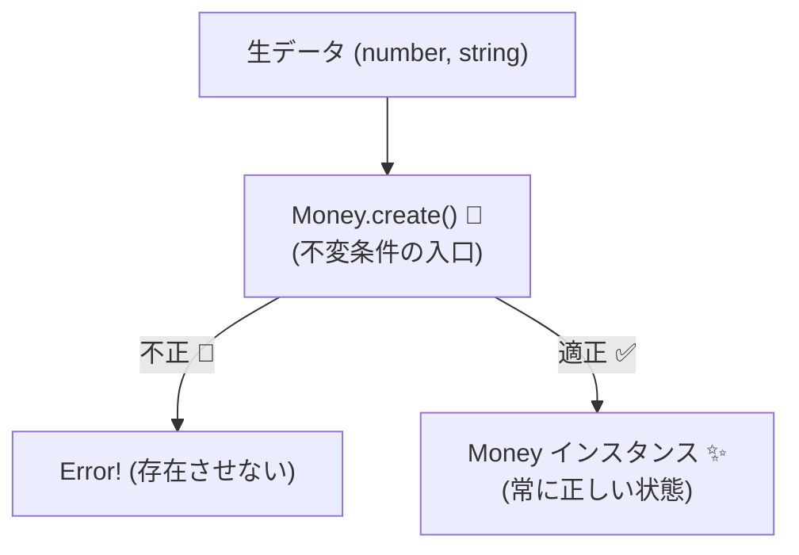

# 第12章　不変条件（Invariant）入門：壊れない中心を作る🧱✨

## 2026年1月時点のツール事情メモ🧰✨

* TypeScript は **5.9 系**が最新版として配布されています。 ([TypeScript][1])
* Node.js は **v24（Active LTS）** が現役のLTSです（他に v22 が Maintenance LTS）。 ([Node.js][2])
* VS Code は **1.108（2025年12月版）** が配布されています。 ([Visual Studio Code][3])
* 参考：TypeScript は “ネイティブ実装（TypeScript 7 のプレビュー）” が進行中、という大きな流れもあります。 ([Microsoft Developer][4])

---

## この章でできるようになること🎯✨

* 「不変条件」＝**いつでも守られていないと困るルール**を説明できる🙂
* “無効な状態” を **作らない設計**にできる🧱
* 不変条件を **1か所に集める理由**が腹落ちする📌
* ミニ実装：**Money（0以上・通貨必須）** を作れる💴🧱

---

## 12.1 不変条件ってなに？🙂💡


不変条件（Invariant）は、**「そのオブジェクトが生きている間、ずっと守られなきゃいけないルール」**です⚓️✨

**「オブジェクト（やドメイン）の中身が、いつ見ても“正しい状態”であるためのルール」**🧱✨

たとえばこんなやつ👇（全部 “いつでも” 守られててほしいよね😇）

* Money：金額は 0 以上／通貨は必須💴✅
* Email：空じゃない／それっぽい形式📩✅
* DateRange：開始日 ≤ 終了日📅✅
* Reservation：キャンセル済みなら再キャンセル不可🚫✅

ポイントはここ👇

* 事前条件（Precondition）：**入口**の約束🚪✅
* 事後条件（Postcondition）：**出口**の約束🎁✅
* 不変条件（Invariant）：**中身（存在し続ける状態）**の約束🧱✅


不変条件が強いと何が嬉しいかというと…
**「中に入ってるものが最初から信用できる」**から、考える量が激減します🧠➡️😌✨

---

## 12.2 不変条件がない世界：バグが“後から出る”😵‍💫💥

まずは、わざと “壊れやすい例” を見てみよう👀

### 例：Money がただの形だけ（壊れてOKになってる）😱

```ts
// ダメな例：ただのデータ（いつでも壊れた状態になれる）
export type Money = {
  amount: number;     // -100 とか入っても止まらない😇
  currency: string;   // "" とか "??" とか入っても止まらない😇
};

export function pay(price: Money) {
  // あちこちで「毎回」チェックする羽目になる😵‍💫
  if (price.amount < 0) throw new Error("amount must be >= 0");
  if (!price.currency) throw new Error("currency is required");
}
```

この設計だと、どこか1か所でもチェックを忘れると…

* ある画面では止まったのに、別の画面では通った😇
* ログの奥深くで、突然 NaN になって死ぬ😇
* 「原因はどこ？」が分からなくなる😇🔦

つまり、**不変条件を“散らす”と破れます**📌💥

---

## 12.3 不変条件のコツ：散らさない、1か所に集める📌🧱✨


不変条件は、こうすると強くなるよ👇

### ✅ ルール：不変条件は「生成時に確定」させる

**作れた＝正しい** にするのがいちばん強い💪✨
（第13章でさらに深掘りするよ🏗️）

### ✅ ルール：中身を外から勝手に変えさせない

* フィールドは readonly にする🧊
* 更新は “専用メソッド” に寄せる（第14章で深掘り）🔁

### ✅ ルール：表現を決める（お金は小数じゃなく “最小単位” が安全）💴📏

小数（0.1 とか）って、丸め事故が起きやすい💥
なので教材では、Money.amount は **最小単位の整数**（例：円）で扱うのをおすすめするよ🙂✨

---

## 12.4 実装ミニパターン：Money を「壊れない中心」にする💴🧱

ここから手を動かそう〜！💪😆✨
目標はこれ👇

* amount は 0 以上✅
* currency は必須✅
* 作れたら、ずっと正しい✅

---

## 12.5 演習：Money（0以上、通貨必須）を作る💴🧱🧪

### ① プロジェクトを用意（Windows＋VS Code）🪟💻

PowerShell で👇（空フォルダでOKだよ🙂）

```bash
npm init -y
npm i -D typescript
npx tsc --init
```

---

### ② 通貨を「ありえるものだけ」に絞る🪙🎯

まずは通貨を型で狭めちゃう！（型で守れるところは型で守る🧷✅）

```ts
// src/domain/currency.ts
export type Currency = "JPY" | "USD" | "EUR";
```

---

### ③ Money を「生成時にチェック」する💴✅

ここがこの章の主役！🧱✨
“壊れた Money は作れない” って状態を作るよ🙂

```ts
// src/domain/money.ts
import { Currency } from "./currency";

export class Money {
  public readonly amount: number;
  public readonly currency: Currency;

  // 外から new されないようにして「作り方」を統一する🏗️
  private constructor(amount: number, currency: Currency) {
    this.amount = amount;
    this.currency = currency;
    Object.freeze(this); // 実行時も「うっかり書き換え」しにくくする🧊
  }

  // ここが“不変条件の入口”🧱✨
  public static create(amount: number, currency: Currency): Money {
    if (!Number.isFinite(amount)) {
      throw new Error("Money.amount must be a finite number");
    }
    if (!Number.isInteger(amount)) {
      throw new Error("Money.amount must be an integer (smallest unit)");
    }
    if (amount < 0) {
      throw new Error("Money.amount must be >= 0");
    }
    // currency は型で担保されるので、ここでは追加チェック不要（必要なら入れてOK）🙂
    return new Money(amount, currency);
  }



  public add(other: Money): Money {
    if (this.currency !== other.currency) {
      throw new Error("Money currency mismatch");
    }
    return Money.create(this.amount + other.amount, this.currency);
  }

  public subtract(other: Money): Money {
    if (this.currency !== other.currency) {
      throw new Error("Money currency mismatch");
    }
    const next = this.amount - other.amount;
    // ここも不変条件（0以上）を絶対に守る🧱
    return Money.create(next, this.currency);
  }
}
```

ここで起きてることを一言で言うと👇
**「Money が存在する限り、ずっと正しい」**🧱✨

---

### ④ 動かして確認してみよう🚀✨

```ts
// src/index.ts
import { Money } from "./domain/money";

const price = Money.create(1200, "JPY");
const fee = Money.create(300, "JPY");
const total = price.add(fee);

console.log(total); // { amount: 1500, currency: "JPY" } みたいな感じ🙂
```

（実行方法はプロジェクト構成で色々あるけど、まずは “コンパイルして node で実行” がシンプルだよ🙂）

```bash
npx tsc
node dist/index.js
```

※ tsconfig の出力先（outDir）を dist にしてない場合は、tsconfig を合わせてね🧩

---

## 12.6 “散らすと破れる” が本当に怖い理由😵‍💫🧨

不変条件を 1か所に集めると、こういう恩恵があるよ👇

* ✅ チェック漏れが起きにくい（入口が1か所）
* ✅ 直す場所が1か所（仕様変更に強い）
* ✅ 使う側がラク（毎回 if しなくていい）
* ✅ テストもしやすい（壊れた入力をまとめて確認できる）🧪✨

逆に散らすと…
「どこで守れてて、どこで守れてない？」が地獄になる😇🔥

---

## 12.7 よくある落とし穴（先に踏み抜きポイント共有）🕳️⚠️

* **小数でお金を扱う**：丸め・誤差が混入しやすい💥（最小単位の整数が安全💴）
* **フィールドを public で書き換え可能にする**：どこからでも壊せちゃう😱
* **“生成後に検証” する**：壊れた状態が一瞬でも存在してしまう⏱️💥
* **“チェックを呼び出し側に任せる”**：100% 忘れられる（人は忘れる）🙂‍↕️

---

## 12.8 AI（Copilot / Codex）活用のコツ🤖✨

AIにお願いするときは、こういう頼み方が安定するよ👇（そのまま貼ってOK✨）

### ✅ プロンプト例：不変条件がブレない Money を作りたい

* 「Money クラスを TypeScript で作って。条件は “amount は 0 以上の整数（最小単位）・currency は JPY/USD/EUR のみ”。不変条件は create に集約して、add/subtract でも必ず守って。例外メッセージは短く具体的に。」

### ✅ AIの出力チェック（ここだけは人間が責任持つ💪）

* “0以上” が add/subtract の両方で守られてる？🧱
* 通貨違いの計算を止めてる？🪙🚫
* amount が整数になってる？（小数が混ざってない？）🔎

---

## 章末チェックリスト✅✨

* 不変条件を「いつでも守るルール」として説明できる🙂
* 不変条件を “呼び出し側に任せると崩壊する” 理由が言える😵‍💫
* Money を「作れたら正しい」形で作れた💴🧱
* add/subtract でも不変条件を守るコードになっている✅

---

## 次章へのつながり🔗✨

* 次の第13章では、「生成時に確定」をさらに強くするために **コンストラクタ／ファクトリ**の置き方を整えていくよ🏗️✅
* その次の第14章では、「更新で壊さない」をちゃんと設計するよ🔁🧱

[1]: https://www.typescriptlang.org/download/?utm_source=chatgpt.com "How to set up TypeScript"
[2]: https://nodejs.org/en/about/previous-releases?utm_source=chatgpt.com "Node.js Releases"
[3]: https://code.visualstudio.com/updates?utm_source=chatgpt.com "December 2025 (version 1.108)"
[4]: https://developer.microsoft.com/blog/typescript-7-native-preview-in-visual-studio-2026?utm_source=chatgpt.com "TypeScript 7 native preview in Visual Studio 2026"

