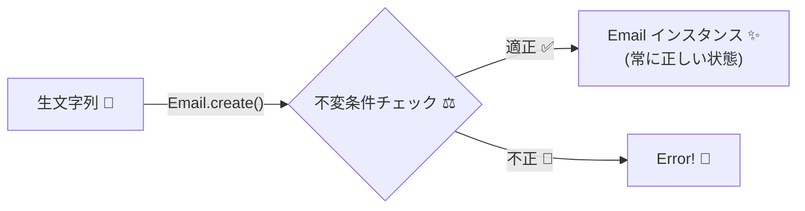
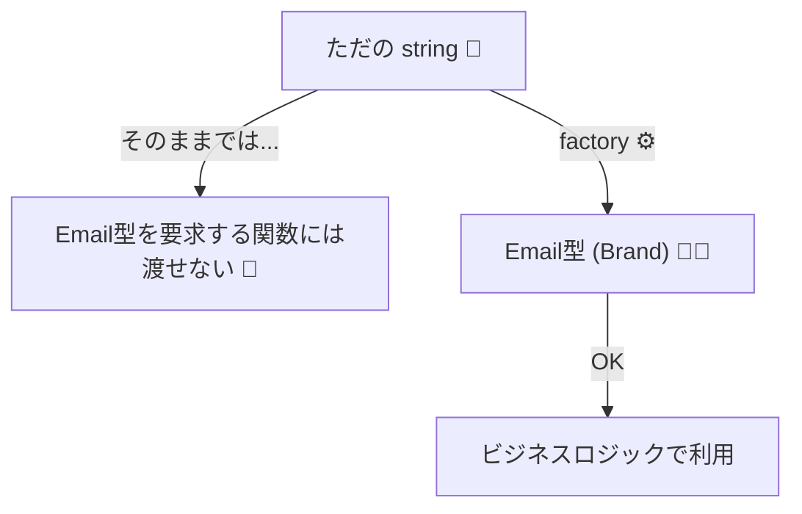

# 第13章　不変条件の配置：コンストラクタ／ファクトリで確定させる🏗️✅

## この章でできるようになること🎯✨

* 「作れた＝正しい状態」なクラス／型を作れるようになる🙆‍♀️✅
* 不変条件（Invariant）を **1か所に集めて** 壊れにくくできる🧱✨
* `new` を“直接触らせない”設計で、バグの入口を閉じられる🚪🔒

---

## 1. なんで「生成時に確定」させるの？🤔💡


不変条件（Invariant）を一番ラクに守る方法は、**「不完全な状態では絶対に生まれないようにする」**ことです🧱✨
だから理想はこれ👇

> **“存在しているインスタンスは、全部ルールを満たしている”** ✅✅✅



これができると、コードがめちゃくちゃラクになるよ😆🌸
なぜなら…

* 関数の中で毎回「これ正しい値かな？」って疑わなくていい🕵️‍♀️❌
* 変な値が混ざって原因不明のバグになるのを防げる🧨🛑
* テストも「正しいものしか来ない前提」で書ける🧪✨

---

## 2. ありがちなダメ例（不変条件が散らばる）😵‍💫💥

たとえば「Emailはメールっぽい文字列である」が不変条件だとするね📩

### ❌ こうなると壊れやすい

* `new Email("  aaa@bbb.com  ")` が通る
* どこかの関数で `trim()` し忘れる
* どこかの関数でチェックし忘れる
* 結果：**“たまに壊れる”** が発生😇💥

---

## 3. 王道パターン①：コンストラクタを隠して `create()` に集約🏭✨

### 3.1 形（結論）📌

* `constructor` を `private`（または `protected`）にする🔒
* 生成は `static create()` のみ🏭
* `create()` の中で

  * 正規化（trim/toLowerなど）🧼
  * 検証（ルール違反を止める）🛑
  * インスタンス化（ここでだけ `new`）🏗️

#### 例：Email クラス（作れたら必ず正しい）📩✅

```ts
export class Email {
  private constructor(private readonly value: string) {}

  public static create(raw: string): Email {
    const text = raw.trim().toLowerCase();

    // 不変条件（Invariant）
    if (text.length === 0) throw new Error("Emailは空にできません📩❌");
    if (!text.includes("@")) throw new Error("Emailの形式が変です📩❌（@が必要）");

    return new Email(text);
  }

  public toString(): string {
    return this.value;
  }
}
```

### 3.2 使う側がめっちゃシンプルになる😍✨

```ts
import { Email } from "./Email";

function sendWelcome(email: Email) {
  // ここでは「Emailは正しい」前提でOK🙆‍♀️
  console.log(`ようこそ！ ${email.toString()} さん🎉`);
}

const email = Email.create("  Alice@Example.com ");
sendWelcome(email);
```

✅ ポイント

* **Emailっぽくない文字列**は `Email.create()` の時点で止まる🛑
* `sendWelcome()` は “正しいEmailが来る” だけ考えればOK🎯✨

---

## 4. 王道パターン②：プリミティブ型は「ブランド型＋ファクトリ関数」🪪✨

「Emailは実体はstringなんだけど、ただのstringとは区別したい」って時あるよね🙂
そのとき便利なのが **ブランド型（Nominalっぽくするやつ）**✨

```ts
declare const emailBrand: unique symbol;
export type Email = string & { readonly [emailBrand]: "Email" };

export function createEmail(raw: string): Email {
  const text = raw.trim().toLowerCase();

  if (text.length === 0) throw new Error("Emailは空にできません📩❌");
  if (!text.includes("@")) throw new Error("Emailの形式が変です📩❌（@が必要）");

  return text as Email;
}
```

### 使い方（ただのstringと混ざらない）🧠🔒

```ts
import { Email, createEmail } from "./email";

function sendWelcome(email: Email) {
  console.log(`ようこそ！ ${email} さん🎉`);
}

const s = "bob@example.com";
// sendWelcome(s); // ❌ stringはEmailじゃない！

const email = createEmail(s);
sendWelcome(email); // ✅
```

✅ どっちを選ぶ？

* **クラス型**：振る舞い（メソッド）も一緒に持たせたいとき🧰
* **ブランド型**：軽く「ただの値」を守りたいとき🪶

---

## 5. `new` を隠すテクニック集🔒🛠️

「`new` できちゃう」状態を放置すると、だいたい後で壊れる😇💥
なので、次のどれかで封じるのが定番だよ✅

* `constructor` を `private` にする（クラス）🔒
* `class` を export せず、`create()` だけ export する（モジュール境界）🚧
* ブランド型＋ファクトリ関数にする🪪



---

## 6. 不変条件チェック、どこまで厳密にする？📏🤔

不変条件は“強く”したいけど、やりすぎると辛いこともあるよね🙂💦

おすすめの考え方👇

* **軽いチェック**（空・範囲・必須文字など）→ 不変条件として持ちやすい💪✨
* **重いチェック**（外部API問い合わせ、DNSチェック等）→ 生成時にやると重くなりがち🐢💦

  * こういうのは境界層でやる／別の検証ステップに分けるのが無難🚧

---

## 7. 演習🧪✍️（手を動かすと一気に身につく！）

### 演習1：`NonEmptyString` を作る🧵✅

* ルール：空文字・空白だけは禁止🙅‍♀️
* 形式：クラスでもブランド型でもOK✨

### 演習2：`Percent`（0〜100）を作る📊✅

* ルール：`0 <= p <= 100`
* `create(120)` は止める🛑

### 演習3：`Email.create()` をちょっと強くする📩💪

* ルール追加例：`@` が先頭／末尾はダメ、`@` が複数はダメ…など🎯
* ただし「正規表現で完璧にやろう」としすぎないでOK（まずは安全第一）🧯✨

---

## 8. AI支援🤖💬（サクッと手伝ってもらう）

### 8.1 雛形を作ってもらう⚡

* 「TypeScriptで private constructor + static create のValueObject例を作って」
* 「ブランド型で Email と UserId を作る例を出して」

### 8.2 ルールのレビューをしてもらう🔎

* 「Emailの不変条件として最低限どこまで見るべき？」
* 「重い検証を不変条件に入れるデメリットを列挙して」

### 8.3 事故りやすい入力を出してもらう🧨

* 「Emailでバグりやすい入力例を20個出して（空白、全角、複数@など）」

---

## 9. 章末チェックリスト✅✨

* [ ] 不変条件を“1か所”に集められた🧱
* [ ] `new` を外から触れない形にできた🔒
* [ ] 「作れた＝正しい状態」になっている✅
* [ ] 使う側のコードがスッキリした（チェック地獄が消えた）😆✨

---

## ちょい最新メモ🗞️✨（2026年1月時点）

* TypeScript の安定版は **5.9系**が最新として配布されているよ📦✨（npmの `typescript` の Latest 表示） ([npm][1])
* TypeScript 5.9 のリリースノートでは、`tsc --init` の更新や `--module node20` など、現行環境に合わせた改善がまとまってるよ🛠️ ([TypeScript][2])
* さらに先の動きとして、TypeScript をネイティブ実装へ寄せる **TypeScript 7 native preview** の話も出ていて、大規模コードでコンパイルが大幅に速くなる報告があるよ⚡（プレビュー段階） ([Microsoft Developer][3])

---

## まとめ✨🎀

不変条件は「後で守る」じゃなくて、**“作る瞬間に確定”** させるのが最強だよ🏗️✅
`create()`（またはファクトリ）に集めて、`new` を隠せば、コードが一気に壊れにくくなる🧱🔒✨

[1]: https://www.npmjs.com/package/typescript?activeTab=versions&utm_source=chatgpt.com "typescript"
[2]: https://www.typescriptlang.org/docs/handbook/release-notes/typescript-5-9.html "TypeScript: Documentation - TypeScript 5.9"
[3]: https://developer.microsoft.com/blog/typescript-7-native-preview-in-visual-studio-2026 "TypeScript 7 native preview in Visual Studio 2026 - Microsoft for Developers"

