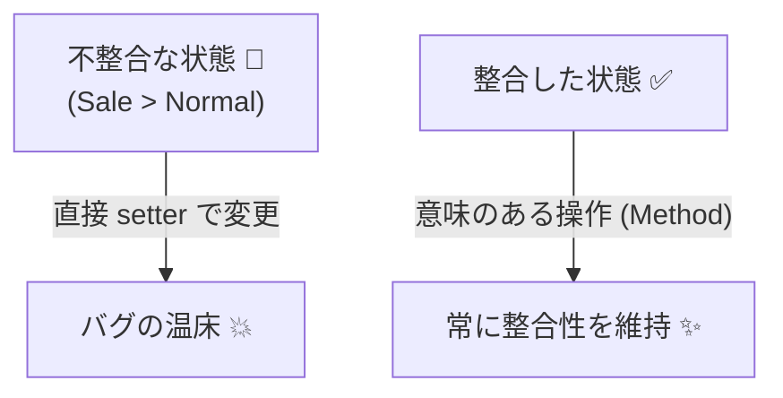
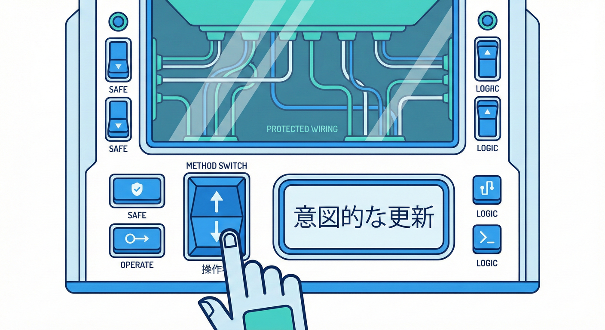
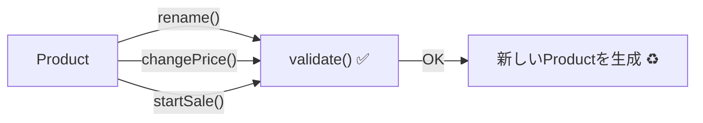

# 第14章　更新で不変条件を守る：setter地獄を避ける🔁🚫🧱

## この章のゴール🎯✨

* 「setterを増やせば増やすほどバグりやすい理由」が説明できる🙂💡
* 更新は「意味のある操作（メソッド）」にまとめて、不変条件（Invariant）を守れるようになる🧰🔒
* “どこで壊れた？”を卒業して、変更に強いモデルを書けるようになる🏋️‍♀️✨

---

## 1. setter地獄ってなに？😵‍💫💥


setter地獄は、ざっくり言うとこう👇

* プロパティを自由に書き換えられる（どこからでも更新できる）🔓
* 更新が「小さく分散」する（Aだけ変えた、Bだけ変えた…）🔁
* その結果、「一時的に不正な状態」が生まれやすい🚨
* そしてバグが出たときに「犯人の行」が特定しづらい🕵️‍♀️💦

たとえば「セール価格は通常価格以下」というルールがあるのに、
通常価格だけ先に下げたり、セール価格だけ先に上げたり…ができちゃうと危ない⚠️😱



---

## 2. 解決策はシンプル：「更新は操作として名付ける」🏗️✅



「どこでも書き換えていいよ」をやめて、**意味のある窓口（メソッド）**だけを開放するのが正攻法だよ🙂✨

* 「プロパティを変える」じゃなくて
  **「意味のある更新操作をする」** にする🧾➡️✅

例：

* 価格を変える → 「changePrice」
* セールを開始する → 「startSale」
* セールを終了する → 「endSale」
* 名前を変える → 「rename」

こうすると毎回そのメソッド内で不変条件をチェックできる🔒✨
さらに、メソッド名が仕様書みたいになって読みやすい📘💕

---

## 3. まず覚える3つの型（この章の型）🧩✨

### A) 値オブジェクトは「作れた＝正しい」＋「更新は作り直す」♻️💎

値オブジェクト（例：金額、メールアドレス）は、基本は不変（immutable）にしやすい✨
更新したいなら「新しい正しい値を作る」💡

### B) エンティティは「public setter禁止」＋「更新メソッドで守る」🚫🔁

エンティティ（例：商品、ユーザー）は変化するけど、
変化の入口を「メソッド」に集めてルールを壊さない🧱

### C) まとめて更新（関係のある値は一緒に）📦🔗

「この2つはセットで整合する」みたいなものは、
別々に変えないで、**一回の操作で更新**する💪✨

---

## 4. 実例：商品（Product）と金額（Money）でやってみよう💴🛍️

### 4.1 小さな契約ヘルパ（章内限定の簡易版）🧰✨

* 条件がダメならすぐ止める🛑
* ここでは契約違反＝例外でOK（詳しい設計は後の章でやるよ）🙂

```ts
export function ensure(condition: unknown, message: string): asserts condition {
  if (!condition) {
    throw new Error(message);
  }
}
```

---

### 4.2 値オブジェクト：Money（0以上の整数円だけ許す）💴🧱

```ts
import { ensure } from "./ensure";

export class Money {
  public readonly yen: number;

  private constructor(yen: number) {
    this.yen = yen;
    Object.freeze(this); // うっかり変更を防ぐ（任意）
  }

  public static create(yen: number): Money {
    ensure(Number.isInteger(yen), "金額は整数（円）で入れてね💴");
    ensure(yen >= 0, "金額は0以上だよ🧱");
    return new Money(yen);
  }

  public add(other: Money): Money {
    return Money.create(this.yen + other.yen);
  }

  public isLessThanOrEqual(other: Money): boolean {
    return this.yen <= other.yen;
  }
}
```

ここで大事なのは👇
**Moneyは作り方（create）を通さないと作れない** → だから不正なMoneyが存在しない✨🔒

---

### 4.3 エンティティ：Product（価格とセール価格の整合を守る）🛍️🔒

ルール（不変条件っぽいもの）を入れるよ👇

* 名前は空にしない📝🚫
* 通常価格は必ずある💴✅
* セール価格があるなら「通常価格以下」🎯

```ts
import { ensure } from "./ensure";
import { Money } from "./money";

type ProductProps = {
  id: string;
  name: string;
  price: Money;
  salePrice?: Money;
};

export class Product {
  public readonly id: string;
  public readonly name: string;
  public readonly price: Money;
  public readonly salePrice?: Money;

  private constructor(props: ProductProps) {
    this.id = props.id;
    this.name = props.name;
    this.price = props.price;
    this.salePrice = props.salePrice;
    Object.freeze(this);
  }

  public static create(props: ProductProps): Product {
    Product.validate(props);
    return new Product(props);
  }

  private static validate(props: ProductProps): void {
    ensure(props.id.length > 0, "idが空だよ🆔");
    ensure(props.name.trim().length > 0, "名前は空にできないよ📝");
    // price は Money 型なので、ここに来た時点で 0以上 が守られてる想定✨

    if (props.salePrice) {
      ensure(
        props.salePrice.isLessThanOrEqual(props.price),
        "セール価格は通常価格以下にしてね🏷️⬇️"
      );
    }
  }

  // ✅ setterの代わり：意味のある更新操作たち
  public rename(newName: string): Product {
    const next: ProductProps = { ...this, name: newName };
    Product.validate(next);
    return new Product(next);
  }

  public changePrice(newPrice: Money): Product {
    // 価格を変えると、既存のセール価格がルール違反になることがある
    const next: ProductProps = { ...this, price: newPrice };

    // ここで「セール価格は維持する」設計にしている（違反なら止める）
    Product.validate(next);
    return new Product(next);
  }

  public startSale(newSalePrice: Money): Product {
    const next: ProductProps = { ...this, salePrice: newSalePrice };
    Product.validate(next);
    return new Product(next);
  }

  public endSale(): Product {
    const next: ProductProps = { ...this, salePrice: undefined };
    Product.validate(next);
    return new Product(next);
  }
}
```

ポイント💡✨

* 更新するたびに validate を通る → **更新しても壊れない**🔒
* setterがない → **どこからでも好き勝手に壊せない**🚫
* メソッド名が仕様 → **読むだけで意図が伝わる**📘💕



---

## 5. “まとめて更新”が必要なケース（2つの値がペア）🔗📦

たとえば「開始日と終了日」はセットだよね📅✨
別々に setter で変えると、一瞬だけ「終了日が開始日より前」が起きる😱

だから「期間を変更する」という操作にまとめる💪

```ts
import { ensure } from "./ensure";

export class MembershipPeriod {
  public readonly start: Date;
  public readonly end: Date;

  private constructor(start: Date, end: Date) {
    this.start = start;
    this.end = end;
    Object.freeze(this);
  }

  public static create(start: Date, end: Date): MembershipPeriod {
    ensure(end.getTime() >= start.getTime(), "終了日は開始日より後だよ📅");
    return new MembershipPeriod(start, end);
  }

  public changePeriod(start: Date, end: Date): MembershipPeriod {
    // ✅ 一括で更新してから検証する
    return MembershipPeriod.create(start, end);
  }

  public extendDays(days: number): MembershipPeriod {
    ensure(Number.isInteger(days) && days > 0, "延長日数は1以上の整数だよ➕");
    const nextEnd = new Date(this.end.getTime());
    nextEnd.setDate(nextEnd.getDate() + days);
    return MembershipPeriod.create(this.start, nextEnd);
  }
}
```

---

## 6. ちょい実務ポイント：更新方針を先に決める⚖️🙂

「価格を下げたらセール価格が違反になった！」みたいなとき、設計は2択になりがち👇

* **A案：違反なら止める**（例外で止めて修正させる）🛑
* **B案：自動で調整する**（セールを解除する、セール価格も下げる等）🧹

どっちが正しいかは仕様次第だけど、DbC的に大事なのは👇
**どちらにするにせよ、更新メソッド内で責任を持って決める**こと✨🔒

---

## 7. ミニテスト：更新しても壊れないのを確認🧪✨（Vitest）

「セール価格が通常価格より高い」は許されない、をテストするよ💥

```ts
import { describe, it, expect } from "vitest";
import { Money } from "./money";
import { Product } from "./product";

describe("Product contracts", () => {
  it("セール価格は通常価格以下", () => {
    const p = Product.create({
      id: "p-1",
      name: "りんごジュース",
      price: Money.create(200),
      salePrice: Money.create(150),
    });

    expect(() => p.startSale(Money.create(999))).toThrow();
  });

  it("価格変更でセール価格が違反なら止まる", () => {
    const p = Product.create({
      id: "p-2",
      name: "いちご",
      price: Money.create(500),
      salePrice: Money.create(400),
    });

    // 新価格が 300 になると salePrice=400 が違反になるので止まる
    expect(() => p.changePrice(Money.create(300))).toThrow();
  });
});
```

---

## 8. VS Codeで動かす手順👣💻

1. フォルダ作成 → VS Codeで開く📁✨
2. ターミナルで初期化（例）

```bash
npm init -y
npm i -D typescript vitest @types/node
```

3. TypeScript設定（例）

```bash
npx tsc --init
```

4. package.json にテストコマンドを追加して実行🧪

```bash
npm test
```

---

## 9. 演習🧪✍️（やさしめ→実務っぽい）

### 演習1（やさしめ）🙂🍓

Product に「changeNameAndPrice（名前と価格を同時に更新）」を追加して、validate が必ず通るようにしてね✨

* ヒント：更新は一回の next を作って validate する💡

### 演習2（ふつう）😺📦

Cart（カート）を作ってみよう

* ルール：数量は1以上🧺
* ルール：同じ商品は重複登録しない（入ってたら数量だけ増やす）🧠
* setter禁止で、addItem / changeQuantity / removeItem を作る✨

### 演習3（実務っぽい）💳🧱

Subscription（定期購読）を作ってみよう

* 状態：Active / Canceled
* ルール：Canceled のものをもう一度 cancel できない🚫
* メソッド：cancel / reactivate（仕様に合わせて）
* 不変条件：状態遷移を壊さない（変な順で呼ばれたら止める）🔒

---

## 10. よくある失敗あるある😱（回避ワザ付き✨）

* 「一部だけ更新」して整合が壊れる → ✅ 関係する値は一括更新📦
* validate を呼び忘れる → ✅ コンストラクタを隠して create / 更新メソッド経由にする🏭
* エラーメッセージが雑で直し方が分からない → ✅ “どう直すか”が分かる文にする🧭
* 値オブジェクトを mutable にしてしまう → ✅ freeze か、更新は作り直し♻️

---

## 11. AI支援（Copilot/Codex等）に頼むと速いところ🤖⚡

そのままコピペで投げやすい指示例だよ✨

* 「Product の不変条件を箇条書きで提案して。salePrice と price の関係も含めて」🧠
* 「setterを使わずに、rename / changePrice / startSale / endSale を持つクラス設計にして」🧱
* 「Vitestで、契約違反が必ず例外になるテストケースを境界値込みで作って」🧪
* 「validate の責務を増やしすぎないための分割案（小さな検証関数）を提案して」🧰

注意ポイントは1つだけ👇
AIが出した“ルール”は、最後は人間が仕様として責任持って決める⚖️🙂

---

## 章末チェックリスト✅✨

* setterを増やすほど壊れやすい理由を説明できる🗣️
* 更新は「意味のある操作メソッド」にまとめられる🧠
* 更新のたびに validate（不変条件チェック）が必ず走る設計にできる🔒
* 関係する値は一括更新にできる📦
* 「壊れたら止める」テストを書ける🧪

---

## 参考（本日時点の最新情報メモ）📌✨

* TypeScript 5.9 の公式アナウンス（5.9系のリリース情報） ([Microsoft for Developers][1])
* TypeScript リリース一覧（5.9.3 などパッチ情報） ([GitHub][2])
* VS Code 1.108（December 2025）リリースノート（リリース日 2026-01-08） ([Visual Studio Code][3])
* Node.js 24 系が Active LTS、24.13.0（LTS）のリリース情報 ([Node.js][4])
* Vitest 4 系の移行ガイド（4.0移行の注意点） ([vitest.dev][5])

[1]: https://devblogs.microsoft.com/typescript/announcing-typescript-5-9/?utm_source=chatgpt.com "Announcing TypeScript 5.9"
[2]: https://github.com/microsoft/typescript/releases?utm_source=chatgpt.com "Releases · microsoft/TypeScript"
[3]: https://code.visualstudio.com/updates?utm_source=chatgpt.com "December 2025 (version 1.108)"
[4]: https://nodejs.org/en/about/previous-releases?utm_source=chatgpt.com "Node.js Releases"
[5]: https://vitest.dev/guide/migration.html?utm_source=chatgpt.com "Migration Guide"

