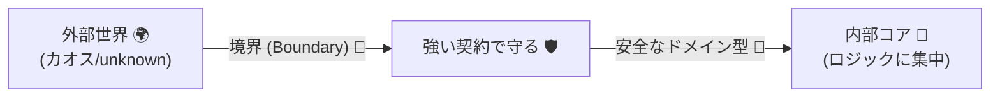
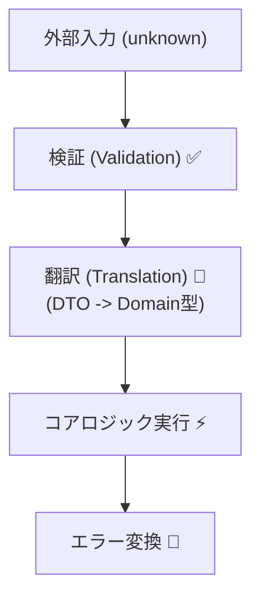

# 第15章　契約はどこに置く？境界（Boundary）設計が9割🚧🧭

## この章でできるようになること🎯✨

* 「どこに契約（チェック）を書くべきか」を迷わなくなる🧭
* **入口はガッチリ**、**中はスイスイ**の形にできる🚪➡️🏃‍♀️
* 「入力の検証」「変換（翻訳）」「エラー変換」を境界に集められる🧼
* チェック地獄（コピペ・散在・二重チェック）から抜け出せる🏃‍♀️💨

---

## まず結論：契約は“境界”に置くのが基本😺✅

DbCのコツは、ざっくり言うとこれ👇

* **境界（外から入ってくる場所）**：契約は**強く・丁寧に・分かりやすく**💪🧾
* **内部（自分のコードの中心）**：契約は**軽く**（前提を信頼してロジックに集中）🧠✨

「外の世界」は何が来るか分からない🌪️
フォーム、JSON、URL、ファイル、環境変数、他サービスのレスポンス…ぜんぶ “荒野” です🏜️😵

だから **荒野との境目（Boundary）** で止めるのが9割なんだよ〜🚧🛑



---

## 境界（Boundary）ってなに？🧭🚧


プログラムには、「外の世界」と「中の世界（中心ロジック）」の継ぎ目があります。これが **境界** です🏰

**境界＝“信頼できないもの”が“信頼できる世界”に入る関所**です🚧🛂

たとえばこんな場所👇

* HTTPの受け口（APIエンドポイント）🌐
* フォーム入力／UIイベント🖱️
* CLI引数（コマンドライン）⌨️
* Webhook / メッセージキュー受信📨
* DBや外部APIから取ってきたデータを“自分の型”にする瞬間🗃️➡️🧱

---

## “入口は厳しく、中はスムーズ”の理由🚪➡️✨

### 1) バグの原因が入口で止まる🛑🔦

中で落ちると「どこで壊れた？」が地獄😵‍💫
入口で落ちると「入力が悪い」と一発で分かる💡

### 2) 内部コードが読みやすくなる📖✨

中で毎回 `if (!x) throw...` してるとロジックが見えない🙈
入口で保証できれば、中は **本来の計算・業務ロジック**だけ書ける🧠💕

### 3) 二重チェックが減って速くなる⚡

“どこでもチェック”は安全そうに見えて、実は…

* コピペ増える📄📄📄
* ルール変更が地獄（直し漏れ）💥
* 重い検証が何度も走る🐢

---

## DbC三点セットは「置き場所」が違うよ📌🧩

ここ超大事！🧠💡

### ✅ 事前条件（Precondition）＝境界に置く🚪✅

* 「この入力で呼んでいいよ」が成立するか
* 例：必須、範囲、形式、文字数、null/空、配列の要素数など

### ✅ 不変条件（Invariant）＝“中心の型（ドメイン）”に閉じ込める🧱🔒

* 「どの時点でも壊れない状態」
* 例：Moneyは0以上、Emailは形式OK、UserIdは空文字禁止、など
* これを型/生成関数に集めると最強💪✨

### ✅ 事後条件（Postcondition）＝境界 or アプリサービス境界🎁✅

* 「成功したなら必ずこうなってる」
* 例：ポイント付与したら増えてる、並び順が保証されてる、など

---

## アンチパターン集😇➡️😱

### ❌ アンチ1：チェックがあちこちに散る🌪️

* A関数でもチェック
* B関数でもチェック
* C関数でもチェック
  → いつの間にか **ルールがズレる**💥

### ❌ アンチ2：内部で“外部入力”をそのまま使う🌋

`any` や “よく分からないオブジェクト” が中まで入ると、
どこでも壊れる地雷原になる💣💣💣

### ❌ アンチ3：境界の仕事が太る（変換とロジックが混ざる）🍔

境界がデカいとテストしづらい＆読めない📚💦
境界は **薄く**、中心は **強く** が基本だよ✨

---

## 王道パターン：Thin Adapter（薄いアダプタ） + Rich Core（濃い中心）🧼🧠


イメージはこれ👇

```text
外の世界🌍
  ↓ (unknown / JSON / string)
境界🚧  = 検証✅ + 変換🔁 + エラー変換🧾
  ↓ (ドメイン型🧱)
アプリサービス🧠  = ユースケース
  ↓
ドメイン🧱  = 不変条件の中心
```

境界は「受付」みたいな感じ😊🏢

* 受け取る
* ルールを確認する
* 中で使える形に整える
* 失敗を分かりやすく返す



---

## 実例：ポイント付与APIで「境界に契約を置く」🎫⬆️🌐

### 0) まず “外から来る入力” は `unknown` で受けるのが安心🛡️

外のJSONは、型が効かない世界🌍
だから境界はこうスタート👇

```ts
// 外部から来るものは信用しない：unknown で受ける🧊
export async function grantPointsEndpoint(rawBody: unknown) {
  // ① 検証 + ② 変換（翻訳）
  const req = parseGrantPointsRequest(rawBody);

  // ③ 中心ロジックへ（ここは「前提を信頼」してスムーズ）
  const result = await grantPoints(req.userId, req.points);

  // ④ 外に返す形に整える
  return { status: 200, body: result };
}
```

---

## 1) “中心の型”を用意する（不変条件の住処）🧱🔒

ポイントやIDって、ただの `number` / `string` じゃ壊れやすい😵
なので **作る時点で保証**しよう✨

```ts
type Brand<K, T> = K & { readonly __brand: T };

export type UserId = Brand<string, "UserId">;
export type Points = Brand<number, "Points">;

export class ContractViolationError extends Error {
  constructor(message: string) {
    super(message);
    this.name = "ContractViolationError";
  }
}

export function toUserId(value: string): UserId {
  if (value.trim().length === 0) throw new ContractViolationError("userId は空にできません🆔🚫");
  return value as UserId;
}

export function toPoints(value: number): Points {
  if (!Number.isInteger(value)) throw new ContractViolationError("points は整数にしてね🔢✨");
  if (value <= 0) throw new ContractViolationError("points は 1 以上にしてね🎫⬆️");
  return value as Points;
}
```

ポイント💡

* **不変条件（Invariant）** は “ドメイン型を作る場所” に集約🧱
* 一度 `Points` が作れたら、中では「Pointsは正しい」が信頼できる✅✨

---

## 2) 境界で検証して “翻訳” する（DTO → ドメイン型）🗣️🔁

外の入力（DTOっぽいやつ）は、いったん “ただのデータ” として扱うよ📦

```ts
type GrantPointsRequest = {
  userId: UserId;
  points: Points;
};

// rawBody(unknown) を「安全なドメイン型」に翻訳する🚧
export function parseGrantPointsRequest(rawBody: unknown): GrantPointsRequest {
  if (typeof rawBody !== "object" || rawBody === null) {
    throw new ContractViolationError("body はオブジェクトで送ってね📦");
  }

  const body = rawBody as Record<string, unknown>;

  const userIdRaw = body["userId"];
  const pointsRaw = body["points"];

  if (typeof userIdRaw !== "string") {
    throw new ContractViolationError("userId は文字列で送ってね🆔");
  }
  if (typeof pointsRaw !== "number") {
    throw new ContractViolationError("points は数値で送ってね🔢");
  }

  return {
    userId: toUserId(userIdRaw),
    points: toPoints(pointsRaw),
  };
}
```

ここが第15章のキモ😺💥

* 検証✅
* 変換（翻訳）🔁
* “中で使える状態” を作ってから渡す🧱✨

---

## 3) 中心ロジックは「前提を信頼して」薄く書ける🧠✨

```ts
type GrantPointsResult = { userId: UserId; newTotal: number };

export async function grantPoints(userId: UserId, points: Points): Promise<GrantPointsResult> {
  // ここは userId/points が正しい前提で進めてOK👍✨
  const current = await loadCurrentPoints(userId);
  const newTotal = current + (points as unknown as number);

  // 例：事後条件（Post）っぽい “結果の保証” を入れるならここ🎁✅
  if (newTotal < 0) throw new Error("ありえない！合計が負になった💥（バグ）");

  await savePoints(userId, newTotal);
  return { userId, newTotal };
}

async function loadCurrentPoints(_userId: UserId): Promise<number> {
  return 100; // 仮
}

async function savePoints(_userId: UserId, _points: number): Promise<void> {
  // 仮
}
```

※ここでは説明のために雑にキャストしてる部分があるけど、実務では `Points` から `number` を取り出す関数（例：`pointsValue(points)`）を用意してキレイにやろうね🧼✨

---

## 境界で“エラー変換”すると世界が平和になる🧾🕊️

境界のもう1つの大事な役目👇
**内部のエラーを、そのまま外に漏らさない**🙅‍♀️

最低限これだけでも効果あるよ✨

```ts
export async function safeGrantPointsEndpoint(rawBody: unknown) {
  try {
    const req = parseGrantPointsRequest(rawBody);
    const result = await grantPoints(req.userId, req.points);
    return { status: 200, body: result };
  } catch (e) {
    if (e instanceof ContractViolationError) {
      return { status: 400, body: { message: e.message } }; // 入力ミス
    }
    return { status: 500, body: { message: "サーバー側で問題が起きたよ💦" } }; // 内部事故
  }
}
```

---

## どこまでを“境界”にする？迷ったらこの線引き🧵✂️

### ✅ 境界に置く（強く）💪

* 外部入力の検証（型・形式・範囲・必須）✅
* DTO → ドメイン型への翻訳（単位、命名、欠損の吸収）🔁
* エラー変換（ユーザー向け/ログ向けを分ける）🧾
* 認可・認証の入口チェック（※設計次第）🔐

### ✅ 中に置く（中心に閉じ込める）🧱

* 不変条件（“壊れない型”のルール）🔒
* 業務ロジック（計算、状態遷移、ユースケース）🧠
* 事後条件（成功したときの整合性保証）🎁✅

---

## VS Codeでやるミニ演習🧪💻✨

### 演習1：境界を“3つの関数”に分けよう✂️🧩

次の3つを分離して作ってみてね👇

1. `validate`（検証）✅
2. `translate`（翻訳）🔁
3. `handle`（中心ロジックを呼ぶ）🧠

目標：`handle()` の中に **ifチェックがほぼ無い** 状態にする😺✨

---

### 演習2：“どこまで厳しくする？”を決めるクイズ🎲🧠

次の入力、境界で弾く？中で弾く？どっち？😆
（答えは下にあるよ👇）

1. `userId: ""`（空文字）
2. `points: 1.5`（小数）
3. `points: 0`
4. `userId: "abc"` だけど、存在しないユーザーだった
5. DBが落ちてて `loadCurrentPoints` が失敗した

**答え💡**

1. 境界（形式/必須の問題）🚪✅
2. 境界（型はnumberでも値がNG）🚪✅
3. 境界（ルールとして弾く）🚪✅
4. これは仕様の失敗（ドメイン/ユースケース側）🧠📉
5. インフラの失敗（境界で500などに変換）🌩️🧾

---

## AI（Copilot/Codex）に頼るときのコツ🤖✨

境界設計はAIが得意！でも「何を境界で保証するか」は人間の仕事⚖️😺

### コピペ用プロンプト例📝

* 「このJSON入力を境界で検証して、ドメイン型に翻訳する関数に分けて」🔁
* 「この関数の“入口チェック”を読みやすい順に並べて、エラーメッセージも改善して」🧾✨
* 「内部例外を外部レスポンスに変換する方針（400/404/500）を提案して」🚦

---

## 2026メモ：境界まわりの“道具”はこう動いてるよ🧰📌

* Node.js は **v24系がActive LTS**として運用されているよ（2026年1月時点）🟢 ([Node.js][1])
* VS Code は **v1.108** のリリースノートが公開されていて、月次で更新されるよ📅 ([Visual Studio Code][2])
* Zod は v4系が進んでいて、npmの “latest” も更新されてるよ🧱✅ ([Zod][3])
* TypeScript 7 “native preview”（コンパイラ等のネイティブ移行）も進捗が出てるよ⚡ ([Microsoft Developer][4])

---

## 章末チェックリスト✅✨

* [ ] 外部入力は `unknown` で受けて、境界で検証している🧊✅
* [ ] 境界で “DTO → ドメイン型” の翻訳をしている🔁🧱
* [ ] 不変条件は “型を作る場所” に集めている🔒
* [ ] 中心ロジックに同じチェックが散らばっていない🧼
* [ ] 内部の例外を境界でエラー変換している🧾🚦

---

## まとめ🧠✨

* DbCは「何をチェックするか」だけじゃなくて、**どこに置くか**が超重要📌
* **境界で強く守る**→ **中心はスムーズに書ける**🚪➡️✨
* 境界は「検証✅」「翻訳🔁」「エラー変換🧾」の3点セットが気持ちいい😺💕

次章では、この境界をさらにスッキリさせる「薄いアダプタと中心ロジック（SoC）」を深掘りするよ🧼🧠🚀

[1]: https://nodejs.org/en/about/previous-releases?utm_source=chatgpt.com "Node.js Releases"
[2]: https://code.visualstudio.com/updates?utm_source=chatgpt.com "December 2025 (version 1.108)"
[3]: https://zod.dev/v4?utm_source=chatgpt.com "Release notes"
[4]: https://developer.microsoft.com/blog/typescript-7-native-preview-in-visual-studio-2026?utm_source=chatgpt.com "TypeScript 7 native preview in Visual Studio 2026"

