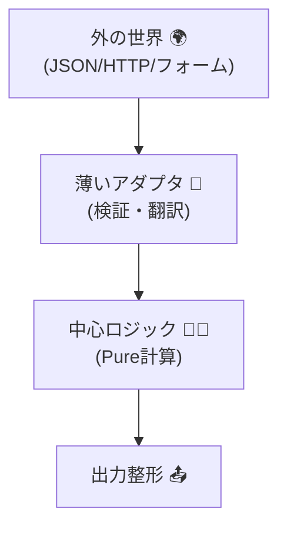
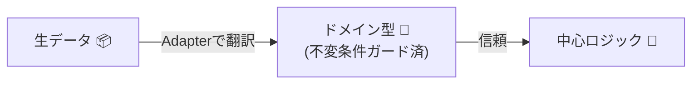

# 第16章　薄いアダプタと中心ロジック：SoCで契約がスッキリ🧼🧠

## この章でできるようになること🎯✨

* 「外から来る値（文字列・JSON）」を **入口でチェック＆変換** して、中心ロジックを守れるようになる💪🚪
* 中心ロジックを **なるべく純粋（Pure）** にして、テストが爆速＆読みやすくなる🧪⚡
* DbC（契約）を「どこに置くか」が整理できて、コードが散らからなくなる🧩🧹

---

## 1) まず結論：契約は“入口”に寄せると幸せ😊🚧

外部から来る入力（API/フォーム/ファイル/CLI）は、だいたいこんな感じで危ない💣😵‍💫

* 数値のつもりが `"12"`（文字列）
* 空文字 `""` が混ざる
* `discountRate` が `1.2` で来る（120%引き…！？）
* 配列の要素が足りない／余計なのが入る

だから、**入口（薄いアダプタ）で“翻訳”してから**、中心ロジックに渡すのが強いよ📘🔁

* ✅ アダプタ：外界の“生データ” → きれいな“ドメイン型”へ変換
* ✅ 中心：ドメイン型を信じて、計算やルールに集中
* ✅ 契約：入口で厚く、中心はスッキリ✨

---

## 2) 今どきの道具（この章で使う想定）🧰🤖

* TypeScript は 5.9 系が公開されているよ📌 ([GitHub][1])
* Node は v24 が Active LTS（安定運用向き）で、v25 が Current（先端）だよ📌 ([Node.js][2])
* Zod は v4 系が現役で、npm 上でも v4 系が “Latest” になってるよ📌 ([npm][3])
* VS Code も 2026年1月時点で 1.108 系のリリースが出てるよ📌 ([Visual Studio Code][4])

この章は「バージョン依存の小技」じゃなくて、**分離の考え方（SoC）** がメインだよ🧠✨
（でも道具が新しいほど、体験はラクになる👍💖）

---

## 3) 例題：注文合計を計算する（入力は“外の世界”）🛒🧾

### 要件（ざっくり）📌

* 入力は JSON（外部から来る）
* `price` は 0以上、`quantity` は 1以上
* `discountRate` は 0〜0.5（最大50%引き）
* 合計は `subtotal - discount + tax`（税は 10% とする）

---

## 4) “薄いアダプタ” と “中心ロジック” の役割分担🧩🔀

### 4-1. こう分ける（図）🗺️✨

* **Adapter（境界）**：入力の検証、変換、エラー整形
* **Core（中心）**：計算とルール（できれば副作用なし）

```txt
外の世界(JSON/HTTP/フォーム)
        │
        ▼
薄いアダプタ（Zodで検証🧱 + ドメイン型へ翻訳🔁）
        │
        ▼
中心ロジック（Pure計算🧠✨）
        │
        ▼
外に返す形に整える（DTO化📦）
```



---

## 5) 実装：アダプタ（入口）で“翻訳”してから中心へ🧱🔁

### 5-1. ドメイン型（中心が信じていい形）🧱💎


ここではシンプルに「型 + 生成関数」で不変条件を固めるよ✅
（第12〜14章の“不変条件”のノリだね🧱✨）

```ts
// domain/types.ts
export type Money = { readonly yen: number };
export type Quantity = { readonly value: number };
export type DiscountRate = { readonly value: number }; // 0.0〜0.5

export function money(yen: number): Money {
  if (!Number.isFinite(yen)) throw new Error("Money: yen must be finite");
  if (yen < 0) throw new Error("Money: yen must be >= 0");
  if (!Number.isInteger(yen)) throw new Error("Money: yen must be integer (yen)");
  return { yen };
}

export function quantity(value: number): Quantity {
  if (!Number.isFinite(value)) throw new Error("Quantity: value must be finite");
  if (!Number.isInteger(value)) throw new Error("Quantity: value must be integer");
  if (value < 1) throw new Error("Quantity: value must be >= 1");
  return { value };
}

export function discountRate(value: number): DiscountRate {
  if (!Number.isFinite(value)) throw new Error("DiscountRate: value must be finite");
  if (value < 0 || value > 0.5) throw new Error("DiscountRate: value must be between 0 and 0.5");
  return { value };
}
```

ここがポイント💡😊

* 中心ロジック側は **Money / Quantity / DiscountRate を受け取れた時点で安心** できる✨
* だから中心で「また null チェック…また範囲チェック…」が減る🧹💖



---

### 5-2. 中心ロジック（計算だけに集中）🧠🧮

```ts
// domain/calcTotal.ts
import { Money, Quantity, DiscountRate, money } from "./types";

export type CalcInput = {
  readonly price: Money;
  readonly quantity: Quantity;
  readonly discountRate: DiscountRate;
};

export type CalcOutput = {
  readonly subtotal: Money;
  readonly discount: Money;
  readonly tax: Money;
  readonly total: Money;
};

export function calcTotal(input: CalcInput): CalcOutput {
  const subtotalYen = input.price.yen * input.quantity.value;

  const discountYen = Math.floor(subtotalYen * input.discountRate.value);
  const taxedBaseYen = subtotalYen - discountYen;

  const taxYen = Math.floor(taxedBaseYen * 0.1);
  const totalYen = taxedBaseYen + taxYen;

  // 事後条件っぽい最小チェック（“壊れてない？”の保険）🧯✨
  if (totalYen < 0) throw new Error("Postcondition violated: total must be >= 0");

  return {
    subtotal: money(subtotalYen),
    discount: money(discountYen),
    tax: money(taxYen),
    total: money(totalYen),
  };
}
```

中心ロジックがスッキリしてる理由🎀

* 入力がもうドメイン型なので、**入口のゴミ掃除が不要**🧼✨
* 計算式が“そのまま読める”📖😍

---

### 5-3. 薄いアダプタ（Zodで入口を固める）🚪🧱

外部入力はまず Zod で止めるよ🛑
（ここが「契約の前線基地」🏰✨）

```ts
// adapter/handleCalc.ts
import { z } from "zod";
import { calcTotal } from "../domain/calcTotal";
import { money, quantity, discountRate } from "../domain/types";

// 外の世界の入力（DTO）を定義🧾
const CalcRequestSchema = z.object({
  priceYen: z.number().int().min(0),
  quantity: z.number().int().min(1),
  discountRate: z.number().min(0).max(0.5),
});

// 外へ返す形（DTO）📦
type CalcResponseDto =
  | { ok: true; subtotalYen: number; discountYen: number; taxYen: number; totalYen: number }
  | { ok: false; message: string; issues?: unknown };

export function handleCalc(raw: unknown): CalcResponseDto {
  const parsed = CalcRequestSchema.safeParse(raw);

  // 入口の契約違反はここで止める🛑🚪
  if (!parsed.success) {
    return {
      ok: false,
      message: "入力が正しくないよ🥲（priceYen/quantity/discountRate を見直してね）",
      issues: parsed.error.issues,
    };
  }

  // “翻訳”して中心へ渡す🔁✨
  const input = {
    price: money(parsed.data.priceYen),
    quantity: quantity(parsed.data.quantity),
    discountRate: discountRate(parsed.data.discountRate),
  };

  const out = calcTotal(input);

  return {
    ok: true,
    subtotalYen: out.subtotal.yen,
    discountYen: out.discount.yen,
    taxYen: out.tax.yen,
    totalYen: out.total.yen,
  };
}
```

ここが **SoCでスッキリ** なところ🎉

* Zod：外部の“形”を守る（DTOの契約）🧱
* ドメイン型：中心の“不変条件”を守る🧱
* calcTotal：計算に集中🧠

---

## 6) テストが一気にラクになる理由🧪💖

### 6-1. 中心ロジックは “Pure” だから速い⚡

HTTPもDBも要らない！
計算だけを秒速で回せる💨✨

```ts
// domain/calcTotal.test.ts
import { describe, it, expect } from "vitest";
import { calcTotal } from "./calcTotal";
import { money, quantity, discountRate } from "./types";

describe("calcTotal", () => {
  it("10%税、20%引きで合計が計算できる🧮", () => {
    const out = calcTotal({
      price: money(1000),
      quantity: quantity(2),
      discountRate: discountRate(0.2),
    });

    // subtotal=2000, discount=400, base=1600, tax=160, total=1760
    expect(out.total.yen).toBe(1760);
  });
});
```

### 6-2. アダプタ側は “入口のバリデーション” を確認するだけ🚪✅

```ts
// adapter/handleCalc.test.ts
import { describe, it, expect } from "vitest";
import { handleCalc } from "./handleCalc";

describe("handleCalc", () => {
  it("入力が変なら ok=false で返す🥲", () => {
    const res = handleCalc({ priceYen: -1, quantity: 0, discountRate: 0.7 });
    expect(res.ok).toBe(false);
  });

  it("入力が正しければ ok=true で返す🙂", () => {
    const res = handleCalc({ priceYen: 1000, quantity: 2, discountRate: 0.2 });
    expect(res.ok).toBe(true);
    if (res.ok) expect(res.totalYen).toBe(1760);
  });
});
```

---

## 7) よくある“分け方ミス”と直し方🧯😵‍💫

### ミス1：中心で raw JSON を受け取ってしまう💥

* ❌ `calcTotal(raw: any)` みたいにしちゃう
* ✅ 中心は **ドメイン型だけ** を受け取る（信頼できる入力だけ）🧱✨

### ミス2：アダプタが太って“全部やる人”になる🐘

* ❌ アダプタに計算ロジックまで詰め込む
* ✅ アダプタは「検証・変換・整形」だけにする🧼

### ミス3：チェックが二重三重でウザい🌀

* ❌ Zodでもチェック、中心でも同じチェック
* ✅ 役割を分ける

  * Zod：外部入力の形・範囲（DTO契約）
  * ドメイン型：不変条件
  * 中心：計算と最小の事後条件保険（壊れてない？）

---

## 8) 演習：パース担当と計算担当を分離する🧩✍️

### 演習A（基本）🌱

次の“ごちゃ混ぜ関数”を、**Adapter / Domain** に分けてね😊✨

* 入力：`{ unitPriceYen, count, couponCode }`
* ルール：

  * `couponCode` が `"OFF10"` なら 10%引き
  * `"OFF20"` なら 20%引き
  * それ以外は割引なし

やること✅

1. Zodで `couponCode` を文字列で受ける（空はNGでもOK）
2. ドメイン側は `DiscountRate` に変換されたものだけ受ける
3. 中心計算は if を減らして読みやすくする

---

### 演習B（発展）🌸

* 税率を固定 10% から `taxRate` 入力にしてみる（0〜0.2）📏
* でも中心には `TaxRate` 型を渡す（raw number禁止）🚫

---

### 演習C（おまけ）🎀

* エラー文言を「ユーザー向け」と「ログ向け」で分けてみる🧾📊

  * ユーザー：やさしい
  * ログ：原因が分かる（フィールド名・期待範囲）

---

## 9) AI活用（この章と相性いい！）🤖💞

AIにはこう頼むと気持ちよく進むよ✨

* 「Zodスキーマを要件どおりに作って」🧱
* 「DTO → ドメイン型への変換関数を作って（境界で翻訳したい）」🔁
* 「中心ロジックを pure function にして、Vitest のテストも作って」🧪
* 「アダプタが太らないように、ファイル分割案も出して」📁

ただし最後はここだけ人間が握るのが大事だよ✋🙂

* ✅ 不変条件（何を許して何を拒否するか）
* ✅ “契約違反”と“仕様として起きる失敗”の線引き

---

## 章末チェックリスト✅📌

* [ ] 外部入力（raw）を中心ロジックに直接渡してない🚫
* [ ] アダプタは「検証・変換・整形」に集中できてる🧼
* [ ] 中心ロジックは Pure に近く、テストが速い🧪⚡
* [ ] 不変条件はドメイン型の生成で固めてる🧱
* [ ] 事後条件の“保険”が最小限入ってる🧯✨

[1]: https://github.com/microsoft/typescript/releases?utm_source=chatgpt.com "Releases · microsoft/TypeScript"
[2]: https://nodejs.org/en/about/previous-releases?utm_source=chatgpt.com "Node.js Releases"
[3]: https://www.npmjs.com/package/zod?utm_source=chatgpt.com "Zod"
[4]: https://code.visualstudio.com/updates?utm_source=chatgpt.com "December 2025 (version 1.108)"

