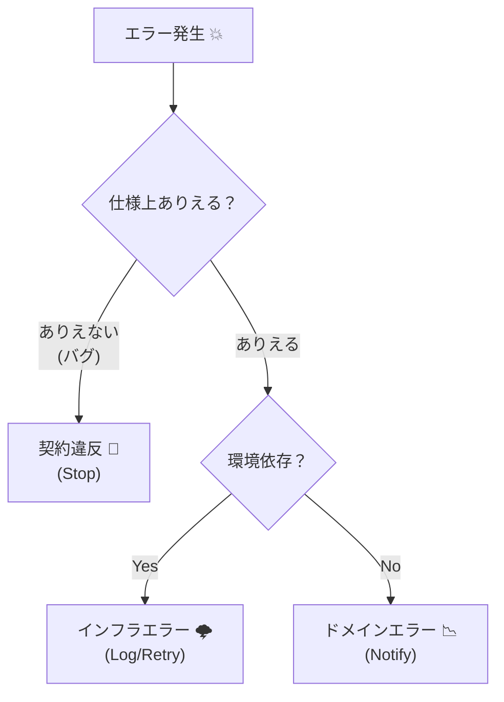
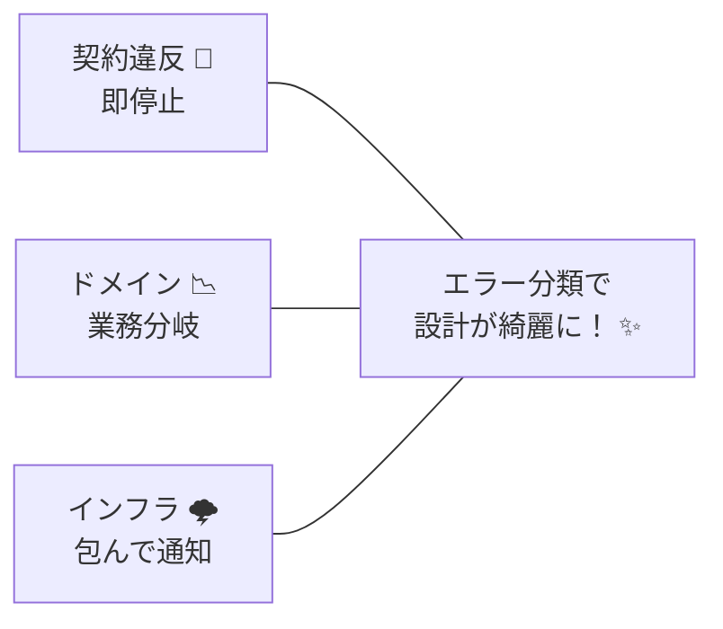

# 第17章　契約違反はどう扱う？まずはエラーの分類🧾🧠

## この章のゴール🎯✨

* 「起きたエラー」を **3種類に分けて** 考えられるようになる🙂🧠
* それぞれに合った「扱い方（止める/伝える/リトライなど）」の方向性が見えるようになる🧭✨
* TypeScriptで **カスタムエラー＋cause** を使って、原因を追いやすくできるようになる🔗🔍 ([MDN Web Docs][1])

---

## まず結論：エラーは3つに分けるのが超ラク🧺✨

### ① 契約違反（Contract Violation）🧨

* **「呼び出し側が約束を破った」**（＝プログラミングミス寄り）
* 例：`amount` が負の値、`userId` が空文字、`price` が NaN など😵‍💫
* 基本方針：**即ストップ**（throw して上に伝える / 直すべきはコード）🛑💥

### ② ドメインエラー（Domain Error）📉

* **「仕様として起きうる失敗」**（＝正しい入力でも起きる）
* 例：残高不足、在庫切れ、予約枠満席、重複登録不可など🧾
* 基本方針：**丁寧に扱う**（ユーザーに伝える/画面に出す/分岐する）🙂📣

### ③ インフラエラー（Infrastructure Error）🌩️

* **「外部要因で失敗」**（ネットワーク/DB/タイムアウト等）
* 例：DB接続失敗、API 500、DNS、通信切れなど📡💥
* 基本方針：**ログ＋リトライ検討＋エラー隠蔽/変換**（詳細は内側に）🧾🔁

---

## 3分類の見分け方（迷ったときの質問）❓🧠


### Q1. その入力、仕様上「ありえる」？🙂

* **ありえる** → ドメインエラー候補📉
* **ありえない** → 契約違反候補🧨

### Q2. 同じ入力で、環境が違うと成功したり失敗したりする？🌩️

* **する** → インフラエラー候補
* **しない** → 契約違反/ドメインエラー候補

### Q3. 直すべきは「コード」？「ユーザー操作」？「環境」？🛠️

* コード → 契約違反🧨
* ユーザー操作（選び直し等）→ ドメインエラー📉
* 環境（通信/DB等）→ インフラエラー🌩️



---

## 例で一気に理解：送金（transfer）💸✨

「送金する」って、失敗パターンが3種類ぜんぶ出る最高の題材なんだよね🙂

* 契約違反🧨：`amount = -100`（呼び出し側のミス）
* ドメインエラー📉：残高不足（仕様として起こる）
* インフラエラー🌩️：DB更新に失敗（外部要因）

---

## TypeScriptで「分類しやすい」エラー型を作る🧩✨

ポイントはこれ👇

* エラーに **種類（kind）** を持たせる
* 原因追跡のために **cause** をつなぐ🔗
* 表に出すメッセージ（ユーザー向け）と、ログ向けを分ける意識🧾🔍

`Error` の `cause` は標準化されていて、原因をチェインできるよ🙂([MDN Web Docs][1])
TypeScript側の型定義は `lib.es2022.error.d.ts` に `ErrorOptions` と `cause` がある形だよ（= `lib` 設定が効く）🧠([GitHub][2])

```ts
// エラー分類の「タグ」🏷️
export type ErrorKind = "contract" | "domain" | "infrastructure";

// 共通の基底エラー（タグ付き）🧩
export class AppError extends Error {
  public readonly kind: ErrorKind;

  constructor(kind: ErrorKind, message: string, options?: { cause?: unknown }) {
    // ES2022 の cause を使える環境/型設定なら、そのまま渡せる🙂
    super(message, options as any);
    this.kind = kind;
    this.name = new.target.name;
  }
}

export class ContractViolationError extends AppError {
  constructor(message: string, options?: { cause?: unknown }) {
    super("contract", message, options);
  }
}

export class DomainError extends AppError {
  public readonly code: string;

  constructor(code: string, message: string, options?: { cause?: unknown }) {
    super("domain", message, options);
    this.code = code;
  }
}

export class InfrastructureError extends AppError {
  constructor(message: string, options?: { cause?: unknown }) {
    super("infrastructure", message, options);
  }
}
```

---

## 「契約違反」は assert で“入口で止める”🚪🛑

契約違反は **コードを直すべきサイン** だから、遠慮せず止めてOK🙂💥
（ここで丁寧にユーザー向け表示…とかやり始めると、バグが隠れて育つ😇🌱）

```ts
export function assert(condition: unknown, message: string): asserts condition {
  if (!condition) throw new ContractViolationError(message);
}

// 例：transfer の入口で契約を守る💸
export function transfer(fromUserId: string, toUserId: string, amount: number) {
  assert(fromUserId.trim().length > 0, "fromUserId は空にできないよ😵");
  assert(toUserId.trim().length > 0, "toUserId は空にできないよ😵");
  assert(Number.isFinite(amount), "amount は有限な数じゃないとダメだよ😵");
  assert(amount > 0, "amount は 0 より大きくしてね😵");

  // …ここから先は「まともな入力」が前提✨
}
```

---

## 「ドメインエラー」は “仕様として起こる” から、コードの分岐にする🙂📉

例：残高不足は「想定内」だから、例外で落とすより
`Result` や `DomainError(code, message)` で **扱える形** にしてあげると読みやすい💡
（このへんの “throw vs Result” の決め方は次章でガッツリやるよ⚖️🎁）

```ts
// ドメインエラー例：残高不足
const ERR_INSUFFICIENT_BALANCE = "INSUFFICIENT_BALANCE" as const;

function failInsufficientBalance(current: number, required: number) {
  return new DomainError(
    ERR_INSUFFICIENT_BALANCE,
    `残高が足りないよ🥲（残高:${current} / 必要:${required}）`
  );
}
```

---

## 「インフラエラー」は cause で“原因を握ったまま”包む🔗🌩️

インフラ失敗は、表に出すときはメッセージをやさしくして、
中では **cause に本当の原因を持たせる** とデバッグが爆速になるよ🔍✨ ([MDN Web Docs][1])

```ts
async function saveToDb(record: unknown) {
  try {
    // DB処理（例）
    // await db.insert(record)
  } catch (e) {
    // 原因は cause に入れて包む🔗
    throw new InfrastructureError("DB保存に失敗したよ🌩️", { cause: e });
  }
}
```

---

## どこで分類する？おすすめは「境界」でまとめて🧱✨

* 外部入力（フォーム/JSON/API）を受けた直後
* DBやAPI呼び出し直後
* publicな関数・モジュールの入口

こういう「境界」で分類できてると、内部ロジックがスッキリするよ🧼🙂

---

## 11. すぐ使える！分類チートシート🧾✨


迷ったらこれを見てね👇

* 契約違反🧨：

  * 原因：プログラミングミス寄り
  * 例：null/空/範囲外/NaN/型ズレ
  * 扱い：**止める（throw）**・テストで潰す🛑🧪

* ドメインエラー📉：

  * 原因：仕様として起きうる
  * 例：残高不足、在庫切れ、満席
  * 扱い：**分岐して返す**（Resultやエラーコード）🙂📦

* インフラエラー🌩️：

  * 原因：外部要因
  * 例：DB/API/通信/タイムアウト
  * 扱い：**包む＋cause＋ログ**（必要ならリトライ）🔗🧾🔁



---

## 演習（クイズ）🎲✨：どれに分類する？

次のケースを「契約違反🧨 / ドメイン📉 / インフラ🌩️」で分類してみよう🙂✍️

1. `createUser({ email: "" })` で email が空だった📭
2. `reserve(roomId, date)` で「その日は満室」だった🏨
3. 決済APIが 503 を返してきた💳🌩️
4. `updatePrice(NaN)` が呼ばれた😵‍💫
5. `cancelReservation(id)` で「すでにキャンセル済み」だった🚫

### 解答✅✨

1. 契約違反🧨（空は“入力の約束”破り）
2. ドメイン📉（仕様として起きうる）
3. インフラ🌩️（外部要因）
4. 契約違反🧨（NaNは値として壊れてる）
5. ドメイン📉（仕様として起きうる状態）

---

## ミニ演習🧪：分類できるようにしてみよう

次の関数を作ってみてね🙂✨

* `AppError` なら `kind` を返す
* それ以外は `infrastructure` 扱いにしてOK（外から来た不明な例外は、まずインフラ寄りで包むと事故りにくい）🌩️🧾

```ts
import { AppError, ErrorKind } from "./errors";

export function kindOf(e: unknown): ErrorKind {
  // TODO
  return "infrastructure";
}
```

---

## AI（Copilot/Codex）に頼るときのコツ🤖✨

* 「分類ルール」を先に渡すとブレにくい🙂
* 例プロンプト（コピペOK）👇

```text
TypeScriptでエラーを contract/domain/infrastructure の3分類にしたい。
- contract: プログラミングミス寄り（入力が約束を破る）
- domain: 仕様として起きうる失敗（残高不足など）
- infrastructure: 通信/DB/外部要因
それぞれのカスタムErrorクラス（kind付き）と、causeで包む例を出して。
```

---

## 2026っぽい小ネタ（“最近のTS事情”）🧠✨

* TypeScript 5.9 は **2025年8月1日**に公開されて、`tsc --init` の生成内容がより実務寄り（`target: esnext` や `module: nodenext` など）になってるよ🧩 ([Microsoft for Developers][3])
* Node.js は **v24 が Active LTS（2026-01-12更新）**、**v25 が Current（2026-01-19更新）** という状況（安定運用ならLTSが安心）🟢📦 ([Node.js][4])
* `cause` は標準の仕組みとして広く使えるから、インフラエラーの「包む設計」と相性がいいよ🔗✨ ([MDN Web Docs][1])

---

## 章末チェックリスト✅✨

* [ ] 契約違反🧨 / ドメイン📉 / インフラ🌩️ を言葉で説明できる
* [ ] 例を見たときに「直すべき場所（コード/仕様の分岐/環境）」が判断できる
* [ ] インフラエラーを `cause` で包むイメージが持てる🔗
* [ ] 契約違反は assert で入口停止できる🚪🛑

[1]: https://developer.mozilla.org/en-US/docs/Web/JavaScript/Reference/Global_Objects/Error/cause?utm_source=chatgpt.com "Error: cause - JavaScript - MDN Web Docs"
[2]: https://github.com/microsoft/TypeScript/blob/main/src/lib/es2022.error.d.ts?utm_source=chatgpt.com "TypeScript/src/lib/es2022.error.d.ts at main"
[3]: https://devblogs.microsoft.com/typescript/announcing-typescript-5-9/ "Announcing TypeScript 5.9 - TypeScript"
[4]: https://nodejs.org/en/about/previous-releases?utm_source=chatgpt.com "Node.js Releases"

