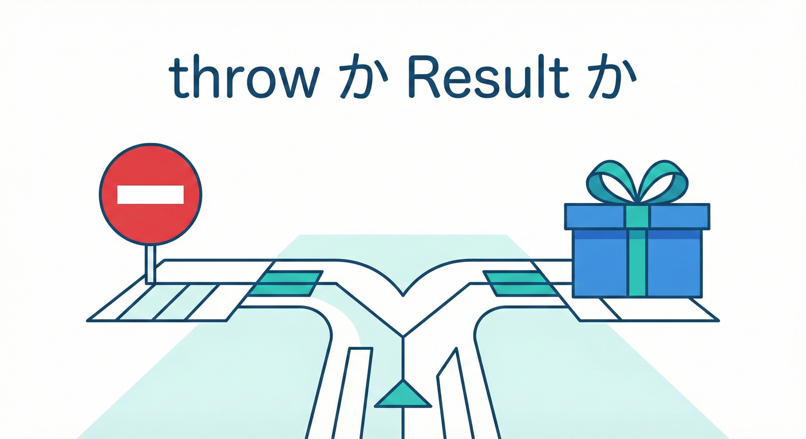
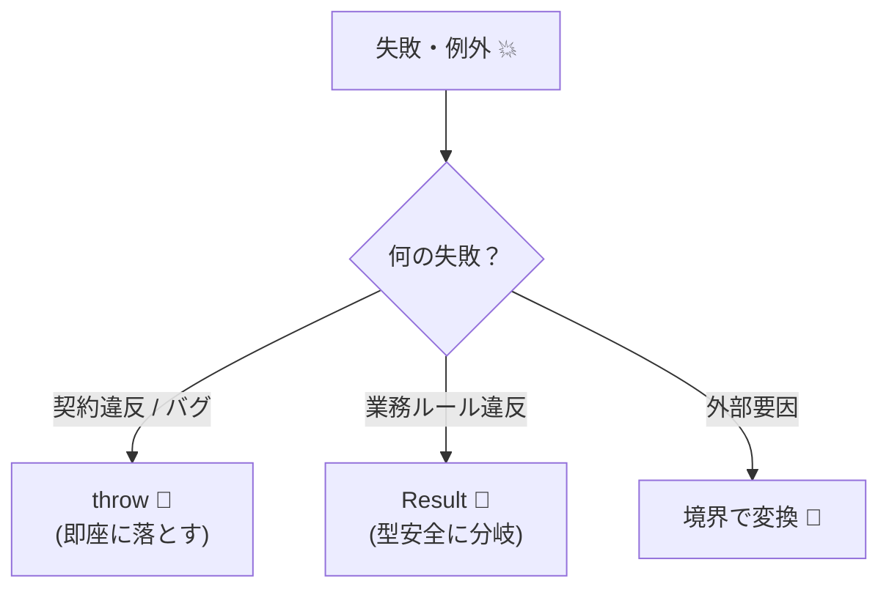
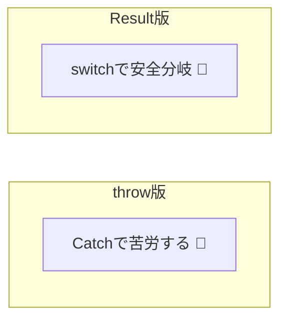

# 第18章　throw vs Result：設計の選び方（迷ったらここ）⚖️🎁

## この章のゴール🎯✨

* 「この失敗、`throw` にすべき？ それとも `Result` で返すべき？」を**迷わず決められる**ようになる🙂🧭
* 同じ処理を **`throw`版 / `Result`版** で書き分けて、読みやすさ・テストしやすさを体感する🧪✨
* DbC（契約）と相性がいい “失敗の流し方” を身につける🤝🛡️

---

## まず最新メモ📝✨（2026-01-26 時点）

* TypeScript の最新安定版は **5.9.3**（GitHub Releases の “Latest”）です。([GitHub][1])
* TypeScript は **6.0（ブリッジ）→ 7.0（Goベースのネイティブ化）** が予告されていて、今後はビルドやツール周りも大きく変わる流れです。([Microsoft for Developers][2])

この章は「どのバージョンでも通用する設計判断」を中心にしつつ、**今のTSの作法（catchがunknown寄り等）**も踏まえて進めます🙂✨

---

## 結論（超重要）⚖️🎁



迷ったときは、この基準だけでOK！👇

### ① DbC（契約違反）っぽい失敗は `throw` 💥🧨

* 例：`amount <= 0` を渡した、`null` を渡した、ありえない状態になった…
* **「呼び出し側が約束を破った」＝バグ寄り**なので、早めに落として気づくのが正義👀⚡

### ② 仕様として起きうる失敗は `Result` 🎁📦

* 例：「残高不足」「在庫なし」「予約枠が埋まってる」など
* **「起きてもおかしくない」＝分岐で扱うのが自然**🙂🔁
  → `if (res.ok) ... else ...` が読みやすい✨

### ③ 外部要因（通信/DB/タイムアウト等）は “境界” で整理🌩️🚧

* 内部では `throw` で上げて、境界で `Result` に変換する…みたいな混ぜ方が強い💪✨
* 「どこまでを仕様エラー扱いにするか」はチーム方針で統一すると超ラク😊🧠



---

## どうして `Result` が欲しくなるの？🤔🧩（TypeScript特有ポイント）

TypeScriptは **「throwされるエラーの型」を型として表現できません**🥲
さらに `catch (e)` の `e` は、設定によって **`unknown` 扱い**になります（推奨の流れ）。([TypeScript][3])

つまり…

* `throw` は便利だけど、**型安全に「どんな失敗が返るか」を表しにくい**😵
* `Result` は、**失敗の型（ドメインエラー）を“戻り値の型”として表現できる**🎁✨

この差が「設計の読みやすさ」に直結します🙂📘

---

## `throw` の強み・弱み💥⚡

### 強み👍✨

* 書くのが速い（ガード節 + `throw` で即終了）🚀
* スタックトレースが取れるので原因追跡がしやすい🔍
* DbC（契約違反）と相性よし🤝🛡️

### 弱み⚠️💦

* 例外の種類が “型” として表れにくい（読み手が把握しづらい）😵‍💫
* `catch` 側で `unknown` を丁寧に扱う必要が出る（`instanceof Error` 等）🧤
* 仕様エラーまで `throw` でやり始めると、分岐が見えなくなって読みづらい💣

### 例外チェーンは `cause` を使うと超便利🔗✨

「捕まえたエラーを、文脈を足して投げ直す」時は `cause` がきれいです🙂
（ES2022 で広く使えるやつ）([MDN Web Docs][4])

---

## `Result` の強み・弱み🎁🧩

### 強み👍✨

* 成功/失敗が “型” と “分岐” で見える👀✅
* テストで「失敗ケース」を書きやすい🧪✨
* 仕様として起きうる失敗（ドメインエラー）を整理しやすい📚🧠

### 弱み⚠️💦

* 書く量が増える（慣れるまでモタつく）🐢
* 伝播が面倒になりがち（`map`/`flatMap` など欲しくなる）🔁
* “なんでもResult” にすると、契約違反（バグ）まで握りつぶして発見が遅れる😱

---

## 早見表📋✨（判断が一瞬になるやつ）

| 失敗の種類               | 例                   | おすすめ          | 理由         |
| ------------------- | ------------------- | ------------- | ---------- |
| 契約違反（プログラミングミス寄り）🧨 | null渡した、範囲外、ありえない状態 | **throw** 💥  | 早く気づくのが価値  |
| ドメインエラー（仕様として起きる）📉 | 残高不足、在庫切れ、重複登録      | **Result** 🎁 | 分岐で扱うのが自然  |
| インフラエラー（外部要因）🌩️    | ネットワーク、DB、タイムアウト    | **境界で整理** 🚧  | 内部詳細を漏らさない |

---

## 実装して体感しよう🙂✨：同じ処理を2通りで比較🔁

題材：**「ポイントを消費して購入する」**（よくあるやつ🛒🎫）

* 仕様エラー：ポイント不足
* 契約違反：`usePoints <= 0` など

---

### A) `throw` 版💥（契約違反も仕様エラーもthrowで行く場合）

```ts
// ドメイン（中心ロジック）に置く想定

class InsufficientPointsError extends Error {
  constructor(public readonly current: number, public readonly required: number) {
    super(`ポイント不足です（current=${current}, required=${required}）`);
    this.name = "InsufficientPointsError";
  }
}

export function buyWithPoints(currentPoints: number, usePoints: number): number {
  // ✅ 契約違反（DbC）: 呼び出し側のミス寄り
  if (!Number.isFinite(currentPoints)) throw new Error("currentPoints must be finite");
  if (!Number.isFinite(usePoints)) throw new Error("usePoints must be finite");
  if (usePoints <= 0) throw new Error("usePoints must be > 0");

  // ✅ 仕様エラー: 起きうる失敗
  if (currentPoints < usePoints) {
    throw new InsufficientPointsError(currentPoints, usePoints);
  }

  // ✅ 正常
  const next = currentPoints - usePoints;

  // （事後条件っぽい軽いチェック）
  if (next < 0) throw new Error("postcondition violated: next < 0");

  return next;
}
```

**この版の読み味**🙂

* 書くのは速い🚀
* でも呼び出し側は `try/catch` が必要で、`catch` 内の取り回しがやや面倒になりやすい🧤

---

### B) `Result` 版🎁（仕様エラーはResult、契約違反はthrow）

まずは “軽量Result” を自作します（慣れると爆速💨）

```ts
export type Result<T, E> =
  | { ok: true; value: T }
  | { ok: false; error: E };

export const ok = <T>(value: T): Result<T, never> => ({ ok: true, value });
export const err = <E>(error: E): Result<never, E> => ({ ok: false, error });
```

ドメインエラーを “型で” 表現👇✨

```ts
export type PurchaseError =
  | { type: "InsufficientPoints"; current: number; required: number };

export function buyWithPointsResult(
  currentPoints: number,
  usePoints: number
): Result<number, PurchaseError> {
  // ✅ 契約違反（DbC）: バグ寄りはthrowで落とす
  if (!Number.isFinite(currentPoints)) throw new Error("currentPoints must be finite");
  if (!Number.isFinite(usePoints)) throw new Error("usePoints must be finite");
  if (usePoints <= 0) throw new Error("usePoints must be > 0");

  // ✅ 仕様エラー: Resultで返す
  if (currentPoints < usePoints) {
    return err({ type: "InsufficientPoints", current: currentPoints, required: usePoints });
  }

  return ok(currentPoints - usePoints);
}
```

呼び出し側が超読みやすい🙂✨

```ts
const res = buyWithPointsResult(100, 120);

if (res.ok) {
  console.log("購入OK！残り:", res.value);
} else {
  switch (res.error.type) {
    case "InsufficientPoints":
      console.log(`ポイント足りないよ〜🥲 ${res.error.current}/${res.error.required}`);
      break;
  }
}
```

**この版の読み味**🙂

* 「起きうる失敗」が型に見える👀🎁
* UI/画面側が分岐を書きやすい✨
* 契約違反（バグ）は握りつぶさず落とせる💥🛡️



---

## ライブラリを使うなら？🧰✨（迷ったら候補だけ覚えよう）

Resultを “便利に伝播” したいならライブラリもアリです🙂
たとえば **neverthrow** は `Result` と、非同期向けの `ResultAsync` を提供します。([GitHub][5])

ただしこの章ではまず「設計判断」が主役なので、**自作Resultで考え方を固める**のがおすすめです🧠✨

---

## 非同期（async/await）での考え方⚡🔁

* `throw`：`await` の途中で落ちる → 呼び出し側で `try/catch`
* `Result`：`Promise<Result<...>>` を返す → 呼び出し側は分岐で扱う

「仕様エラー（想定内の失敗）が多い処理」ほど `Result` が光ります✨🎁
（ログイン、決済、予約、クーポン適用…など🙂）

---

## “境界で変換” の定番パターン🚧🔁（超おすすめ）

**中心（ドメイン）**：

* 契約違反は `throw`（DbC）💥
* 仕様エラーは `Result` 🎁

**境界（API/画面/外部）**：

* `throw` された例外は **ログ用に残しつつ**、ユーザー向けに変換🧾✨
* 例外チェーンは `cause` で保持しておくと、追跡がラク🔗🙂([MDN Web Docs][4])

---

## AI活用（Copilot/Codex）で爆速にするコツ🤖⚡

* 「この関数の**仕様エラー**を `Result` のユニオン型で定義して」🧩
* 「この `Result` を使って呼び出し側の `switch` を書いて」🔁
* 「契約違反（precondition）をガード節で追加して。メッセージは“直し方が分かる”感じで」📝✨
* 「正常系 + 失敗系のテストケースを列挙して（境界値も）🧪」

ポイント：AIが出したエラー分類が**“仕様エラー”と“契約違反”をごっちゃにしてないか**だけは必ずチェック👀✅

---

## 演習🧪✨（throw版 / Result版を両方やるよ）

### 演習1：分類クイズ🎲🙂

次の失敗は `throw`？ `Result`？（理由も一言で）

1. `usePoints = -10`
2. `currentPoints < usePoints`
3. DB接続がタイムアウトした
4. “ありえない状態”（残高が負になっていた）

---

### 演習2：同じ機能を2実装🔁🔥

次の関数を **throw版** と **Result版** の2つで作る：

* `reserveSeat(current: number, request: number)`

  * 契約違反：`request <= 0`
  * 仕様エラー：`current < request`（席が足りない）

**チェック**✅

* throw版：エラー型（クラス）を1つ作る💥
* Result版：エラーをdiscriminated unionで表す🎁
* 呼び出し側のコードが読みやすい方はどっち？🙂

---

### 演習3：境界での変換🚧✨

Result版の `reserveSeat` を呼び出す「境界関数」を作る：

* 成功：`{ status: 200, body: ... }`
* 仕様エラー：`{ status: 400, body: ... }`
* 例外（契約違反や想定外）：`{ status: 500, body: ... }` ＋ログ🧾

---

## 章末チェックリスト✅✨

* [ ] **契約違反（DbC）** と **仕様エラー** を分けて考えられる🙂🧠
* [ ] 契約違反は `throw` に寄せる理由を説明できる💥
* [ ] 仕様エラーは `Result` に寄せると読みやすい理由を説明できる🎁
* [ ] `catch` のエラーは `unknown` 前提で丁寧に扱う感覚がある🧤([TypeScript][3])
* [ ] “境界で変換” を入れると設計が安定するのが分かる🚧✨

[1]: https://github.com/microsoft/typescript/releases "Releases · microsoft/TypeScript · GitHub"
[2]: https://devblogs.microsoft.com/typescript/progress-on-typescript-7-december-2025/?utm_source=chatgpt.com "Progress on TypeScript 7 - December 2025"
[3]: https://www.typescriptlang.org/tsconfig/useUnknownInCatchVariables.html?utm_source=chatgpt.com "useUnknownInCatchVariables - TSConfig Option"
[4]: https://developer.mozilla.org/en-US/docs/Web/JavaScript/Reference/Global_Objects/Error/cause?utm_source=chatgpt.com "Error: cause - JavaScript - MDN Web Docs"
[5]: https://github.com/supermacro/neverthrow?utm_source=chatgpt.com "supermacro/neverthrow: Type-Safe Errors for JS & TypeScript"

