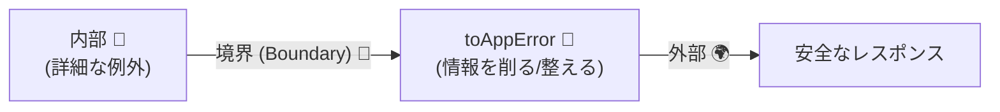
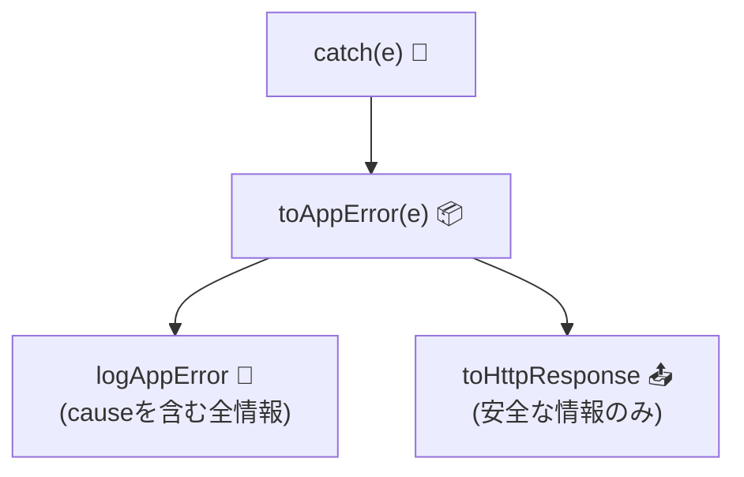

# 第19章　“境界で変換する”：内部エラーを外に漏らさない🧱🔁

## この章でできるようになること🎯✨

* 「境界（Boundary）」で例外を受け止めて、**外に出す形へ変換**できるようになる🧤📦
* **ユーザー向けメッセージ**と**ログ向け詳細**を分けて、安全＆デバッグしやすくする🧾🔐
* `unknown` をちゃんと扱って、**“何が飛んできても落ち着いて処理する”**を書けるようになる🧘‍♀️🧠
* `cause` を使って「原因」を保持しつつ、外側はスッキリにできる🪢✨（`Error.cause` は広く利用可能💡） ([MDN Web Docs][1])

---

## 今どきメモ（2026年1月）🗓️🧩

* TypeScript は **5.9.2（Stable）** が公開されているよ📌 ([GitHub][2])
* VS Code は **v1.108（2025年12月アップデート）** が **2026-01-08** にリリース📌 ([Visual Studio Code][3])
* Node.js は **v24.13.0（LTS）** が **2026-01-13** に出ているよ🔒 ([Node.js][4])
* そして TypeScript は「ネイティブ移植（プレビュー）」でビルド高速化の流れも進行中🏎️💨 ([Microsoft Developer][5])

---

## なぜ「境界で変換」しないと危ないの？😱🧨

境界で変換しないと、こんな事故が起きがち👇

* **内部情報ダダ漏れ**（DB名、SQL、ファイルパス、スタックトレース…）🫣💥
* 画面やAPIで **意味不明なエラー** が出て、ユーザーも開発者も困る🥲❓
* 例外の種類がバラバラで、呼び出し側が **毎回 try/catch 地獄** になる🌀🧟‍♀️
* 「直す場所」が増えて、設計がどんどん崩れる🏚️💦

だから基本はこれ👇
**中の例外は中で使う。外には“外向けの形”だけを出す。** 🚧➡️📦



---

## 「境界」ってどこ？🚧🧭

境界は、**世界が変わるところ**だよ🌍✨
たとえば👇

* HTTP API の入口（ルーティング、コントローラ）🌐🚪
* CLI の入口（コマンド実行）⌨️🚪
* UI のイベントハンドラ（ボタン押下）🖱️🚪
* ジョブ実行の入口（スケジューラ、キュー）⏰📥

境界の仕事はざっくり2つだけ👇

1. **入力を受ける**（変換・検証）🧼
2. **失敗を返す**（外向けに変換）📤

この章は 2) を主役にするよ💃✨

---

## 変換の基本ルール3つ🏁✅


### ルール①：外に出すエラーは「型（形）」を固定する📦🧱

* 例：`AppError` みたいな **統一フォーマット** にする
* UI/HTTP/CLI など、外側の都合に合わせて **出力を作れる**ようになる✨

### ルール②：メッセージは二重にする🧾🔐

* ユーザー向け：短く・安全・次にやることが分かる🙂🧭
* ログ向け：原因・スタック・文脈・再現に必要な情報🕵️‍♀️📌

### ルール③：境界以外では「変換しない」🙅‍♀️

* 中で無理に握りつぶすと、原因が迷子になる🐶💨
* 変換は境界の仕事！中は “正確に投げる” に集中🎯

---

## まずは最小の土台：`AppError` を作ろう🧩✨

「外に出す形」を決めるよ📦
（HTTPでもCLIでも同じ思想で使えるよ👍）

```ts
// AppError = 外向けの統一フォーマット📦
export type AppError =
  | {
      kind: "BadRequest";
      code: "BAD_REQUEST";
      message: string;
      details?: unknown; // 入力エラーなど（外に出してOKな範囲だけ）
    }
  | {
      kind: "Conflict";
      code: "CONFLICT";
      message: string;
    }
  | {
      kind: "NotFound";
      code: "NOT_FOUND";
      message: string;
    }
  | {
      kind: "Unauthorized";
      code: "UNAUTHORIZED";
      message: string;
    }
  | {
      kind: "Internal";
      code: "INTERNAL";
      message: string;   // ユーザー向けは固定文言が基本🧊
      cause?: unknown;   // ログ用に保持（外へは出さない前提）
    };
```

ポイント💡

* `kind` を **判別用（discriminated union）** にしておくと分岐が超ラク🥳
* `Internal` は **固定メッセージ** 推奨（漏洩防止）🔐
* `cause` はログ用に抱えとく（これ超大事）🪢✨

---

## 「unknown が来ても平気」な変換関数を作る🧯✨

`catch` で受けるのは、基本 `unknown` として扱うのが安全🙆‍♀️
（`useUnknownInCatchVariables: true` だとより安心🧼）

```ts
// 便利：安全に Error 判定する🧠
const isError = (e: unknown): e is Error => e instanceof Error;

// 例：ドメイン側で投げる「仕様上の失敗」用（第17〜18章の続き感）
export class DomainError extends Error {
  constructor(
    public readonly domainCode: "EMAIL_TAKEN" | "INSUFFICIENT_BALANCE",
    message: string
  ) {
    super(message);
    this.name = "DomainError";
  }
}

// 変換の本体：unknown → AppError📦
export const toAppError = (e: unknown): AppError => {
  // 仕様として起きる失敗（ユーザー向けに出してOK）
  if (e instanceof DomainError) {
    if (e.domainCode === "EMAIL_TAKEN") {
      return { kind: "Conflict", code: "CONFLICT", message: "そのメールは既に使われています📩💦" };
    }
    return { kind: "BadRequest", code: "BAD_REQUEST", message: e.message };
  }

  // よくある「見つからない」
  if (isError(e) && e.name === "NotFoundError") {
    return { kind: "NotFound", code: "NOT_FOUND", message: "見つかりませんでした🔍💦" };
  }

  // それ以外は Internal（詳細はログへ）
  return {
    kind: "Internal",
    code: "INTERNAL",
    message: "エラーが発生しました。時間をおいて再度お試しください🙏💦",
    cause: e,
  };
};
```

ここが気持ちいいところ🥰✨

* 外に返すメッセージは統一できる
* でも `cause` に “本当の原因” を保持できる
* だから、ユーザーには安全、開発者には優しい💖🛠️

---

## `cause` で「原因」をつないでいく🪢✨

境界で変換するなら、**原因チェーン**が命！🔥
`Error.cause` は「捕まえたエラーを別エラーに包む」用途で使われるよ🧠 ([MDN Web Docs][1])

```ts
export class InfraError extends Error {
  constructor(message: string, options?: { cause?: unknown }) {
    // ES2022+ なら cause を付けられる（環境設定はプロジェクト側で）
    super(message, options);
    this.name = "InfraError";
  }
}
```

例：DB層で catch して “DBの文脈” を付けて投げ直す👇

```ts
async function fetchUserFromDb(userId: string) {
  try {
    // ...DBアクセス
  } catch (e) {
    throw new InfraError("DBアクセスに失敗しました", { cause: e });
  }
}
```

これでログに出すとき👇

* 表面：`DBアクセスに失敗しました`
* 原因：接続失敗／タイムアウト／SQLエラー…
  が辿れるようになるよ🕵️‍♀️🔗

---

## 境界でのテンプレ：try/catch はここだけに寄せる🧱✨

境界（例：HTTPハンドラっぽい入口）ではこう👇

```ts
type HttpResponse =
  | { status: 200 | 201; body: unknown }
  | { status: 400 | 401 | 404 | 409 | 500; body: { message: string; code: string } };

const toHttpResponse = (err: AppError): HttpResponse => {
  switch (err.kind) {
    case "BadRequest":
      return { status: 400, body: { message: err.message, code: err.code } };
    case "Unauthorized":
      return { status: 401, body: { message: err.message, code: err.code } };
    case "NotFound":
      return { status: 404, body: { message: err.message, code: err.code } };
    case "Conflict":
      return { status: 409, body: { message: err.message, code: err.code } };
    case "Internal":
      return { status: 500, body: { message: err.message, code: err.code } };
  }
};

const logAppError = (err: AppError, context: { requestId: string }) => {
  // 例：ログはここで集約🧾
  // cause は外へ返さないけど、ログには残せる📌
  if (err.kind === "Internal") {
    console.error("🔥INTERNAL", context, { err, cause: err.cause });
  } else {
    console.warn("⚠️APP_ERROR", context, { err });
  }
};

## 境界でのテンプレ🧱🔁


```ts
/**
 * 境界（コントローラ/ハンドラ）での書き方
 */
async function handleRequest(input: unknown) {
  try {
    // 1. バリデーション & 中心ロジック呼び出し
    const result = await someCoreLogic(input);
    return { status: 200, body: result };
  } catch (e) {
    // 2. 境界で「外向けの言葉」に変換する！
    const errorResponse = translateError(e);
    return { status: errorResponse.status, body: errorResponse.body };
  }
}
```

export async function handleCreateUser(requestId: string, input: unknown): Promise<HttpResponse> {
  try {
    // ここでは「成功時の流れ」に集中✨
    const userId = await createUserUseCase(input);
    return { status: 201, body: { userId } };
  } catch (e) {
    // 変換は境界の仕事🧱
    const appErr = toAppError(e);
    logAppError(appErr, { requestId });
    return toHttpResponse(appErr);
  }
}

// 例の中身（ここでは適当に）
async function createUserUseCase(_input: unknown): Promise<string> {
  // ... 中では DomainError / InfraError を投げてもOK
  return "user_123";
}
```

この形のメリット🥳🎉

* 入口はスッキリ（成功ルートが読みやすい）✨
* 失敗は **必ず** `AppError` に統一される📦
* レスポンスもログも “ルールで処理” できる🧠✅



---

## やっちゃダメ集（事故りやすい）🚫💥

* `return { error: e }` みたいに **例外をそのまま返す**（情報漏洩）🫣
* `console.log(e)` だけして **握りつぶす**（原因迷子）🐶💨
* “中の層” で **UI/HTTP形式に変換**しちゃう（関心の混線）🧶🌀
* ユーザー向けメッセージに `e.message` をそのまま使う（危険）🔓💣

---

## 演習①：エラー変換関数を強化しよう🧪✨

次の仕様で `toAppError` を改造してね✍️

1. `DomainError("INSUFFICIENT_BALANCE", "...")` は
   　`BadRequest` にして、メッセージは「残高が足りません💸😢」に固定する
2. `Error` で `name === "AbortError"` は
   　`Internal` にして「時間がかかりすぎたので中断しました⌛💦」にする
3. それ以外は今のままでOK🙆‍♀️

---

## 演習②：境界で「返す」「ログる」を完全に分離しよう🧩🧾

`handleCreateUser` の catch をこう分けてみてね👇

* `handleError(e, ctx)` は `AppError` を返す（変換担当）📦
* `respondError(appErr)` は `HttpResponse` を返す（出力担当）📤
* `logError(appErr, ctx)` はログだけ（ログ担当）🧾

「役割が分かれると、設計が急にキレイになる」感覚が掴めるよ🥰✨

---

## AI活用メモ（雛形づくりに便利）🤖⚡

* 「`AppError` の union と `toHttpResponse` の switch を作って」
* 「`toAppError` のテストケース（DomainError/unknown/AbortError）を列挙して」
* 「`logAppError` に requestId と cause を入れて、漏洩しない形にして」

雛形はAIが速い🏎️💨
でも **“何を外に出してOKか”** の判断は人間が責任持つのが大事だよ⚖️🧠

---

## 章末チェックリスト✅📌

* [ ] 境界でだけ `try/catch` している🚧
* [ ] 外向けの失敗は `AppError` に統一した📦
* [ ] ユーザー向けとログ向けを分けた🔐🧾
* [ ] `unknown` を安全に扱えている🧼
* [ ] `cause` で原因をつないで追跡できる🪢🔍 ([MDN Web Docs][1])

[1]: https://developer.mozilla.org/en-US/docs/Web/JavaScript/Reference/Global_Objects/Error/cause "Error: cause - JavaScript | MDN"
[2]: https://github.com/microsoft/typescript/releases "Releases · microsoft/TypeScript · GitHub"
[3]: https://code.visualstudio.com/updates "December 2025 (version 1.108)"
[4]: https://nodejs.org/en/blog/release/v24.13.0 "Node.js — Node.js 24.13.0 (LTS)"
[5]: https://developer.microsoft.com/blog/typescript-7-native-preview-in-visual-studio-2026?utm_source=chatgpt.com "TypeScript 7 native preview in Visual Studio 2026"

