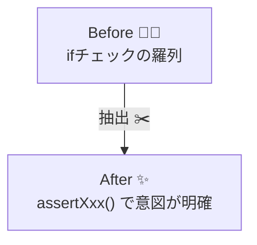
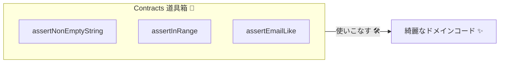

# 第20章　アサーション関数入門：読みやすい契約を関数化🧩📝

## 20.0 最新版メモ📌

TypeScript は 2026年1月時点で **5.9 系**が最新として案内されています🆕✨ ([TypeScript][1])
この章の内容（アサーション関数）は、最近のTSでもそのまま使えます🙂

---

## 20.1 この章のゴール🎯

この章が終わると、次のことができるようになります💪✨

* ✅ 「チェックのコピペ地獄」から脱出できる🏃‍♀️💨
* ✅ `assertNonEmptyString()` みたいに、**意図が名前で伝わる**コードが書ける📝✨
* ✅ エラーメッセージが「直し方つき」になって、デバッグがラクになる🔧🔍
* ✅ 契約チェックを “道具化” して、プロジェクトに馴染ませられる🧰🎁

---

## 20.2 あるある：チェックが散らばって読めない😵‍💫💥


たとえば、こんな感じの関数…よく見ません？🥺

```ts
export function createUser(name: string, age: number, email: string) {
  if (name == null) throw new Error("name is required");
  if (name.trim().length === 0) throw new Error("name is required");
  if (name.length > 50) throw new Error("name is too long");

  if (!Number.isFinite(age)) throw new Error("age must be a number");
  if (age < 18) throw new Error("age must be >= 18");
  if (age > 120) throw new Error("age is too large");

  if (!email.includes("@")) throw new Error("invalid email");
  if (email.length > 200) throw new Error("email too long");

  // 本来の処理はここからなのに…🥲
  return { id: "u_123", name, age, email };
}
```

### これのツラいところ😭

* 🤕 本来やりたい処理が見えない（チェックが主役になっちゃう）
* 🧨 似たチェックが増えて、修正漏れが起きやすい
* 🧩 メッセージがバラバラで、使う人が迷う



そこで登場するのが **アサーション関数**です🧩✨

---

## 20.3 アサーション関数ってなに？🧩

**アサーション（assertion）**は、ざっくり言うとこうです👇

* 「ここはこうであるはず！」を実行時にチェックする✅
* もし違ったら **throw で止める**🛑💥

`throw` は、例外を投げた瞬間にその場の処理が止まり、呼び出し側の `catch` に制御が移ります（なければ上まで伝播）📤 ([MDN Web Docs][2])

さらに TypeScript には、アサーション関数を書くための仕組みとして **`asserts`** が用意されています（TS 3.7 から）🧠✨ ([TypeScript][3])

---

## 20.4 まずは最小の `assert` を作ろう🧪🧱

「条件がダメなら止める」だけのミニ関数から作ります🙂✨

### ファイル例📁

* `src/contracts/assert.ts`

```ts
export function assert(condition: unknown, message = "Assertion failed"): asserts condition {
  if (!condition) {
    throw new Error(message);
  }
}
```

この `asserts condition` により、**「この関数が戻ったなら condition は真」**として扱ってOKになります🧠✨（型の話は次章でしっかりやります） ([TypeScript][3])

---

## 20.5 “意図に名前をつける” が本番✨📝

ここからがこの章のメインです🎉
`assert()` を直接書くより、**意図が分かる名前の関数**にすると一気に読みやすくなります🙂💕

### 20.5.1 空じゃない文字列を保証する✅🧡

```ts
import { assert } from "./assert";

export function assertNonEmptyString(value: unknown, fieldName: string): asserts value is string {
  assert(typeof value === "string", `${fieldName} must be a string`);
  assert(value.trim().length > 0, `${fieldName} must not be empty`);
}
```

ポイント✨

* `fieldName` を渡すとメッセージが統一されて気持ちいい🥰
* `trim()` を使うと「スペースだけ」も弾ける🧽

---

### 20.5.2 数値の範囲を保証する📏🔢

```ts
import { assert } from "./assert";

export function assertFiniteNumber(value: unknown, fieldName: string): asserts value is number {
  assert(typeof value === "number", `${fieldName} must be a number`);
  assert(Number.isFinite(value), `${fieldName} must be finite`);
}

export function assertInRange(
  value: number,
  min: number,
  max: number,
  fieldName: string
): void {
  assert(value >= min, `${fieldName} must be >= ${min}`);
  assert(value <= max, `${fieldName} must be <= ${max}`);
}
```

コツ💡

* 「型チェック」と「範囲チェック」を分けると再利用が増える🔁✨
* メッセージは “直し方が分かる形” が最高🧭🙂

---

### 20.5.3 形式チェックを関数にする🧾✨

メールっぽい形式を例にします📩
（※ 厳密なメール仕様はめちゃ複雑なので、ここでは “アプリの都合に合うルール” を決めてOKです🙂）

```ts
import { assert } from "./assert";

const SIMPLE_EMAIL_REGEX = /^[^\s@]+@[^\s@]+\.[^\s@]+$/;

export function assertEmailLike(value: string, fieldName: string): void {
  assert(SIMPLE_EMAIL_REGEX.test(value), `${fieldName} must look like an email`);
}
```

---

## 20.6 使う側がどう変わるか🌈✨

さっきの `createUser` を、アサーション関数でスッキリさせます🎀

```ts
import { assertNonEmptyString } from "./contracts/assertNonEmptyString";
import { assertFiniteNumber, assertInRange } from "./contracts/assertNumber";
import { assertEmailLike } from "./contracts/assertEmailLike";

export function createUser(name: unknown, age: unknown, email: unknown) {
  assertNonEmptyString(name, "name");

  assertFiniteNumber(age, "age");
  assertInRange(age, 18, 120, "age");

  assertNonEmptyString(email, "email");
  assertEmailLike(email, "email");

  // ここから先は「正しい前提」で読める😍✨
  return { id: "u_123", name, age, email };
}
```

### うれしいところ🥳

* 🌟 本来の処理が見える
* 🧠 「この下は安全」って読んで分かる
* 🔁 同じルールを何度でも使える

---

## 20.7 置き場所のおすすめ🗺️✨


* **`shared/contracts/`**: プロジェクト全体で使う「汎用的な契約」（`assertString`, `assertPositiveInt` など）🧩
  * `assertNonEmptyString.ts`
  * `assertNumber.ts`
  * `assertEmailLike.ts`

### 命名ルールのコツ🪄

* ✅ `assertXxx` は「違ったら止める」ニュアンス
* ✅ `ensureXxx` でもOK（チームで統一できればどちらでも）
* ✅ “何を保証するか” が名前で分かるのが最重要💖



---

## 20.8 エラーメッセージのテンプレ📝✨

メッセージは「直し方が分かる」と超つよいです💪🙂

おすすめ型👇

* `"{field} must be {rule}"`

例：

* ✅ `age must be >= 18`
* ✅ `name must not be empty`

注意⚠️

* 🔒 パスワードやトークン等の秘密を、メッセージにそのまま出さない
* 📦 API境界でそのまま返す場合は、ユーザー向け文言に変換する（前章の「境界で変換する」につながるよ🧱🔁）

---

## 20.9 よくある落とし穴💣🙂

### 20.9.1 アサーションを “仕様の失敗” に使いすぎる🎭

アサーションは基本「プログラム側の約束（契約）」向きです🧩
ユーザー操作で普通に起きる失敗（例：残高不足、在庫なし）まで全部 `throw` にすると、扱いづらくなりがちです🥺💦

* 🧨 契約違反っぽい → assert / throw
* 📉 仕様として起きる失敗 → Result などで表現（第18章の考え方）

### 20.9.2 “万能アサーション関数” を作りすぎる🌀

最初から巨大な汎用ライブラリにしないでOK🙂
まずは **プロジェクトで頻出の3〜5個** だけ作るのが勝ちです🏆✨

---

## 20.10 AIで時短するコツ🤖⚡

AIは “叩き台” が得意です🙂✨
たとえばこんなお願いが便利👇

* 「`assertNonEmptyString` と `assertInRange` を作って。例外メッセージは統一して」
* 「この関数の入口チェックをアサーション関数に分割して、`contracts/` に置いて」
* 「境界値テスト（0, 1, max, max+1）をセットで作って」

ただし最後は人間が責任持つところ💡

* ✅ どのルールを契約にするか
* ✅ エラーメッセージが適切か
* ✅ どこまで公開して良い情報か🔒

---

## 20.11 章末チェックリスト✅✨

* [ ] チェックが “散らばる” 代わりに “関数に集まる” ようにできた🙂
* [ ] `assertNonEmptyString` / `assertInRange` / `assertEmailLike` を作れた🧩
* [ ] 使う側のコードが「本来の処理中心」になった🌈
* [ ] メッセージが「直し方つき」になった🧭

---

## 20.12 演習問題🧪✍️

### 演習1：アサーション3点セットを完成させよう🎁

次を作ってください🙂✨

* `assertNonEmptyString(value, fieldName)`
* `assertFiniteNumber(value, fieldName)`
* `assertInRange(value, min, max, fieldName)`

ゴール🎯

* 同じエラー文言のスタイルで統一できていること📝✨

---

### 演習2：コピペ地獄の関数を救出しよう🛟😵‍💫

次みたいな関数を用意して、アサーション関数でスッキリさせてください👇

* `createEvent(title, dateText, capacity)`

  * title：空NG、最大100文字
  * dateText：空NG、`YYYY-MM-DD` っぽい形式
  * capacity：1〜500

ヒント💡

* 形式チェックは正規表現でOK🙆‍♀️✨
* 「本体ロジック」が見えるようにするのが目的です🌟

---

### 演習3：読みやすい失敗メッセージに改善しよう🔧🙂

わざとダメな文言にしてから、改善してください👇

* ❌ `invalid`
* ❌ `error`
* ✅ `capacity must be between 1 and 500`

“直し方が分かる” を合言葉にね🧡✨

[1]: https://www.typescriptlang.org/download/?utm_source=chatgpt.com "How to set up TypeScript"
[2]: https://developer.mozilla.org/en-US/docs/Web/JavaScript/Reference/Statements/throw?utm_source=chatgpt.com "throw - JavaScript - MDN Web Docs - Mozilla"
[3]: https://www.typescriptlang.org/docs/handbook/release-notes/typescript-3-7.html?utm_source=chatgpt.com "Documentation - TypeScript 3.7"

