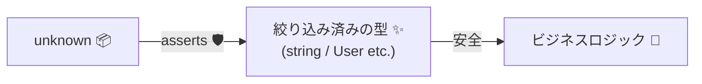
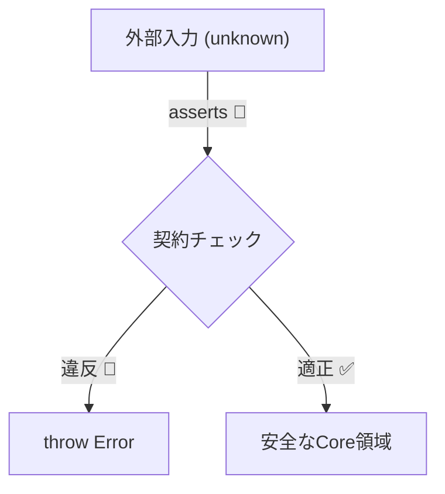

# 第21章　`asserts` を使って「型」も一緒に守る🛡️🧠

## この章でできるようになること🎯

* 「外から来た値（unknown）」を、**安全に“使っていい型”へ変換**できるようになる✨
* 「チェックした事実」をTypeScriptに伝えて、**以降のコードをスッキリ安全に**できる🧼✅
* DbCの視点で、**契約（主に事前条件）を“型 + 実行時”の二段構え**で書けるようになる🤝🧱

---

## 1. 「asserts」って何？（超ざっくり）🙂


「asserts」は、**“この条件が成り立つことを保証する（成り立たないなら例外で止める）”**という宣言だよ🛑
そしてTypeScriptは、その宣言を信じて **型を絞り込んで（narrowingして）**くれる✨ ([TypeScript][1])

ポイントはこれ👇

* **実行時**：条件がダメなら throw して止める💥
* **型**：条件がOKなら「ここから先はこういう型だね！」って推論が効く✅



---

## 2. asserts には2種類あるよ🧩

### A) 「asserts 条件」：条件が真であることを保証✅

例：null じゃない／文字列だ／配列じゃない…などを保証するやつ！

```ts
export function assert(condition: unknown, message = "Assertion failed"): asserts condition {
  if (!condition) {
    throw new Error(message);
  }
}
```

これを使うと👇

```ts
function greet(name: string | null) {
  assert(name !== null, "name must not be null");
  // ここから先、name は string として扱える✨
  return `Hello, ${name.toUpperCase()}!`;
}
```

TypeScript 公式でも「asserts condition」の形が説明されてるよ。 ([TypeScript][1])

---

### B) 「asserts 値 is 型」：値がその型であることを保証👑

「asserts value is string」みたいに、**“型そのもの”を保証**できるのが強い✨

```ts
export function assertNonEmptyString(value: unknown, name = "value"): asserts value is string {
  assert(typeof value === "string", `${name} must be a string`);
  assert(value.trim().length > 0, `${name} must be a non-empty string`);
}
```

---

## 3. なんで「asserts」が必要なの？（unknown地獄を救う🧯）

外部入力（JSON/フォーム/Storage/Query/DBなど）は、型が効きにくい世界🌍
だから「いったん unknown で受けて、検証してから使う」が安全✨

さらに最近のTypeScriptだと、例外の catch の変数も **unknown 扱いが基本**になりやすいので、「unknown → 絞る」がますます大事だよ🧠 ([TypeScript][2])

---

## 4. まずは“土台の道具”を作ろう🧰✨（実務で超使う）

### 4-1. 「オブジェクトっぽい」を保証する（Recordへ）📦

```ts
export function assertIsRecord(
  value: unknown,
  name = "value"
): asserts value is Record<string, unknown> {
  assert(typeof value === "object" && value !== null, `${name} must be an object`);
  // 必要なら配列除外も👇
  // assert(!Array.isArray(value), `${name} must not be an array`);
}
```

### 4-2. 「キーがある」を保証する🔑

```ts
export function assertHasKeys<K extends string>(
  obj: Record<string, unknown>,
  keys: readonly K[],
  name = "object"
): asserts obj is Record<K, unknown> & Record<string, unknown> {
  for (const k of keys) {
    assert(k in obj, `${name} must have key "${k}"`);
  }
}
```

---

## 5. 目玉：assertIsUser(input) を作る👤✅（演習の完成形イメージ）

### 5-1. 例としてのUser型

```ts
export type User = {
  id: string;
  name: string;
  age?: number;
};
```

### 5-2. unknown → User へ「通行証」を発行する🚦✨

```ts
export function assertIsUser(input: unknown): asserts input is User {
  assertIsRecord(input, "input");
  assertHasKeys(input, ["id", "name"] as const, "input");

  assertNonEmptyString(input.id, "input.id");
  assertNonEmptyString(input.name, "input.name");

  if (input.age !== undefined) {
    assert(typeof input.age === "number", "input.age must be a number when provided");
    assert(Number.isFinite(input.age), "input.age must be finite");
    assert(input.age >= 0, "input.age must be >= 0");
  }
}
```

### 5-3. 使う側が激ラクになる😍

```ts
function handleRequest(body: unknown) {
  assertIsUser(body);

  // ここから先、body は User！🎉
  return `${body.name} (${body.id})`;
}
```

---

## 6. DbCとしての「asserts」の置きどころ🚧🧱

「asserts」は、DbCでいうと **事前条件（入口の契約）** と相性が最高💖
おすすめ配置はこんな感じ👇

* ✅ **外から入ってくる境界**（API受信、フォーム、Storage読み出し、ファイル読み込み）で強く守る
* ✅ 中のロジックは「正しい型が来る前提」でスッキリ書く
* ✅ “壊れた値を中に入れない”ができると、バグが激減する🛑✨



---

## 7. よくある落とし穴（ここ超大事）⚠️🧨

### 7-1. 「asserts」は宣言。ウソをつけちゃう😱

TypeScriptは「asserts」の宣言を基本的に信じるので、チェックが甘いと型安全が壊れるよ💥
実際「不十分な絞り込みでも通ってしまう」問題は議論されているよ。 ([GitHub][3])

**ダメ例（危険）**👇

```ts
type User = { id: string };

function assertIsUserBad(x: unknown): asserts x is User {
  // 何もチェックしてないのに通してしまう😱
}
```

👉 なので、**asserts を書くなら“必ず”実行時チェックも本気で書く**のが約束🤝

---

### 7-2. 「as User」で逃げると、契約が消える🫥

```ts
const user = input as User; // ← これは検証してない（ただの自己申告）
```

DbC的には、これは「契約を書いたフリ」になりやすいよ😵‍💫
**unknown → asserts → 型確定**の流れが正攻法✨

---

### 7-3. エラーメッセージが雑だと、デバッグ地獄🔦😇

悪い例：「invalid」だけ
良い例：「input.age must be a number when provided」みたいに**直し方が分かる**🧭✨

---

## 8. ちょい実務テク：catch の unknown を asserts で救う🛟

```ts
export function assertIsError(e: unknown): asserts e is Error {
  assert(e instanceof Error, "Expected an Error instance");
}
```

```ts
try {
  // ...
} catch (e) {
  assertIsError(e);
  console.error(e.message); // 安全✨
}
```

catch が unknown になりやすい流れ自体は、公式の tsconfig オプションでも説明されてるよ。 ([TypeScript][2])

---

## 9. AIに手伝ってもらうコツ🤖✨（でも主導権はこっち）

* 「この型の asserts 関数を作って。境界値（空文字、null、配列、巨大数）も含めて」みたいに頼むと速い⚡
* ただし **“何を正とするか（不変条件/必須項目/範囲）”は人間が決める**のがDbCの肝だよ⚖️🧠

---

## 10. 演習🧪✍️（手を動かすと一気に分かるよ！）

### 演習1：assertPositiveInt を作ろう🔢✅

要件👇

* input は unknown
* 0より大きい整数だけ通す
* ダメなら throw
* 通ったら「number」として安全に使える

ヒント：Number.isInteger / Number.isFinite を使う🙂

---

### 演習2：assertIsProduct を作ろう🛒✨

型👇

* id: string（空NG）
* price: number（0以上）
* tags?: string[]（あるなら、全部 空NG）

---

### 演習3：unknown の配列を「User[]」に変換する🚚👤

やりたいこと👇

* input: unknown を受ける
* 配列じゃなければ止める
* 全要素に assertIsUser をかける
* 通ったら以降は User[] として扱える✨

---

## 11. 演習の解答例✅（答え合わせ）

### 解答1：assertPositiveInt

```ts
export function assertPositiveInt(value: unknown, name = "value"): asserts value is number {
  assert(typeof value === "number", `${name} must be a number`);
  assert(Number.isFinite(value), `${name} must be finite`);
  assert(Number.isInteger(value), `${name} must be an integer`);
  assert(value > 0, `${name} must be > 0`);
}
```

### 解答2：assertIsProduct

```ts
export type Product = {
  id: string;
  price: number;
  tags?: string[];
};

export function assertIsProduct(input: unknown): asserts input is Product {
  assertIsRecord(input, "input");
  assertHasKeys(input, ["id", "price"] as const, "input");

  assertNonEmptyString(input.id, "input.id");

  assert(typeof input.price === "number", "input.price must be a number");
  assert(Number.isFinite(input.price), "input.price must be finite");
  assert(input.price >= 0, "input.price must be >= 0");

  if (input.tags !== undefined) {
    assert(Array.isArray(input.tags), "input.tags must be an array when provided");
    for (const [i, t] of input.tags.entries()) {
      assertNonEmptyString(t, `input.tags[${i}]`);
    }
  }
}
```

### 解答3：assertIsUserArray

```ts
export function assertIsUserArray(input: unknown): asserts input is User[] {
  assert(Array.isArray(input), "input must be an array");
  for (const [i, item] of input.entries()) {
    try {
      assertIsUser(item);
    } catch (e) {
      throw new Error(`input[${i}] is not a valid User`);
    }
  }
}
```

---

## 12. 章末チェックリスト✅✨

* 「unknown は unknown のまま使わない」って意識できた🙂
* 「asserts condition」と「asserts value is Type」の違いが分かる🧠
* 「入口で asserts、内部はスッキリ」になってる🚪➡️✨
* 「as で逃げず、実行時チェックとセット」になってる🛡️
* エラーメッセージが「直し方が分かる」形になってる🧭

---

### おまけ：いまのTypeScriptの最新状況メモ📝✨

* 本日時点で npm の最新版は **TypeScript 5.9.3**（公開情報ベース）だよ。 ([npm][4])
* これから先の大きな動きとして、TypeScript 6.0 / 7.0（ネイティブ化）に向けた進捗が公式に共有されてるよ。 ([Microsoft for Developers][5])

[1]: https://www.typescriptlang.org/docs/handbook/release-notes/typescript-3-7.html?utm_source=chatgpt.com "Documentation - TypeScript 3.7"
[2]: https://www.typescriptlang.org/tsconfig/useUnknownInCatchVariables.html?utm_source=chatgpt.com "useUnknownInCatchVariables - TSConfig Option"
[3]: https://github.com/microsoft/TypeScript/issues/57436?utm_source=chatgpt.com "Type assertions & type predicates can have incorrect ..."
[4]: https://www.npmjs.com/package/typescript?utm_source=chatgpt.com "TypeScript"
[5]: https://devblogs.microsoft.com/typescript/progress-on-typescript-7-december-2025/?utm_source=chatgpt.com "Progress on TypeScript 7 - December 2025"

