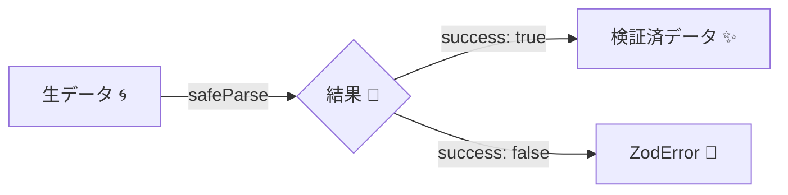

# 第22章　外部入力はZodで守る①：Validationで弾く🧱✅

## この章のゴール🎯✨

* JSON / フォーム / クエリ文字列みたいな「外から来る値」🌀を、**Zodで安全にチェックしてから使える**ようになる🙆‍♀️✅
* `safeParse()` を使って、**落ちてもアプリが爆発しない**（例外で落ちない）形にできる💣➡️🧯
* エラーを「人間が読める形」に整形して、UIに出しやすくする📣🧡

---

## 1. 外部入力は“型が効かない世界”🌍😵‍💫

TypeScriptの型って、基本は **コンパイル時の安心**だよね🧠✨
でも外部入力は、実行時に突然こうなる👇

* `age: "20"`（文字列やん！）😇
* `email: null`（ヌルやん！）😇
* `name: "   "`（空みたいなもんやん！）😇
* `{"isAdmin": true}` みたいな **余計なキーが混入**する😈

つまり外部入力は、最初はだいたい `unknown`（正体不明）として扱うのが安全🛡️✨

---

## 2. Zodってなに？（ざっくり）🧩🙂

Zodは「実行時にデータを検証」して、**通ったら型もついてくる**バリデーションライブラリだよ✅✨
しかも TypeScript と相性バツグン💞（スキーマから型を推論できる）

（2026年1月時点）Zodは v4 系が主流で、npmの最新版は 4.3.6 になってるよ📦✨ ([npm][1])

---

## 3. まずは最重要パターン1つだけ覚えよ🧠✅

### ✅ 外部入力 → `safeParse` → 成功なら使う / 失敗なら弾く

* `parse()`：失敗したら例外 throw 💥（初心者のうちは扱いづらい）
* `safeParse()`：成功/失敗を **戻り値で受け取れる**🧯✨（こっちが基本！）



---

## 4. ハンズオン：`CreateUserRequest` をZodで受ける📨👤✨


### 4.1 スキーマを書く✍️

ポイントはこれ👇

* `z.object({ ... })` で形を固定🧱
* 文字列は `.min()` や `.email()` で縛る🔒
* 数字は `.int()` `.min()` で縛る📏

```ts
import { z } from "zod";

export const CreateUserRequestSchema = z
  .object({
    name: z.string().trim().min(1, "名前は必須だよ🙂"),
    email: z.string().trim().email("メール形式が変だよ📩"),
    age: z.number().int().min(18, "18歳以上だよ🧑‍🎓").optional(),
  })
  .strict(); // 👈 余計なキーを許さない（APIならこれが安心！🛡️）
```

> `.strict()` は「知らないキーが来たらエラー」にするモードだよ🚫
> 逆に、状況によっては `.strip()`（余計なキーを捨てる）や `.passthrough()`（余計なキーも通す）もあるよ🔁✨

---

### 4.2 `unknown` を `safeParse` で検証する🔍✅

```ts
import type { z } from "zod";
import { CreateUserRequestSchema } from "./schemas/createUser";

export type CreateUserRequest = z.infer<typeof CreateUserRequestSchema>;

export function validateCreateUserRequest(input: unknown) {
  const result = CreateUserRequestSchema.safeParse(input);

  if (!result.success) {
    // 失敗：ZodError を返す（この章ではまず“弾く”が目的！）
    return { ok: false as const, error: result.error };
  }

  // 成功：ここから result.data は CreateUserRequest 型になる✨
  return { ok: true as const, data: result.data };
}
```

---

## 5. 「フォームは全部文字列問題」どうする？🧩😇

フォームやクエリって、だいたい文字列で来るよね？
なのにスキーマは `z.number()`… つらい😭

そこで便利なのが **`z.preprocess`**（入力を整形してから検証）✨

例：`age: "20"` を number に寄せる👇

```ts
import { z } from "zod";

const AgeSchema = z.preprocess((v) => {
  if (typeof v === "string" && v.trim() !== "") return Number(v);
  return v;
}, z.number().int().min(18, "18歳以上だよ🧑‍🎓"));

export const CreateUserRequestFromFormSchema = z
  .object({
    name: z.string().trim().min(1, "名前は必須だよ🙂"),
    email: z.string().trim().email("メール形式が変だよ📩"),
    age: AgeSchema.optional(),
  })
  .strict();
```

> `preprocess` は「入り口で軽く整形」って感じ✨
> 次章（第23章）でやる“ドメイン型への翻訳”とは役割が違うよ🗣️🔁

---

## 6. エラーを“UIに出せる形”にする📣🧡


### 6.1 まずは `issues` を見る（中身の基本）🧠

```ts
const result = CreateUserRequestSchema.safeParse(input);
if (!result.success) {
  console.log(result.error.issues);
}
```

### 6.2 でもそのままだとゴチャつく😵‍💫 → 整形しよ✨

Zod v4 にはエラー整形の便利関数があるよ👇

* `z.prettifyError()`：人間が読める文字列にする🪄
* `z.flattenError()`：フラットなフォーム向けに整形📋
* `z.treeifyError()`：ネスト構造に強い🌳
  （※ `z.formatError()` は非推奨になってるよ） ([Zod][2])

#### ✅ いちばん簡単：`prettifyError`（ログに最高）🪄

```ts
import { z } from "zod";

if (!result.success) {
  const msg = z.prettifyError(result.error);
  console.log(msg);
}
```

#### ✅ フォームに便利：`flattenError`（項目ごとに出せる）📋✨

```ts
import { z } from "zod";

if (!result.success) {
  const flat = z.flattenError(result.error);
  // flat.errors -> 全体エラー（配列）
  // flat.properties.name -> ["名前は必須だよ🙂"] みたいに取れる
  console.log(flat);
}
```

---

## 7. “境界で弾く”の実務テンプレ🧱✅

### 7.1 APIハンドラっぽい形（フレームワーク不問）🔁

```ts
import { z } from "zod";
import { CreateUserRequestSchema } from "./schemas/createUser";

export function handleCreateUser(body: unknown) {
  const parsed = CreateUserRequestSchema.safeParse(body);

  if (!parsed.success) {
    const flat = z.flattenError(parsed.error);

    // 例：HTTP 400 の返却イメージ
    return {
      status: 400,
      json: {
        message: "入力にまちがいがあるよ🙂",
        errors: flat.properties, // UIで項目ごとに表示しやすい✨
      },
    };
  }

  // ✅ ここから先は、型付きで安全に使える
  const req = parsed.data;

  return {
    status: 200,
    json: {
      ok: true,
      received: req,
    },
  };
}
```

---

## 8. よくある設計のコツ（やさしめ）🧠🧡

### ✅ コツ1：外部入力は「受けた瞬間にZod」🚪🛑

* 入口でZod
* 中に入れたら“もう信じていい”状態にする✨

### ✅ コツ2：`.strict()` を基本にすると安心🛡️

余計なキーを入れられると、セキュリティ事故や仕様ズレになりやすい😵‍💫
APIの入力は `.strict()` が気持ちよく安全✅

### ✅ コツ3：エラーは「直し方が分かる文」にする🧭🙂

* ❌「Invalid input」
* ✅「メール形式が変だよ📩」「18歳以上だよ🧑‍🎓」

---

## 9. 章末演習🧪✨（手を動かすやつ！）

### 演習1：バリデーションを通してみよ✅

次の入力を `handleCreateUser()` に渡して、返ってくる `status` と `errors` を確認してね👀✨

**A：成功するはず🙂**

```ts
{
  name: "  Komi  ",
  email: "komi@example.com",
  age: 20
}
```

**B：失敗するはず😵**

```ts
{
  name: "   ",
  email: "not-mail",
  age: 10
}
```

**C：`strict()` で弾かれるはず🚫**

```ts
{
  name: "Komi",
  email: "komi@example.com",
  isAdmin: true
}
```

---

### 演習2：フォーム対応版を作ろう🧩✨

* `age: "20"` を許可するスキーマ（`preprocess`）を使って
* `"20"` / `" 20 "` / `""` の3パターンで挙動を確認してね🙂🔁

---

## 10. 今日のまとめ✅🎉

* 外部入力は **まず `unknown`** として受ける🌀
* **`safeParse()` が基本**（落とさずに弾ける）🧯✨
* **Zodで通ったデータだけ**中で使う🧱✅
* エラーは `z.flattenError()` などで **UI向けに整形**できる📋✨ ([Zod][2])

---

### ちょいメモ（2026年1月時点の“今どき”）📝✨

* TypeScript の npm 最新版は 5.9.3 📦 ([npm][3])
* Node.js は v24 が Active LTS（安定運用に向く）🟢 ([nodejs.org][4])
* Node.js は定期的にセキュリティ更新が入るから、たまにアップデートしてね🔐✨ ([nodejs.org][5])

次の第23章では、この「通ったデータ」を **そのまま使わず**に、`Email` や `UserId` みたいな **ドメイン型に翻訳**して、中心ロジックをもっと強く守っていくよ🧱🗣️🔁

[1]: https://www.npmjs.com/package/zod?utm_source=chatgpt.com "Zod"
[2]: https://zod.dev/error-formatting?utm_source=chatgpt.com "Formatting errors"
[3]: https://www.npmjs.com/package/typescript?utm_source=chatgpt.com "TypeScript"
[4]: https://nodejs.org/en/about/previous-releases?utm_source=chatgpt.com "Node.js Releases"
[5]: https://nodejs.org/en/blog/vulnerability/december-2025-security-releases?utm_source=chatgpt.com "Tuesday, January 13, 2026 Security Releases"

