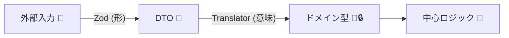
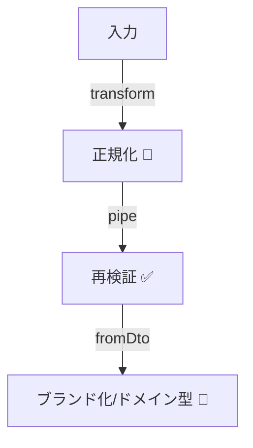

# 第23章　外部入力はZodで守る②：ドメイン型へ変換（翻訳）🗣️🔁

Zodはv4系が現行で、npm上の最新版は4.3.6（2026年1月時点）だよ📦✨ ([npm][1])

---

## 23.1 この章でできるようになること🎯✨

* 外から来たデータ（JSON/フォーム/URLクエリ）を **Zodで「形」を検査**できる🧱✅ ([Zod][2])
* 検査に通ったデータを、そのまま使わずに **ドメイン型に“翻訳”**できる🏭🔁
* エラーを **「入力が悪い」vs「仕様として起きる」**に分けて扱える🧾💡

---

## 23.2 なぜ「DTOのまま使う」が危ないの？😵‍💫💥

外部入力をZodで通して「OKだった！」となっても、DTO（ただのオブジェクト）のまま中心ロジックに入れると、あとでこんな事故が起きやすいよ🧨

* **意味が薄い**：`email: string` のままだと、正規化（小文字化/trim）やルールが散らばる🌀
* **単位が迷子**：`amount: number` が “円”なのか “ドル”なのか曖昧💴❓
* **欠損値の扱いがバラバラ**：`null`/`undefined`/空文字が混在しやすい🫠
* **中心が汚れる**：ドメインの関数が「入力の掃除」ばかりやることに…🧹😢

そこでやるのがこの章のテーマ👇

**「Zodで形を通す」→「ドメイン型へ翻訳する」** の2段階ガード🛡️🛡️



---

## 23.3 2段階ガードの基本形🧱➡️🏭


### ✅ 役割分担（ここが超大事！）

* Zod：**形・型・最低限の形式**（string/number、必須、email形式、uuid形式、範囲など）🧱✅
* 翻訳（Translator/Mapper）：**命名・単位・正規化・欠損の吸収**🗣️🔁
* ドメイン型（Value Objectなど）：**不変条件（ルール）を最終確定**🧱🔒

Zodは「parse then transform（検査してから変換）」の考え方が基本だよ✨ ([GitHub][3])
さらにZodは Input/Output を区別できて、変換後の型を「出力」として扱えるよ📤🧠 ([Zod][4])

---

## 23.4 例題：CreateUser の入力を「翻訳」して中心を守る👤📨➡️🏭

ここでは、外部から来る入力（DTO）を、ドメインで扱いやすい型へ変換する流れを作るよ😊✨

---

### 23.4.1 まずはDTOスキーマ（外から来る形）🧱📦


```ts
import * as z from "zod";

// 外部入力（DTO）を「検査＋軽い正規化」するスキーマ
export const CreateUserRequestSchema = z.object({
  // 外部は string で来る。uuid形式かをここで弾く
  userId: z.string().uuid(),

  // いったん trim & 小文字化 → その後 email形式を保証したい
  email: z
    .string()
    .transform((s) => s.trim().toLowerCase())
    .pipe(z.string().email()),

  // 表示名：空はダメ、長すぎもダメ
  displayName: z.string().trim().min(1).max(50),

  // 未指定なら false にしたい（欠損値を吸収）
  marketingOptIn: z.boolean().optional().default(false),
});

// ここがポイント！Input と Output が別になる（transform してるから）
export type CreateUserRequestInput = z.input<typeof CreateUserRequestSchema>;
export type CreateUserRequestDTO = z.output<typeof CreateUserRequestSchema>;
```

* `z.input`：外から来る “生” の型（transform前）🧊
* `z.output`：Zodが整えてくれた “使ってOK” の型（transform後）✨ ([Zod][4])

---

### 23.4.2 次にドメイン型（中心で信じたい形）🧱🔒

ここは「作れた＝正しい」を目指すよ💪✨（不変条件を閉じ込める）

```ts
// ✅ Result（超ミニ）
export type Result<T, E> =
  | { ok: true; value: T }
  | { ok: false; error: E };

export const ok = <T>(value: T): Result<T, never> => ({ ok: true, value });
export const err = <E>(error: E): Result<never, E> => ({ ok: false, error });

// ✅ ドメインエラー（表示しやすい形に）
export type DomainError =
  | { kind: "InvalidUserId"; message: string }
  | { kind: "InvalidEmail"; message: string }
  | { kind: "InvalidDisplayName"; message: string };

// ✅ Value Object例
export type UserId = string & { readonly __brand: "UserId" };
export type Email = string & { readonly __brand: "Email" };
export type DisplayName = string & { readonly __brand: "DisplayName" };

// UserId：uuidであることはZodで保証済みだけど
// 「これはUserIdだよ」という意味付けをする（取り違え防止）
export const UserId = {
  fromDto(value: string): Result<UserId, DomainError> {
    // ここでは追加ルールが無いなら素直にブランド化でOK
    return ok(value as UserId);
  },
};

export const Email = {
  fromDto(value: string): Result<Email, DomainError> {
    // 追加ルール例：会社の都合で「+」を禁止したい…など
    if (value.includes("+")) {
      return err({ kind: "InvalidEmail", message: "メールアドレスに + は使えません" });
    }
    return ok(value as Email);
  },
};

export const DisplayName = {
  fromDto(value: string): Result<DisplayName, DomainError> {
    // Zodでも min/max したけど、追加のドメインルールをここに置ける
    if (value.includes("admin")) {
      return err({ kind: "InvalidDisplayName", message: "displayName に admin は使えません" });
    }
    return ok(value as DisplayName);
  },
};

// ドメインで使うコマンド（中心が欲しい形）
export type CreateUserCommand = {
  userId: UserId;
  email: Email;
  displayName: DisplayName;
  marketingOptIn: boolean;
};
```

---

### 23.4.3 翻訳関数（DTO → ドメイン）🗣️➡️🏭

「Zodで通ったDTO」を、ドメイン型へまとめて変換するよ✨
この“翻訳所”があると、中心ロジックがずっと綺麗になる🧼💕

```ts
import { CreateUserRequestSchema, CreateUserRequestInput } from "./dto";
import { Result, ok, err, DomainError, UserId, Email, DisplayName, CreateUserCommand } from "./domain";
import * as z from "zod";

export type ValidationError = { kind: "Validation"; issues: { path: string; message: string }[] };
export type TranslateError = ValidationError | DomainError;

// Zodエラーを「画面に出しやすい形」に整形
function toValidationError(e: z.ZodError): ValidationError {
  return {
    kind: "Validation",
    issues: e.issues.map((i) => ({
      path: i.path.join("."),
      message: i.message,
    })),
  };
}

// DTO（外部入力）→ ドメイン（中心）へ翻訳
export function translateCreateUser(input: CreateUserRequestInput): Result<CreateUserCommand, TranslateError> {
  const parsed = CreateUserRequestSchema.safeParse(input);
  if (!parsed.success) {
    return err(toValidationError(parsed.error));
  }

  const dto = parsed.data; // ここからは「検査済みDTO」✨

  const idR = UserId.fromDto(dto.userId);
  if (!idR.ok) return err(idR.error);

  const emailR = Email.fromDto(dto.email);
  if (!emailR.ok) return err(emailR.error);

  const nameR = DisplayName.fromDto(dto.displayName);
  if (!nameR.ok) return err(nameR.error);

  return ok({
    userId: idR.value,
    email: emailR.value,
    displayName: nameR.value,
    marketingOptIn: dto.marketingOptIn,
  });
}
```

ここまでできると、中心ロジック側はこうなるよ👇（最高にスッキリ😍）

```ts
import { translateCreateUser } from "./translate";

export function handleCreateUser(raw: unknown) {
  const r = translateCreateUser(raw);

  if (!r.ok) {
    // kind で表示を分けられる✨
    if (r.error.kind === "Validation") {
      return { status: 400, body: { message: "入力が不正です", issues: r.error.issues } };
    }
    return { status: 400, body: { message: r.error.message } };
  }

  const cmd = r.value;
  // ここから先は、UserId/Email/DisplayName を信じて処理できる🧱🔒
  return { status: 200, body: { ok: true, userId: cmd.userId } };
}


```

---

## 23.5 Zodで「変換」と「検査」を気持ちよく分けるコツ✨🧠

### ✅ transform：正規化・整形（trim、小文字化、空白除去など）🧼✨

* 例：`"  Foo@EXAMPLE.com "` → `"foo@example.com"`
* Zodの基本は「検査してから変換」だよ📌 ([GitHub][3])

### ✅ pipe：変換した後に、もう一回検査したいとき🔁✅

* 例：trim後にemail判定（trim前だと落ちちゃうケースがある）📩

### ✅ refine：Zodで表現しにくい追加ルールを入れるとき🧩

* ただし、**ドメインの意味に近いルール**は、翻訳後（ドメイン型側）に寄せると散らばりにくいよ🧱💕

---

## 23.6 実務でハマりやすいポイントと対策🧯✨

### ① DTOの型を中心に流さない🚫📦

* DTOは境界の外側で完結させる（中心に入れない）🧱

### ② “欠損値”を翻訳所で吸収する🕳️➡️🧱

* `optional().default(...)` はすごく便利✨（「中心は常にboolean」とかにできる）

### ③ エラーを「表示向け」に整える🧾👀

* Zodの`issues`はそのまま返しても良いけど、UIに合わせて `path`/`message` へ変換すると扱いやすい🙆‍♀️

### ④ asyncな検査があるなら parseAsync/safeParseAsync を使う⚡

* たとえば「メールアドレス重複チェック」を翻訳中にやるなら async になるよね🏃‍♀️💨
* async transform を使うなら `parseAsync` 系が前提になるよ📌 ([GitHub][5])

---

## 23.7 演習問題🧪💖（手を動かすと一気に腹落ち！）

### 演習1：Emailの正規化を強化しよう📩🧼

* `email` を `trim + 小文字化` したうえで

  * 連続する空白があったらエラー（例：`"a  b@example.com"` はNG）にしてみよう🚫

ヒント：Zod側で `.refine()`、またはドメイン `Email.fromDto()` 側でチェック🧠✨

---

### 演習2：ニックネーム（任意）を「中心は常にある」にしよう🙂🎀

DTOには `nickname?: string` を追加して、

* 未指定 → `"（未設定）"` にする
* 指定あり → trim して `min(1)` を満たさなければエラー

を作ってみよう✨

---

### 演習3：UserIdの取り違え事故を止めよう🪪🛑

`UserId` と `ProductId` を **別ブランド**で作って、

* `function buy(userId: UserId, productId: ProductId)`
  に対して、引数の順番を間違えたらコンパイルで落ちるようにしてみよう💥✅

---

### 演習4：エラーを「1回で全部返す」モードを作ろう📚🧾

今の翻訳は、最初に見つけたドメインエラーで止まる設計だよね👀
これを、

* UserId / Email / DisplayName のエラーを **全部集めて返す**（配列で返す）

にしてみよう✨（フォームUIだと超便利！）

---

## 23.8 章末チェックリスト✅✨

* [ ] Zodで「形」と「最低限の形式」を弾ける🧱✅
* [ ] `z.input` と `z.output` の違いが分かる📥📤 ([Zod][4])
* [ ] DTOをそのまま中心に流さず、翻訳所でドメイン型へ変換できる🏭🔁
* [ ] エラーを「入力が悪い（Validation）」と「ドメインルール違反」に分けられる🧾💡
* [ ] 中心ロジック側が「掃除コード」だらけにならない🧼💖

[1]: https://www.npmjs.com/package/zod?utm_source=chatgpt.com "Zod"
[2]: https://zod.dev/api?utm_source=chatgpt.com "Defining schemas"
[3]: https://v3.zod.dev/?utm_source=chatgpt.com "Zod | Documentation"
[4]: https://zod.dev/codecs?utm_source=chatgpt.com "Codecs"
[5]: https://github.com/colinhacks/zod/issues/5459?utm_source=chatgpt.com "Zod v4: Transform function loses type inference with ..."

