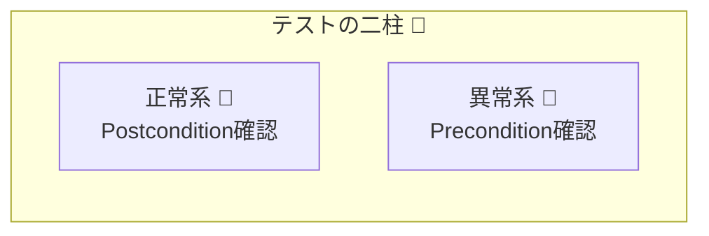

## 第24章　DbC×テスト：契約を「壊れない仕組み」にする🧪🔒


## この章でやること🎯✨

DbC（契約）って「書いた」だけだと、いつの間にか消えたり薄まったりします😵‍💫
だから **テストで“契約が守られ続ける仕組み”** にします💪🧪

この章では👇をできるようにします✨

* 正常系テストで「約束どおりに動く🙂」を固定する✅
* 契約違反テストで「壊れた入力は入口で止める🛑」を固定する✅
* 境界値（0/空/最大など）を“セット”で固める🍎📏
* できれば「型の契約（type test）」も一緒に守る🧷✅（Vitestの機能）

---

## まず最重要：テストは“仕様”じゃなくて“約束”を固定する🧠🔒


DbCのテストは、ざっくり2種類です👇

### ① 正常系テスト🙂✅

「正しい入力なら、**事後条件（Post）** が守られる」
例：振込が成功したら残高が減る、合計が一致する、など💸📉

### ② 契約違反テスト🛑⚠️

「壊れた入力なら、**事前条件（Pre）** で確実に止まる」
例：負の金額、空文字、範囲外、など🚫

この2つを“セット”にすると、後から誰かがコードを変えても、契約が崩れません🔒✨



---

## 2026時点のおすすめ：Vitestでサクッと回す⚡🧪

最近のTypeScript（現行リリース）に合わせて、テストは軽快に回したいです💨
VitestはViteベースの次世代テストフレームワークで、体験が良いです✨ ([Vitest][1])
`expect` 系のアサーションも充実してます🧪 ([Vitest][2])

> ちなみに TypeScript の最新リリースノートは 5.9 が参照点になります（2026-01-21 更新）🆕 ([TypeScript][3])

---

## セットアップ（最短コース）🧰⚡

### 1) 依存関係を入れる📦

```bash
npm i -D vitest typescript @types/node
```

### 2) `package.json` に scripts を追加▶️

```json
{
  "scripts": {
    "test": "vitest",
    "test:watch": "vitest --watch",
    "test:run": "vitest run"
  }
}
```

### 3) テストファイル命名ルール📁

* `src/**/__tests__/**/*.test.ts`
* もしくは `src/**/*.test.ts`

---

## 例題：お金の振込で「契約＋テスト」を1本にする💸🧱🧪

### お題の契約（宣言）📘✨

* **Pre（事前条件）**

  * 送金額は 1 以上
  * 送金元残高は十分ある
* **Post（事後条件）**

  * 成功したら `from` は減る、`to` は増える
  * 合計（from+to）は変わらない（手数料なし想定）
* **Invariant（不変条件）**

  * `Money` は常に 0 以上（負は作れない）

---

## 実装（最小サンプル）🧩

### `src/contract.ts`（契約違反エラー）💥

```ts
export class ContractError extends Error {
  override name = "ContractError";
}
```

### `src/assert.ts`（アサーション関数）🛡️

```ts
import { ContractError } from "./contract";

export function assert(condition: unknown, message: string): asserts condition {
  if (!condition) throw new ContractError(message);
}

export function assertNonNegativeInt(n: number, label: string): asserts n is number {
  assert(Number.isInteger(n), `${label} は整数である必要があります`);
  assert(n >= 0, `${label} は 0 以上である必要があります`);
}

export function assertPositiveInt(n: number, label: string): asserts n is number {
  assert(Number.isInteger(n), `${label} は整数である必要があります`);
  assert(n >= 1, `${label} は 1 以上である必要があります`);
}
```

### `src/money.ts`（不変条件は“作成時”に確定）🧱✨

```ts
import { assertNonNegativeInt } from "./assert";

export class Money {
  private constructor(private readonly value: number) {}

  static of(value: number): Money {
    assertNonNegativeInt(value, "money");
    return new Money(value);
  }

  toNumber(): number {
    return this.value;
  }

  add(other: Money): Money {
    return Money.of(this.value + other.value);
  }

  sub(other: Money): Money {
    // ここでは「結果が負にならない」も不変条件として守る
    return Money.of(this.value - other.value);
  }
}
```

### `src/transfer.ts`（Pre/Postをテストしやすく）💸

```ts
import { Money } from "./money";
import { assert } from "./assert";

export function transfer(from: Money, to: Money, amount: Money) {
  const beforeTotal = from.toNumber() + to.toNumber();

  // Pre: amount は 1 以上（Money は 0 以上なので、ここでは 1 以上を追加で要求）
  assert(amount.toNumber() >= 1, "amount は 1 以上である必要があります");

  // Pre: 残高不足は禁止
  assert(from.toNumber() >= amount.toNumber(), "残高不足です");

  const afterFrom = Money.of(from.toNumber() - amount.toNumber());
  const afterTo = Money.of(to.toNumber() + amount.toNumber());

  // Post: 合計は変わらない（手数料なし）
  const afterTotal = afterFrom.toNumber() + afterTo.toNumber();
  assert(afterTotal === beforeTotal, "Postcondition violated: 合計が一致しません");

  return { from: afterFrom, to: afterTo };
}
```

---

## テストを書く（正常＋契約違反）🧪🔒

### `src/transfer.test.ts` ✅🛑

```ts
import { describe, it, expect } from "vitest";
import { Money } from "./money";
import { transfer } from "./transfer";
import { ContractError } from "./contract";

describe("transfer 💸", () => {
  it("正常系🙂: amount だけ from が減り to が増える", () => {
    const from = Money.of(100);
    const to = Money.of(20);
    const amount = Money.of(30);

    const result = transfer(from, to, amount);

    expect(result.from.toNumber()).toBe(70);
    expect(result.to.toNumber()).toBe(50);

    // Postの“別視点”チェック（合計が保存される）
    expect(result.from.toNumber() + result.to.toNumber()).toBe(120);
  });

  it("契約違反🛑: amount が 0 は入口で止まる", () => {
    const from = Money.of(100);
    const to = Money.of(20);
    const amount = Money.of(0);

    expect(() => transfer(from, to, amount)).toThrow(ContractError);
    expect(() => transfer(from, to, amount)).toThrow("amount は 1 以上");
  });

  it("契約違反🛑: 残高不足は入口で止まる", () => {
    const from = Money.of(10);
    const to = Money.of(0);
    const amount = Money.of(30);

    expect(() => transfer(from, to, amount)).toThrow(ContractError);
    expect(() => transfer(from, to, amount)).toThrow("残高不足");
  });

  it("不変条件🧱: Money は負の値を作れない", () => {
    expect(() => Money.of(-1)).toThrow(ContractError);
    expect(() => Money.of(-1)).toThrow("0 以上");
  });
});
```

### 実行▶️

```bash
npm test
```

---

## 境界値テストの“型”🍎📏（これ、超効きます🔥）

境界値は「単発」じゃなくて **セットで** 固めます✅

例：金額なら👇

* 0（ダメ/OKどっち？）
* 1（最小OK）
* 最大（上限があるなら）
* ちょい超え（上限+1）

テスト名も揃えると読みやすいです📚✨

* `amount=0 は契約違反`
* `amount=1 は正常`
* `amount=max は正常`
* `amount=max+1 は契約違反`


---

## 「契約違反テスト」3つのコツ🧠🧪

### 1) “どの条件で止めたか”が分かるメッセージにする🧭✨

`"残高不足です"` みたいに、直す方向が見えると最高です🙂

### 2) 例外の型を固定する🧱

契約違反は `ContractError` で統一すると、仕様エラーと混ざらないです🔒

### 3) 例外メッセージまでテストする（やりすぎ注意😌）

* **重要な契約**はメッセージまで固定✅
* 文言変更が多いところは型だけ固定でもOK🙂

---

## 型の契約もテストできる（Type Test）🧷🧪✨

「型で守りたい約束」も、テストで壊れにくくできます💪
Vitestは `expectTypeOf` / `assertType` などで型テストができます🧷 ([Vitest][4])

例：`Money.of()` の戻り値が `Money` であることを型として保証する、など🙂

---

## Jest派の人へ（ts-jest）📦🧪

もし既存プロジェクトがJestなら、TypeScriptは `ts-jest` で繋げられます🔁 ([Jest][5])
ESM絡みの設定ポイントも公式ガイドにまとまってます🧭 ([Kulshekhar][6])

---

## Nodeの標準テストランナーもある（選択肢）🧪🟢

Nodeにはビルトインの `node:test` があり、テスト実行・レポーターなども用意されています🧰 ([nodejs.org][7])
ただ、TypeScriptをどう流すかはプロジェクト方針で変わるので、まずはVitest（またはJest）で「迷いを減らす」のが楽です🙂✨

---

## 演習✍️🧪（1機能に“正常＋契約違反”を両方書く）

### お題：ユーザー登録の契約を固めよう👤🧱

#### 仕様（ざっくり）🙂

* `Email.create(text)`

  * Pre: 空文字NG、`@` を含む
  * Invariant: `Email` は常に正しい形式
* `registerUser(email)`

  * Post: 成功したら `userId` が返る（空じゃない）

#### やること✅

1. 正常系：正しい email で登録できる🙂
2. 契約違反：空文字で止まる🛑
3. 契約違反：`"abc"`（@なし）で止まる🛑
4. 境界値：最短のそれっぽいメール（例：`a@b.c`）は通す？通さない？🤔（どっちでもOK、決めたらテストで固定🔒）

---

## 章末チェックリスト✅🧪

* [ ] 正常系テストで Postcondition が固定されてる🙂
* [ ] 契約違反テストで Precondition が固定されてる🛑
* [ ] 境界値（0/1/最大/超え）を“セット”で入れた🍎📏
* [ ] 契約違反の例外型が統一されてる🧱
* [ ] 重要な契約はメッセージ（または識別子）まで追えてる🧭
* [ ] （できれば）型テストも入れて“型の契約”も守れてる🧷✨

[1]: https://vitest.dev/guide/?utm_source=chatgpt.com "Getting Started | Guide"
[2]: https://vitest.dev/api/expect.html?utm_source=chatgpt.com "expect"
[3]: https://www.typescriptlang.org/docs/handbook/release-notes/typescript-5-9.html?utm_source=chatgpt.com "Documentation - TypeScript 5.9"
[4]: https://vitest.dev/guide/testing-types?utm_source=chatgpt.com "Testing Types | Guide"
[5]: https://jestjs.io/docs/getting-started?utm_source=chatgpt.com "Getting Started"
[6]: https://kulshekhar.github.io/ts-jest/docs/guides/esm-support?utm_source=chatgpt.com "ESM Support | ts-jest"
[7]: https://nodejs.org/api/test.html?utm_source=chatgpt.com "Test runner | Node.js v25.4.0 Documentation"

