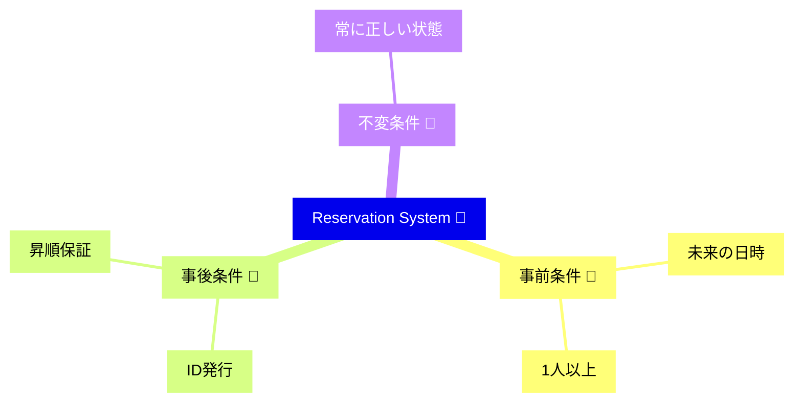

# 第25章　総合ミニプロジェクト：契約で守る“小さな予約システム”📅🚀

## この章でやること（ゴール）🎯✨

この章では、「型🧷＋実行時チェック🛡️＋テスト🧪」を**1本の流れ**としてつなげて、ミニ予約システムを完成させます💪✨

* 予約作成：日付は未来🕒➡️🌈、人数は1以上🧍‍♀️
* キャンセル：すでにキャンセル済みは不可🚫
* 一覧：重複なし、並び順（例：日付昇順）を保証📈✨

---

## 2026/1 時点の “道具”メモ🧰📝（この章のコードと相性◎）

* TypeScript：npm の最新は **5.9.3**（5.9系が安定） ([npm][1])
* Node.js：**v24 が Active LTS**、v25 は Current ([Node.js][2])
* Vitest：**4.0**（メジャー更新） ([Vitest][3])
* Zod：**4.3.6**（v4系が本流） ([npm][4])
* tsx：TS をサクッと実行できる（最新 4.21.0） ([npm][5])

---

## まずは「契約表」を作ろう📘✨（ここがDbCの肝）


予約システムを作る前に、**守りたい約束（契約）**を1枚にします🧡
（あとでテストにも直結します🧪）

### 予約作成（CreateReservation）

* 事前条件（Pre）🚪✅

  * `partySize >= 1`
  * `when` は “日時として解釈できる”
  * `when` は **未来**（今より後）
* 事後条件（Post）🎁✅

  * 予約が保存される（IDが発行される）
  * 作成直後は `status = ACTIVE`
* 不変条件（Invariant）🧱✨

  * `partySize >= 1`
  * `status = CANCELLED` のときだけ `cancelledAt` が存在する（逆も同じ）

### キャンセル（CancelReservation）

* 事前条件（Pre）🚪✅

  * 対象の予約が存在する
  * まだキャンセルされていない（キャンセル済みは不可🚫）
* 事後条件（Post）🎁✅

  * `status = CANCELLED`
  * `cancelledAt` が入る

### 一覧（ListReservations）

* 事後条件（Post）🎁✅

  * 重複がない（IDがユニーク）
  * 並び順が保証される（この章では「日時昇順」で固定📈）



---

## 全体設計（超ざっくり地図）🗺️✨


* **境界（外から来る入力）**：Zod でバリデーション🧱✅
* **中心（ドメイン）**：不変条件を守るモデル🧱✨
* **ユースケース**：作成/キャンセル/一覧の流れをまとめる🔗
* **テスト**：正常系＋境界値＋禁止ケースを固める🧪🔒

---

## 0）プロジェクト作成（最短ルート）⚡

### 0-1. 初期化 & 依存関係📦

新しいフォルダを作って、ターミナルで👇

```bash
mkdir dbc-reservation
cd dbc-reservation
npm init -y

npm i zod
npm i -D typescript vitest tsx @types/node
```

### 0-2. package.json scripts 追加🏃‍♀️

`package.json` の `"scripts"` をこうします👇

```json
{
  "scripts": {
    "dev": "tsx src/demo.ts",
    "test": "vitest run",
    "test:watch": "vitest",
    "build": "tsc -p tsconfig.json"
  }
}
```

### 0-3. tsconfig.json 作成🧷

プロジェクト直下に `tsconfig.json`：

```json
{
  "compilerOptions": {
    "target": "ES2022",
    "module": "NodeNext",
    "moduleResolution": "NodeNext",
    "strict": true,
    "noUncheckedIndexedAccess": true,
    "exactOptionalPropertyTypes": true,
    "skipLibCheck": true,
    "rootDir": "src",
    "outDir": "dist"
  },
  "include": ["src"]
}
```

### 0-4. vitest.config.ts 作成🧪

`vitest.config.ts` を作ります👇（ViteなしでもOKな書き方） ([Vitest][6])

```ts
import { defineConfig } from "vitest/config";

export default defineConfig({
  test: {
    environment: "node"
  }
});
```

---

## 1）フォルダ構成📁✨

この章はこう分けるとスッキリします🧼

```text
src/
  domain/
    reservation.ts
  usecase/
    reservationService.ts
  boundary/
    schemas.ts
  shared/
    contract.ts
    errors.ts
    result.ts
    clock.ts
  demo.ts
  reservation.test.ts
```

---

## 2）共通：Result / エラー / Clock を作る🧰✨

ここは「設計の下ごしらえ」です🔪🥕

### 2-1. Result（仕様として起きる失敗用）📦

`src/shared/result.ts`

```ts
export type Result<T, E> =
  | { ok: true; value: T }
  | { ok: false; error: E };

export const ok = <T>(value: T): Result<T, never> => ({ ok: true, value });
export const err = <E>(error: E): Result<never, E> => ({ ok: false, error });
```

### 2-2. エラー（契約違反とドメイン失敗を分ける）🧾✨

`src/shared/errors.ts`

```ts
export class ContractViolationError extends Error {
  constructor(message: string) {
    super(message);
    this.name = "ContractViolationError";
  }
}

// 仕様として起きうる失敗（ユーザー操作でも起きるやつ）
export abstract class DomainError extends Error {
  abstract readonly code: string;

  constructor(message: string) {
    super(message);
    this.name = "DomainError";
  }
}

export class ValidationError extends DomainError {
  readonly code = "VALIDATION_ERROR";
  constructor(public readonly issues: string[]) {
    super("入力が不正です");
  }
}

export class NotFoundError extends DomainError {
  readonly code = "NOT_FOUND";
  constructor() {
    super("対象が見つかりません");
  }
}

export class AlreadyCancelledError extends DomainError {
  readonly code = "ALREADY_CANCELLED";
  constructor() {
    super("すでにキャンセル済みです");
  }
}
```

### 2-3. Clock（“未来”判定をテストで安定させる）🕒🧪

`src/shared/clock.ts`

```ts
export interface Clock {
  now(): Date;
}

export const SystemClock: Clock = {
  now: () => new Date()
};

export const fixedClock = (fixed: Date): Clock => ({
  now: () => new Date(fixed)
});
```

### 2-4. 契約用アサート関数（読みやすさ爆上がり）🧩✨

`src/shared/contract.ts`

```ts
import { ContractViolationError } from "./errors";

export function assertContract(
  condition: unknown,
  message: string
): asserts condition {
  if (!condition) {
    throw new ContractViolationError(message);
  }
}

export function assertDateValid(d: Date, message: string) {
  assertContract(!Number.isNaN(d.getTime()), message);
}

export function assertFuture(d: Date, now: Date, message: string) {
  assertContract(d.getTime() > now.getTime(), message);
}

export function assertSortedAsc<T>(
  items: readonly T[],
  key: (t: T) => number,
  message: string
) {
  for (let i = 1; i < items.length; i++) {
    assertContract(key(items[i - 1]) <= key(items[i]), message);
  }
}

export function assertNoDuplicates<T>(
  items: readonly T[],
  key: (t: T) => string,
  message: string
) {
  const set = new Set<string>();
  for (const it of items) {
    const k = key(it);
    assertContract(!set.has(k), message);
    set.add(k);
  }
}
```

---

## 3）境界：Zodで入力を受けて「中心が食べられる形」に翻訳🗣️🔁

外から来る値は信用しません🙂‍↔️
Zodで「形のチェック」＋「変換」までやっちゃいます✨

`src/boundary/schemas.ts`

```ts
import { z } from "zod";
import { err, ok, Result } from "../shared/result";
import { ValidationError } from "../shared/errors";
import type { Clock } from "../shared/clock";

// datetime文字列は Z や +09:00 みたいな offset 付きが現実的💡
// Zodは datetime の検証ができる（例: ISO 8601）:contentReference[oaicite:6]{index=6}
const CreateReservationSchema = z.object({
  when: z.string().datetime({ offset: true }),
  partySize: z.number().int().min(1)
});

export type CreateReservationInput = {
  when: Date;
  partySize: number;
};

export function parseCreateReservation(
  input: unknown,
  clock: Clock
): Result<CreateReservationInput, ValidationError> {
  const parsed = CreateReservationSchema.safeParse(input);
  if (!parsed.success) {
    return err(new ValidationError(parsed.error.issues.map(i => i.message)));
  }

  const when = new Date(parsed.data.when);
  if (Number.isNaN(when.getTime())) {
    return err(new ValidationError(["when が日時として解釈できません"]));
  }

  // “未来”はユーザー入力ミスとして扱えるので、ここで優しく弾く💡
  if (when.getTime() <= clock.now().getTime()) {
    return err(new ValidationError(["when は未来の日時にしてください"]));
  }

  return ok({ when, partySize: parsed.data.partySize });
}

const CancelSchema = z.object({
  id: z.string().uuid()
});

export function parseCancelReservation(
  input: unknown
): Result<{ id: string }, ValidationError> {
  const parsed = CancelSchema.safeParse(input);
  if (!parsed.success) {
    return err(new ValidationError(parsed.error.issues.map(i => i.message)));
  }
  return ok(parsed.data);
}
```

---

## 4）ドメイン：予約（不変条件の中心）🧱✨

`src/domain/reservation.ts`

```ts
import { assertContract, assertDateValid, assertFuture } from "../shared/contract";
import type { Clock } from "../shared/clock";

export type ReservationStatus = "ACTIVE" | "CANCELLED";

export type Reservation = Readonly<{
  id: string;
  when: Date;
  partySize: number;
  status: ReservationStatus;
  createdAt: Date;
  cancelledAt?: Date;
}>;

export function createReservationModel(params: {
  id: string;
  when: Date;
  partySize: number;
  clock: Clock;
}): Reservation {
  // ここは “中心の安全装置” 🔒
  // 境界で弾いてるはずだけど、万一ここに悪い値が来たら「内部のバグ」なので契約違反として落とす💥
  assertContract(params.partySize >= 1, "Invariant: partySize は 1 以上");
  assertDateValid(params.when, "Pre: when は有効な Date");
  assertFuture(params.when, params.clock.now(), "Pre: when は未来の日時");

  const createdAt = params.clock.now();

  const r: Reservation = {
    id: params.id,
    when: new Date(params.when),
    partySize: params.partySize,
    status: "ACTIVE",
    createdAt: new Date(createdAt)
  };

  // 不変条件（作れた＝正しい状態）✨
  assertContract(r.partySize >= 1, "Invariant: partySize は 1 以上");
  assertContract(r.status === "ACTIVE", "Post: 作成直後は ACTIVE");

  return r;
}

export function cancelReservationModel(r: Reservation, clock: Clock): Reservation {
  // ここは “状態遷移” 🔁
  const cancelledAt = clock.now();
  const next: Reservation = {
    ...r,
    status: "CANCELLED",
    cancelledAt: new Date(cancelledAt)
  };

  // 不変条件
  assertContract(next.status === "CANCELLED", "Post: cancel 後は CANCELLED");
  assertContract(!!next.cancelledAt, "Post: cancel 後は cancelledAt が入る");

  return next;
}
```

---

## 5）ユースケース：作成／キャンセル／一覧をつなぐ🔗✨

`src/usecase/reservationService.ts`

```ts
import { randomUUID } from "node:crypto";
import type { Clock } from "../shared/clock";
import { assertNoDuplicates, assertSortedAsc, assertContract } from "../shared/contract";
import { err, ok, Result } from "../shared/result";
import { AlreadyCancelledError, NotFoundError } from "../shared/errors";
import {
  Reservation,
  cancelReservationModel,
  createReservationModel
} from "../domain/reservation";

type Store = Map<string, Reservation>;

export class ReservationService {
  private readonly store: Store = new Map();

  constructor(private readonly clock: Clock) {}

  // Create
  create(when: Date, partySize: number): string {
    const id = randomUUID();
    const r = createReservationModel({ id, when, partySize, clock: this.clock });
    this.store.set(id, r);
    return id;
  }

  // Cancel（仕様として起きうる失敗は Result で返す🎁）
  cancel(id: string): Result<void, AlreadyCancelledError | NotFoundError> {
    const current = this.store.get(id);
    if (!current) return err(new NotFoundError());
    if (current.status === "CANCELLED") return err(new AlreadyCancelledError());

    const next = cancelReservationModel(current, this.clock);
    this.store.set(id, next);
    return ok(undefined);
  }

  // List（保証：重複なし＆日時昇順📈）
  list(): Reservation[] {
    const items = [...this.store.values()].sort(
      (a, b) => a.when.getTime() - b.when.getTime()
    );

    // “出力の約束” は Postcondition として固める✅（壊れたら内部バグ）
    assertNoDuplicates(items, r => r.id, "Post: 一覧は重複なし");
    assertSortedAsc(items, r => r.when.getTime(), "Post: 一覧は日時昇順");

    // ついでに、全要素の不変条件も軽くチェック（安心）🧱
    for (const r of items) {
      assertContract(r.partySize >= 1, "Invariant: partySize は 1 以上");
      if (r.status === "CANCELLED") {
        assertContract(!!r.cancelledAt, "Invariant: CANCELLED なら cancelledAt 必須");
      }
    }

    return items;
  }
}
```

---

## 6）デモ（動かしてみる）🎮✨

`src/demo.ts`

```ts
import { SystemClock } from "./shared/clock";
import { ReservationService } from "./usecase/reservationService";

const svc = new ReservationService(SystemClock);

const in1hour = new Date(Date.now() + 60 * 60 * 1000);
const in2hour = new Date(Date.now() + 2 * 60 * 60 * 1000);

const id1 = svc.create(in2hour, 2);
const id2 = svc.create(in1hour, 1);

console.log("作成:", { id1, id2 });

console.log("一覧(昇順):", svc.list().map(r => ({ id: r.id, when: r.when.toISOString(), status: r.status })));

console.log("キャンセル:", id1, svc.cancel(id1));
console.log("キャンセル(2回目):", id1, svc.cancel(id1)); // これは Err が返るはず

console.log("一覧:", svc.list().map(r => ({ id: r.id, status: r.status })));
```

実行👇

```bash
npm run dev
```

---

## 7）テスト（正常＋禁止ケース＋並び順）🧪🔒

`src/reservation.test.ts`

```ts
import { describe, expect, test } from "vitest";
import { fixedClock } from "./shared/clock";
import { ReservationService } from "./usecase/reservationService";
import { parseCreateReservation } from "./boundary/schemas";

describe("予約システム（DbCミニプロジェクト）", () => {
  test("予約作成→一覧は日時昇順＆重複なし📈", () => {
    const clock = fixedClock(new Date("2026-01-01T00:00:00.000Z"));
    const svc = new ReservationService(clock);

    const t1 = new Date("2026-01-01T02:00:00.000Z");
    const t2 = new Date("2026-01-01T01:00:00.000Z");

    const id1 = svc.create(t1, 2);
    const id2 = svc.create(t2, 1);

    const list = svc.list();
    expect(list.map(r => r.id).sort()).toEqual([id1, id2].sort());
    expect(list[0].when.getTime()).toBeLessThanOrEqual(list[1].when.getTime());
  });

  test("キャンセルは1回だけOK、2回目はErr🚫", () => {
    const clock = fixedClock(new Date("2026-01-01T00:00:00.000Z"));
    const svc = new ReservationService(clock);

    const t = new Date("2026-01-01T01:00:00.000Z");
    const id = svc.create(t, 1);

    expect(svc.cancel(id).ok).toBe(true);
    const second = svc.cancel(id);
    expect(second.ok).toBe(false);
    if (!second.ok) expect(second.error.code).toBe("ALREADY_CANCELLED");
  });

  test("境界(Zod)で、過去日時は優しく弾く🧱", () => {
    const clock = fixedClock(new Date("2026-01-01T00:00:00.000Z"));

    const input = { when: "2025-12-31T23:59:59.000Z", partySize: 1 };
    const r = parseCreateReservation(input, clock);

    expect(r.ok).toBe(false);
    if (!r.ok) expect(r.error.code).toBe("VALIDATION_ERROR");
  });

  test("境界(Zod)で、人数0は弾く🧱", () => {
    const clock = fixedClock(new Date("2026-01-01T00:00:00.000Z"));

    const input = { when: "2026-01-01T00:00:01.000Z", partySize: 0 };
    const r = parseCreateReservation(input, clock);

    expect(r.ok).toBe(false);
  });
});
```

実行👇

```bash
npm test
```

---

## 8）この章の“おいしいポイント”まとめ😋✨

### ① 境界で弾く🧱

* ユーザー入力ミスは **Result/ValidationError** で返す🎁（落ち着いた失敗）

### ② 中心は「不変条件」を守る🧱✨

* 中心に悪い値が来たら **契約違反（内部バグ）** として強めに落とす💥
  → 「境界が漏れた」「内部の呼び出しが間違えた」がすぐ分かる🔦

### ③ 一覧の“約束”は Postcondition で固める📈✅

* 「重複なし」「順序保証」は**使う側に超うれしい**🎀
  だからこそ、返す直前にチェックして守る💪

---

## 章末チェックリスト✅✨

* [ ] 予約作成の Pre（未来・人数）を境界で弾けてる🧱
* [ ] ドメイン側で不変条件チェックがある🧱
* [ ] キャンセル2回目が Err になる🚫
* [ ] 一覧が日時昇順📈＆重複なし✨
* [ ] テストが「正常＋禁止＋境界値」を押さえてる🧪🔒

---

## 追加演習（やると実務感アップ！）🧩✨

1. 🧍‍♀️人数上限を追加

* Pre：`partySize <= 20` みたいに上限を入れてみる
* テストも追加🧪

2. ⏰予約の変更（Reschedule）

* Pre：未来のみ
* Post：変更後の `when` が保存される
* “すでにキャンセル済みは変更不可” をどう扱う？🤔

3. 🔁DTO→ドメイン変換をもっと明確に

* `parseCreateReservation` の返り値を「ドメイン用の型」に寄せる（翻訳っぽく）🗣️✨

---

## 🤖AI活用ポイント（コピペで使えるプロンプト例）✨

### 雛形生成（速い⚡）

* 「Vitestで `予約作成→一覧は日時昇順` のテストケースを3つ作って。境界値も入れて」

### 契約表の整理（見落とし防止👀）

* 「予約システムの Create/Cancel/List の Pre/Post/Invariant を表にして。漏れがあれば指摘して」

### リファクタ案（読みやすく🧼）

* 「`ReservationService` を“契約が読みやすい順番”に整形して。assertメッセージも改善して」

[1]: https://www.npmjs.com/package/typescript?utm_source=chatgpt.com "TypeScript"
[2]: https://nodejs.org/en/about/previous-releases?utm_source=chatgpt.com "Node.js Releases"
[3]: https://vitest.dev/blog/vitest-4?utm_source=chatgpt.com "Announcing Vitest 4.0"
[4]: https://www.npmjs.com/package/zod?utm_source=chatgpt.com "Zod"
[5]: https://www.npmjs.com/package/tsx?utm_source=chatgpt.com "tsx"
[6]: https://vitest.dev/config/?utm_source=chatgpt.com "Configuring Vitest"

