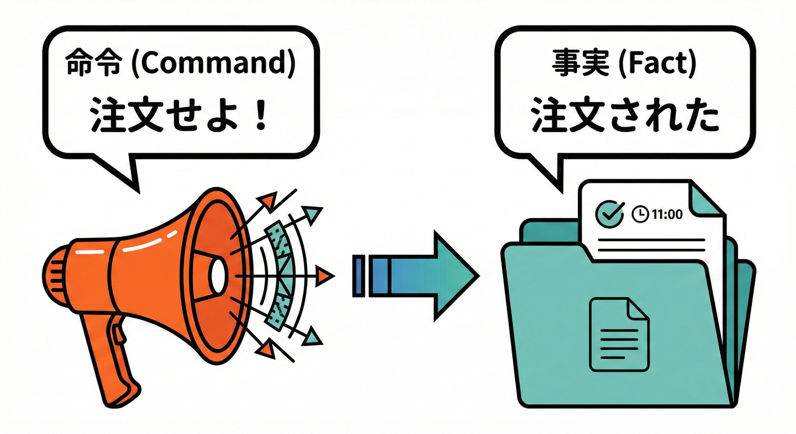

# 第02章：学習題材を決めよう🎁🛒（ミニEC）

## 2.1 この章のゴール🎯✨

この章が終わると…

* 「ミニEC（ネットショップ）」の**業務フロー**を、ざっくり説明できる📦💳📩
* そのフローから、**ドメインイベント（起きた事実）**を **3〜6個** 選べる🧾✨
* 「イベント名の粒度（大きすぎ/小さすぎ）」を、ちょっとだけ嗅ぎ分けられる👃⚖️

---

## 2.2 ミニECってどんな題材？🛍️🐾（超ざっくりストーリー）

題材はシンプルなネットショップでOKです🙆‍♀️✨
たとえば「ねこグッズ屋さん」🐱🎀

登場するもの（最低限）👇

* お客さん（購入する人）👩‍🦰
* 注文（Order）🧾
* 支払い（Payment）💳
* 発送（Shipping）📦
* 通知（Notification）📩

ここで大事なのは…
**“画面”じゃなくて“業務の流れ”** を主役にすることです🎬✨
（画面は後でいくらでも足せるけど、業務の流れが弱いとイベントも弱くなりがち😵‍💫）

---

## 2.3 まずは「業務フロー」を描こう🗺️🖊️（文章でOK）

フロー図って聞くと難しそうだけど、最初は**文章の矢印**で十分です🙌✨
（きれいな図は後で！今は “流れが分かる” が最優先💨）

### ✅ ハッピーパス（成功する流れ）🌈

まずは「だいたいこうなるよね」っていう成功ルートだけ作ります👇

1. お客さんが購入ボタンを押す🛒
2. 注文が作られる🧾
3. 支払いが完了する💳✅
4. 発送される📦🚚
5. お客さんに通知される📩✨

この章の範囲は、これでOKです👍
（返品とか在庫切れとかは “追加で考える” で大丈夫🙆‍♀️）

---

## 2.4 フローから「イベント候補」を抜き出すコツ🔍✨

ドメインイベントは一言でいうと…

**「業務で起きた“事実”（過去形）」** です⏳🧾

### ✅ コツ1：動詞が “した/された” になってる？（過去形）⏳

* 🙆‍♀️ `OrderPlaced`（注文が置かれた＝注文された）
* 🙆‍♀️ `OrderPaid`（注文が支払われた）
* 🙆‍♀️ `OrderShipped`（注文が発送された）

### ❌ コツ2：「命令」っぽい名前は避けがち📮❌

* 🙅‍♀️ `SendEmail`（メール送れ！）
* 🙅‍♀️ `ChargeCreditCard`（カード課金しろ！）

命令は「やること」なので、イベントより **コマンド寄り** です🧠
イベントは「起きたこと」なので、まず **事実** に寄せます✨

### ✅ コツ3：イベントは “転換点” に生まれやすい💥

フローの中で「状態が変わる瞬間」に注目👀✨

* 注文が “作成された”
* 支払いが “完了した/失敗した”
* 発送が “始まった/完了した”

---

## 2.5 3〜6個に絞る！おすすめイベントセット🍱✨

イベントを増やすと気持ちいいけど、最初は**少ないほど勝ち**です🏆😆
（増やすのは簡単、減らすのは大変…！）

### 🍙 最小セット（3つ）まずはこれでOK！

* `OrderPlaced` 🧾
* `OrderPaid` 💳✅
* `OrderShipped` 📦🚚

👉 これだけでも「後から通知追加」などがやりやすくなります🔌✨

### 🍱 標準セット（5つ）ちょいリアルにするなら

* `OrderPlaced` 🧾
* `PaymentFailed` 💳💥
* `OrderPaid` 💳✅
* `OrderCanceled` 🗑️
* `OrderShipped` 📦🚚

👉 **失敗** と **キャンセル** が入ると、一気に “業務っぽさ” が出ます🧑‍💼✨

### 🧁 追加候補（今は選ばなくてOK）

* `ShipmentDelivered`（配達完了）🏠📦
* `RefundIssued`（返金された）💸
* `OrderConfirmed`（確認された）✅
* `StockReserved`（在庫が確保された）📦🔒

---

## 2.6 演習✍️：あなたのミニECのイベント候補を書いてみよう🎀

次のテンプレを埋めてみてね📝✨
（英語名が不安なら、まず日本語→あとで英語でもOK🙆‍♀️）

### ✅ ステップ1：フロー（成功ルート）を書く🗺️

* ① __________________
* ② __________________
* ③ __________________
* ④ __________________
* ⑤ __________________

### ✅ ステップ2：その中で「事実（過去形）」になってる所を拾う⛏️

* 候補1：__________________
* 候補2：__________________
* 候補3：__________________
* （余裕あれば）候補4：__________________
* （余裕あれば）候補5：__________________

### ✅ ステップ3：3〜6個に絞る✂️✨

* 今回使うイベント：

  * 1. ---
  * 2. ---
  * 3. ---
  * 4. ---
  * 5. ---
  * 6. ---

---

## 2.7 AI活用🤖✨：フローからイベント候補を抽出してもらう

AIにお願いするときは、**材料（フロー）** をちゃんと渡すと精度が上がります📈✨

### 🪄 コピペ用プロンプト①：イベント候補を3〜6個に絞って！

> ミニECの業務フローは以下です。
>
> 1. 注文が作られる
> 2. 支払いが完了する（失敗する場合もある）
> 3. 発送される
> 4. 通知される
>
> このフローから、ドメインイベント（過去形の事実）を3〜6個に絞って提案して。
>
> * 命令形（Send/Do/Chargeなど）は避ける
> * 粒度が大きすぎ/小さすぎになってないかもコメントして
> * できれば英語名（PascalCase）で出して

### 🪄 コピペ用プロンプト②：失敗パターンを足して「現実っぽく」！

> ミニECで起きがちな失敗・例外を5つ出して。
> それぞれに対応する「過去形の事実（イベント名）」も付けて。
> ただしイベントは増やしすぎない方針なので、重要度順に並べて。

### 🪄 コピペ用プロンプト③：イベント名レビュー（命名添削）💅

> 次のイベント名リストをレビューして。
>
> * 過去形の事実になってる？
> * 命令っぽくない？
> * 粒度は適切？
>
> リスト：OrderPlaced, OrderPaid, SendEmail, ChargeCreditCard, OrderShipped

---

## 2.8 2026メモ🆕：TypeScript/Nodeの“今”を軽く知っておく👀✨

* TypeScript は **5.9系** が “現行ライン” としてドキュメントが整備されていて、npm上でも `typescript` の **Latest が 5.9.3** になっています📦✨ ([NPM][1])
* Node.js は **TypeScriptをトランスパイルなしで直接実行**できる流れが進んでいて、**v22.18.0以降は「消せる型（erasable syntax）」ならフラグなし実行OK** という公式案内があります⚡🟦 ([Node.js][2])
* Node.js の現状は、**v24 が Active LTS**、**v25 が Current** として整理されています🟢🟡 ([Node.js][3])
* TypeScript は **7.0に向けて大きな変化（ネイティブ化）**が進行中で、6.0はその橋渡し的リリース、という位置づけが公式に説明されています🚧✨ ([Microsoft for Developers][4])

---

## 2.9 安全メモ🔐：AIや外部コードを扱うときの基本

外から拾ったコードやリポジトリを開くときは、VS Codeの **Workspace Trust（制限モード）** をうまく使うと安心です🛡️✨
「信頼しない状態」だと、タスク・デバッグ・拡張機能などが制限されて、意図しないコード実行リスクを下げられます🔒 ([Visual Studio Code][5])

---

## 2.10 この章のまとめ🎀✨

* 題材はミニECでOK！大事なのは **業務フロー** 🛒➡️💳➡️📦➡️📩
* イベントは **過去形の事実**（命令じゃない）⏳🧾
* 最初は **3〜6個** に絞るのが最強✂️🏆

[1]: https://www.npmjs.com/package/typescript?activeTab=versions&utm_source=chatgpt.com "typescript"
[2]: https://nodejs.org/en/learn/typescript/run-natively?utm_source=chatgpt.com "Running TypeScript Natively"
[3]: https://nodejs.org/en/about/previous-releases?utm_source=chatgpt.com "Node.js Releases"
[4]: https://devblogs.microsoft.com/typescript/progress-on-typescript-7-december-2025/?utm_source=chatgpt.com "Progress on TypeScript 7 - December 2025"
[5]: https://code.visualstudio.com/docs/editing/workspaces/workspace-trust?utm_source=chatgpt.com "Workspace Trust"
