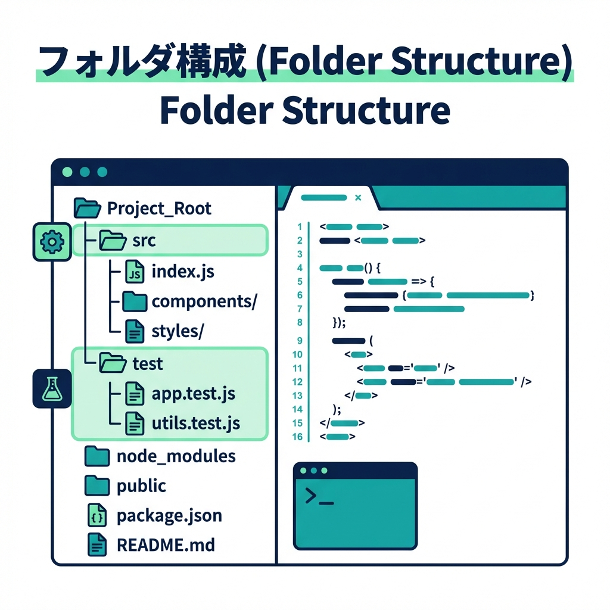

# 第03章：2026年版 環境セットアップ（Windows + VS Code）🪄🖥️

## この章のゴール 🎯

TypeScriptプロジェクトを作って、**実行できて**、**テストが通って**、**整形＆チェック（フォーマット/リンター）も回る**ところまで到達します✨
最後に `npm test` が通れば勝ちです🧪✅

---

## 3.1 まず「最小セット」を決めるよ 🧰✨

この章で入れるのはこの5つだけ👇（迷ったらこれでOK！）

* Node.js（LTS）🟩
  2026-01-27時点では **v24 が Active LTS**（現行で安定枠）です📌 ([Node.js][1])
* TypeScript（最新版）🔷
  TypeScript公式の案内では **現在 5.9 系**が最新として案内されています📌 ([TypeScript][2])
* 実行：`tsx`（TypeScriptをそのまま動かす）⚡
  tsx は 2025-11 時点で **v4.21.0** が出ています📌 ([GitHub][3])
* テスト：Vitest 🧪
  Vitest は **v4** が公開されています📌 ([Vitest][4])
* 静的チェック：ESLint（flat config）＋ TypeScript-ESLint 🧹
  ESLint の **flat config は v9 からデフォルト**になっています📌 ([ESLint][5])
  TypeScript-ESLint も flat config 前提のクイックスタートが用意されています📌 ([TypeScript-ESLint][6])

---

## 3.2 Node.js を入れて動作確認する 🟩✅

1. Node.js の **LTS（v24 系）** をインストール
   （Active LTS が推奨される、という位置づけです📌） ([Node.js][1])

2. ターミナルで確認（PowerShell でOK）👇

```powershell
node -v
npm -v
```

`node` が「見つからない🥲」なら、いったん VS Code / ターミナルを開き直して再実行してみてね🔁
それでもダメなら、インストール時の「PATH 追加」が外れてる可能性が高いです🧯

---

## 3.3 VS Code に入れる拡張（最小）🧩✨

### 開発体験を上げる拡張たち 🪄

* ESLint（コードのミスを見つける）🧹
* Prettier（自動整形）🎀
* Vitest 関連（テストが見やすくなる）🧪

### AI拡張（導入済み前提）🤖💬

* GitHub Copilot（補完） ([Visual Studio Marketplace][7])
* GitHub Copilot Chat（チャット） ([Visual Studio Marketplace][8])
* Codex（OpenAI のコーディングエージェント） ([Visual Studio Marketplace][9])

---

## 3.4 最小プロジェクトを作る（ここから実作業）📦✨

好きな場所にフォルダを作って、VS Code で開きます👇

```powershell
mkdir mini-ec-events
cd mini-ec-events
code .
```

次に npm 初期化📦

```powershell
npm init -y
```

---

## 3.5 必要パッケージを入れる（実行・テスト・型）📥✨

まずは実行・テストの土台👇

```powershell
npm i -D typescript tsx vitest @types/node
```

* TypeScript公式の案内では npm で最新版（現在 5.9 系）を入れられます📌 ([TypeScript][2])
* tsx は TypeScript をサクッと動かせるランナーです⚡ ([GitHub][3])
* Vitest は v4 が提供されています🧪 ([Vitest][4])

---

## 3.6 tsconfig.json を作る（“型のルールブック”）📘🔷

次のコマンドで土台を作って👇

```powershell
npx tsc --init
```

生成された `tsconfig.json` を、いったんこの形に寄せます👇（コピペOK✨）

```json
{
  "compilerOptions": {
    "target": "ES2022",
    "module": "CommonJS",
    "rootDir": "src",
    "outDir": "dist",

    "strict": true,
    "esModuleInterop": true,
    "skipLibCheck": true,

    "sourceMap": true
  },
  "include": ["src", "test"]
}
```

ポイント💡

* `strict: true` は最初ちょい厳しいけど、上達が早いです🔥
* 今は **難しいESM設定で迷子にならない**ために CommonJS でスタートします🚶‍♀️🌱

---

## 3.7 “動くコード”を置く（最小）🚀✨

### フォルダ構成 📁




こんな感じにします👇

* `src/`
* `test/`

```powershell
mkdir src
mkdir test
```

### 1) ドメインイベントの最小型を作る 🧩

`src/domainEvent.ts` を作って👇

```ts
export type DomainEvent<TType extends string, TPayload> = Readonly<{
  eventId: string;
  occurredAt: string; // ISO文字列（まずは簡単に）
  aggregateId: string;
  type: TType;
  payload: TPayload;
}>;

export function createEvent<TType extends string, TPayload>(args: {
  eventId: string;
  aggregateId: string;
  type: TType;
  payload: TPayload;
}): DomainEvent<TType, TPayload> {
  return Object.freeze({
    eventId: args.eventId,
    occurredAt: new Date().toISOString(),
    aggregateId: args.aggregateId,
    type: args.type,
    payload: args.payload,
  });
}
```

### 2) エントリーポイントを作る 🏁

`src/index.ts` を作って👇

```ts
import { createEvent } from "./domainEvent";

const ev = createEvent({
  eventId: crypto.randomUUID(),
  aggregateId: "order-001",
  type: "OrderPlaced",
  payload: { totalYen: 1200 },
});

console.log(ev);
```

---

## 3.8 テストを1本書いて `npm test` を通す 🧪✅

`test/domainEvent.test.ts` を作って👇

```ts
import { describe, expect, test } from "vitest";
import { createEvent } from "../src/domainEvent";

describe("createEvent", () => {
  test("最低限の形でイベントが作れる", () => {
    const ev = createEvent({
      eventId: "e-1",
      aggregateId: "order-001",
      type: "OrderPlaced",
      payload: { totalYen: 1200 },
    });

    expect(ev.type).toBe("OrderPlaced");
    expect(ev.payload.totalYen).toBe(1200);
    expect(typeof ev.occurredAt).toBe("string");
  });
});
```

---

## 3.9 package.json にスクリプトを追加する 🧾✨

`package.json` の `"scripts"` をこうします👇

```json
{
  "scripts": {
    "dev": "tsx watch src/index.ts",
    "build": "tsc -p tsconfig.json",
    "start": "node dist/index.js",
    "test": "vitest"
  }
}
```

---

## 3.10 ここで実行！ゴール判定タイム ⏱️🏁

まず実行してみる👇

```powershell
npm run dev
```

別ターミナルでテスト👇

```powershell
npm test
```

✅ テストが通ったら、この章はクリアです🎉🧪

---

## 3.11 フォーマット/リンターを“最小”で入れる 🧹🎀

### 1) インストール 📥

ESLint（flat config）＋ TypeScript-ESLint を入れます👇
TypeScript-ESLintのクイックスタートはこの組み合わせを案内しています📌 ([TypeScript-ESLint][6])

```powershell
npm i -D eslint @eslint/js typescript-eslint
npm i -D prettier
```

ESLint の flat config は v9 からデフォルトになっています📌 ([ESLint][5])

### 2) ESLint 設定ファイルを作る 🧾

ルートに `eslint.config.mjs` を作って👇（公式の最小例ベース✨） ([TypeScript-ESLint][6])

```js
// @ts-check
import eslint from "@eslint/js";
import { defineConfig } from "eslint/config";
import tseslint from "typescript-eslint";

export default defineConfig(
  eslint.configs.recommended,
  tseslint.configs.recommended,
);
```

### 3) Prettier 設定（最小）🎀

ルートに `.prettierrc.json` を作って👇

```json
{
  "singleQuote": true,
  "semi": true
}
```

### 4) scripts 追加（lint/format）🧰

`package.json` の `"scripts"` に追記👇

```json
{
  "scripts": {
    "lint": "eslint .",
    "format": "prettier . --write"
  }
}
```

実行してみよう👇

```powershell
npm run lint
npm run format
```

---

## 3.12 VS Code 側の設定（保存したら勝手に整う✨）⚙️💖

`.vscode/settings.json` を作って、これを入れるとラクです👇

```json
{
  "editor.formatOnSave": true,
  "editor.defaultFormatter": "esbenp.prettier-vscode",
  "editor.codeActionsOnSave": {
    "source.fixAll.eslint": "explicit"
  }
}
```

---

## 3.13 VS Code が使う TypeScript を「プロジェクトのもの」に合わせる 🔁🔷

TypeScript は VS Code に同梱のものと、プロジェクトに入れたものがありえます。
コマンドパレットで **「TypeScript: Select TypeScript Version」** を使うと切り替えできます📌 ([Visual Studio Code][10])

「Use Workspace Version」を選べば、`node_modules` の TypeScript を使ってくれます👌 ([Visual Studio Code][10])

---

## 3.14 AI活用ミニレシピ（この章で使うやつ）🤖✨

### 設定ファイルが怖いとき 🥲➡️😊

* 「`tsconfig.json` の各項目を“中学生にもわかる言葉”で説明して」
* 「この ESLint 設定で *何がチェックされるか* を箇条書きにして」

### つまずき対応（原因切り分け）🧯

* 「`npm test` が落ちた。ログ貼るから、原因候補を3つに絞って、それぞれ確認手順も書いて」
* 「ESM/CJS の違いで怒られてるっぽい。初心者向けに直し方を1つに決めて提案して」

---

## 3.15 演習（提出物みたいにやってみよ📒✨）🧑‍🎓💖

### 演習A：イベント名を増やす 🏷️

`OrderPaid` を追加して、`payload` を `{ paidYen: number }` にしてみよう💳✨
テストも1本増やしてね🧪

### 演習B：型を“より安全”にする 🛡️

`type EventType = "OrderPlaced" | "OrderPaid"` を作って、`type` に使ってみよう🔷

---

## 3.16 よくある詰まりポイント（ここ見ればだいたい助かる）🧯✨

* `node` が見つからない
  → ターミナル/VS Code を開き直す🔁（PATH反映待ちが多い）
* `vitest` が動かない / import で怒られる
  → まず `npm i` が成功してるか、`package-lock.json` と `node_modules` があるか確認📦
* VS Code の型エラー表示が変
  → 「TypeScript: Select TypeScript Version」で workspace を選ぶ🔧 ([Visual Studio Code][10])

---

[1]: https://nodejs.org/en/about/previous-releases "Node.js — Node.js Releases"
[2]: https://www.typescriptlang.org/download/?utm_source=chatgpt.com "How to set up TypeScript"
[3]: https://github.com/privatenumber/tsx/releases?utm_source=chatgpt.com "Releases · privatenumber/tsx"
[4]: https://vitest.dev/blog/vitest-4 "Vitest 4.0 is out! | Vitest"
[5]: https://eslint.org/docs/latest/use/configure/migration-guide "Configuration Migration Guide - ESLint - Pluggable JavaScript Linter"
[6]: https://typescript-eslint.io/getting-started/ "Getting Started | typescript-eslint"
[7]: https://marketplace.visualstudio.com/items?itemName=GitHub.copilot&utm_source=chatgpt.com "GitHub Copilot"
[8]: https://marketplace.visualstudio.com/items?itemName=VisualStudioExptTeam.VSGitHubCopilot&utm_source=chatgpt.com "GitHub Copilot Chat - Visual Studio Marketplace"
[9]: https://marketplace.visualstudio.com/items?itemName=openai.chatgpt&utm_source=chatgpt.com "Codex – OpenAI's coding agent"
[10]: https://code.visualstudio.com/docs/typescript/typescript-compiling?utm_source=chatgpt.com "Compiling TypeScript"
