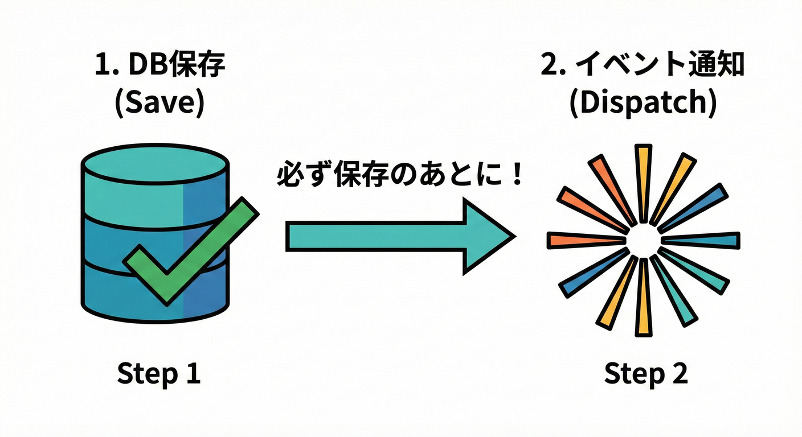

# 第13章：イベントを“配る”流れ（アプリ層ディスパッチ）📣🚚

## 🎯 この章のゴール

* 「保存してからイベントを配る」基本フローを、言葉でもコードでも説明できる✨
* アプリ層（ユースケース）がやること／ドメインがやらないことを分けて考えられる🧠🧱
* “順番ミス”で事故るポイントを先に潰せる🧯💥

---

## 1) まず結論：イベントは「保存のあと」に配る 💾➡️📤




ドメインイベントは「業務で起きた事実」なので、基本はこう流します👇

1. ユースケース開始（アプリ層）🏁
2. 集約（ドメイン）を操作して、イベントが“たまる”🫙
3. Repositoryで保存する💾
4. 保存が成功したら、イベントを取り出して配る（ディスパッチ）📣
5. ハンドラが副作用を実行（通知・連携・集計など）🔔🌍

この「保存→配る」の順番が超だいじです✅

> 2026年1月時点だと、Node.jsは v24 がActive LTS（Krypton）として更新され続けていて、安定運用の軸にしやすいです🧊🟢 ([Node.js][1])

---

## 2) “配る”って何をするの？📮✨

ここで言う「配る（ディスパッチ）」は、ざっくり言うと👇

* ドメインイベントの **type** を見て
* それに反応する **ハンドラ** を呼び出す
* 必要なら複数ハンドラに配る（通知＋ポイント付与、みたいな）📩🪙

つまり、アプリ層は「イベント配達員」みたいな役です🚚💨
ドメインは「事実を生む」だけ。配達や外部I/Oはしません🙅‍♀️

---

## 3) なんで “保存のあと” がいいの？🤔💥

順番を間違えると、ありがちな事故が起きます…🧯

### ❌ 事故A：配ったのに、保存が失敗した

* DB保存が失敗したのに
* 先にメール通知が飛んだ📩💨
* ユーザー「え、買えてないのに通知来たんだけど？」😇

→ **「存在しない注文の通知」** が出てしまう地獄です🕳️

### ❌ 事故B：保存は成功したのに、配るのが失敗した

* DBは更新された✅
* でも通知が落ちた⚠️
* 「支払い済み」なのに「通知が来ない」みたいな不整合😵‍💫

→ これは後の章（Outbox/リトライ）でしっかり倒します🧰
この章では「まず基本形」を作ります🌱

---

## 4) 実装の最小セット（TypeScript）🧩🔷

ここでは **“最小で動く”** 形にします✂️✨
（本格運用の堅牢化は後半章へ）

### 4-1) イベント型（共通フォーマット）🧾

```ts
// domain/events/DomainEvent.ts
export type DomainEvent<TType extends string, TPayload> = Readonly<{
  eventId: string;
  occurredAt: string;      // ISO文字列でOK（例: new Date().toISOString()）
  aggregateId: string;
  type: TType;
  payload: TPayload;
}>;
```

---

### 4-2) 集約がイベントをためる（前章の復習）🫙

```ts
// domain/core/AggregateRoot.ts
import { DomainEvent } from "../events/DomainEvent";

export abstract class AggregateRoot {
  private readonly domainEvents: DomainEvent<string, unknown>[] = [];

  protected addDomainEvent(event: DomainEvent<string, unknown>) {
    this.domainEvents.push(event);
  }

  // ✅ 成功後に呼ぶ想定：取り出したら空にする（pull）
  pullDomainEvents(): DomainEvent<string, unknown>[] {
    const events = [...this.domainEvents];
    (this.domainEvents as DomainEvent<string, unknown>[]).length = 0;
    return events;
  }
}
```

---

### 4-3) ハンドラの型（受け取って処理する人）🔔

```ts
// application/events/DomainEventHandler.ts
import { DomainEvent } from "../../domain/events/DomainEvent";

export interface DomainEventHandler<E extends DomainEvent<string, unknown>> {
  // まずはシンプルに async 前提でOK ✨
  handle(event: E): Promise<void>;
}
```

---

### 4-4) ディスパッチャ（配達係）📣🚚

ここは「type → handler一覧」の対応表を持ちます🗺️

```ts
// application/events/DomainEventDispatcher.ts
import { DomainEvent } from "../../domain/events/DomainEvent";
import { DomainEventHandler } from "./DomainEventHandler";

type EventType = string;

export class DomainEventDispatcher {
  private readonly handlers = new Map<EventType, DomainEventHandler<any>[]>();

  register<E extends DomainEvent<string, unknown>>(
    type: E["type"],
    handler: DomainEventHandler<E>
  ) {
    const list = this.handlers.get(type) ?? [];
    list.push(handler);
    this.handlers.set(type, list);
  }

  async dispatch(events: DomainEvent<string, unknown>[]) {
    for (const event of events) {
      const list = this.handlers.get(event.type) ?? [];

      // ✅ 初学者は「まず順番に await」がおすすめ（事故りにくい）🧯
      for (const handler of list) {
        await handler.handle(event);
      }
    }
  }
}
```

---

## 5) ユースケースでの “保存→配る” 実装例 🧾💾📤

ミニEC想定で「支払い完了」を例にします💳✨

### 5-1) 例：Orderがイベントを生む（ざっくり）🧾

```ts
// domain/order/Order.ts
import { AggregateRoot } from "../core/AggregateRoot";
import { DomainEvent } from "../events/DomainEvent";

type OrderPaid = DomainEvent<"OrderPaid", { orderId: string; paidAmount: number }>;

export class Order extends AggregateRoot {
  private constructor(
    public readonly id: string,
    private status: "Created" | "Paid"
  ) {
    super();
  }

  static create(id: string) {
    return new Order(id, "Created");
  }

  pay(paidAmount: number) {
    if (this.status === "Paid") throw new Error("すでに支払い済みだよ⚠️");
    if (paidAmount <= 0) throw new Error("金額が変だよ⚠️");

    this.status = "Paid";

    const event: OrderPaid = {
      eventId: crypto.randomUUID(),
      occurredAt: new Date().toISOString(),
      aggregateId: this.id,
      type: "OrderPaid",
      payload: { orderId: this.id, paidAmount },
    };

    this.addDomainEvent(event);
  }
}
```

---

### 5-2) Repository（保存係）💾

```ts
// application/order/OrderRepository.ts
import { Order } from "../../domain/order/Order";

export interface OrderRepository {
  save(order: Order): Promise<void>;
  findById(orderId: string): Promise<Order | null>;
}
```

---

### 5-3) 支払いユースケース（ここが本題！）🏛️✨

「保存に成功したらイベントを取り出してディスパッチ」です✅

```ts
// application/order/PayOrderUseCase.ts
import { OrderRepository } from "./OrderRepository";
import { DomainEventDispatcher } from "../events/DomainEventDispatcher";

export class PayOrderUseCase {
  constructor(
    private readonly repo: OrderRepository,
    private readonly dispatcher: DomainEventDispatcher
  ) {}

  async execute(input: { orderId: string; amount: number }) {
    const order = await this.repo.findById(input.orderId);
    if (!order) throw new Error("注文が見つからないよ😢");

    // ① ドメイン操作（ここでイベントが溜まる）🫙
    order.pay(input.amount);

    // ② 保存 💾
    await this.repo.save(order);

    // ③ 保存成功後にイベントを取り出す 📤
    const events = order.pullDomainEvents();

    // ④ 配る 📣
    await this.dispatcher.dispatch(events);
  }
}
```

この順番が、まずは“最小で正しい”基本形です🌱✅

---

## 6) 失敗時の扱い（この章は“概要だけ”）⚠️🧯

ディスパッチやハンドラは、外部I/Oが絡みがちで失敗します🌍💥
この章では「考え方の型」だけ持ち帰りましょう🎒✨

### パターン①：ユースケースを失敗にする（同期っぽい）

* ハンドラ失敗 → execute自体をエラーにする
* 画面に「処理失敗」って返す
* ✅ “今すぐ結果が必要”な処理には分かりやすい
* ❌ ただし「保存は成功してるのに失敗扱い」になりやすい（後で整える必要あり）

### パターン②：ログして続行（非同期前提の第一歩）

* ハンドラ失敗 → ログを残す📝
* いったん処理は成功として返す
* ✅ UX的に軽くできる
* ❌ “取りこぼし”対策が必要（Outbox/リトライで回収する）

> Vitestは 4.0 が公開され、移行ガイドも更新されています🧪✨（テスト環境の整備がしやすい流れ） ([Vitest][2])

---

## 7) ハンドラ例：通知とポイント付与を分ける📩🪙

「1ハンドラ＝1関心」だと育てやすいです🌱

```ts
// application/handlers/SendPaidEmailHandler.ts
import { DomainEventHandler } from "../events/DomainEventHandler";
import { DomainEvent } from "../../domain/events/DomainEvent";

type OrderPaid = DomainEvent<"OrderPaid", { orderId: string; paidAmount: number }>;

export class SendPaidEmailHandler implements DomainEventHandler<OrderPaid> {
  async handle(event: OrderPaid) {
    // ここでメール送信（外部I/O）📩
    // 今はダミーでOK
    console.log(`メール送信: 注文${event.payload.orderId} 支払い完了💌`);
  }
}
```

```ts
// application/handlers/AddPointHandler.ts
import { DomainEventHandler } from "../events/DomainEventHandler";
import { DomainEvent } from "../../domain/events/DomainEvent";

type OrderPaid = DomainEvent<"OrderPaid", { orderId: string; paidAmount: number }>;

export class AddPointHandler implements DomainEventHandler<OrderPaid> {
  async handle(event: OrderPaid) {
    console.log(`ポイント付与: ${event.payload.paidAmount}円ぶん🪙`);
  }
}
```

登録して配ります👇

```ts
// application/boot/registerHandlers.ts
import { DomainEventDispatcher } from "../events/DomainEventDispatcher";
import { SendPaidEmailHandler } from "../handlers/SendPaidEmailHandler";
import { AddPointHandler } from "../handlers/AddPointHandler";

export function registerHandlers(dispatcher: DomainEventDispatcher) {
  dispatcher.register("OrderPaid", new SendPaidEmailHandler());
  dispatcher.register("OrderPaid", new AddPointHandler());
}
```

---

## 8) テストして「保存→配る順」を守れてるか確認🧪✅

ここ、めちゃ大事です！
順番がズレると事故るので、テストで縛ると安心🧷✨

```ts
// application/order/PayOrderUseCase.test.ts
import { describe, it, expect, vi } from "vitest";
import { PayOrderUseCase } from "./PayOrderUseCase";
import { DomainEventDispatcher } from "../events/DomainEventDispatcher";
import { Order } from "../../domain/order/Order";

describe("PayOrderUseCase", () => {
  it("保存が成功した後にイベントをディスパッチする✅", async () => {
    const order = Order.create("o-1");

    const repo = {
      findById: vi.fn(async () => order),
      save: vi.fn(async () => {}),
    };

    const dispatcher = new DomainEventDispatcher();
    const dispatchSpy = vi.spyOn(dispatcher, "dispatch");

    const useCase = new PayOrderUseCase(repo as any, dispatcher);

    await useCase.execute({ orderId: "o-1", amount: 1000 });

    expect(repo.save).toHaveBeenCalledTimes(1);
    expect(dispatchSpy).toHaveBeenCalledTimes(1);

    // “順番”が気になるなら、呼び出し順もチェックできるよ✨
    const saveCall = repo.save.mock.invocationCallOrder[0];
    const dispatchCall = dispatchSpy.mock.invocationCallOrder[0];
    expect(saveCall).toBeLessThan(dispatchCall);
  });
});
```

---

## 9) 📝 演習（手を動かすやつ）①②③

### 演習1：処理順を番号で書く①②③📝

次のユースケースの順番を、番号付きで書いてみてください👇

* 注文取得
* 支払い処理（ドメイン操作）
* 保存
* イベント取り出し
* ディスパッチ

### 演習2：落とし穴探し🧯

次の “ダメな順番” のどこがマズいか、理由を1行で！👇

* イベント取り出し → ディスパッチ → 保存

### 演習3：ハンドラを1つ追加🎁

`OrderPaid` を受けて「売上集計テーブル更新（ダミーでconsole.log）」するハンドラを追加して、登録してみよう📊✨

---

## 10) 🤖 AI活用プロンプト（そのままコピペOK）💬✨

### プロンプトA：処理順のレビュー🧯

```text
次のユースケースの処理順をレビューして、事故りそうな点を3つ指摘して。
特に「保存」と「ディスパッチ」の順番・例外時の挙動に注目して。

（ここに execute のコード貼る）
```

### プロンプトB：イベントpayloadの詰め込みチェック🎒

```text
このイベントpayloadは情報を詰め込みすぎ？
「入れるべき最小限」と「参照で取れる情報」を分けて提案して。

イベント: OrderPaid
payload: （ここに貼る）
```

### プロンプトC：ハンドラ分割案✂️

```text
OrderPaid をきっかけにやりたい副作用がいくつかある。
「1ハンドラ＝1関心」になるように分割案（名前＋責務）を出して。
副作用候補: メール通知, ポイント付与, 売上集計, 外部CRM連携
```

---

## 11) ✅ ありがちチェックリスト（ここ踏むと爆発しがち）💥

* [ ] 保存前にディスパッチしてない？（通知だけ先に飛ぶ）📩💨
* [ ] ドメインの中で外部I/Oしてない？（DB/HTTP/メールなど）🙅‍♀️
* [ ] ハンドラが“全部入り”になってない？（関心が混ざる）🍲
* [ ] 例外が出たときの方針が未定のまま？（後で事故る）⚠️
* [ ] テストで「保存→配る」順番を縛れてる？🧪🧷

---

## 12) この章でできたこと🎉

* アプリ層が「保存→ディスパッチ」を担当する理由が分かった💾➡️📣
* 最小のディスパッチャとユースケース実装が書けた✍️
* 順番事故をテストで防ぐ型が手に入った🧪✅

次の章では、ハンドラ側の作り方（副作用を外へ）をもっとちゃんと育てます🔔🧩

[1]: https://nodejs.org/en/about/previous-releases?utm_source=chatgpt.com "Node.js Releases"
[2]: https://vitest.dev/blog/vitest-4?utm_source=chatgpt.com "Vitest 4.0 is out!"
