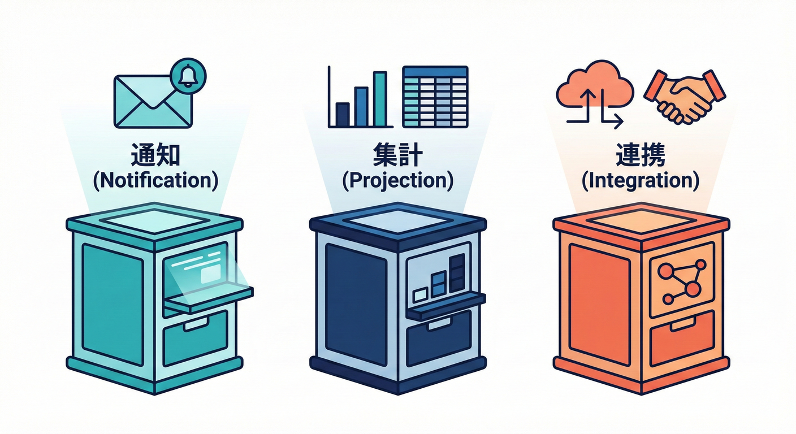

# 第15章：ハンドラ分割の設計（増えても破綻しない）🍱➡️🧩

## 15.0 この章のゴール 🎯✨

* ハンドラが増えても「どこに何があるか」迷子にならない整理術がわかる 🗂️🧭
* 「通知系」「集計系」「連携系」みたいに**分類ルール**を作って、チームでもブレない置き方にできる 📚✅
* “1ハンドラ＝1関心” を守ったまま、拡張しても破綻しない設計にできる 🍱💪

---

## 15.1 そもそも、なぜ分割が必要？🤔💥

ドメインイベントを使うと、機能が増えるたびに「イベントの反応先」が増えます 📈✨
例：`OrderPaid` が起きたら…

* レシートメール送る 📩
* ポイント付与する 🪙
* 売上集計のReadModel更新する 📊
* CRMへ連携する 🔗
* 監視ログやメトリクス残す 👀

ここで分割しないと、こうなる事故が多いです👇😵‍💫

* 1ファイルが巨大化して “神ハンドラ” になる 👑💣
* `if (event.type === ...)` の巨大switchが生まれる 🧟‍♂️
* 追加のたびに「どこを触ればいい？」が毎回不明 🌀

ドメインイベントは「起きた事実」を伝える仕組みで、そこからの副作用（通知・連携など）を外に出せるのが強みです 🔔➡️🌍 ([Microsoft Learn][1])
だからこそ、**外に出した副作用を“整理して増やす設計”**が必要になります 🍱🧩

---

## 15.2 ハンドラ分類の“超使える”3分類 📚✨


（まずはこれだけでOK）

この章では、まず迷わないための3分類から入ります 😊🍀

### ① 通知系（Notification）📩✨

* ユーザーや運用担当に「伝える」
* 例：メール、Push、Slack、アプリ内通知 など

**特徴**：UI/文言/チャネル変更が多い（仕様変更の理由が「伝え方」）💬

---

### ② 集計・投影系（Projection / ReadModel）📊🔍

* 読み取りを速くしたり、一覧表示用に整形したりする
* 例：注文一覧テーブル更新、売上集計カウンタ更新 など

**特徴**：「表示の都合」「検索の都合」で変わる（仕様変更の理由が「見せ方」）🪄

---

### ③ 連携系（Integration）🔗🌐

* 外部システムに送ったり、外部APIを叩いたりする
* 例：CRM、決済連携、配送SaaS連携、会計システム連携 など

**特徴**：相手都合（API仕様、障害、タイムアウト）が多い 📡⚠️

---

## 15.3 分類ルールを作るコツ 📏🧠（“変更理由”で分ける）

分類で一番強い考え方はこれ👇✨
**「何が変わったら、このコードを直す？」**で分ける 🧩🔍

* 文言・送信先・テンプレが変わったら直す → 通知系 📩
* 画面の一覧表示が変わったら直す → 集計/投影系 📊
* 外部APIが変わったら直す → 連携系 🔗

こうしておくと、「変更の波」が来ても被害が小さいです 🌊🛟
（SoCの感覚が、ここでめちゃ効きます🧱✨）

---

## 15.4 命名ルール：イベント名＋やること＝迷子ゼロ 🧭✅

### ルールA（おすすめ）：`<Event>_<Action>Handler` 🧩

* `OrderPaid_SendReceiptEmailHandler` 📩
* `OrderPaid_GrantPointsHandler` 🪙
* `OrderPaid_UpdateSalesSummaryHandler` 📊
* `OrderPaid_SyncCrmHandler` 🔗

**いいところ**：ファイル名を見ただけで「いつ何をする」が一発でわかる 👀✨

> 💡イベントは「起きた事実」を表すので、過去形のイベント名にしておくと整理しやすいです ⏳✅ ([Stack Overflow][2])

---

## 15.5 フォルダ設計：増えても破綻しない“置き場所の型”🗂️✨

ここは流派があるけど、初心者が事故りにくい“鉄板3つ”を出します 🍀

---

### パターン1：カテゴリ（通知/集計/連携）で切る 📚🗂️（おすすめ）

「何のためのハンドラ？」で置き場所が決まるので、迷いづらいです 😊

```text
src/
  application/
    handlers/
      notification/
        order/
          OrderPaid_SendReceiptEmailHandler.ts
      projection/
        sales/
          OrderPaid_UpdateSalesSummaryHandler.ts
      integration/
        crm/
          OrderPaid_SyncCrmHandler.ts
```

**向いてる**：ハンドラが増えるほど強い 💪📈
**弱点**：同じイベントが複数フォルダに散る（でも分類の勝ち！）🧠✨

---

### パターン2：イベントごとに束ねる 🔔📦（小規模向け）

「このイベントに何がぶら下がってる？」が見やすいです 👀

```text
src/
  application/
    handlers/
      order-paid/
        SendReceiptEmailHandler.ts
        GrantPointsHandler.ts
        UpdateSalesSummaryHandler.ts
        SyncCrmHandler.ts
```

**向いてる**：イベント数が少なく、1イベントの反応が多いとき 🎯
**弱点**：「通知だけ見たい」がやりにくい 📩😵‍💫

---

### パターン3：外部システム単位で束ねる 🔗🏢（連携が多いとき）

```text
src/
  application/
    handlers/
      integration/
        crm/
          OrderPaid.ts
          OrderShipped.ts
        accounting/
          OrderPaid.ts
```

**向いてる**：「相手のAPI都合」で変更が来る現場 📡⚠️
**弱点**：イベント起点の探索が弱い 🔍

---

## 15.6 “登録のしかた”が整理の9割 📣🧩（増えても壊れない仕組み）

ハンドラが増えると、最大の地雷はこれ👇💥

* どこでハンドラが呼ばれてるか追えない
* 追加したのに登録し忘れる
* 「なぜか動かない」😇

だから **登録の入口を1か所**にします 🚪✨

---

### 15.6.1 最小のインターフェース 🍀

```ts
// src/application/eventing/EventHandler.ts
export type AnyDomainEvent = Readonly<{
  type: string;
  eventId: string;
  occurredAt: string; // ISO文字列でOK
  aggregateId: string;
  payload: unknown;
}>;

export interface EventHandler<E extends AnyDomainEvent = AnyDomainEvent> {
  readonly eventType: E["type"];
  handle(event: E): Promise<void>;
}
```

---

### 15.6.2 ディスパッチャ（配る人）📣🚚

```ts
// src/application/eventing/DomainEventDispatcher.ts
import type { AnyDomainEvent, EventHandler } from "./EventHandler.js";

export class DomainEventDispatcher {
  private readonly handlersByType = new Map<string, EventHandler[]>();

  register(handler: EventHandler) {
    const list = this.handlersByType.get(handler.eventType) ?? [];
    list.push(handler);
    this.handlersByType.set(handler.eventType, list);
  }

  registerMany(handlers: readonly EventHandler[]) {
    for (const h of handlers) this.register(h);
  }

  async dispatch(events: readonly AnyDomainEvent[]) {
    for (const event of events) {
      const handlers = this.handlersByType.get(event.type) ?? [];
      for (const handler of handlers) {
        await handler.handle(event);
      }
    }
  }
}
```

> ⚡「同期/非同期の順序どうする？」は次章でやるので、この章ではまず “ちゃんと整理できる” を優先でOKです 🕰️✨

---

## 15.7 具体例：`OrderPaid` のハンドラを3分類で分ける 🍱✨

### 15.7.1 イベント型（例）🔔

```ts
// src/domain/order/events/OrderPaid.ts
export type OrderPaid = Readonly<{
  type: "OrderPaid";
  eventId: string;
  occurredAt: string;
  aggregateId: string; // orderIdでもOK
  payload: Readonly<{
    orderId: string;
    userId: string;
    amount: number;
    currency: "JPY";
  }>;
}>;
```

---

### 15.7.2 通知系：レシートメール 📩✨

```ts
// src/application/handlers/notification/order/OrderPaid_SendReceiptEmailHandler.ts
import type { EventHandler } from "../../../eventing/EventHandler.js";
import type { OrderPaid } from "../../../../domain/order/events/OrderPaid.js";

export interface EmailSender {
  sendReceipt(input: { userId: string; orderId: string; amount: number }): Promise<void>;
}

export class OrderPaid_SendReceiptEmailHandler implements EventHandler<OrderPaid> {
  readonly eventType = "OrderPaid" as const;

  constructor(private readonly emailSender: EmailSender) {}

  async handle(event: OrderPaid) {
    const { userId, orderId, amount } = event.payload;
    await this.emailSender.sendReceipt({ userId, orderId, amount });
  }
}
```

* **このハンドラが変わる理由**：メール文言、送信条件、テンプレ、送信サービス変更 📩📝
* だから「通知」に置くのが自然です ✅✨

---

### 15.7.3 集計・投影系：売上サマリ更新 📊✨

```ts
// src/application/handlers/projection/sales/OrderPaid_UpdateSalesSummaryHandler.ts
import type { EventHandler } from "../../../eventing/EventHandler.js";
import type { OrderPaid } from "../../../../domain/order/events/OrderPaid.js";

export interface SalesSummaryRepository {
  addRevenue(input: { date: string; amount: number; currency: "JPY" }): Promise<void>;
}

export class OrderPaid_UpdateSalesSummaryHandler implements EventHandler<OrderPaid> {
  readonly eventType = "OrderPaid" as const;

  constructor(private readonly repo: SalesSummaryRepository) {}

  async handle(event: OrderPaid) {
    const date = event.occurredAt.slice(0, 10); // YYYY-MM-DD
    await this.repo.addRevenue({ date, amount: event.payload.amount, currency: event.payload.currency });
  }
}
```

* **変わる理由**：画面で欲しい集計が変わる、粒度が変わる 📈
* だから「projection」に置くのが自然です ✅✨

---

### 15.7.4 連携系：CRMへ同期 🔗✨

```ts
// src/application/handlers/integration/crm/OrderPaid_SyncCrmHandler.ts
import type { EventHandler } from "../../../eventing/EventHandler.js";
import type { OrderPaid } from "../../../../domain/order/events/OrderPaid.js";

export interface CrmClient {
  upsertPurchase(input: { userId: string; orderId: string; amount: number; occurredAt: string }): Promise<void>;
}

export class OrderPaid_SyncCrmHandler implements EventHandler<OrderPaid> {
  readonly eventType = "OrderPaid" as const;

  constructor(private readonly crm: CrmClient) {}

  async handle(event: OrderPaid) {
    const { userId, orderId, amount } = event.payload;
    await this.crm.upsertPurchase({ userId, orderId, amount, occurredAt: event.occurredAt });
  }
}
```

* **変わる理由**：相手APIの仕様・認証方式・レート制限など 🔐📡
* だから「integration」に置くのが自然です ✅✨

---

## 15.8 “登録の入口”を1か所にする（これで迷子が消える）🧭✨

```ts
// src/application/handlers/index.ts
import type { EventHandler } from "../eventing/EventHandler.js";
import { OrderPaid_SendReceiptEmailHandler } from "./notification/order/OrderPaid_SendReceiptEmailHandler.js";
import { OrderPaid_UpdateSalesSummaryHandler } from "./projection/sales/OrderPaid_UpdateSalesSummaryHandler.js";
import { OrderPaid_SyncCrmHandler } from "./integration/crm/OrderPaid_SyncCrmHandler.js";

// ここでは「new」してるけど、DIは後の章で美しくできるよ🪄
// いったん最小でOK！
export function buildHandlers(deps: {
  emailSender: ConstructorParameters<typeof OrderPaid_SendReceiptEmailHandler>[0];
  salesRepo: ConstructorParameters<typeof OrderPaid_UpdateSalesSummaryHandler>[0];
  crmClient: ConstructorParameters<typeof OrderPaid_SyncCrmHandler>[0];
}): EventHandler[] {
  return [
    new OrderPaid_SendReceiptEmailHandler(deps.emailSender),
    new OrderPaid_UpdateSalesSummaryHandler(deps.salesRepo),
    new OrderPaid_SyncCrmHandler(deps.crmClient),
  ];
}
```

そしてアプリ層の起動時に👇

```ts
import { DomainEventDispatcher } from "./eventing/DomainEventDispatcher.js";
import { buildHandlers } from "./handlers/index.js";

const dispatcher = new DomainEventDispatcher();
dispatcher.registerMany(buildHandlers({ emailSender, salesRepo, crmClient }));

// あとはユースケースで events を集めて dispatch するだけ📣✨
```

---

## 15.9 ちょい最新トピック：ハンドラを“遅延ロード”する（上級）🐢➡️⚡

TypeScript 5.9 では `import defer` が入り、モジュールの評価（実行）を遅らせられます 🧠✨
「普段は使わない分析系ハンドラ」を、必要なときだけ読み込む…みたいな設計がしやすくなります 📦🕰️ ([TypeScript][3])

```ts
// 例：分析系の登録を遅らせる（雰囲気）
import defer * as analytics from "./handlers/analytics/index.js";

if (process.env.ENABLE_ANALYTICS === "1") {
  // 最初に analytics を触った瞬間に評価されるイメージ✨
  dispatcher.registerMany(analytics.buildAnalyticsHandlers());
}
```

> 💡「今すぐ必須」じゃないけど、ハンドラが増えてきた未来に効く小技です 🪄

---

## 15.10 よくある失敗パターンと回避 🧯✅

### 失敗A：1ハンドラで全部やる 👑💣

* メールもポイントもCRMも1クラスで…
  → **変更理由が混ざって爆発**します 💥

✅回避：**“1ハンドラ＝1関心”**（1目的）🎯

---

### 失敗B：巨大switchで分岐する 🧟‍♂️🪓

* `handle(event){ switch(event.type){...}}`
  → 追加のたびに巨大化、影響範囲が読めない 😵‍💫

✅回避：**型 + 登録**で「追加はファイル追加」で終わらせる 🗂️✨

---

### 失敗C：フォルダが気分で増える 🌀📁

* `misc/`, `temp/`, `new/` が生まれる
  → 3ヶ月後に誰も探せない 🫠

✅回避：**分類は最初に3つに固定**（通知/投影/連携）📚✅
増やすのは“必要になってから”でOK！

---

## 15.11 演習：ハンドラをカテゴリ別に整理しよう 📝💖

### 演習1：分類してみよう 📚

次を「通知/投影/連携」に振り分けてね👇✨

* `OrderPaid` → レシートメール送信 📩
* `OrderPaid` → 売上日次サマリ更新 📊
* `OrderPaid` → CRM同期 🔗
* `OrderShipped` → 発送通知 📦📩
* `OrderShipped` → 配送会社APIへ発送データ送信 🚚🔗

---

### 演習2：フォルダ設計を決めよう 🗂️

パターン1（カテゴリで切る）をベースに、あなたの題材のフォルダを作ってみよう ✨
`notification / projection / integration` の3つは固定でOKです 📌

---

### 演習3：命名を整えよう ✍️

命令っぽい名前を、イベント起点で“何をするか”が見える形に直してね😊

* `SendMailHandler` → ✅ `OrderPaid_SendReceiptEmailHandler`
* `UpdateDbHandler` → ✅ `OrderPaid_UpdateSalesSummaryHandler`

---

## 15.12 AI活用（ぶれない分類ルールを作る）🤖📏✨

### 使える聞き方テンプレ 🧠

* 「このハンドラ一覧を“通知/投影/連携”に分類して。分類理由も1行で」📚
* 「命名ルールを1つ決めて、既存ファイル名を全部リネーム案出して」📝
* 「フォルダ構成が散らかりそうなポイントを指摘して、規約案を作って」🗂️✅

### コツ 🍀

AIに丸投げじゃなくて、**“分類軸（変更理由）”**を先に渡すと精度が跳ねます 📈✨
（例：「通知＝伝え方が変わる」「投影＝表示都合」「連携＝相手都合」）

---

## 15.13 まとめ 🎁✨

* ハンドラは増える前提！だから最初に **分類（通知/投影/連携）** を固定する 📚✅
* 命名は **イベント名＋やること** で迷子ゼロ 🧭✨
* 登録の入口を **1か所**にして、追加を“ファイル追加だけ”にする 🗂️📣
* `import defer` みたいな新しめ機能で、将来のスケールにも備えられる 🐢⚡ ([TypeScript][3])

次章は「同期/非同期と順序」⚡🕰️
ここで整理したハンドラたちを、どう実行すべきか判断していきます 🍱➡️🚀

[1]: https://learn.microsoft.com/en-us/dotnet/architecture/microservices/microservice-ddd-cqrs-patterns/domain-events-design-implementation?utm_source=chatgpt.com "Domain events: Design and implementation - .NET"
[2]: https://stackoverflow.com/questions/12510535/naming-convention-for-commands-events?utm_source=chatgpt.com "Naming Convention for Commands & Events"
[3]: https://www.typescriptlang.org/docs/handbook/release-notes/typescript-5-9.html?utm_source=chatgpt.com "Documentation - TypeScript 5.9"
