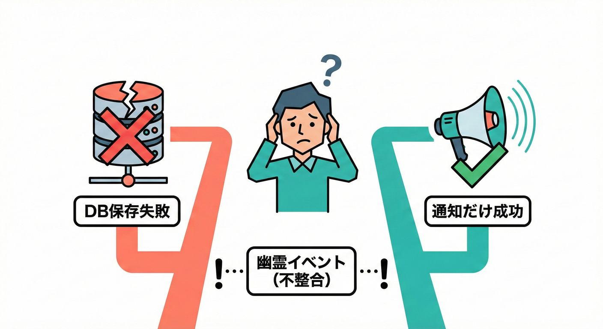

# 第20章 Outboxが解決する問題（取りこぼし地獄）⚠️📤

## 🎯 この章のゴール

* 「Outbox（トランザクショナル・アウトボックス）」が **なにを解決する仕組み**なのか説明できる✨
* ありがちな事故（取りこぼし／二重送信／不整合）を **具体例でイメージ**できる🧠
* “Outboxを入れるべきタイミング”が判断できるようになる⚖️

---

## 1) まず怖い話：いちばん起きやすい事故は「DBは成功、イベントは失敗」😱💥

ドメインイベントを使うと、だいたいこんな処理がしたくなるよね👇

* 注文をDBに保存する💾
* 「注文が作られたよ！」というイベントを発行する📣（他の処理が動く）

でも、ここでよくあるのが **二重書き込み（dual-write）問題** ってやつ。

### 💣 事故パターンA：DBコミット成功 → 発行だけ失敗（取りこぼし）

* 注文はDBに保存された✅
* でもメッセージブローカー（Kafka/RabbitMQ/SQS/Service Bus等）への送信が失敗❌
  （ネットワーク・一時障害・ブローカー停止・タイムアウト…）

結果：

* **「注文はあるのに、イベントが飛んでない」**
* 下流（発送、メール、ポイント付与）が一生動かない…😵‍💫

この“コミット後に落ちる”事故は典型例として説明されてるよ。([AWS ドキュメント][1])

---

## 2) 逆も地獄：DBは失敗、イベントは成功（幽霊イベント）👻📨




### 💣 事故パターンB：DBロールバック → なのにイベントだけ送れた

* 例えばDB更新がロールバックした❌
* でもイベント発行だけ先に成功してしまった✅

結果：

* 下流は「注文できた！」と思って処理を進める
* しかし本体DBには注文が存在しない…矛盾…😵

このタイプの不整合も、Outboxが解決したい対象として整理されてるよ。([AWS ドキュメント][1])

---

## 3) なんでこんなこと起きるの？🤔🧩（原因は超シンプル）

理由はこれ👇

* **DB更新**はDBのトランザクションで守れる🔒
* **イベント発行**は別システム（ブローカー/外部API）に飛ばす🌍

つまり「同じトランザクションでまとめて成功/失敗させる」が難しいの。

「じゃあ分散トランザクション（2PC）で…」は現実的に辛いことが多いから、実務では **Outbox** みたいなやり方がよく選ばれるよ。([microservices.io][2])

---

## 4) Outboxの考え方：イベントを“送る”んじゃなくて“記録する”🗃️✍️

Outboxパターンは発想が転換系✨

### ✅ やること

1. ドメイン更新（注文保存など）💾
2. **同じDBトランザクションで** Outboxテーブルにイベントを書き込む🧾
3. コミット✅
4. 別の仕組み（ワーカー/CDC）がOutboxから読んで、あとで配る📤

これで「DBだけ成功」や「イベントだけ成功」のズレを防ぎやすくなる。
（“DB更新とイベントの原本”が同じトランザクションで残るから）([microservices.io][2])

---

## 5) 取りこぼし地獄がどう救われる？🛟✨（事故シナリオで確認）

### 🧯さっきの事故パターンA（DB成功→発行失敗）をOutboxでやると…

* DB更新 ✅
* Outboxへの書き込み ✅（同じトランザクション）
* 「発行」はあとでワーカーがリトライできる🔁

つまり、ブローカーが落ちてても **Outboxに“未送信”が残る**から復活できる！

---

## 6) Outboxの“最低限”構造（これだけ覚えればOK）🧾🧠

Outboxテーブル（またはコレクション）に、最低限これがあると安心👇

* `id`（イベントID / messageId）🆔
* `type`（例：`OrderPaid`）🏷️
* `payload`（JSONなど）📦
* `occurredAt`（いつ起きた？）⏱️
* `status`（PENDING / SENT / FAILED など）🚦
* `retryCount` / `nextRetryAt`（運用したくなるやつ）🔁🕰️

DebeziumなどのCDCと組み合わせて “Outboxテーブルの変更をイベント化” する説明もあるよ。([Debezium][3])

---

## 7) TypeScriptでの最小イメージ（コードは“雰囲気”でOK）🧩🟦

ここでは「注文を支払い済みにする」ユースケースを例にするね💳

### 7-1) ドメインイベントの形（復習っぽく）

```ts
export type DomainEvent<TType extends string, TPayload> = {
  eventId: string;
  type: TType;
  occurredAt: string; // ISO文字列
  aggregateId: string;
  payload: TPayload;
};
```

### 7-2) Outboxに入れる行（DBに保存する“原稿”）

```ts
export type OutboxRow = {
  id: string;                // eventId
  type: string;              // event type
  aggregateId: string;
  payloadJson: string;       // JSON.stringify(payload)
  occurredAt: string;        // ISO
  status: "PENDING" | "SENT" | "FAILED";
  retryCount: number;
  nextRetryAt: string | null;
};
```

### 7-3) 超重要：DB更新とOutbox挿入を“同じトランザクション”でやる

（DBライブラリは何でもOKなので擬似コードだよ〜🙆‍♀️）

```ts
// application layer（ユースケース）
await db.transaction(async (tx) => {
  // 1) 注文の状態変更（例：paid にする）
  await tx.orders.update({ id: orderId, status: "PAID" });

  // 2) 同じトランザクションで outbox にイベントを書き込む
  const evt: DomainEvent<"OrderPaid", { amount: number }> = {
    eventId: crypto.randomUUID(),
    type: "OrderPaid",
    occurredAt: new Date().toISOString(),
    aggregateId: orderId,
    payload: { amount },
  };

  await tx.outbox.insert({
    id: evt.eventId,
    type: evt.type,
    aggregateId: evt.aggregateId,
    payloadJson: JSON.stringify(evt.payload),
    occurredAt: evt.occurredAt,
    status: "PENDING",
    retryCount: 0,
    nextRetryAt: null,
  });
});
```

ここがOutboxの核！
**「送信」じゃなくて「確実に残す」**が最優先💾✨

---

## 8) “配る係”は別で動く（ワーカー / バッチ / CDC）🚚📣

Outboxから PENDING を拾って、ブローカーに投げて、SENTにする係が必要だよ。

### 8-1) ワーカー方式（ポーリング）

* 例えば1秒おきにOutboxを見る🔁
* まとめて送る（バッチ）もできる🍱
* 失敗したらリトライ計画にのせる🧯

```ts
// ざっくりワーカー（雰囲気）
const rows = await db.outbox.findPending({ limit: 50, now: new Date() });

for (const row of rows) {
  try {
    await broker.publish(row.type, row.payloadJson, { messageId: row.id });
    await db.outbox.markSent(row.id);
  } catch (e) {
    await db.outbox.markFailedWithBackoff(row.id);
  }
}
```

### 8-2) CDC方式（Debeziumなど）

Outboxテーブルの変更を“DB側から”拾ってイベント化する方式。
アプリがブローカー送信を直接しなくてもよくなる設計ができるよ。([Debezium][3])

---

## 9) ここで大事：Outboxを入れても「重複」は起きうる🔁😵

Outboxは「取りこぼし」を減らす超強力アイテムだけど、現実はこう👇

* ワーカーが「送れた！」と思った直後に落ちて、SENT更新できない💥
  → 次回また送ってしまう（重複）

だから **下流は冪等（同じイベントが来ても壊れない）** が基本になるよ🔁🧷
（第19章の内容がここで効いてくる！）

---

## 10) Outboxを入れる判断基準（入れどき）⚖️✅

次のどれかが当てはまるなら、Outboxを真面目に検討してOK👇

* DB更新と、外部通知/連携（メール、決済、在庫、配送、分析…）が“別世界”🌍
* 「イベントが飛ばないと業務が止まる」レベルで重要🚨
* ブローカーや外部APIが “たまに落ちる前提” で運用したい🧯
* 将来ハンドラが増えるのが見えてる（拡張性が大事）🌱

---

## 📝 演習（手を動かす系）✍️💖

### 演習1：取りこぼしの困りごとを3つ書こう😵‍💫

「DB成功・発行失敗」だと何が困る？ 3つ書いてみて🧾
例：発送されない、メール来ない、ポイント付かない…

### 演習2：Outboxテーブル設計（カラム案）🗂️

自分の題材で、Outboxに必要なカラムを考えてみよう✨
最低限：id / type / payload / occurredAt / status
余裕：retryCount / nextRetryAt / lockedBy / lockedAt など

### 演習3：事故を“わざと”起こす🧯

* イベント送信部分で例外を投げる（常に失敗させる）
* それでもOutboxにPENDINGが残っていることを確認👀
* 送信処理を直して、残っていたPENDINGが消化されることを確認✅

---

## 🤖 AI活用（コピペで使えるプロンプト）💬✨

* 「“DB成功・イベント失敗”が起きる具体シナリオを、ECの例で5個出して。ユーザー影響も書いて。」
* 「Outboxテーブルの設計案を、最小→運用向け→大規模向けの3段階で提案して。理由も添えて。」
* 「Outboxワーカーの失敗パターン（重複・順序・ロック・遅延）を箇条書きで整理して。」

---

## ✅ まとめ（ここだけ覚えて帰ろう）🧠🎀

* “DB更新”と“イベント発行”を別々にやるとズレ事故が起きやすい⚠️([AWS ドキュメント][1])
* Outboxは「イベントをまずDBに同時に記録する」ことで取りこぼしを防ぎやすくする🗃️✨([microservices.io][2])
* 配信はワーカー or CDCでやる📤（Debezium等）([Debezium][3])
* 重複は起きうるので、下流の冪等性が超大事🔁🧷

[1]: https://docs.aws.amazon.com/prescriptive-guidance/latest/cloud-design-patterns/transactional-outbox.html?utm_source=chatgpt.com "Transactional outbox pattern - AWS Prescriptive Guidance"
[2]: https://microservices.io/patterns/data/transactional-outbox.html?utm_source=chatgpt.com "Pattern: Transactional outbox"
[3]: https://debezium.io/documentation/reference/stable/transformations/outbox-event-router.html?utm_source=chatgpt.com "Outbox Event Router"
