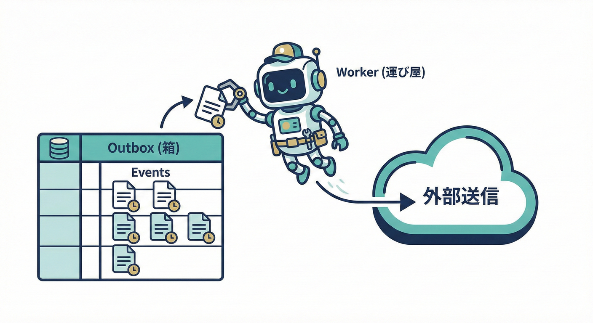

# 第21章：Outboxの仕組み（記録して後で配る）🗃️👷

## 1. まず結論：Outboxって何する仕組み？🎯✨

Outbox（送信トレイ）パターンは、

* ✅ **注文の保存（DB更新）**
* ✅ **イベント配信（他サービス通知・メール送信など）**

この「2つを同時にやりたい問題」を、**DBの中だけで安全にまとめる**ための仕組みだよ〜！🧠💡 ([microservices.io][1])

ポイントはこれ👇

* 📝 まず **Outboxテーブルに“送る予定のイベント”を記録**（DB更新と同じトランザクションで！）
* 🚚 あとから **別のワーカーがOutboxを読んで配信**する（成功したら送信済みにする）

これで「DBは保存できたのに、イベントだけ飛ばなかった😭」を減らせるよ！ ([microservices.io][1])

---

## 2. Outboxの全体像（書く→配る）📌🔁




### 2.1 フロー図（超ざっくり）🗺️✨

1. アプリ処理（注文確定など）🛒
2. **同じトランザクションで**

   * 注文テーブル更新 🧾
   * OutboxテーブルにイベントINSERT 🗃️
3. Outboxワーカーが定期的に拾う 👷
4. 外部へ送る（メッセージブローカー/HTTP/メール等）📣
5. 成功したらOutboxを **送信済みに更新** ✅

この考え方自体が「Transactional Outbox」だよ〜！ ([microservices.io][1])

---

## 3. Outboxテーブル設計（“最低限これ”）🧾🧩

Outboxのカラムは、最初はこのセットで十分いけるよ👇✨

* `id`：イベントID（UUID）🆔
* `aggregateId`：どの注文（集約）に紐づく？🧾
* `type`：イベント種別（例：`OrderPaid`）🏷️
* `occurredAt`：発生時刻 ⏰
* `payload`：中身（JSON）🎒
* `status`：`PENDING / SENT / FAILED` みたいな状態 🚦
* `attempts`：試行回数 🔁
* `nextAttemptAt`：次に試す時刻（バックオフ用）🕰️
* `lastError`：最後のエラー（短め文字列）😵‍💫
* `sentAt`：送れた時刻 ✅

> 💡「送れたら削除」方式もあるけど、まずは `status/sentAt` で管理が分かりやすいよ〜✨
> “送信済みにするのは送信成功後” が基本だよ！ ([iyzico.engineering][2])

---

## 4. 実装：Outboxを書き込む（注文保存と同じトランザクション）✍️🗃️

ここでは例として **Prisma** を使った書き方を出すよ（他ORMでも考え方は同じ！）🧠✨
Prismaは `.$transaction(async (tx) => ...)` の形で、複数クエリを1トランザクションにまとめられるよ〜！ ([Prisma][3])

### 4.1 Prismaのモデル例（Outbox）🧾

```prisma
model Order {
  id        String   @id @default(uuid())
  status    String
  totalYen  Int
  createdAt DateTime @default(now())
}

model OutboxEvent {
  id            String   @id @default(uuid())
  aggregateId    String
  type          String
  occurredAt    DateTime @default(now())
  payload       Json
  status        String   @default("PENDING")
  attempts      Int      @default(0)
  nextAttemptAt DateTime @default(now())
  lastError     String?
  sentAt        DateTime?
  createdAt     DateTime @default(now())

  @@index([status, nextAttemptAt, createdAt])
}
```

### 4.2 “注文確定”ユースケース例（同トランザクションでOutboxもINSERT）🛒✅

```ts
import { PrismaClient } from "@prisma/client";
const prisma = new PrismaClient();

type OrderPlacedPayload = {
  orderId: string;
  totalYen: number;
};

export async function placeOrder(totalYen: number) {
  return prisma.$transaction(async (tx) => {
    // 1) 注文を作る
    const order = await tx.order.create({
      data: { status: "PLACED", totalYen },
    });

    // 2) Outboxに「送る予定のイベント」を記録（同じトランザクション）
    const payload: OrderPlacedPayload = { orderId: order.id, totalYen };

    await tx.outboxEvent.create({
      data: {
        aggregateId: order.id,
        type: "OrderPlaced",
        payload,
        status: "PENDING",
      },
    });

    // 3) ここで例外が起きたら、注文もOutboxもまとめてロールバックされる💥
    return order;
  });
}
```

ここがOutboxの“心臓”🫀✨
**注文が保存されたのにイベントが残らない**、とか
**イベントだけ残って注文がない**、みたいな事故を避けやすいよ！ ([microservices.io][1])

---

## 5. 実装：Outboxを配るワーカー（ポーリング方式）👷🔁

Outboxを配る方法は大きく2つあるよ👇

* 🧹 **ポーリング（定期的にDBから拾う）**：最初はコレが簡単✨
* 🛰️ **CDC（DBの変更ログを拾う）**：Debeziumなど、強めの構成にするとき ([Decodable][4])

この章はまず「ポーリング」で作るね〜！🧡

### 5.1 重要：並列ワーカーにするなら「取り合い防止」が必要！⚔️🛡️

ワーカーが複数台あると、同じOutboxを2人で拾っちゃう危険があるよね？😱
そこで **PostgreSQLの `FOR UPDATE SKIP LOCKED`** が超便利✨

* `FOR UPDATE`：行をロック
* `SKIP LOCKED`：すでにロック中の行はスキップ

“キューっぽいテーブル”を安全に並列処理できる用途で使えるよ〜！ ([PostgreSQL][5])

### 5.2 SQL（未送信を“掴む”）🧲🧾

```sql
-- 例：PENDING かつ nextAttemptAt を過ぎたものを、古い順に最大20件掴む
SELECT *
FROM "OutboxEvent"
WHERE status = 'PENDING'
  AND "nextAttemptAt" <= now()
ORDER BY "createdAt" ASC
LIMIT 20
FOR UPDATE SKIP LOCKED;
```

> 💡このSELECTは「トランザクションの中」で実行してね！
> 掴んだ後に `status='SENDING'` へ更新する方式もよく使うよ〜🚦✨

### 5.3 ワーカー実装（疑似コード → ちゃんと動く形）🧑‍💻✨

Prismaだけで `SKIP LOCKED` がやりづらい場合は、**生SQL（`$queryRaw`）**でOKだよ👍
（ここは“ORMの都合より、正しく動く”が勝ちやすいところ！）

```ts
import { PrismaClient } from "@prisma/client";
const prisma = new PrismaClient();

type OutboxRow = {
  id: string;
  aggregateId: string;
  type: string;
  payload: unknown;
  attempts: number;
};

async function publishToOutside(row: OutboxRow) {
  // 例：外部送信（ここではダミー）
  // 実際は Kafka / SQS / HTTP / メール などに送る📣
  console.log("📤 publish:", row.type, row.aggregateId, row.payload);

  // デモ用：たまに失敗させる😈（リトライ挙動を見るため）
  if (Math.random() < 0.2) throw new Error("Random send failure 😵‍💫");
}

function calcBackoffSeconds(attempts: number) {
  // 例：指数バックオフ（最大60秒）
  const s = Math.min(60, Math.pow(2, attempts));
  return s;
}

export async function runOutboxWorkerLoop() {
  console.log("👷 Outbox worker started!");

  while (true) {
    const processed = await prisma.$transaction(async (tx) => {
      // 1) 未送信を掴む（ロックして取り合い防止）
      const rows = await tx.$queryRaw<OutboxRow[]>`
        SELECT id, "aggregateId", type, payload, attempts
        FROM "OutboxEvent"
        WHERE status = 'PENDING'
          AND "nextAttemptAt" <= now()
        ORDER BY "createdAt" ASC
        LIMIT 20
        FOR UPDATE SKIP LOCKED
      `;

      if (rows.length === 0) return 0;

      // 2) 送る（1件ずつ。慣れたら並列もOK✨）
      for (const row of rows) {
        try {
          await publishToOutside(row);

          // 3) 成功したら送信済みにする✅
          await tx.outboxEvent.update({
            where: { id: row.id },
            data: { status: "SENT", sentAt: new Date(), lastError: null },
          });
        } catch (e) {
          const message = e instanceof Error ? e.message : "Unknown error";
          const nextSeconds = calcBackoffSeconds(row.attempts + 1);

          // 4) 失敗したら attempts を増やして nextAttemptAt を未来にずらす🕰️
          await tx.outboxEvent.update({
            where: { id: row.id },
            data: {
              attempts: { increment: 1 },
              lastError: message.slice(0, 500),
              nextAttemptAt: new Date(Date.now() + nextSeconds * 1000),
              status: "PENDING",
            },
          });
        }
      }

      return rows.length;
    });

    // 5) ちょい休憩（空ポーリングを減らす）😴
    if (processed === 0) {
      await new Promise((r) => setTimeout(r, 500));
    }
  }
}
```

この形だと、**送信は“少なくとも1回”（at-least-once）**になりやすいよ〜🔁
つまり「重複の可能性はある」から、次の章たち（冪等性・リトライ方針）が効いてくるんだ〜！🧷✨ ([iyzico.engineering][2])

---

## 6. “ポーリングがうるさい”問題：LISTEN/NOTIFYで起こす方法🔔⚡

ポーリングは簡単だけど、件数が少ないと「ずっと空振り」しがち😅
PostgreSQLには **LISTEN/NOTIFY** っていう「通知で起こす」仕組みがあるよ✨ ([PostgreSQL][6])

* 注文処理の最後で `NOTIFY outbox` を投げる🔔
* ワーカーは `LISTEN outbox` して待つ👂

ただし！
通知は“きっかけ”であって、**最終的にはOutboxをDBから読む**のは変わらないよ（取りこぼし防止のため）🧠✨ ([PostgreSQL][6])

---

## 7. もっと強い構成：CDC（Debezium Outbox Event Router）🛰️📦

DBの変更（OutboxテーブルへのINSERT）を、**変更データキャプチャ（CDC）**で拾って、Kafka等へ流す方式も有名だよ〜！
Debeziumには Outbox Event Router という仕組みがあるよ✨ ([Debezium][7])

* アプリは **DBだけ更新**（Outbox INSERTまで）
* Debeziumが Outbox の変更を見てイベントに変換して配信 📣

「ワーカー自作より、プラットフォームでがっちり」したいときの選択肢だね〜💪 ([Debezium][7])

---

## 8. “ジョブキュー使う？”問題（BullMQなど）🧰🧃

Outboxの“配る部分”を、Redis系のジョブキュー（BullMQ）に寄せる設計もあるよ〜！

* 👷 Worker でジョブを処理する概念が分かりやすい
* 🔁 リトライやバックオフが標準で用意されてる

BullMQは Worker / retry がドキュメントで整理されてるよ✨ ([BullMQ][8])

ただしOutboxの目的は「**DB更新とイベント記録を一体化**」だから、
BullMQだけに頼って **DBとキューへ二重書き**すると、また第20章の事故に戻りがち😵‍💫
（なので “Outbox + キュー” は相性はいいけど、順番を守るのが大事！） ([microservices.io][1])

---

## 9. 演習（手を動かして覚える）📝💖

### 演習1：Outboxカラム案を完成させよう🧾✨

次を満たすようにカラムを決めてみてね👇

* ✅ 送信済み判定ができる
* ✅ リトライ回数を数えられる
* ✅ 次にいつ再挑戦するかを持てる
* ✅ 最後のエラーを追える

### 演習2：payloadの“詰め込みすぎ”チェック🎒🔍

`OrderPlaced` のpayloadを2案作って比較してみよう！

* A案：全部入れる（商品一覧・住所・決済情報…）
* B案：最小（orderId と totalYen だけ）

どっちが “依存が増えにくい” かな？🧠✨

### 演習3：ワーカーを2つ起動しても二重送信しない？👯‍♀️🛡️

* ワーカーを2プロセスで起動
* `FOR UPDATE SKIP LOCKED` の有無で挙動を比べてみよう！

`SKIP LOCKED` は「ロックできない行をスキップ」って公式にも書かれてるよ〜📚✨ ([PostgreSQL][5])

### 演習4：バックオフを改善しよう🕰️🔁

* 2^attempts の指数バックオフ
* 最大待ち時間を決める（例：60秒）
* `attempts > 10` なら `FAILED` にして“死んだ手紙箱”へ📮😇

### 演習5：送信先が“冪等じゃない”時の対策🧷💥

* 送信側に `eventId` を渡して重複排除してもらう
* できない場合、送信前に「送信済みフラグ」をどこで管理する？（難しい！）

「成功後に送信済みにする」基本と、「重複が起こりうる」前提をセットで理解しよ〜！ ([iyzico.engineering][2])

---

## 10. AI活用プロンプト（コピペOK）🤖🪄

### 10.1 Outboxテーブル設計レビュー🧾🔍

「Outboxテーブルに `id/type/aggregateId/payload/status/attempts/nextAttemptAt/lastError/sentAt` を用意しました。インデックス設計（どのカラムに貼るべき？）と、運用で困りそうな点を初心者向けに指摘して。」

### 10.2 “状態遷移”を図にしてもらう🚦🗺️

「Outboxの状態を `PENDING -> SENT` と `PENDING -> FAILED` を含む形で、リトライ・バックオフ込みの状態遷移図を文章で作って。」

### 10.3 SKIP LOCKEDの説明を超やさしく📚💬

「PostgreSQLの `FOR UPDATE SKIP LOCKED` を、DB初心者にも分かる例（レジ待ちの列とか）で説明して。」

（`SKIP LOCKED` は“すぐロックできない行はスキップ”って公式ドキュメントにもあるよ〜📖） ([PostgreSQL][5])

---

## 11. まとめ（この章で持ち帰ること）🎁✨

* 🗃️ Outboxは「イベントを先にDBへ記録して、後で配る」仕組み
* 🔥 肝は「**同一トランザクションで** 業務データ更新 + Outbox INSERT」
* 👷 配信はワーカー（ポーリング/CDC）でやる
* 🛡️ 並列ワーカーなら `FOR UPDATE SKIP LOCKED` が超便利（キュー的用途に向く） ([PostgreSQL][5])
* 🔁 重複は起きうるので、冪等性・リトライ方針がセットで重要になるよ〜！ ([iyzico.engineering][2])

[1]: https://microservices.io/patterns/data/transactional-outbox.html?utm_source=chatgpt.com "Pattern: Transactional outbox"
[2]: https://iyzico.engineering/outbox-pattern-best-practices-for-reliable-messaging-in-distributed-systems-923201f03fd5?utm_source=chatgpt.com "Outbox Pattern Best Practices for Reliable Messaging in ..."
[3]: https://www.prisma.io/docs/orm/prisma-client/queries/transactions?utm_source=chatgpt.com "Transactions and batch queries (Reference) - Prisma Client"
[4]: https://www.decodable.co/blog/revisiting-the-outbox-pattern?utm_source=chatgpt.com "Revisiting the Outbox Pattern"
[5]: https://www.postgresql.org/docs/current/sql-select.html?utm_source=chatgpt.com "PostgreSQL: Documentation: 18: SELECT"
[6]: https://www.postgresql.org/docs/current/sql-listen.html?utm_source=chatgpt.com "PostgreSQL: Documentation: 18: LISTEN"
[7]: https://debezium.io/documentation/reference/stable/transformations/outbox-event-router.html?utm_source=chatgpt.com "Outbox Event Router"
[8]: https://docs.bullmq.io/guide/workers?utm_source=chatgpt.com "Workers"
