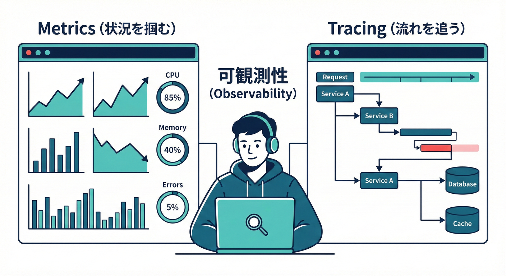

# 第25章：メトリクスとトレースのイメージ📈🕵️‍♀️

## 🎯 この章のゴール

* 「メトリクス（数字の監視）📊」と「トレース（処理の道のり）🧵」の違いを説明できる
* ドメインイベント運用で“何を測るべきか”が3つ以上言える✅
* TypeScriptで「メトリクスを1個増やす」「トレースに1スパン足す」イメージが掴める💡

---

## 1) まずは全体像：観測できると何が嬉しい？👀✨

ドメインイベントは「起きた事実」を起点に、通知・集計・連携などが増えていく設計でしたね📩🧾🔗
ただ、増えるとこうなりがちです👇

* 「注文したのにメール来ないんだけど…？」😢
* 「たまにポイントが二重付与される…？」🪙💥
* 「遅い！どこが遅いの？」🐢💦

ここで助けてくれるのが **Observability（オブザーバビリティ）** です🧠🔭
OpenTelemetry（OTel）は、トレース・メトリクス・ログなどのテレメトリを集めるためのAPI/SDK/ツール群として整理されています。([OpenTelemetry][1])
さらに近年は、シグナルが「トレース・メトリクス・ログ」に加えて「プロファイル」も含めて語られる流れがあります。([OpenTelemetry][2])

---

## 2) メトリクスってなに？📊（“数字のグラフ”）

### ✅ メトリクスの役割

メトリクスは「時間と一緒に見る数字」です⏱️
例：1分あたりのイベント処理件数、失敗率、遅延（レイテンシ）など📈

### よく使う“型”（超重要）🧩

Prometheusの考え方が分かりやすいので、まずはこの4つを覚えるのが王道です🫶

* **Counter（カウンタ）**：増えるだけ（件数）🔢
* **Gauge（ゲージ）**：上下する（在庫数、キュー長など）🎚️
* **Histogram（ヒストグラム）**：分布（処理時間のばらつき）📏
* **Summary（サマリ）**：分位点っぽい要約（※用途は選ぶ）🧾

この分類はPrometheusの公式ドキュメントでも整理されています。([Prometheus][3])

---

## 3) トレースってなに？🧵（“1回の処理の道のり”）

### ✅ トレースの役割

トレースは「1回の処理が、どんな順番で、どこに時間がかかったか」を“道のり”で見ます🚶‍♀️➡️🏁

* 1回の注文処理
* 1つのドメインイベント（例：OrderPaid）の処理
* Outbox配信 → ハンドラ実行 → 外部API呼び出し

### 超ざっくり用語

* **Trace**：一連の流れ 全体🧵
* **Span**：その中の1ステップ（区間）🧱

  * 例：DB保存、Outbox書き込み、メール送信API呼び出し…📦📮📡

### “つながる”ための共通ルール（Trace Context）🔗

分散トレーシングは、サービスを跨いでも同じトレースとして繋げたいです🌍
そのために **traceparent / tracestate** というヘッダ形式がW3Cで標準化されています。([W3C][4])

---

## 4) ドメインイベント運用で「何を測る？」🎛️✨（ミニECの例）

ここからは、あなたのイベント駆動の流れ（保存→Outbox→配信→ハンドラ）にピッタリ当てはめます🧩📦

### 4.1 最低限ほしいメトリクス（まずはこの3つ）🥇

1. **イベント処理件数（Counter）**

* 例：domain_event_handled_total
* ラベル例：eventType（OrderPaidなど）、handler（SendEmailなど）

2. **イベント処理失敗数（Counter）** 💥

* 例：domain_event_failed_total
* リトライ設計の効き具合が見える🔁

3. **イベント処理時間（Histogram）** ⏳

* 例：domain_event_handler_duration_ms
* “遅い原因”を疑う入口になる🐢

### 4.2 Outboxがあるなら「遅延」を測ると強い💪

* **Outbox滞留件数（Gauge）**：未配信が溜まってない？🫙
* **Outbox滞留時間（Histogram）**：配信まで何秒かかってる？⏱️

---

## 5) “読み方”のイメージ：メトリクス vs トレース👀




### メトリクスで分かること📊

* 「今日、失敗率が上がってる」⚠️
* 「特定のハンドラだけ遅い」🐢
* 「Outboxが詰まってる」🫙💦

👉 でも、**“どの1回”が失敗したか** は探しにくいです😵‍💫

### トレースで分かること🧵

* 「この注文（この1回）が遅い。犯人は外部決済APIだった」💳📡
* 「Outbox書き込み後、ワーカーが拾うまで60秒空いてる」🫙➡️🤖

👉 つまり

* **メトリクス：全体の健康診断** 🩺
* **トレース：個別の検死（原因追跡）** 🕵️‍♀️

---

## 6) TypeScript実装イメージ：OTelで“トレースを1本入れる”🧵🔧

OpenTelemetryは、テレメトリ（トレース/メトリクス/ログ）を集めるための仕組みとして整理され、JavaScript/Node向けのドキュメントも用意されています。([OpenTelemetry][1])
また、JavaScript SDK 2系の大きな整理（2.0）も公開されています。([OpenTelemetry][5])

### 6.1 イベントハンドラを“スパンで囲う”🎁

例：OrderPaid → SendEmailHandler の処理を、1スパンとして見える化します📩

```ts
import { trace, SpanStatusCode } from "@opentelemetry/api";

const tracer = trace.getTracer("mini-ec");

export async function handleOrderPaid(event: {
  eventId: string;
  type: "OrderPaid";
  occurredAt: string;
  aggregateId: string; // orderId
  correlationId: string;
  payload: { paymentId: string; amount: number };
}) {
  return tracer.startActiveSpan(
    "DomainEventHandler:OrderPaid:SendEmail",
    {
      attributes: {
        "domain.event.id": event.eventId,
        "domain.event.type": event.type,
        "domain.aggregate.id": event.aggregateId,
        "correlation.id": event.correlationId,
      },
    },
    async (span) => {
      try {
        // 👇 本来はここでメール送信などの副作用
        await fakeSendEmail(event.payload.paymentId);

        span.setStatus({ code: SpanStatusCode.OK });
      } catch (e) {
        span.recordException(e as Error);
        span.setStatus({ code: SpanStatusCode.ERROR });
        throw e;
      } finally {
        span.end();
      }
    }
  );
}

async function fakeSendEmail(_paymentId: string) {
  // ダミー（あとで本物に差し替えOK）
}
```

ポイントはこれだけです👇💡

* **“遅い/失敗した”がトレース上で見える**
* correlationId（第24章）も属性として付けられる🔗

---

## 7) TypeScript実装イメージ：メトリクスを“1個増やす”📈➕🔢

### 7.1 Counterで「成功件数」を数える✅

```ts
import { metrics } from "@opentelemetry/api";

const meter = metrics.getMeter("mini-ec");

// ✅ 増えるだけのカウンタ
const handledTotal = meter.createCounter("domain_event_handled_total", {
  description: "Number of handled domain events",
});

export function countHandled(eventType: string, handlerName: string) {
  handledTotal.add(1, {
    "domain.event.type": eventType,
    "domain.handler": handlerName,
  });
}
```

### 7.2 注意：メトリクスのラベルに「注文ID」を入れない🙅‍♀️

メトリクスは“集計して見る”ので、ラベルが増えすぎると逆に死にます😇

* ✅ eventType / handlerName / result（success/fail）
* ❌ orderId / userId / email（1件ごとに変わる値）

「個別の注文を追いたい」は、トレースやログの担当です🧵📝✨

---

## 8) 送信先のイメージ：OTLP と Collector 🚚📦

「アプリ → どこにデータ送るの？」問題、ありますよね😵‍💫
よくある形はこれ👇

* アプリ（OTel SDK）
  → **OTLP** で送る📤
  → **OpenTelemetry Collector** が受け取って、加工して、好きな観測基盤へ流す🚚

Collectorは、テレメトリを **受信・処理・エクスポート** するためのベンダー中立な実装として紹介されています。([OpenTelemetry][6])
またOTLPは、OTelのデータモデルに沿ってロスなく出せる“まず選ぶ輸出方式”として整理され、対応ツールが多いのも強みです。([OpenTelemetry][7])

---

## 9) 📝 演習（手を動かそう！）💪✨

### 演習1：監視したい指標を3つ選ぶ✅

次から3つ選んで、理由も一言で書いてください📝

* イベント処理成功件数（domain_event_handled_total）
* イベント処理失敗件数（domain_event_failed_total）
* ハンドラ処理時間（domain_event_handler_duration_ms）
* Outbox滞留件数（outbox_pending_count）
* Outbox滞留時間（outbox_lag_seconds）

### 演習2：トレースの“スパン設計”を描く🧵

OrderPaid の処理を例に、Spanを3〜5個に分けて書いてください✍️
例（雰囲気）👇

* UseCase
* Repository Save
* Outbox Insert
* Publish Worker
* SendEmailHandler

### 演習3：「アラート条件」を1個決める🔔

例👇

* 「5分間の失敗率が2%を超えたら通知」⚠️
* 「Outbox滞留件数が100を超えたら通知」🫙

---

## 10) 🤖 AI活用（Copilot / Codex向けプロンプト例）💬✨

### 10.1 指標の洗い出しを手伝ってもらう🧠

* 「ミニECのドメインイベント運用で、最初に入れるべきメトリクスを10個。Counter/Gauge/Histogramに分類して」
* 「Outboxパターンで“詰まり”を検知するためのメトリクス案を、ラベル設計つきで」

### 10.2 “ラベル地獄”を避けるレビュー📏

* 「このメトリクス名とラベル設計、カーディナリティが爆発しない？危ない点があれば直して」

### 10.3 トレースのSpan設計レビュー🧵

* 「この処理フローのSpan分割、どこが粒度大きすぎ/小さすぎ？改善案を出して」

---

## ✅ この章のまとめ🎀

* メトリクスは「全体の健康状態を数字で見る」📈
* トレースは「1回の処理の道のりを追う」🧵
* ドメインイベント運用は、まず

  * 件数（成功/失敗）🔢
  * 時間（遅延）⏱️
  * 滞留（Outbox詰まり）🫙
    を測れると一気に強くなります💪✨

[1]: https://opentelemetry.io/docs/languages/js/?utm_source=chatgpt.com "JavaScript"
[2]: https://opentelemetry.io/blog/2025/stability-proposal-announcement/?utm_source=chatgpt.com "Evolving OpenTelemetry's Stabilization and Release ..."
[3]: https://prometheus.io/docs/tutorials/understanding_metric_types/?utm_source=chatgpt.com "Understanding metric types"
[4]: https://www.w3.org/TR/trace-context/?utm_source=chatgpt.com "Trace Context"
[5]: https://opentelemetry.io/blog/2025/otel-js-sdk-2-0/?utm_source=chatgpt.com "Announcing the OpenTelemetry JavaScript SDK 2.0"
[6]: https://opentelemetry.io/docs/collector/?utm_source=chatgpt.com "Collector"
[7]: https://opentelemetry.io/docs/languages/js/exporters/?utm_source=chatgpt.com "Exporters"
