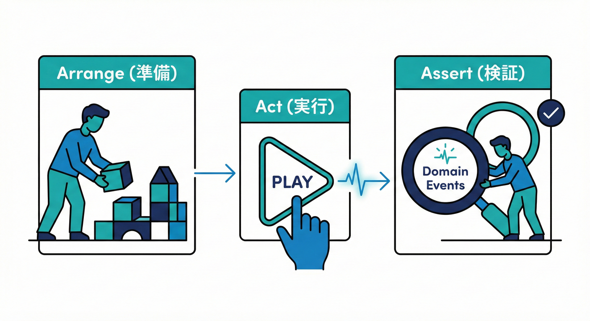

# 第26章：テスト：ドメイン（イベントが出たか？）🧪💖

## この章のゴール🎯✨

ドメインを「単体」でテストして、次の3点を自信を持って確認できるようになります😊🌸

* ✅ 入力（メソッド呼び出し）で、状態が正しく変わった？
* ✅ その結果として、ドメインイベントが**出た**？
* ✅ イベントの中身（payload）が**必要最小限**で正しい？

---

## まず結論：ドメインテストは「入力 → 状態 → イベント」🧠➡️📦➡️📣

ドメイン層のテストは、外部I/O（DB・HTTP・メール送信など）を一切触らずに、

1. **メソッドを呼ぶ**
2. **状態が変わったか見る**
3. **イベントが溜まったか見る**

これだけでOKです💪✨
イベント駆動の設計って「後から機能追加がラク」なんだけど、テストがあるとその安心感が爆増します😇💕

---

## 2026年のテスト環境：Vitestでサクッといこう⚡🧪

この章では **Vitest** を使います😊
理由はシンプルで、Jest系の書き味にかなり互換がありつつ、今どきのTS/ESMでスムーズに動かしやすいからです✨（Viteを使ってなくても選択肢になるよ）([Vitest][1])

さらに、カバレッジも標準ルートで扱えます📈
Vitestは **v8 / istanbul** のカバレッジ収集をサポートしていて、デフォルトはv8です🧩([Vitest][2])

ついでに、Node.js 側も 2026年1月時点で **v24がActive LTS** として更新されています🛡️([Node.js][3])
（セキュリティ更新も定期的に出るので、LTS追従が安心だよ〜😌）

---

## 最小セットアップ（Vitest + TS）🧰✨

### 1) インストール📦

```powershell
npm init -y
npm i -D typescript vitest
npm i -D @vitest/coverage-v8
```

`@vitest/coverage-v8` はカバレッジ用（必要になったらでOKだけど、入れとくと便利）🧡([Vitest][2])

### 2) package.json の scripts 🏃‍♀️💨

```json
{
  "scripts": {
    "test": "vitest",
    "test:run": "vitest run",
    "coverage": "vitest run --coverage"
  }
}
```

`vitest run --coverage` の形は公式ガイドでも紹介されています📈([Vitest][4])

### 3) vitest.config.ts（Vite無し構成でもOK）🧩

Vitestの設定は `vitest/config` から `defineConfig` をimportすればOKです✨([Vitest][5])

```ts
// vitest.config.ts
import { defineConfig } from "vitest/config";

export default defineConfig({
  test: {
    environment: "node",
    coverage: {
      provider: "v8"
    }
  }
});
```

カバレッジの provider 指定は公式ドキュメントどおり🧡([Vitest][2])

### 4) tsconfig.json（最小）🔷

```json
{
  "compilerOptions": {
    "target": "ES2022",
    "module": "ESNext",
    "moduleResolution": "Bundler",
    "strict": true,
    "esModuleInterop": true,
    "skipLibCheck": true
  }
}
```

---

## ドメイン実装：イベントが「溜まる」集約を作ろう🫙🏛️

ここから「注文（Order）」を例にします🛒✨
支払いが成功したら、`OrderPaid` イベントが出る感じね💳🎉

### フォルダ例📁

* `src/domain/` … ドメイン（今回ここだけテストする！）
* `src/domain/*.test.ts` … ドメインの単体テスト

---

## 実装（最小のドメイン + イベントバッファ）🧩📦

### 1) イベント型 & 依存（Clock / IdGenerator）⏰🆔

テストを安定させるコツは「時間」と「ID」を固定できるようにすること😊
`new Date()` と `randomUUID()` をそのまま使うと、テストが毎回違う値になって辛いの…🥲

```ts
// src/domain/events.ts
export type DomainEvent<TType extends string, TPayload> = Readonly<{
  eventId: string;
  type: TType;
  occurredAt: Date;
  aggregateId: string;
  payload: TPayload;
}>;

export type Clock = { now(): Date };
export type IdGenerator = { newId(): string };

export const systemClock: Clock = {
  now: () => new Date()
};

// Node.jsのcrypto.randomUUID()等に繋ぐ想定（ここはドメイン外で差し替えOK）
export const randomId: IdGenerator = {
  newId: () => crypto.randomUUID()
};

export abstract class AggregateRoot {
  private _events: DomainEvent<string, unknown>[] = [];

  protected addEvent(e: DomainEvent<string, unknown>): void {
    this._events.push(e);
  }

  pullEvents(): DomainEvent<string, unknown>[] {
    const copied = [...this._events];
    this._events = [];
    return copied;
  }
}
```

---

### 2) ドメインエラー（例：再支払い禁止）🚫💳

```ts
// src/domain/errors.ts
export class AlreadyPaidError extends Error {
  constructor() {
    super("すでに支払い済みです");
    this.name = "AlreadyPaidError";
  }
}

export class InvalidMoneyError extends Error {
  constructor() {
    super("金額が不正です");
    this.name = "InvalidMoneyError";
  }
}
```

---

### 3) Order 集約：支払いで状態変更 + イベント発火🎉📣

```ts
// src/domain/order.ts
import { AggregateRoot, Clock, DomainEvent, IdGenerator, randomId, systemClock } from "./events";
import { AlreadyPaidError, InvalidMoneyError } from "./errors";

export type OrderStatus = "Created" | "Paid";

export type OrderPaid = DomainEvent<"OrderPaid", Readonly<{
  paymentId: string;
  paidAmount: number;
}>>;

export class Order extends AggregateRoot {
  private constructor(
    private readonly id: string,
    private status: OrderStatus,
    private readonly totalAmount: number,
    private readonly clock: Clock,
    private readonly ids: IdGenerator
  ) {
    super();
    if (totalAmount < 0) throw new InvalidMoneyError();
  }

  static create(id: string, totalAmount: number, deps?: { clock?: Clock; ids?: IdGenerator }) {
    return new Order(
      id,
      "Created",
      totalAmount,
      deps?.clock ?? systemClock,
      deps?.ids ?? randomId
    );
  }

  getId() {
    return this.id;
  }

  getStatus() {
    return this.status;
  }

  pay(paymentId: string): void {
    if (this.status === "Paid") throw new AlreadyPaidError();

    // 状態変更（事実が起きた！）
    this.status = "Paid";

    // イベント発行（過去形の事実）
    const event: OrderPaid = {
      eventId: this.ids.newId(),
      type: "OrderPaid",
      occurredAt: this.clock.now(),
      aggregateId: this.id,
      payload: {
        paymentId,
        paidAmount: this.totalAmount
      }
    };

    this.addEvent(event);
  }
}
```

---

## テスト：イベントが「出たか？」を確認しよう🧪💖

### テストの基本形（AAA）🧁




* Arrange：準備
* Act：実行
* Assert：検証

この章では **「状態」+「イベント」** の2点を見るよ👀✨

---

### 1) 正常系：支払いで Paid になって、OrderPaid が1個出る✅🎉

```ts
// src/domain/order.test.ts
import { describe, it, expect } from "vitest";
import { Order } from "./order";
import type { Clock, IdGenerator } from "./events";

class FixedClock implements Clock {
  constructor(private readonly fixed: Date) {}
  now() { return this.fixed; }
}

class FixedId implements IdGenerator {
  constructor(private readonly fixed: string) {}
  newId() { return this.fixed; }
}

describe("Order（ドメイン）", () => {
  it("支払い成功で、状態がPaidになり、OrderPaidイベントが出る", () => {
    // Arrange
    const clock = new FixedClock(new Date("2026-01-01T00:00:00.000Z"));
    const ids = new FixedId("evt-001");
    const order = Order.create("order-001", 1200, { clock, ids });

    // Act
    order.pay("pay-999");
    const events = order.pullEvents();

    // Assert（状態）
    expect(order.getStatus()).toBe("Paid");

    // Assert（イベント）
    expect(events).toHaveLength(1);
    expect(events[0]).toMatchObject({
      eventId: "evt-001",
      type: "OrderPaid",
      aggregateId: "order-001",
      payload: {
        paymentId: "pay-999",
        paidAmount: 1200
      }
    });

    // Dateは完全一致で見てもOK（固定してるから）
    expect(events[0].occurredAt.toISOString()).toBe("2026-01-01T00:00:00.000Z");
  });
});
```

---

### 2) 重要：イベントは pull したら空になる🫙➡️🫧

「同じイベントを2回処理」しないために、`pullEvents()` は取り出したら空になるのが便利です😊

```ts
import { describe, it, expect } from "vitest";
import { Order } from "./order";

describe("イベントバッファ", () => {
  it("pullEvents()すると、次は空になる", () => {
    const order = Order.create("order-002", 500);
    order.pay("pay-1");

    const first = order.pullEvents();
    const second = order.pullEvents();

    expect(first).toHaveLength(1);
    expect(second).toHaveLength(0);
  });
});
```

---

### 3) 演習の題材：支払い済みは再支払い不可💳❌

ここ、超大事🥹✨
「不変条件（ルール）」はテストで守ると最強になります🔒✅

```ts
import { describe, it, expect } from "vitest";
import { Order } from "./order";
import { AlreadyPaidError } from "./errors";

describe("不変条件", () => {
  it("支払い済みの注文は再支払いできない（イベントも増えない）", () => {
    const order = Order.create("order-003", 800);

    order.pay("pay-1");
    order.pullEvents(); // 1回目のイベントは処理済みの想定で捨てる

    expect(() => order.pay("pay-2")).toThrow(AlreadyPaidError);

    const events = order.pullEvents();
    expect(events).toHaveLength(0);
    expect(order.getStatus()).toBe("Paid");
  });
});
```

---

## 乱数・日時の固定：Vitestでもできる（でもドメイン側で固定できる方が好き）⏰🧊

Vitestには `vi.setSystemTime` みたいな仕組みもあります😊([Vitest][6])
ただし「ドメインが Date に直接依存」すると、将来つらくなりがち…🥲

なのでこの教材では、**Clock/IdGeneratorを注入**する形を推します💡
（テストが安定＆読みやすい＆設計もキレイ✨）

---

## よくある失敗あるある😵‍💫🌀（先に潰そ！）

### ❌ ドメインの単体テストなのに、DBやHTTPを触っちゃう

→ それは **アプリ層/インフラ層のテスト** でやろうね（この章じゃない）🙅‍♀️💦

### ❌ 1テストで検証しすぎる

→ 「状態」と「イベント」だけに集中するとスッキリするよ🍰✨

### ❌ イベントpayloadに“なんでも”入れてしまう

→ テストが重くなる＆依存が増える🎒💥
必要最小限にして、「足りないものは参照で取る」が基本🥺✨

---

## 演習📝💖（手を動かすと一気に理解が進むよ！）

### 演習1：テストケースを増やそう📌

次の3つをテストにしてみてね😊

* `totalAmount` がマイナスなら生成できない（例外）💸❌
* `pay("")` みたいな不正な支払いIDを弾くルールを追加して、テストする🧾
* イベントが2回出ないことを確認する（pull後は空）🫧

### 演習2：イベントの中身を「最小」に整える🎒✂️

`OrderPaid` の payload に「注文の全明細」を入れたくなったら…
それ本当に必要？を考えて、最小案に直してみよう😌✨

---

## 🤖 AI活用（Copilot / Codex）プロンプト例💬✨

コピペして使ってOKだよ〜😆💕

* 「Orderの`pay()`の不変条件（再支払い禁止）をテストケースとして列挙して。正常系/異常系で分けてね」
* 「このテスト、見落としてる境界値ある？（例：金額0、paymentIdの空文字、連続呼び出し）」
* 「`toMatchObject` を使った読みやすいassertに直して」
* 「テスト名を“仕様が読める日本語”に整えて、`it()`の文を改善して」

---

## まとめ🎀✨

ドメインの単体テストはこれだけでOKでした😊💖

* 🧠 入力 → ✅ 状態 → 📣 イベント
* 🧊 Clock/Idを固定してテストを安定させる
* 🫙 `pullEvents()` で “取り出したら空” にして二重処理を防ぐ

次の章では、ここで出たイベントを受け取る側（ハンドラ）を「副作用込みで安全にテスト」していきます📞🧪

[1]: https://vitest.dev/guide/comparisons?utm_source=chatgpt.com "Comparisons with Other Test Runners | Guide"
[2]: https://vitest.dev/guide/coverage.html?utm_source=chatgpt.com "Coverage | Guide"
[3]: https://nodejs.org/en/about/previous-releases?utm_source=chatgpt.com "Node.js Releases"
[4]: https://vitest.dev/guide/features?utm_source=chatgpt.com "Features | Guide"
[5]: https://vitest.dev/config/?utm_source=chatgpt.com "Configuring Vitest"
[6]: https://vitest.dev/guide/mocking?utm_source=chatgpt.com "Mocking | Guide"
