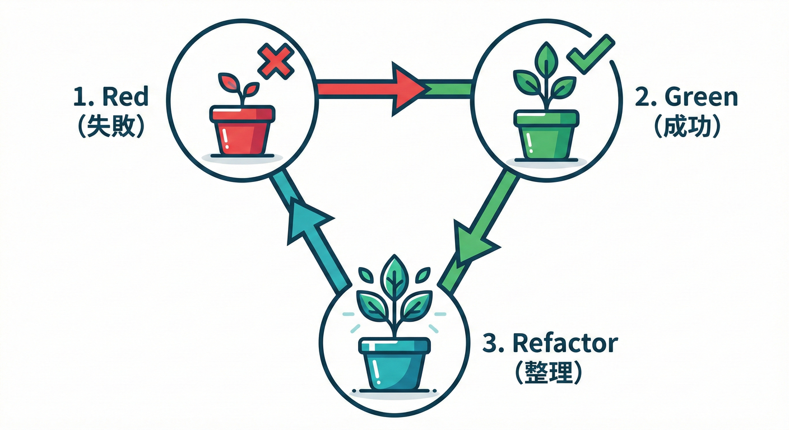

# 第28章：TDDっぽくイベントを育てる🌱🧪

## この章のゴール🎯✨

* 「テスト → 実装 → 整理（リファクタ）」の流れで、ドメインイベントを**小さく安全に進化**させられる🧩🔧
* `OrderPlaced` を **最小 → ちょい拡張 → きれいに整理** の3ステップで完成させる👣👣👣
* “テストが仕様書になる感覚”をつかむ📘💖

---

## まず「TDDっぽく」って何？🤔🧪

TDD（テスト駆動開発）は、ざっくり言うとこの繰り返しだよ〜👇✨

1. **Red 🔴**：まずテストを書く（当然まだ落ちる）
2. **Green 🟢**：最小の実装でテストを通す
3. **Refactor 🧹**：動作を変えずにコードを整える（読みやすく・増やしやすく）

ドメインイベントと相性がいい理由はこれ👇

* 「この操作で**何が起きた？**」をテストで固定できる🧾✨
* 後から payload を足しても、**壊れてないか即わかる**✅
* “イベント名・粒度”の迷いも、テストがあると整理しやすい🧠🧹

ちなみに、2026年1月時点だと TypeScript の安定版は **5.9.3** が “Latest” 扱いだよ🧷✨ ([GitHub][1])
テストランナーは **Vitest 4.0** が出ていて（2025/10）、今どき感あるよ〜⚡🧪 ([Vitest][2])

---

## 今回の題材：`OrderPlaced` を育てる🛒🧾

「注文が確定した」っていう事実を、イベントとして育てるよ🌱✨
（ミニEC想定：注文確定＝`OrderPlaced`）

この章では、**ドメインがイベントを溜める → アプリ層が拾う**流れで進めるよ🫙➡️📣

---

## テスト環境（Vitest 4）を用意🧪⚙️

Vitest は公式で **UIを別パッケージ（@vitest/ui）として追加**できて、`--ui` で起動できるよ✨ ([Vitest][3])
VS Code には Vitest を実行・デバッグできる拡張（Vitest Explorer）もあるよ🧩🖥️ ([Visual Studio Marketplace][4])

最低限の例👇（すでに第26〜27章で入れてるなら読み飛ばしてOK🙆‍♀️）

```json
// package.json（例）
{
  "name": "mini-ec-domain-events",
  "private": true,
  "type": "module",
  "scripts": {
    "test": "vitest",
    "test:watch": "vitest --watch",
    "test:ui": "vitest --ui"
  },
  "devDependencies": {
    "@types/node": "^24.0.0",
    "typescript": "^5.9.3",
    "vitest": "^4.0.0",
    "@vitest/ui": "^4.0.0"
  }
}
```

> 📝 ちょい注意：Vitest 4 はカバレッジ周りに変更も入ってるので、更新する時は移行ガイドを見るのがおすすめだよ🔍 ([Vitest][5])

---

## フォルダ構成（この章の最小セット）🗂️✨

```text
src/
  domain/
    event.ts
    aggregateRoot.ts
    order.ts
  application/
    placeOrder.ts
test/
  orderPlaced.spec.ts
```

---

## ハンズオン：3ステップで `OrderPlaced` を完成させる👣🧪

## Step 0：ベース（土台）を作る🧱✨

まずは「イベントの型」と「イベントを溜める仕組み」だけ用意するよ🫙🧩

### `src/domain/event.ts`（イベント共通フォーマット）🧾🛡️

```ts
export type DomainEvent<TType extends string, TPayload> = Readonly<{
  eventId: string;
  type: TType;
  occurredAt: string;     // ISO文字列（例: 2026-01-27T...）
  aggregateId: string;
  payload: TPayload;
}>;
```

### `src/domain/aggregateRoot.ts`（イベントを溜める）🫙✨

```ts
import type { DomainEvent } from "./event";

export abstract class AggregateRoot {
  private _events: DomainEvent<string, unknown>[] = [];

  protected raise(event: DomainEvent<string, unknown>) {
    this._events.push(event);
  }

  pullDomainEvents(): DomainEvent<string, unknown>[] {
    const events = this._events;
    this._events = [];
    return events;
  }
}
```

---

## Step 1：Red → Green（「イベントが出る」を最小で通す）🔴➡️🟢




### 1) まずテストを書く（Red）🔴🧪

「注文確定したら `OrderPlaced` が1個出る」だけチェックするよ✅

#### `test/orderPlaced.spec.ts`

```ts
import { describe, it, expect } from "vitest";
import { Order } from "../src/domain/order";

describe("OrderPlaced（Step1）", () => {
  it("注文を確定すると OrderPlaced が1つ発生する", () => {
    const order = Order.create("order-1");

    order.place();

    const events = order.pullDomainEvents();
    expect(events).toHaveLength(1);
    expect(events[0].type).toBe("OrderPlaced");
    expect(events[0].aggregateId).toBe("order-1");
  });
});
```

この時点では `Order` がないから落ちるよね🙂‍↕️（それでOK）

---

### 2) 最小実装で通す（Green）🟢🔧

#### `src/domain/order.ts`（Step1の最小版）🛒✨

```ts
import { AggregateRoot } from "./aggregateRoot";
import type { DomainEvent } from "./event";
import { randomUUID } from "node:crypto";

type OrderPlaced = DomainEvent<"OrderPlaced", {}>;

export class Order extends AggregateRoot {
  private constructor(private readonly id: string) {
    super();
  }

  static create(id: string) {
    return new Order(id);
  }

  place() {
    const event: OrderPlaced = {
      eventId: randomUUID(),
      type: "OrderPlaced",
      occurredAt: new Date().toISOString(),
      aggregateId: this.id,
      payload: {},
    };

    this.raise(event);
  }
}
```

✅ これで Step1 のテストは通るはず！

---

### 3) Step1の学びポイント🧠✨

* まずは payload を空 `{}` でもOK🙆‍♀️（最小で通すのがコツ）
* 「イベントが出る」が**仕様として固定**された📌🧾

---

## Step 2：Red → Green（payload を“必要最小限”で足す）🔴➡️🟢🎒

### 1) テストを追加（Red）🔴🧪

今度は「注文確定時に最低限ほしい情報」を payload に入れるよ🎒
例：`customerId`, `total`（合計）

#### `test/orderPlaced.spec.ts`（追記）

```ts
import { describe, it, expect } from "vitest";
import { Order } from "../src/domain/order";

describe("OrderPlaced（Step2）", () => {
  it("OrderPlaced payload に customerId と total が入る", () => {
    const order = Order.create("order-2", { customerId: "cust-9" });

    order.place(1200);

    const [event] = order.pullDomainEvents();
    expect(event.type).toBe("OrderPlaced");
    expect(event.payload.customerId).toBe("cust-9");
    expect(event.payload.total).toBe(1200);
  });
});
```

---

### 2) 実装を最小で更新（Green）🟢🔧

#### `src/domain/order.ts`（Step2版）🛒💳✨

```ts
import { AggregateRoot } from "./aggregateRoot";
import type { DomainEvent } from "./event";
import { randomUUID } from "node:crypto";

type OrderPlacedPayload = {
  customerId: string;
  total: number;
};

type OrderPlaced = DomainEvent<"OrderPlaced", OrderPlacedPayload>;

export class Order extends AggregateRoot {
  private constructor(
    private readonly id: string,
    private readonly customerId: string,
  ) {
    super();
  }

  static create(id: string, args?: { customerId: string }) {
    const customerId = args?.customerId ?? "guest";
    return new Order(id, customerId);
  }

  place(total: number = 0) {
    const event: OrderPlaced = {
      eventId: randomUUID(),
      type: "OrderPlaced",
      occurredAt: new Date().toISOString(),
      aggregateId: this.id,
      payload: {
        customerId: this.customerId,
        total,
      },
    };

    this.raise(event);
  }
}
```

✅ Step2 も通る〜！🎉

---

### 3) Step2の学びポイント🧠🎒

* payload は「今ほんとに必要な最小」でOK（盛りすぎ注意⚠️）
* テストを足すと、“イベント契約”が育つ感じが出る🌱📜

---

## Step 3：Refactor（壊さず整理して、育てやすくする）🧹✨

ここからが「TDDっぽい」おいしいところ😋
テストが通ってる状態で、安心して整理できるよ✅🧹

### ありがちなモヤモヤ😵‍💫

* `new Date()` がテストでブレそう
* `randomUUID()` がテストで追いにくい
* `place()` がイベント生成の詳細を持ちすぎてる

### ここでやる整理の方向性🧭✨

* “時間”と“ID”を外から渡せるようにして、テストを安定させる🕰️🧾
* イベント生成を1か所にまとめて読みやすくする📦✨

---

### 1) Clock と IdGenerator を用意（小さく）🕰️🧾

#### `src/domain/order.ts`（Step3版：整理）🧹✨

```ts
import { AggregateRoot } from "./aggregateRoot";
import type { DomainEvent } from "./event";

type OrderPlacedPayload = {
  customerId: string;
  total: number;
};

type OrderPlaced = DomainEvent<"OrderPlaced", OrderPlacedPayload>;

type Clock = { nowIso(): string };
type IdGenerator = { newId(): string };

const systemClock: Clock = { nowIso: () => new Date().toISOString() };

export class Order extends AggregateRoot {
  private constructor(
    private readonly id: string,
    private readonly customerId: string,
    private readonly clock: Clock,
    private readonly idGen: IdGenerator,
  ) {
    super();
  }

  static create(
    id: string,
    args?: {
      customerId: string;
      clock?: Clock;
      idGen?: IdGenerator;
    },
  ) {
    const customerId = args?.customerId ?? "guest";
    const clock = args?.clock ?? systemClock;
    const idGen =
      args?.idGen ?? { newId: () => crypto.randomUUID() }; // NodeのWeb Crypto

    return new Order(id, customerId, clock, idGen);
  }

  place(total: number = 0) {
    this.raise(this.buildOrderPlaced(total));
  }

  private buildOrderPlaced(total: number): OrderPlaced {
    return {
      eventId: this.idGen.newId(),
      type: "OrderPlaced",
      occurredAt: this.clock.nowIso(),
      aggregateId: this.id,
      payload: { customerId: this.customerId, total },
    };
  }
}
```

> 💡 `crypto.randomUUID()` は Node 側の Web Crypto でも使えるよ（最近の Node ならOK）🧾✨
> ちなみに Node は LTS を使うのが無難で、2026年1月時点だと **v24 が Active LTS** だよ🟩 ([Node.js][6])

---

### 2) テストも「安定化」できる✅🧪

時間とIDが固定できると、テストが気持ちいいくらい安定するよ〜🧡

#### `test/orderPlaced.spec.ts`（Step3用の例）

```ts
import { describe, it, expect } from "vitest";
import { Order } from "../src/domain/order";

describe("OrderPlaced（Step3）", () => {
  it("occurredAt と eventId を固定してテストできる", () => {
    const fixedClock = { nowIso: () => "2026-01-27T00:00:00.000Z" };
    const fixedIdGen = { newId: () => "evt-1" };

    const order = Order.create("order-3", {
      customerId: "cust-1",
      clock: fixedClock,
      idGen: fixedIdGen,
    });

    order.place(500);

    const [event] = order.pullDomainEvents();
    expect(event.eventId).toBe("evt-1");
    expect(event.occurredAt).toBe("2026-01-27T00:00:00.000Z");
  });
});
```

---

## 仕上げ：アプリ層で「イベントを拾う」ミニ例📣🚚

「ドメインは溜めるだけ」だったよね？🫙
最後にアプリ層が拾って “次の処理” に回すイメージだけつけよう〜✨

### `src/application/placeOrder.ts`（超ミニ）🧩

```ts
import { Order } from "../domain/order";

type OrderRepository = {
  save(order: Order): Promise<void>;
};

type EventDispatcher = {
  dispatch(events: { type: string }[]): Promise<void>;
};

export class PlaceOrderUseCase {
  constructor(
    private readonly repo: OrderRepository,
    private readonly dispatcher: EventDispatcher,
  ) {}

  async execute(input: { orderId: string; customerId: string; total: number }) {
    const order = Order.create(input.orderId, { customerId: input.customerId });

    order.place(input.total);

    await this.repo.save(order);

    const events = order.pullDomainEvents();
    await this.dispatcher.dispatch(events);
  }
}
```

> 🧠 ポイント：保存のあとに dispatch する流れは「保存できた事実に寄せる」ためだよ💾➡️📣
> （Outbox まで行くのは次の章以降の世界観だね🗃️✨）

---

## AI活用（この章向け）🤖💬✨

## 1) “次の最小ステップ” を聞く🧭

* 「今このテストが落ちてる。**最小で通す実装だけ**提案して」
* 「payload を足したい。**入れるべき最小項目**を3案で」

## 2) リファクタ案を出してもらう🧹

* 「この `place()` が読みにくい。**責務を減らす分割案**を3つ」
* 「Clock/Id を注入したい。**やりすぎない最小DI**で」

## 3) テスト名を整える📛

* 「このテスト名、読みやすい日本語と英語で候補10個ちょうだい」

---

## 演習📝💖（3ステップを自分の手で）

## 演習A：`OrderPlaced` を“最小→拡張→整理”で作る👣✨

1. Step1：`OrderPlaced` が出るだけ
2. Step2：payload に `customerId` と `total`
3. Step3：Clock/Id注入でテストを安定化

## 演習B：もう1イベント増やす🌱➕

`OrderCancelled` を同じ流れで追加してみよう🧾

* Step1：イベントが出る
* Step2：payload に `reason`（キャンセル理由）
* Step3：イベント生成を `buildOrderCancelled()` に分離

---

## つまずきチェックリスト✅🧠

* テストが「実装の細部」まで縛ってない？（縛りすぎると育てにくい）🔒😵‍💫
* payload を盛りすぎてない？（参照で取れる情報は入れすぎ注意）🎒⚠️
* “時間”や“ID”がブレてテストが不安定になってない？🕰️🧾
* 「Red→Green→Refactor」の順番を守れてる？（Refactorを先にしがち）🧹🫣

---

## まとめ🌷✨

* **まずは小さくテストで固定**して、イベントを安全に育てる🧪🧾
* payload は必要最小限から始めて、**テストで契約を育てる**📜🌱
* テストが通ってる状態なら、**リファクタは怖くない**🧹💖

[1]: https://github.com/microsoft/typescript/releases "Releases · microsoft/TypeScript · GitHub"
[2]: https://vitest.dev/blog/vitest-4?utm_source=chatgpt.com "Vitest 4.0 is out!"
[3]: https://vitest.dev/guide/ui.html?utm_source=chatgpt.com "Vitest UI | Guide"
[4]: https://marketplace.visualstudio.com/items?itemName=vitest.explorer&utm_source=chatgpt.com "Vitest"
[5]: https://vitest.dev/guide/migration.html?utm_source=chatgpt.com "Migration Guide"
[6]: https://nodejs.org/en/about/previous-releases?utm_source=chatgpt.com "Node.js Releases"
