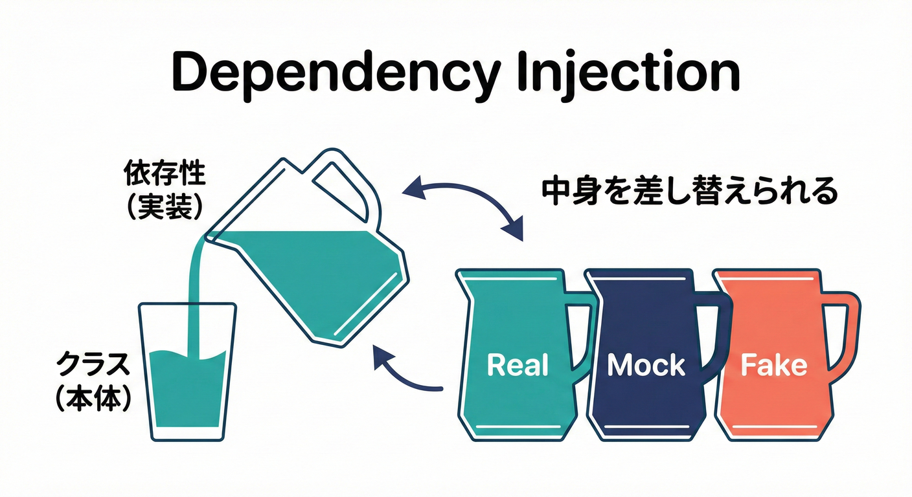

# 第29章：DI入門（差し替え可能にする）🔄🧩

## 🎯 ゴール

* 外部サービス（決済・メール・DBなど）への依存を「ゆるく」できる💐
* テストで本物⇄偽物をサクッと入れ替えられる🧪✨
* 「どこで new する？」問題を解決できる🧠🔧

---

## 1) DIってなに？🍹➡️🥤




DI（Dependency Injection）は「必要なもの（依存）を、外から注いであげる（注入）」考え方だよ〜🫶💡

* 依存：クラスが仕事をするために “使う道具” 🧰
  例）決済ゲートウェイ、メール送信、注文リポジトリ
* 注入：その道具をクラスの外で用意して渡すこと🎁
* DIをすると、道具の種類を簡単に差し替えできる🔁✨

---

## 2) DIがないと何がつらい？😵‍💫💥

たとえば「注文の支払い」をする処理で、クラスの中でいきなり本物の決済を作っちゃうと…👇

* テストでネットワーク決済が動いちゃう（怖い💳😱）
* 失敗ケースの再現が面倒（タイムアウトとか…📡💥）
* 決済サービスを変更したい時に、あちこち修正になる（つらい🧩🪓）

---

## 3) まずは王道：コンストラクタ注入🧰✨

DIの中でもいちばん読みやすくて、事故りにくいのが「コンストラクタ注入」だよ✅💕

やることはシンプル👇

1. 依存を「インターフェース（契約）」にする📜
2. 本物の実装と、テスト用の偽物実装を作る🎭
3. 使う側は “インターフェースだけ” を受け取る🎁
4. 組み立て（new）を「外」に追い出す🏗️

---

## 3-1) PaymentGateway をインターフェース化する💳🧩

決済の “契約” を作るよ（ミニEC想定）🛒✨

```ts
// payment-gateway.ts
export type PaymentResult = {
  transactionId: string;
};

export type ChargeInput = {
  orderId: string;
  amountYen: number;
};

export interface PaymentGateway {
  charge(input: ChargeInput): Promise<PaymentResult>;
}
```

ポイント🧠✨

* 「決済のやり方」ではなく「決済した結果（transactionId）」に寄せると扱いやすいよ📦
* メソッドは増やしすぎない（太ると地獄🍔💦）
  返金・与信・売上取消…は別インターフェースに分けてもOK✂️

---

## 3-2) 本番用の実装（例）🏦🌍

本番は外部サービスを呼ぶ実装になるよね📡💳

```ts
// stripe-payment-gateway.ts（例）
import { PaymentGateway, ChargeInput, PaymentResult } from "./payment-gateway";

type StripeClient = {
  charge: (amountYen: number, orderId: string) => Promise<{ id: string }>;
};

export class StripePaymentGateway implements PaymentGateway {
  constructor(private readonly stripe: StripeClient) {}

  async charge(input: ChargeInput): Promise<PaymentResult> {
    const res = await this.stripe.charge(input.amountYen, input.orderId);
    return { transactionId: res.id };
  }
}
```

---

## 3-3) テスト用の偽物（Fake）🧸🧪

テストでは “外部サービスに出ない” 偽物を注入するよ✨

```ts
// fake-payment-gateway.ts
import { PaymentGateway, ChargeInput, PaymentResult } from "./payment-gateway";

export class FakePaymentGateway implements PaymentGateway {
  constructor(private readonly shouldFail = false) {}

  async charge(input: ChargeInput): Promise<PaymentResult> {
    if (this.shouldFail) {
      throw new Error("PAYMENT_TEMPORARILY_FAILED");
    }
    return { transactionId: `fake_${input.orderId}_${input.amountYen}` };
  }
}
```

これで、成功・失敗を自由自在に作れるよ🔁💖

---

## 3-4) ユースケースに注入する🎁🧩

「支払いユースケース」は PaymentGateway の “中身” を知らないのが正解✅✨

```ts
// pay-order-usecase.ts
import { PaymentGateway } from "./payment-gateway";

type Order = {
  id: string;
  totalYen: number;
  // 支払い済みにする（内部でイベントをためる想定でもOK）
  markPaid: (txId: string) => void;
};

type OrderRepository = {
  findById: (id: string) => Promise<Order>;
  save: (order: Order) => Promise<void>;
};

export class PayOrderUseCase {
  constructor(
    private readonly orderRepo: OrderRepository,
    private readonly paymentGateway: PaymentGateway,
  ) {}

  async execute(orderId: string): Promise<void> {
    const order = await this.orderRepo.findById(orderId);

    const result = await this.paymentGateway.charge({
      orderId: order.id,
      amountYen: order.totalYen,
    });

    order.markPaid(result.transactionId);
    await this.orderRepo.save(order);
  }
}
```

ここがDIの気持ちよさポイント🥰✨

* ユースケースは「契約（PaymentGateway）」しか見てない
* 本番は本番実装、テストはFakeを差すだけでOK🎯

---

## 4) 組み立て場所（Composition Root）🏗️🧩

「new をどこに置くか問題」はここで解決するよ✅
アプリの入口（起動ファイル）でまとめて組み立てるのが定番🎀

```ts
// main.ts（組み立て場所）
import { PayOrderUseCase } from "./pay-order-usecase";
import { StripePaymentGateway } from "./stripe-payment-gateway";

// ここは例（実際はDBや外部クライアント初期化も並ぶ）
const stripeClient = {
  charge: async (amountYen: number, orderId: string) => ({ id: "tx_real_123" }),
};

const orderRepo = {
  findById: async (id: string) => ({
    id,
    totalYen: 1200,
    markPaid: (_txId: string) => {},
  }),
  save: async (_order: any) => {},
};

const paymentGateway = new StripePaymentGateway(stripeClient);

const useCase = new PayOrderUseCase(orderRepo, paymentGateway);

// 例：どこかのHTTPハンドラから呼ぶ
await useCase.execute("order_001");
```

コツ💡

* ドメイン・ユースケースの中に new を散らさない🌪️
* 入口だけ “配線工事” になる（それでいい🏗️✨）

---

## 5) テストが超ラクになる🧪💖（Fake差し替え）

Fakeを注入すれば、外部なしで安全に検証できるよ✨

```ts
// pay-order-usecase.test.ts（例）
import { describe, it, expect } from "vitest";
import { PayOrderUseCase } from "./pay-order-usecase";
import { FakePaymentGateway } from "./fake-payment-gateway";

describe("PayOrderUseCase", () => {
  it("支払い成功で保存まで進む", async () => {
    const calls: string[] = [];

    const orderRepo = {
      findById: async (id: string) => ({
        id,
        totalYen: 1200,
        markPaid: (txId: string) => calls.push(`paid:${txId}`),
      }),
      save: async () => calls.push("saved"),
    };

    const paymentGateway = new FakePaymentGateway(false);

    const useCase = new PayOrderUseCase(orderRepo, paymentGateway);
    await useCase.execute("order_001");

    expect(calls).toContain("saved");
  });

  it("支払い失敗なら例外になる（例）", async () => {
    const orderRepo = {
      findById: async (id: string) => ({
        id,
        totalYen: 1200,
        markPaid: (_txId: string) => {},
      }),
      save: async () => {},
    };

    const paymentGateway = new FakePaymentGateway(true);

    const useCase = new PayOrderUseCase(orderRepo, paymentGateway);
    await expect(useCase.execute("order_001")).rejects.toBeTruthy();
  });
});
```

---

## 6) よくある落とし穴🙈⚠️

### ✅ 落とし穴1：インターフェースは実行時に消える🫥

TypeScriptのインターフェースは型チェック用だから、実行時には存在しないよ💡
だから DIコンテナを使うときは「トークン（Symbolなど）」が必要になりがち🪪✨

### ✅ 落とし穴2：Service Locator（探しに行くDI）は避けたい🏃‍♀️💨

クラスの中で「コンテナから取得」し始めると依存が見えなくなる😵
依存はコンストラクタで “受け取るだけ” が読みやすい✅

### ✅ 落とし穴3：インターフェースが太る🍔💥

PaymentGateway に「charge」「refund」「capture」「void」…全部入れると破綻しやすい🧨
用途ごとに小さく分けるのがコツ✂️💕

---

## 7) DIコンテナは必要？📦🧩（最新事情つき）

小さめのアプリなら、ここまでの “手動DI” だけで十分いけることも多いよ✅✨
でも依存が増えて「組み立てが大変💦」になったら、DIコンテナが助けてくれる🛟

### よく使われる選択肢（2026年1月時点）🗓️✨

* TSyringe：npm の最新版は 4.10.0 ([npm][1])
* InversifyJS：npm の最新版は 7.11.0 ([npm][2])

  * 次のメジャー（8.0.0）は 2026年3月を目標に計画中 ([InversifyJS][3])

### TSyringe を使うときの “必要セット” 🧩🪄

TSyringeはデコレータ＆メタデータを使うので、設定が要るよ👇 ([GitHub][4])

* tsconfig の experimentalDecorators / emitDecoratorMetadata
* reflect-metadata の読み込み（DIより前に1回だけ）

```ts
// main.ts（最初に1回だけ）
import "reflect-metadata";
```

---

## 8) 演習✍️🌸

### 演習1：PaymentGateway を “最小の契約” にする📜

* charge の入力と出力を、必要最小限にする
* 余計な情報（顧客の住所全部など）は入れない🎒❌

### 演習2：Fake を2種類作る🎭

* 成功するFake（transactionIdを返す）
* 失敗するFake（例外を投げる）
  → 失敗時の動作（保存しない、イベント出さない等）をテストで確認🧪✨

### 演習3：new を入口に寄せる🏗️

* ユースケースの中の new をゼロにする
* main.ts（または bootstrap.ts）に組み立てを集約する🧩

---

## 9) AI活用プロンプト集🤖🪄

* 「PaymentGateway のインターフェースを、メソッド1つで最小にして。入力・出力の型も提案して」💳✨
* 「このユースケース、依存が多すぎる？分割案を3つ出して」🧩🔪
* 「Fake実装で、成功/失敗/タイムアウトを再現する案を作って」🧸⏱️
* 「このインターフェース、太りすぎてないかレビューして。分割したらどうなる？」🍔➡️🍱

---

## 🗒️ 最新メモ（2026年1月）🧷

* Node.js は v24 が Active LTS、v25 が Current として更新されているよ ([Node.js][5])
* v24 系は 2026-01-13 に 24.13.0（LTS）のセキュリティリリースが出てる ([Node.js][6])
* TypeScript の安定版リリースとしては 5.9.3 が “Latest” 扱いになっている（GitHub Releases） ([GitHub][7])

[1]: https://www.npmjs.com/package/tsyringe?utm_source=chatgpt.com "tsyringe"
[2]: https://www.npmjs.com/package/inversify?utm_source=chatgpt.com "inversify"
[3]: https://inversify.io/blog/planning-inversify-8-0-0/ "Planning InversifyJS 8 - Feedback Needed! | InversifyJS"
[4]: https://github.com/microsoft/tsyringe "GitHub - microsoft/tsyringe: Lightweight dependency injection container for JavaScript/TypeScript"
[5]: https://nodejs.org/en/about/previous-releases "Node.js — Node.js Releases"
[6]: https://nodejs.org/en/blog/release/v24.13.0?utm_source=chatgpt.com "Node.js 24.13.0 (LTS)"
[7]: https://github.com/microsoft/typescript/releases "Releases · microsoft/TypeScript · GitHub"
