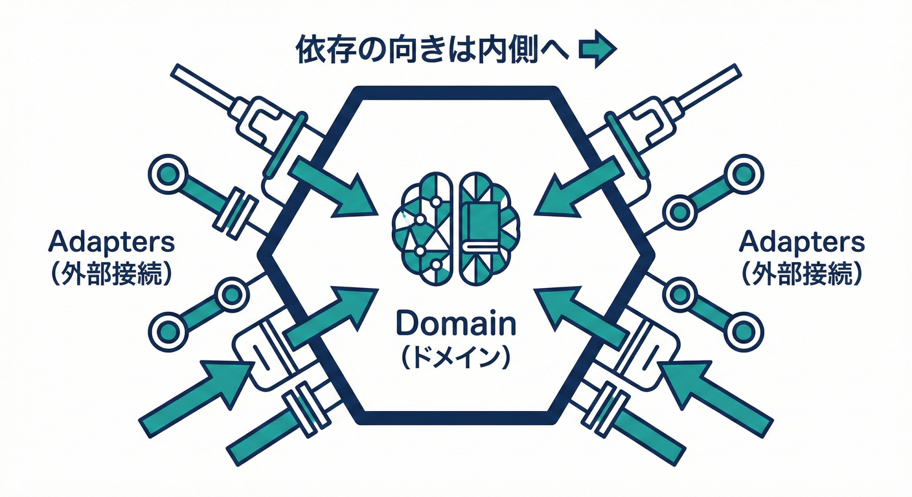

# 第30章：Ports & Adaptersで整理する（置き場所のルール）🔌🗂️

## 🎯 この章のゴール

* 「ドメインを外の都合（DB/HTTP/外部API）から守る」って何かを説明できる 🛡️✨
* Inbound / Outbound の “Port” を TypeScript の `interface` で切れる 🧩
* 「どのコードをどこに置くか」のルールを作れて、迷子にならない 🗺️🐾
* ドメインイベントの “配る先” が増えても、ぐちゃぐちゃにならない 🍱➡️✨

---

## 🧠 まずイメージ（超ざっくり）🏝️🚢

Ports & Adapters（別名：Hexagonal Architecture）は、

* **中心（ドメイン）**は “業務ルール” だけ 🧠
* 外側（DB/通知/HTTPなど）は “差し替え可能な部品” 🔧
* 真ん中が外側に **依存しない**（これが最重要）🔥

この考え方は「UIやDBなしでもアプリが動いてテストできるようにしよう」という狙いで整理されたものだよ 📌 ([Alistair Cockburn][1])

---

## 🧩 Ports と Adapters って結局なに？（用語をやさしく）🧸✨

### ✅ Port（ポート）＝ “穴（約束）” 🤝🕳️

TypeScript で言うと **`interface`（契約）** がいちばん近いよ！

* **Inbound Port（入口の約束）**：アプリが「提供する機能」の形（= ユースケース）🚪

  * 例：`PayOrderUseCase`（支払いする）💳
* **Outbound Port（出口の約束）**：アプリが「外にお願いしたいこと」の形（= 外部依存）📤

  * 例：`OrderRepository`（保存して〜）💾
  * 例：`PaymentGateway`（決済して〜）🌐

> ざっくり：
>
> * Inbound = 外 → アプリへ入ってくる
> * Outbound = アプリ → 外へ出ていく

「Incoming ports / Outgoing ports」の説明もこの感覚でOKだよ 🧠 ([8th Light][2])

---

### ✅ Adapter（アダプター）＝ “穴に刺さる変換器” 🔌🔁

Port（interface）を **実際に実装する側**。

* Inbound Adapter：HTTP/CLI/テストコードなど（入力をアプリの形に変換）🧾➡️🧩
* Outbound Adapter：DB実装、外部API呼び出し、Outbox発行など（アプリのお願いを現実の技術で実現）🧩➡️🛠️

Cockburnの説明でも「外から来たイベントを adapter が手続き呼び出しに変換して渡す / 外へ送る時も port 経由で adapter が技術の信号に変換する」って書かれてるよ 📮🔁 ([Alistair Cockburn][1])

---

## 🔥 いちばん大事なルール（依存の向き）➡️🛡️




### ✅ “内側（ドメイン）ほど偉い” 👑

* `domain` は **何にも依存しない**（HTTPもDBも知らない）🙅‍♀️
* `application` は domain を使う（ユースケースを実行する）🎮
* `infrastructure` は port を実装する（現実の技術担当）🛠️

つまり依存はこう👇

```text
infrastructure  --->  application  --->  domain
```

逆（domain が infrastructure を import）は **即アウト** 🚫😵‍💫
これが守れると、DBやフレームワークが変わってもドメインが無傷で生き残るよ 🧟‍♀️✨

---

## 🗂️ 置き場所ルール（ミニEC向けフォルダ構成）🛒📦

```text
src/
  domain/
    order/
      Order.ts
    events/
      DomainEvent.ts
  application/
    ports/
      inbound/
        PayOrderUseCase.ts
      outbound/
        OrderRepository.ts
        PaymentGateway.ts
        EventPublisher.ts
    usecases/
      PayOrderService.ts
  infrastructure/
    inbound/
      http/
        payOrderRoute.ts
    outbound/
      memory/
        InMemoryOrderRepository.ts
      payment/
        FakePaymentGateway.ts
      events/
        SimpleEventPublisher.ts
  main.ts
```

* **domain**：Entity/VO/不変条件/ドメインイベントを出す場所 🔒🧠
* **application**：ユースケース（コマンド処理）＋ port（interface）📮🧩
* **infrastructure**：HTTP/DB/外部API/Outboxなど、現実の技術で port を実装 🛠️🌍
* **main.ts**：全部を組み立てて配線する場所（Composition Root）🧵✨

---

## 🛒 ミニECでやってみる（支払いユースケース）💳✨

### 1) domain：ドメインイベントの型 🧾🧠

```ts
// src/domain/events/DomainEvent.ts
export type DomainEvent<TType extends string, TPayload> = Readonly<{
  eventId: string;
  occurredAt: string;      // ISO文字列（例: new Date().toISOString()）
  aggregateId: string;
  type: TType;
  payload: TPayload;
}>;
```

### 2) domain：Order が状態変更してイベントを “ためる” 🫙✨

```ts
// src/domain/order/Order.ts
import { DomainEvent } from "../events/DomainEvent.js";

type OrderStatus = "Created" | "Paid";

type OrderPaid = DomainEvent<
  "OrderPaid",
  { orderId: string; amount: number }
>;

export class Order {
  private status: OrderStatus = "Created";
  private readonly events: DomainEvent<string, unknown>[] = [];

  constructor(
    public readonly id: string,
    private amount: number
  ) {}

  pay(nowIso: string, eventId: string) {
    if (this.status === "Paid") throw new Error("すでに支払い済みだよ💦");

    this.status = "Paid";

    const ev: OrderPaid = {
      eventId,
      occurredAt: nowIso,
      aggregateId: this.id,
      type: "OrderPaid",
      payload: { orderId: this.id, amount: this.amount },
    };

    this.events.push(ev);
  }

  pullDomainEvents() {
    const copied = [...this.events];
    this.events.length = 0;
    return copied;
  }
}
```

ポイント👇

* Order は **DBもメールも知らない** 🙅‍♀️
* ただ「支払われた」という事実をイベントとして出すだけ 💡

---

### 3) application：Outbound Port（外にお願いする約束）📤🤝

```ts
// src/application/ports/outbound/OrderRepository.ts
import { Order } from "../../../domain/order/Order.js";

export interface OrderRepository {
  findById(id: string): Promise<Order | null>;
  save(order: Order): Promise<void>;
}
```

```ts
// src/application/ports/outbound/PaymentGateway.ts
export interface PaymentGateway {
  charge(orderId: string, amount: number): Promise<void>;
}
```

```ts
// src/application/ports/outbound/EventPublisher.ts
import { DomainEvent } from "../../../domain/events/DomainEvent.js";

export interface EventPublisher {
  publish(events: DomainEvent<string, unknown>[]): Promise<void>;
}
```

---

### 4) application：Inbound Port（ユースケースの入口）🚪✨

```ts
// src/application/ports/inbound/PayOrderUseCase.ts
export interface PayOrderUseCase {
  execute(input: { orderId: string }): Promise<void>;
}
```

---

### 5) application：ユースケース本体（Portを使って進める）🎮🧩

```ts
// src/application/usecases/PayOrderService.ts
import { PayOrderUseCase } from "../ports/inbound/PayOrderUseCase.js";
import { OrderRepository } from "../ports/outbound/OrderRepository.js";
import { PaymentGateway } from "../ports/outbound/PaymentGateway.js";
import { EventPublisher } from "../ports/outbound/EventPublisher.js";

const newId = () => crypto.randomUUID();

export class PayOrderService implements PayOrderUseCase {
  constructor(
    private readonly orders: OrderRepository,
    private readonly payments: PaymentGateway,
    private readonly events: EventPublisher
  ) {}

  async execute(input: { orderId: string }) {
    const order = await this.orders.findById(input.orderId);
    if (!order) throw new Error("注文が見つからないよ🥲");

    // 外部決済（副作用）は application から port 経由でお願いする
    // ※ ここを Outbox 方式にするのは第20〜23章の話とつながるよ🗃️✨
    await this.payments.charge(order.id, /*amountは本来orderから*/ 1000);

    order.pay(new Date().toISOString(), newId());

    await this.orders.save(order);

    const domainEvents = order.pullDomainEvents();
    await this.events.publish(domainEvents);
  }
}
```

ここが Ports & Adapters の気持ちよさポイント👇😍

* ユースケースは **interface（port）だけ知ってる**
* 実体が DB でもメモリでも、決済が本物でもダミーでも、差し替えOK 🔁✨

---

### 6) infrastructure：Outbound Adapter（port の実装）🛠️

```ts
// src/infrastructure/outbound/memory/InMemoryOrderRepository.ts
import { OrderRepository } from "../../../application/ports/outbound/OrderRepository.js";
import { Order } from "../../../domain/order/Order.js";

export class InMemoryOrderRepository implements OrderRepository {
  private store = new Map<string, Order>();

  async findById(id: string) {
    return this.store.get(id) ?? null;
  }

  async save(order: Order) {
    this.store.set(order.id, order);
  }
}
```

```ts
// src/infrastructure/outbound/payment/FakePaymentGateway.ts
import { PaymentGateway } from "../../../application/ports/outbound/PaymentGateway.js";

export class FakePaymentGateway implements PaymentGateway {
  async charge(orderId: string, amount: number) {
    // 本物は外部APIを呼ぶところ🌐
    console.log("決済したことにするよ💳✨", { orderId, amount });
  }
}
```

```ts
// src/infrastructure/outbound/events/SimpleEventPublisher.ts
import { EventPublisher } from "../../../application/ports/outbound/EventPublisher.js";
import { DomainEvent } from "../../../domain/events/DomainEvent.js";

export class SimpleEventPublisher implements EventPublisher {
  async publish(events: DomainEvent<string, unknown>[]) {
    for (const ev of events) {
      console.log("イベント発行📣", ev.type, ev);
    }
  }
}
```

---

### 7) infrastructure：Inbound Adapter（HTTPっぽい入口）🌐➡️🚪

フレームワークは何でもいいけど、やることは同じ👇
「外の入力」→「ユースケースの形」へ変換して呼ぶだけ！

```ts
// src/infrastructure/inbound/http/payOrderRoute.ts
import { PayOrderUseCase } from "../../../application/ports/inbound/PayOrderUseCase.js";

export async function payOrderRoute(
  usecase: PayOrderUseCase,
  req: { params: { orderId: string } }
) {
  await usecase.execute({ orderId: req.params.orderId });
  return { status: 204 };
}
```

---

### 8) main.ts：配線（Composition Root）🧵✨

ここだけが「どの実装を使うか」を知ってればOK！

```ts
// src/main.ts
import { PayOrderService } from "./application/usecases/PayOrderService.js";
import { InMemoryOrderRepository } from "./infrastructure/outbound/memory/InMemoryOrderRepository.js";
import { FakePaymentGateway } from "./infrastructure/outbound/payment/FakePaymentGateway.js";
import { SimpleEventPublisher } from "./infrastructure/outbound/events/SimpleEventPublisher.js";
import { payOrderRoute } from "./infrastructure/inbound/http/payOrderRoute.js";

const orders = new InMemoryOrderRepository();
const payments = new FakePaymentGateway();
const publisher = new SimpleEventPublisher();

const payOrder = new PayOrderService(orders, payments, publisher);

// HTTPっぽく呼んでみる
await payOrderRoute(payOrder, { params: { orderId: "order-1" } });
```

---

## ✨ ありがち事故と回避ワザ（初心者がハマりやすい）🧯😵‍💫

### 🚫 事故1：domain が DB を import しちゃう

* 症状：`domain/Order.ts` に `Prisma` とか出てくる 😱
* 対策：domain は **純粋にルールだけ**。保存は port に丸投げ 💾➡️📤

### 🚫 事故2：port が “具体技術の言葉” をしゃべり出す

* 悪い例：`saveToDynamoDb()` みたいな名前 😵
* 良い例：`save()` / `findById()` みたいに “目的” で言う 🧠✨

### 🚫 事故3：infrastructure がユースケースをやり始める

* 症状：HTTPのルートで business logic こねこねしだす 🍝
* 対策：infrastructure は **変換だけ**（入力↔アプリ）🔁

---

## 🧪 テストがラクになるのがご褒美だよ🍬✨

Ports & Adapters だと、ユースケースのテストはこうなる👇

* `PaymentGateway` をダミーにする 🎭
* `OrderRepository` をメモリにする 🧠
* 外部APIもDBも起動いらない 💨

「テストが速い」＝「改善が速い」＝「設計が育つ」🌱🧪✨

---

## 📝 演習（手を動かすやつ）✍️💖

### 演習1：フォルダに置いてみよう🗂️

1. `src/domain` / `src/application` / `src/infrastructure` を作る
2. 上のファイルをコピペで置く
3. **import の向き**が守れてるかチェック（逆向きがないか）🔍

✅ できたら：`infrastructure` を消しても **domain はコンパイルできる**状態が理想だよ ✨

---

### 演習2：Outbound Port を1個増やす（通知）📩

* `NotificationSender` port を作る
* `OrderPaid` を受けて「通知したことにする」adapter を作る
* `main.ts` で差し替える

🎯 ゴール：通知方法（メール/LINE/Push）が変わっても domain が無傷 🛡️✨

---

### 演習3：Outboxっぽくする（第20〜23章と接続）🗃️

`EventPublisher.publish()` の中身を「今すぐ送る」じゃなくて
「Outboxに保存する」に差し替える（メモリでもOK）🔁✨

---

## 🤖 AI活用プロンプト（そのままコピペOK）🧠💬

```text
あなたはソフト設計レビュー担当です。
このリポジトリは Ports & Adapters を目指しています。

1) domain が infrastructure に依存している import を列挙して、直し方を提案して。
2) port(interface) の命名が「技術寄り」になっているものがあれば、目的寄りの名前に変えて案を出して。
3) inbound adapter が business logic を持ってしまってる箇所があれば、usecase に移す分割案を出して。

（対象コードをこのあと貼ります）
```

```text
このユースケースの入出力（DTO）を、外部API/DBの都合が漏れない形に整えたいです。
- 入力の最小セット
- 出力の最小セット
- domain に置くべき値オブジェクト候補
を提案してください。
```

---

## 🆕 2026っぽい小ネタ（TypeScript実行まわり）⚡🪄

最近の Node.js は、条件つきで **TypeScriptをそのまま実行**できるよ（型を“剥がす”方式）👕✨

* Node v22.18.0 以降なら、**erasableなTS構文だけ**ならフラグなしで実行OK 🏃‍♀️💨 ([Node.js][3])
* `enum` や `namespace` みたいな “変換が必要なTS” を使うなら `--experimental-transform-types` が必要になることがあるよ 🔧 ([Node.js][3])
* Node公式は「エディタ設定や `tsc` は Node の挙動に合わせて、TypeScript 5.7+ を使うのがおすすめ」って書いてるよ 🧩 ([Node.js][3])
* ちなみに Node のページには **最新LTSや最新Releaseの番号**も載ってる（今どれ使う？の確認に便利）📌 ([Node.js][3])

---

## ✅ この章のまとめ（ここだけ覚えれば勝ち）🏆✨

* **Port = interface（約束）**、**Adapter = 実装（変換器）** 🔌
* 依存は **infrastructure → application → domain** の一方通行 ➡️
* ドメインイベントは domain が生み、application が配り、infrastructure が外へ届ける 📣🚚
* 置き場所ルールができると、機能追加もテストもスイスイ進むよ 🛼💖

[1]: https://alistair.cockburn.us/hexagonal-architecture "hexagonal-architecture"
[2]: https://8thlight.com/insights/a-color-coded-guide-to-ports-and-adapters?utm_source=chatgpt.com "A Color Coded Guide to Ports and Adapters"
[3]: https://nodejs.org/en/learn/typescript/run-natively "Node.js — Running TypeScript Natively"
