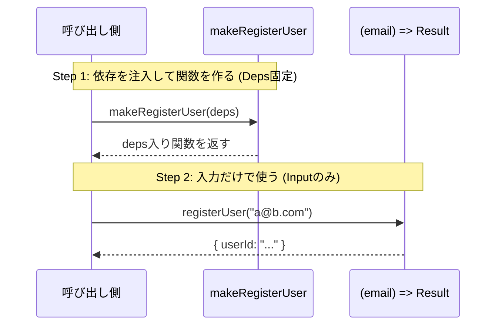
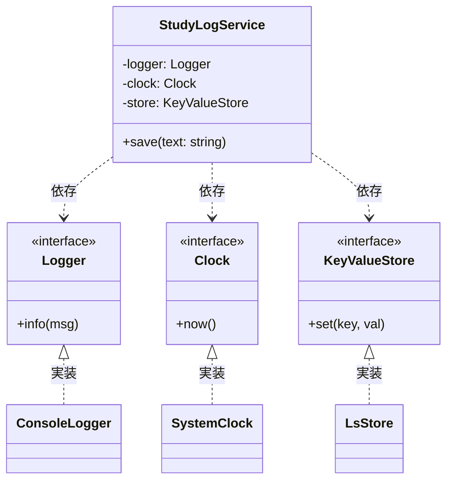
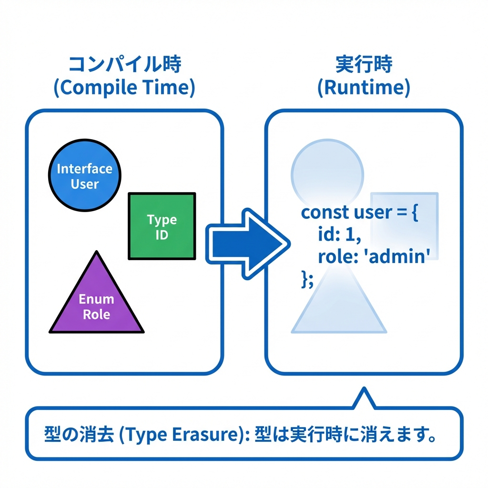
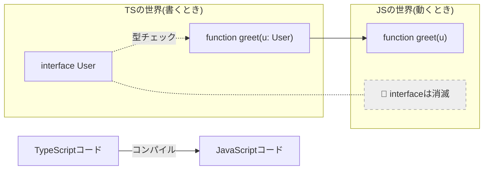
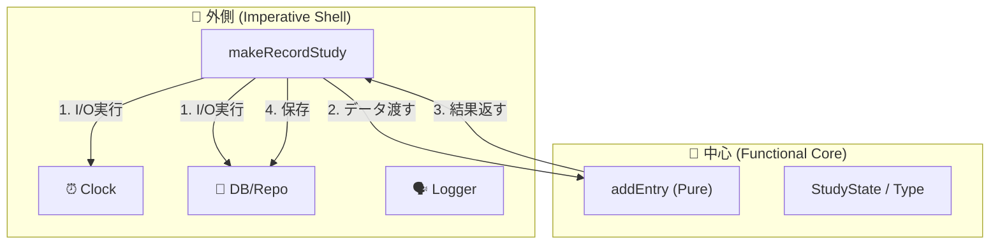
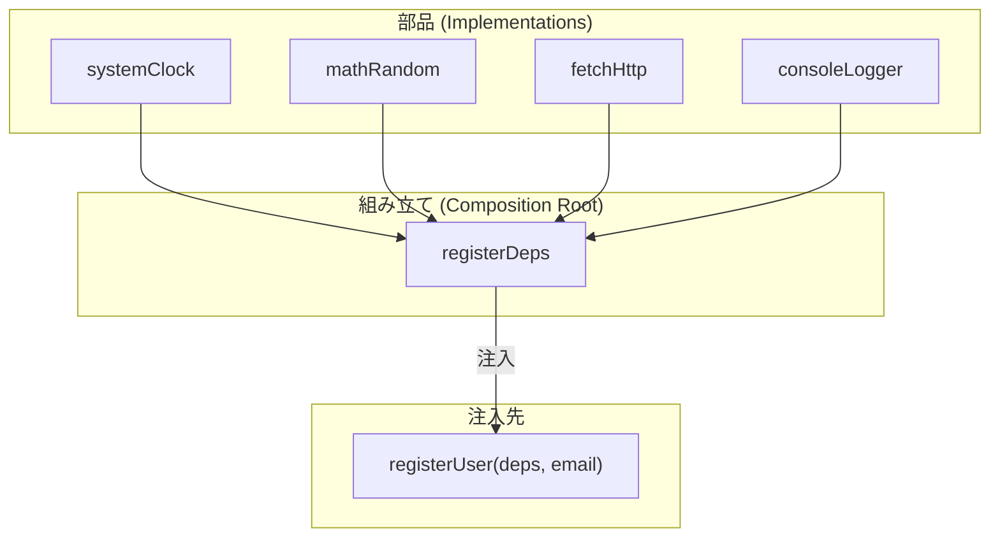

# 第6章　超重要：TSは型が実行時に消える👻（ここがC#と違う！）

この章はDI（依存性注入）をTypeScriptでやるときの** 返ってくるのは **入力だけの関数**（ここが最高に便利😍）


```mermaid
sequenceDiagram
    participant Main as 呼び出し側
    participant Factory as makeRegisterUser
    participant Func as (email) => Result
    
    Note over Main, Factory: Step 1: 依存を注入して関数を作る (Deps固定)
    Main->>Factory: makeRegisterUser(deps)
    Factory-->>Main: deps入り関数を返す
    
    Note over Main, Func: Step 2: 入力だけで使う (Inputのみ)
    Main->>Func: registerUser("a@b.com")
    Func-->>Main: { userId: "..." }
```

分かると、あとが一気にラクになる✨

---

## 🎯 この章のゴール（ここまでできたらOK！）

* 「**TypeScriptの型は、実行時に存在しない**」を自分の言葉で説明できる🗣️✨ ([TypeScript][1])
* 「だからTSのDIは**C#みたいに“型から自動解決”が基本できない**」を理解できる🧠💡
* 代わりに必要になる **“値（token）” ベースのDI** テストが爆速で安定🧪💕


```mermaid
classDiagram
    class StudyLogService {
        -logger: Logger
        -clock: Clock
        -store: KeyValueStore
        +save(text: string)
    }

    class Logger {
        <<interface>>
        +info(msg)
    }
    class Clock {
        <<interface>>
        +now()
    }
    class KeyValueStore {
        <<interface>>
        +set(key, val)
    }

    StudyLogService ..> Logger : 依存
    StudyLogService ..> Clock : 依存
    StudyLogService ..> KeyValueStore : 依存

    class ConsoleLogger
    class SystemClock
    class LsStore

    Logger <|.. ConsoleLogger : 実装
    Clock <|.. SystemClock : 実装
    KeyValueStore <|.. LsStore : 実装
```

---

## 1) まず結論：TSの型は“設計図”で、完成品（実行時）には残らない👻📄➡️📦



TypeScriptは **JavaScriptに変換して実行**されるよね。
このとき **型注釈（`: string` とか）や型の情報は消える**。
公式ドキュメントでも「TypeScript固有のものは消える（eraseされる）」って説明されてるよ✨ ([TypeScript][1])

たとえば👇

```ts
// ✅ TypeScript（書いてるときは型がある）
function greet(name: string) {
  return "Hello, " + name;
}
```

出力されるJavaScriptはだいたいこう👇（イメージ）

```js
// ✅ JavaScript（実行時。型はもういない👻）
function greet(name) {
  return "Hello, " + name;
}
```

**型は“コンパイル時のチェック用”で、動いてる最中の世界にはいない**って覚えよう🧠✨
（型アサーションも実行時チェックはしてくれないよ〜⚠️） ([TypeScript][2])


```mermaid
flowchart LR
    TS_Code["TypeScriptコード"] -->|コンパイル| JS_Code["JavaScriptコード"]
    
    subgraph TS["TSの世界(書くとき)"]
        TypeA["interface User"]
        FuncA["function greet(u: User)"]
        TypeA -.型チェック.-> FuncA
    end

    subgraph JS["JSの世界(動くとき)"]
        FuncB["function greet(u)"]
        Ghost["👻 interfaceは消滅"]
    end

    FuncA --> FuncB
    TypeA -.- Ghost
    style Ghost fill:#eee,stroke:#999,stroke-dasharray: 5 5
```

---

## 2) 「interfaceが実行時にいない」がDIで致命的になる理由💥💉

## ❌ やりがちな罠：interfaceをDIコンテナのキーにしたくなる

C#だと「`ILogger` を登録して…」みたいに、**インターフェイスそのもの**を登録キーにできるよね。

でもTSで同じことをやろうとするとこうなる👇

```ts
interface Logger {
  log(msg: string): void;
}

// ❌ これはできない（interfaceは“型”であって“値”じゃない）
container.register(Logger, ConsoleLogger);
```

だって `Logger` は **実行時に存在しない**から、登録キーとして渡せないの🥲
この「型＝消える」性質のせいで、TSのDIは基本的に **“値（value）をキーにする”** 発想が必要になるよ🔑✨

---

## 3) じゃあTSのD> I/Oは外側に追い出して、中心をPureにする✂️✨


```mermaid
flowchart TD
    subgraph Shell["🍩 外側 (Imperative Shell)"]
        IO_Time["⏰ Clock"]
        IO_DB["💾 DB/Repo"]
        IO_Log["🗣️ Logger"]
        Handler["makeRecordStudy"]
    end

    subgraph Core["🍏 中心 (Functional Core)"]
        Logic["addEntry (Pure)"]
        Type["StudyState / Type"]
    end

    Handler -->|"1. I/O実行"| IO_Time
    Handler -->|"1. I/O実行"| IO_DB
    Handler -->|"2. データ渡す"| Logic
    Logic -->|"3. 結果返す"| Handler
    Handler -->|"4. 保存"| IO_DB
```

TypeScriptでDIするときのキーはだいたいこのへん👇

## ✅ A. `class`（クラス）は実行時にいる🏛️

```ts
class ConsoleLogger {
  log(msg: string) { console.log(msg); }
}

// クラス（コンストラクタ関数）は実行時に存在する＝キーにできる
container.register(ConsoleLogger, () => new ConsoleLogger());
```

📌 **ただし注意！**
「抽象（interface）ではなく具象（class）に寄りがち」になって、DIP的にイヤなときがある😵‍💫

---

## ✅ B. `string`（文字列token）🧵

```ts
const LOGGER = "Logger";

container.register(LOGGER, () => new ConsoleLogger());
```

📌 **注意！**
文字列は衝突しやすい（同名の事故）🥲

---

## ✅ C. `Symbol`（おすすめ！衝突しない）💎

```ts
export const LOGGER = Symbol("Logger");
export type Logger = { log(msg: string): void };

container.register(LOGGER, () => new ConsoleLogger());

// 取り出すときは型引数で「これはLoggerだよ」を付ける
const logger = container.resolve<Logger>(LOGGER);
logger.log("hi!");
```

**Symbolは実行時に存在する値**だし、基本衝突しないから便利💎✨

---

## 4) 「import」も実行時に関係あるよ⚠️（型だけのつもりが地雷になるやつ）

ここ、DIと相性悪い事故ポイント🔥

## ✅ `import type` は “型だけ” を読み込む（実行時には消える）👻📦

TypeScript公式のリリースノートでも、`import type` は **出力に残らず完全に消える**って明言されてるよ✨ ([TypeScript][3])

```ts
import type { Logger } from "./logger-types"; // ✅ 型だけ

// これは実行時JSには残らない（= 余計な依存や副作用を増やしにくい）
```

DIでありがちな「循環import🌀」や「読み込んだ瞬間に副作用ドーン💥」を避けるのに効く👍

---

## ✅ `verbatimModuleSyntax`：importの挙動を“素直”にする設定🧼

最近のTSでは、モジュール周りの事故を減らすために `verbatimModuleSyntax` みたいなオプションも用意されてるよ（import/exportをより明確に扱う）🧹✨ ([TypeScript][4])

あと `preserveValueImports` は **`verbatimModuleSyntax` のほうが今は推奨**って扱いになってるよ📌 ([TypeScript][5])

---

## 5) まとめ：この章がDIにくれる超大事な“合言葉”🧩✨

* TSの型（`RegisterDeps` として成立してるかチェックしつつ、オブジェクトの“中身の型推論”は潰さないのが `satisfies` の良さだよ〜！([TypeScript][3])


```mermaid
graph TD
    subgraph Components["部品 (Implementations)"]
        C["systemClock"]
        R["mathRandom"]
        H["fetchHttp"]
        L["consoleLogger"]
    end

    subgraph Assembly["組み立て (Composition Root)"]
        Deps["registerDeps"]
    end

    subgraph Target["注入先"]
        Func["registerUser(deps, email)"]
    end

    C --> Deps
    R --> Deps
    H --> Deps
    L --> Deps
    Deps -->|注入| Func
```
* だからTSのDIは「型から自動で解決！」よりも、まず **値token（Symbolとか）で組み立てる**方向が現実的🔑
* `import type` を使うと「型だけ」を安全に扱えて、DIの地雷（循環importなど）を踏みにくい💣➡️🧯 ([TypeScript][3])

---

## 🧪 ミニ課題（5分）✨

## 課題A：一文で説明してみよ📝

「TypeScriptの型が実行時に消える」ってどういうこと？
👉 **30文字くらい**で説明してみて😊

## 課題B：DI用のtokenを作ってみよ🔑

`Clock`（`now(): number`）のtokenを `Symbol` で作ってみてね💎

---

## 🤖 AIにお願いするなら（コピペOK✨）

* 「TypeScriptの型消失を、高校生にも分かる例えで3つ出して」
* 「interfaceをDIのキーにできない理由を、短く説明して」
* 「Symbol tokenを使った最小DI例をTypeScriptで書いて（Clock/Logger）」

---

## 📌 最新状況メモ（2026-01-16時点）

* TypeScriptの最新安定版は **5.9.3**（npmと公式リリース一覧で確認できるよ） ([npm][6])
* 公式ブログでは **TypeScript 6.0は5.9→7.0への“橋渡し”**という位置づけで、リリースは早期2026が目標と報じられてるよ ([Microsoft for Developers][7])

（でもね！✨ バージョンが進んでも「型が実行時に消える」はTypeScriptの根っこなので、ここはずっと超重要だよ👻）

---

次の第7章からは、この前提の上で「じゃあ依存をどう渡す？（deps注入）」を、手を動かしながらやっていくよ〜👜💉✨

[1]: https://www.typescriptlang.org/docs/handbook/2/basic-types.html?utm_source=chatgpt.com "TypeScript: Documentation - The Basics"
[2]: https://www.typescriptlang.org/docs/handbook/2/everyday-types.html?utm_source=chatgpt.com "Documentation - Everyday Types"
[3]: https://www.typescriptlang.org/docs/handbook/release-notes/typescript-3-8.html?utm_source=chatgpt.com "Documentation - TypeScript 3.8"
[4]: https://www.typescriptlang.org/tsconfig/verbatimModuleSyntax.html?utm_source=chatgpt.com "TSConfig Option: verbatimModuleSyntax"
[5]: https://www.typescriptlang.org/tsconfig/preserveValueImports.html?utm_source=chatgpt.com "TSConfig Option: preserveValueImports"
[6]: https://www.npmjs.com/package//typescript?activeTab=versions&utm_source=chatgpt.com "typescript"
[7]: https://devblogs.microsoft.com/typescript/progress-on-typescript-7-december-2025/?utm_source=chatgpt.com "Progress on TypeScript 7 - December 2025"
