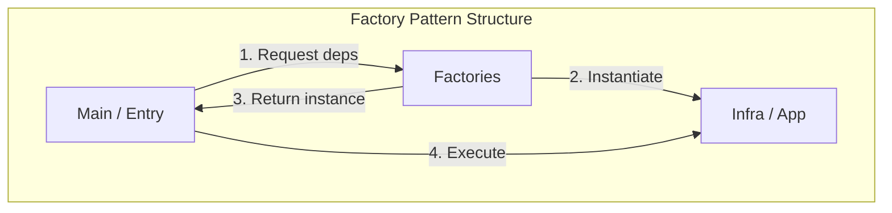
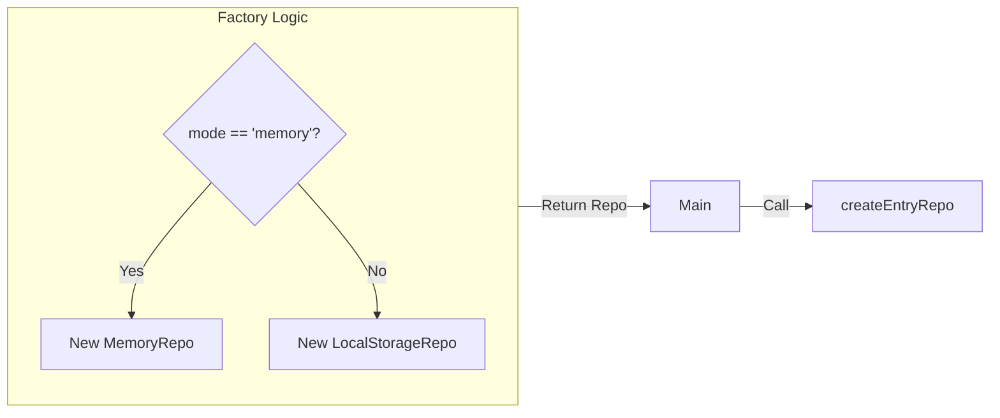

# 第15章　Factoryパターン：TSã®ç¾å®Ÿè§£ğŸ­âœ¨

## ã“ã®ç« ã§ã§ãるよã†ã«ãªã‚‹ã“ã¨ï¼ˆã‚´ãƒ¼ãƒ«ï¼‰ğŸ¯

* Factory（生æˆæ‹…当）を使ã£ã¦ã€Composition Root（起動・組ã¿ç«‹ã¦ï¼‰ã‚’スッキリã•ã›ã‚‰ã‚Œã‚‹ğŸ§¹âœ¨
* 「new ãŒå¢—ãˆã¦åœ°ç„😵â€ğŸ’«ã€ã‚’ã€æ®µéšçš„ã«â€œèª­ã‚ã‚‹é…ç·šâ€ã¸ç›´ã›ã‚‹ğŸ”§
* Factoryを“ä¾å­˜ã¨ã—ã¦æ³¨å…¥â€ã™ã‚‹å½¢ï¼ˆå¿…è¦ãªã¨ãã ã‘作る）も分ã‹ã‚‹ğŸª„

> ã¡ãªã¿ã«æœ¬æ—¥æ™‚点（2026-01-16）ã€npmã®å®‰å®šç‰ˆ TypeScript ã®æœ€æ–°ã¯ **5.9.3** ã ã‚ˆğŸ“Œ ([npm][1])
> Node 㯠**v24 ãŒActive LTS**ã€ç›´è¿‘ã®LTSセキュリティリリース㯠**24.13.0（2026-01-13）** ãªã©ãŒå‡ºã¦ã‚‹ã‚ˆğŸ” ([Node.js][2])
> （TypeScript 7 “Project Corsa†ã¯é€²æ—ãŒå…¬é–‹ã•ã‚Œã¦ã¦ã€ãƒ—レビューも動ã段éšã«æ¥ã¦ã‚‹ã¿ãŸã„ï¼ğŸš€ï¼‰ ([Microsoft for Developers][3])

---

## 2) Factory（工場）ã£ã¦ãªã«ï¼ŸğŸ­
ğŸ§âœ¨ï¼ˆDI文脈ã®è¶…ã‹ã‚“ãŸã‚“定義）

Factoryã¯ã²ã¨ã“ã¨ã§è¨€ã†ã¨â€¦

**「オブジェクト（や関数）を作る手順をã€ã²ã¨ã¾ã¨ã‚ã«ã—ãŸâ€œç”Ÿæˆä¿‚â€ã€** ğŸ­

DIã®è©±ã ã¨ã€Factoryã®å½¹ç›®ã¯ã“れ👇

* `new` ã‚„åˆæœŸåŒ–ã®ã‚´ãƒãƒ£ã¤ãã‚’ã€1ã‹æ‰€ï¼ˆã¾ãŸã¯å°‘数）ã«é–‰ã˜è¾¼ã‚る📦
* 生æˆã®ãƒ«ãƒ¼ãƒ«ï¼ˆã©ã®å®Ÿè£…を使ã†ã‹ã€è¨­å®šã‚’ã©ã†èª­ã‚€ã‹ï¼‰ã‚’ã€èª­ã¿ã‚„ã™ãä¿ã¤ğŸ“š
* テストã§å·®ã—替ãˆã‚„ã™ãã™ã‚‹ğŸ”„🧪

---

## 2) ãªãœTSã¯FactoryãŒâ€œç¾å®Ÿè§£â€ã«ãªã‚Šã‚„ã™ã„ã®ï¼ŸğŸ‘»ğŸ§©

TypeScriptã¯å‹ï¼ˆinterface）ãŒå®Ÿè¡Œæ™‚ã«æ¶ˆãˆã‚‹ã‹ã‚‰ã€**「å‹ã ã‘ã§è‡ªå‹•è§£æ±ºã€**ã¯é›£ã—ããªã‚ŠãŒã¡ã ã‚ˆã­ğŸ‘»
ãªã®ã§ã€**手動DIをキレイã«ä¿ã¤å·¥å¤«ï¼Factory** ãŒã‚ã¡ã‚ƒåŠ¹ãï¼ğŸ‹ï¸â€â™€ï¸âœ¨

ã•ã‚‰ã«TS 5.9 ã§ã¯ `import defer` ã¿ãŸã„ãªã€Œãƒ¢ã‚¸ãƒ¥ãƒ¼ãƒ«ã®å®Ÿè¡Œã‚¿ã‚¤ãƒŸãƒ³ã‚°ã‚’é…らã›ã‚‹ã€æ–¹å‘ã®æ©Ÿèƒ½ã‚‚出ã¦ã¦ã€**副作用（å‹æ‰‹ã«å‹•ãåˆæœŸåŒ–）をコントロールã—ãŸã„**ã£ã¦æµã‚Œã¨ã‚‚相性ãŒã„ã„よ🧯 ([TypeScript][4])

---

## 3) Factoryã¯3種é¡ã ã‘覚ãˆã‚Œã°OK😊🫶

### A. シンプルFactory（ã¾ãšã¯ã“ã‚Œï¼ï¼‰ğŸ™

* `createX(deps)` ã¿ãŸã„ã«ã€Œå¿…è¦ãªä¾å­˜ã‚’渡ã™ã¨ã€å®Œæˆå“ãŒè¿”ã‚‹ã€

### B. 設定ã¤ãFactory（環境・設定ã§åˆ†å²ï¼‰ğŸ›ï¸

* `createStorage({ mode })` 㧠`localStorage` / `memory` を切り替ãˆã‚‹ã€ã¿ãŸã„ãªã‚„ã¤ğŸ”„

### C. Factoryを“ä¾å­˜ã¨ã—ã¦æ³¨å…¥â€ï¼ˆå¿…è¦ãªã¨ãã ã‘作る）🪄

* 「実行ã®ãŸã³ã«ã€å…¥åŠ›ã«å¿œã˜ã¦ä½œã‚ŠãŸã„ã€æ™‚ã«ä½¿ã†âœ¨
  例：`idGenerator.create()`ã€`clientFactory.forTenant(tenantId)` ã¨ã‹ğŸ§µ

---

## 4) ã¾ãšâ€œåœ°ç„ã®Composition Rootâ€ã‚’見よã†ğŸ˜µâ€ğŸ’«â¡ï¸âœ¨

### 😵â€ğŸ’« 悪ã„例：main.ts ãŒé…ç·šã§ãƒ‘ンパン

```ts
// main.ts（悪ã„例：読ã‚ãªã„…）
import { ConsoleLogger } from "./infra/ConsoleLogger";
import { LocalStorageEntryRepo } from "./infra/LocalStorageEntryRepo";
import { RealClock } from "./infra/RealClock";
import { AddEntryUseCase } from "./app/AddEntryUseCase";
import { ListEntriesUseCase } from "./app/ListEntriesUseCase";

const logger = new ConsoleLogger();
const clock = new RealClock();
const repo = new LocalStorageEntryRepo("study-log");

const addEntry = new AddEntryUseCase(repo, clock, logger);
const listEntries = new ListEntriesUseCase(repo, logger);

// ã“ã“ã‹ã‚‰UIã‚„HTTPãƒãƒ³ãƒ‰ãƒ©ã¸â€¦ï¼ˆã•ã‚‰ã«å¢—ãˆã‚‹ï¼‰
```

**å•é¡Œç‚¹**😵â€ğŸ’«

* `new` ãŒå¢—ãˆã‚‹ã»ã©ã€Œèª­ã‚€æ°—ãŒå¤±ã›ã‚‹ã€ğŸ“‰
* “何ãŒä½•ã«ä¾å­˜ã—ã¦ã‚‹ã‹â€ãŒã€æ¯å› main.ts を追ã‚ãªã„ã¨åˆ†ã‹ã‚‰ãªã„ğŸ”
* å·®ã—替ãˆï¼ˆrepoã‚’memoryã«ï¼‰ã—ãŸã„ã ã‘ã§ã€é…ç·šãŒãã¡ã‚ƒãã¡ã‚ƒğŸ§¶

---

## 5) Factoryã§â€œç”Ÿæˆâ€ã‚’分割ã—ã¦ã€é…線を読ã¿ç‰©ã«ã™ã‚‹ğŸ“šâœ¨

### ✅ ゴールã®å½¢ï¼ˆã‚¤ãƒ¡ãƒ¼ã‚¸ï¼‰ğŸ—ºï¸

* `main.ts` ã¯ã€Œå¤§ãã„部å“を組ã¿ç«‹ã¦ã‚‹ã ã‘ã€
* 生æˆã®ç´°ã‹ã„手順㯠`factories/` ã«å¯„ã›ã‚‹

```
src/
  app/        ↠ユースケース（使ã†å´ï¼‰
  domain/     ↠純粋ロジック
  infra/      ↠外部I/O実装
  factories/  ↠生æˆä¿‚ğŸ­âœ¨ï¼ˆä»Šå›ã®ä¸»å½¹ï¼‰
  main.ts     ↠Composition Root（é…ç·šä¿‚ğŸ“）
```


```mermaid
graph TD
    subgraph Structure["Factory Pattern Structure"]
        Main[Main / Entry]
        Factory[Factories]
        Impl[Infra / App]
    end

    Main -->|1. Request deps| Factory
    Factory -->|2. Instantiate| Impl
    Factory -->|3. Return instance| Main
    Main -->|4. Execute| Impl
```

---

## 6) ãƒãƒ³ã‚ºã‚ªãƒ³ï¼šå­¦ç¿’記録ミニアプリã§FactoryğŸ«ğŸ“✨

### 6-1) ã¾ãšã€Œä¾å­˜ã®å‹ï¼ˆå¥‘約）ã€ã‚’作る📜

```ts
// app/ports.ts
export interface Logger {
  info(message: string): void;
  error(message: string, err?: unknown): void;
}

export interface Clock {
  nowIso(): string;
}

export type Entry = { at: string; text: string };

export interface EntryRepo {
  add(entry: Entry): Promise<void>;
  list(): Promise<Entry[]>;
}
```

### 6-2) ユースケース（使ã†å´ï¼‰ã¯â€œå¥‘ç´„â€ã ã‘見る👀✨

```ts
// app/AddEntryUseCase.ts
import type { Clock, EntryRepo, Logger } from "./ports";

export class AddEntryUseCase {
  constructor(
    private readonly repo: EntryRepo,
    private readonly clock: Clock,
    private readonly logger: Logger
  ) {}

  async execute(text: string): Promise<void> {
    const trimmed = text.trim();
    if (!trimmed) {
      this.logger.info("空文字ã¯ã‚¹ã‚­ãƒƒãƒ—ã—ãŸã‚ˆğŸ™‚");
      return;
    }

    await this.repo.add({ at: this.clock.nowIso(), text: trimmed });
    this.logger.info("追加ã—ãŸã‚ˆâœ…");
  }
}
```

```ts
// app/ListEntriesUseCase.ts
import type { EntryRepo, Logger, Entry } from "./ports";

export class ListEntriesUseCase {
  constructor(
    private readonly repo: EntryRepo,
    private readonly logger: Logger
  ) {}

  async execute(): Promise<Entry[]> {
    const list = await this.repo.list();
    this.logger.info(`件数: ${list.length}件📚`);
    return list;
  }
}
```

### 6-3) infra（外部実装）ã¯è‡ªç”±ã«ã‚„ã£ã¦OK🧰

```ts
// infra/ConsoleLogger.ts
import type { Logger } from "../app/ports";

export class ConsoleLogger implements Logger {
  info(message: string): void {
    console.log(`â„¹ï¸ ${message}`);
  }
  error(message: string, err?: unknown): void {
    console.error(`🔥 ${message}`, err);
  }
}
```

```ts
// infra/RealClock.ts
import type { Clock } from "../app/ports";

export class RealClock implements Clock {
  nowIso(): string {
    return new Date().toISOString();
  }
}
```

```ts
// infra/LocalStorageEntryRepo.ts
import type { EntryRepo, Entry } from "../app/ports";

export class LocalStorageEntryRepo implements EntryRepo {
  constructor(private readonly key: string) {}

  async add(entry: Entry): Promise<void> {
    const list = await this.list();
    list.unshift(entry);
    localStorage.setItem(this.key, JSON.stringify(list));
  }

  async list(): Promise<Entry[]> {
    const raw = localStorage.getItem(this.key);
    if (!raw) return [];
    try {
      return JSON.parse(raw) as Entry[];
    } catch {
      return [];
    }
  }
}
```

---

## 7) ã“ã“ã‹ã‚‰ãŒæœ¬é¡Œï¼šFactoryを作るğŸ­âœ¨

### 7-1) Factoryã®ç´ æ：Deps（ä¾å­˜ã®æŸï¼‰ğŸ‘œ

```ts
// factories/types.ts
import type { Logger, Clock, EntryRepo } from "../app/ports";

export type AppDeps = {
  logger: Logger;
  clock: Clock;
  entryRepo: EntryRepo;
};
```

### 7-2) infra生æˆFactory（å°ã•ã分ã‘る）🧩

```ts
// factories/createInfra.ts
import { ConsoleLogger } from "../infra/ConsoleLogger";
import { RealClock } from "../infra/RealClock";
import { LocalStorageEntryRepo } from "../infra/LocalStorageEntryRepo";
import type { AppDeps } from "./types";

export function createInfra(): AppDeps {
  const logger = new ConsoleLogger();
  const clock = new RealClock();
  const entryRepo = new LocalStorageEntryRepo("study-log");

  return { logger, clock, entryRepo };
}
```

### 7-3) ユースケース生æˆFactory（“大ãã„部å“â€ã‚’作る）ğŸ—ï¸

```ts
// factories/createUseCases.ts
import { AddEntryUseCase } from "../app/AddEntryUseCase";
import { ListEntriesUseCase } from "../app/ListEntriesUseCase";
import type { AppDeps } from "./types";

export function createUseCases(deps: AppDeps) {
  return {
    addEntry: new AddEntryUseCase(deps.entryRepo, deps.clock, deps.logger),
    listEntries: new ListEntriesUseCase(deps.entryRepo, deps.logger),
  };
}
```

### 7-4) main.ts（Composition Root）ã¯â€œèª­ã‚€ã ã‘â€ã«è¿‘ã¥ãğŸ“✨

```ts
// main.ts（良ã„例：読ã¿ã‚„ã™ã„ï¼ï¼‰
import { createInfra } from "./factories/createInfra";
import { createUseCases } from "./factories/createUseCases";

const deps = createInfra();
const useCases = createUseCases(deps);

// ã“ã“ã‹ã‚‰UI/ãƒãƒ³ãƒ‰ãƒ©ã¸æ¸¡ã™ã ã‘😊
useCases.addEntry.execute("DIã®Factoryã‚ã‹ã£ãŸï¼ğŸ­âœ¨");
```

**ã“ã“ãŒæœ€é«˜ãƒã‚¤ãƒ³ãƒˆ**🥳

* `main.ts` ãŒã€Œä½•ã‚’組ã¿ç«‹ã¦ã¦ã‚‹ã‹ã€ã ã‘読ã‚ã°ã„ã„📖
* 生æˆã®è©³ç´°ã¯Factoryã®ä¸­ã«éš ã›ã‚‹ï¼ˆã§ã‚‚éš ã—ã™ããªã„）🙈✨
* repoå·®ã—替ãˆï¼ˆmemory ↔ localStorage）もFactoryå´ã ã‘ç›´ã›ã°OK🔄

---

## 8) “設定ã¤ãFactoryâ€ã§ã€å·®ã—替ãˆã‚’ã‚‚ã£ã¨æ¥½ã«ğŸ”„ğŸ›ï¸

ãŸã¨ãˆã°é–‹ç™ºä¸­ã ã‘メモリä¿å­˜ã«ã—ãŸã„…ã¿ãŸã„ãªæ™‚ã­ğŸ˜Š

```ts
// infra/MemoryEntryRepo.ts
import type { EntryRepo, Entry } from "../app/ports";

export class MemoryEntryRepo implements EntryRepo {
  private listData: Entry[] = [];

  async add(entry: Entry): Promise<void> {
    this.listData.unshift(entry);
  }
  async list(): Promise<Entry[]> {
    return [...this.listData];
  }
}
```

```ts
// factories/createEntryRepo.ts
import type { EntryRepo } from "../app/ports";
import { LocalStorageEntryRepo } from "../infra/LocalStorageEntryRepo";
import { MemoryEntryRepo } from "../infra/MemoryEntryRepo";

export type RepoMode = "localStorage" | "memory";

export function createEntryRepo(mode: RepoMode): EntryRepo {
  return mode === "memory"
    ? new MemoryEntryRepo()
    : new LocalStorageEntryRepo("study-log");
}
```


```mermaid
flowchart LR
    Caller[Main] -->|Call| Factory[createEntryRepo]
    
    subgraph FactoryLogic["Factory Logic"]
        Check{mode == 'memory'?}
        Mem[New MemoryRepo]
        LS[New LocalStorageRepo]
        
        Check -->|Yes| Mem
        Check -->|No| LS
    end
    
    FactoryLogic -->|Return Repo| Caller
```

```ts
// factories/createInfra.ts（差ã—替ãˆå¯¾å¿œç‰ˆï¼‰
import { ConsoleLogger } from "../infra/ConsoleLogger";
import { RealClock } from "../infra/RealClock";
import { createEntryRepo, type RepoMode } from "./createEntryRepo";
import type { AppDeps } from "./types";

export function createInfra(mode: RepoMode): AppDeps {
  return {
    logger: new ConsoleLogger(),
    clock: new RealClock(),
    entryRepo: createEntryRepo(mode),
  };
}
```

---

## 9) Factoryを“ä¾å­˜ã¨ã—ã¦æ³¨å…¥â€ã™ã‚‹ãƒ‘ターン🪄（地味ã«å¼·ã„）

「æ¯å› new ã™ã‚‹ç›¸æ‰‹ã€ã‚„「入力ã§ä½œã‚Šåˆ†ã‘る相手ã€ã¯ã€Factory自体をä¾å­˜ã«ã—ã¡ã‚ƒã†ã¨ã‚­ãƒ¬ã‚¤âœ¨

例：ID生æˆã‚’ユースケースå´ã§ä½¿ã„ãŸã„（ã§ã‚‚ランダムã¯ãƒ†ã‚¹ãƒˆå›°ã‚‹ğŸ²ï¼‰

```ts
// app/IdFactory.ts
export type IdFactory = {
  create(): string;
};
```

```ts
// infra/RandomIdFactory.ts
import type { IdFactory } from "../app/IdFactory";

export class RandomIdFactory implements IdFactory {
  create(): string {
    return crypto.randomUUID();
  }
}
```

ã“れを `deps` ã«å…¥ã‚Œã¦ã€ãƒ¦ãƒ¼ã‚¹ã‚±ãƒ¼ã‚¹ã§ä½¿ã†ã¨â€¦

* 本番：`RandomIdFactory`
* テスト：`FixedIdFactory("id-123")`
  ã¿ãŸã„ã«å·®ã—替ãˆãŒè¶…ラクã«ãªã‚‹ã‚ˆğŸ§ªğŸ’–

---

## 10) Factoryã§ã‚„ã‚ŠãŒã¡ãªåœ°é›·3ã¤ğŸ•³ï¸âš ï¸ï¼ˆã“ã“超大事ï¼ï¼‰

### 地雷①：Factoryã®ä¸­ã§â€œå‹æ‰‹ã«I/Oâ€ã™ã‚‹ğŸ˜±

* 例：Factory内ã§ãƒãƒƒãƒˆãƒ¯ãƒ¼ã‚¯ã‚¢ã‚¯ã‚»ã‚¹ã€ãƒ•ã‚¡ã‚¤ãƒ«èª­ã¿è¾¼ã¿ã€DBæ¥ç¶šã‚’å³å®Ÿè¡Œâ€¦
  → **作ã£ãŸã ã‘ã§å‰¯ä½œç”¨**ãŒèµ·ãã‚‹ã¨ã€ãƒ‡ãƒãƒƒã‚°ãŒã¤ã‚‰ã„😭
  ✅ コツ：Factoryã¯ã€Œçµ„ã¿ç«‹ã¦ã€ä¸­å¿ƒã€‚é‡ã„æ¥ç¶šã¯é…延（必è¦ãªã¨ã）も検è¨ğŸ•°ï¸

### 地雷②：FactoryãŒè‚¥å¤§åŒ–ã—ã¦â€œç¥ãƒ•ã‚¡ã‚¯ãƒˆãƒªâ€ã«ãªã‚‹ğŸ‘‘

* 何ã§ã‚‚createã—ã¦500行…ã¿ãŸã„ãªğŸ˜µ
  ✅ コツ：**“層ã§åˆ†ã‘ã‚‹â€**（infraç”Ÿæˆ / usecaseç”Ÿæˆ / handler生æˆï¼‰ğŸ“¦ğŸ“¦ğŸ“¦

### 地雷③：Containerを渡ã—ã¦ã—ã¾ã„ã€Service Locator化ã™ã‚‹ğŸŒ€

* `useCase(container)` ã¿ãŸã„ã«ã™ã‚‹ã¨ã€Œã©ã“ã§ä½•ä½¿ã£ã¦ã‚‹ã‹ä¸æ˜ã€ğŸ™ˆ
  ✅ コツ：Factoryã®å¼•æ•°ã¯ **å¿…è¦ãªdepsã ã‘** ã«ã™ã‚‹ğŸ«¶

---

## 11) 章末ミニ課題ğŸ“✨（ãœã‚“ã¶å°ã•ãã¦OKï¼ï¼‰

1. `createInfra()` を分割ã—ã¦ã€`createLogger()` / `createClock()` / `createRepo()` ã«ã—ã¦ã¿ã¦ã­ğŸ§©
2. `RepoMode` を追加ã—ã¦ã€`memory` 㨠`localStorage` を切り替ãˆã§ãるよã†ã«ã—ã¦ã¿ã‚ˆã†ğŸ”„
3. “差ã—替ãˆã—ã‚„ã™ã•â€ã‚’æ„Ÿã˜ãŸã‚‰ã€1è¡Œã§æ„Ÿæƒ³ã‚’書ã„ã¦ã¿ã¦ğŸ¥°ğŸ“

---

## 12) AI（Copilot/Codex等）ã«é ¼ã‚‹ã¨è¶…ã¯ã‹ã©ã‚‹ãƒ—ロンプト例🤖✨

* 「main.ts ã® new ã‚’ factories ã«ç§»ã—ã¦ã€è²¬å‹™ãŒåˆ†ã‹ã‚‹ãƒ•ã‚¡ã‚¤ãƒ«åˆ†å‰²æ¡ˆã‚’出ã—ã¦ã€ğŸ§¹
* 「Factoryã®å¼•æ•°ãŒè‚¥å¤§åŒ–ã—ãã†ã€‚depsã‚’æ•´ç†ã™ã‚‹å‹è¨­è¨ˆã‚’æ案ã—ã¦ã€ğŸ‘œ
* 「ã“ã®Factory構æˆã§Service Locatorã£ã½ããªã£ã¦ãªã„ã‹ãƒ¬ãƒ“ューã—ã¦ã€ğŸ•µï¸â€â™€ï¸

---

## ã¾ã¨ã‚ğŸ€

* Factory㯠**手動DIを“読ã‚ã‚‹é…ç·šâ€ã«ä¿ã¤ãŸã‚ã®æœ€å¼·ãƒ†ã‚¯**ğŸ­âœ¨
* Composition Rootã¯ã€Œçµ„ã¿ç«‹ã¦ã‚‹ã ã‘ã€ã€Factoryã¯ã€Œä½œã‚Šæ–¹ã‚’知ã£ã¦ã‚‹ã ã‘ã€ğŸ“
* å·®ã—替ãˆãƒ»ãƒ†ã‚¹ãƒˆãƒ»ç’°å¢ƒåˆ†å²ãŒã€ã³ã£ãã‚Šã™ã‚‹ã»ã©æ¥½ã«ãªã‚‹ã‚ˆğŸ§ªğŸ”„💖

次ã®ç« ï¼ˆç¬¬16章）ã¯ã€Factoryã§æ•´ãˆãŸä¸Šã§ã€ŒDIP（契約ã«ä¾å­˜ã™ã‚‹ï¼‰ã€ã‚’ã¡ã‚ƒã‚“ã¨è…¹è½ã¡ã•ã›ã‚‹ã¨ã€ã•ã‚‰ã«ä¸€æ®µãƒ©ã‚¯ã«ãªã‚‹ã‚ˆã€œï¼ğŸ“œâœ¨

[1]: https://www.npmjs.com/package/typescript?activeTab=versions&utm_source=chatgpt.com "typescript"
[2]: https://nodejs.org/en/about/previous-releases?utm_source=chatgpt.com "Node.js Releases"
[3]: https://devblogs.microsoft.com/typescript/progress-on-typescript-7-december-2025/?utm_source=chatgpt.com "Progress on TypeScript 7 - December 2025"
[4]: https://www.typescriptlang.org/docs/handbook/release-notes/typescript-5-9.html?utm_source=chatgpt.com "Documentation - TypeScript 5.9"
