# 第18章　環境依存①：ブラウザ/Nodeの差をDIで吸収🪟🌐

この章は「同じTypeScriptでも、動かす場所が変わると使えるAPIが変わる😵」問題を、DIでスッキリ解決しちゃう回だよ〜🧹💖
（本日時点だと Node は **v24 がActive LTS**、v25 がCurrent だよ📌）([Node.js][1])

---

## この章でできるようになること🎯✨

* ブラウザ専用の `localStorage` を **アプリの中心から追い出す**🚚💨
* Node側では `fs/promises` を使った保存に **差し替え**できるようにする🗄️✨([Node.js][2])
* 「選ぶのは入口（Composition Root）だけ！」の形にできる📍💕

---

## 1) 環境依存ってなに？🤔🌍

代表例はこんな感じ👇

* ブラウザ：`localStorage` がある（キー/値で保存できる）🧺
  `setItem / getItem / removeItem` などがあるよ([MDNウェブドキュメント][3])
* Node：`localStorage` は基本ない（代わりにファイルやDBなど）📄
  ファイルなら `fs/promises` が Promise で扱えて便利だよ([Node.js][2])

ここでやりがちな事故がこれ👇

---

## 2) ダメ例：中心のコードが `localStorage` 直叩き😣🧨

```ts
// ❌ ブラウザ以外で落ちやすい例
export class PrefsService {
  getTheme(): string {
    return localStorage.getItem("theme") ?? "light";
  }
  setTheme(theme: string) {
    localStorage.setItem("theme", theme);
  }
}
```

Nodeで動かした瞬間、`localStorage is not defined` 💥 みたいにコケるやつ〜😭

---

## 3) 解決の型：契約（interface）→ 実装2つ → 入口で注入📍💉

## まず「保存できる箱」の契約を作る🧩

ブラウザは同期、Nodeは非同期になりがちなので、ここは **Promise で統一**しちゃうのがラクだよ🫶

```ts
// src/core/KeyValueStore.ts
export interface KeyValueStore {
  get(key: string): Promise<string | null>;
  set(key: string, value: string): Promise<void>;
  remove(key: string): Promise<void>;
}
```

---

## 4) アプリ中心（core/app）は「契約」だけ見て使う💖

例として「テーマ設定」を保存してみよう🎨✨

```ts
// src/core/ThemeService.ts
import type { KeyValueStore } from "./KeyValueStore";

export class ThemeService {
  constructor(private readonly store: KeyValueStore) {}

  async getTheme(): Promise<"light" | "dark"> {
    const v = await this.store.get("theme");
    return v === "dark" ? "dark" : "light";
  }

  async setTheme(theme: "light" | "dark"): Promise<void> {
    await this.store.set("theme", theme);
  }
}
```

ポイント✅

* `localStorage` も `fs` も **ここに出てこない**🙅‍♀️
* 「保存できる何か」を注入すればOK💉✨

---

## 5) ブラウザ実装：LocalStorage版🪟🧺

`Storage`（Web Storage API）の基本メソッドを使うよ〜🧸
（`getItem / setItem / removeItem` など）([MDNウェブドキュメント][3])

```ts
// src/infra/browser/LocalStorageStore.ts
import type { KeyValueStore } from "../../core/KeyValueStore";

export class LocalStorageStore implements KeyValueStore {
  constructor(private readonly storage: Storage = localStorage) {}

  async get(key: string): Promise<string | null> {
    return this.storage.getItem(key);
  }
  async set(key: string, value: string): Promise<void> {
    this.storage.setItem(key, value);
  }
  async remove(key: string): Promise<void> {
    this.storage.removeItem(key);
  }
}
```

---

## 6) Node実装：ファイル保存版📄🗄️（fs/promises）

Nodeの `fs/promises` は Promiseベースで扱えるよ✨([Node.js][2])
ただし **同じファイルに同時書き込み**は注意（同期されないよ）って公式も言ってるので、ここでは「書き込みキュー」で安全寄りにするね🚦([Node.js][2])

```ts
// src/infra/node/JsonFileStore.ts
import type { KeyValueStore } from "../../core/KeyValueStore";
import { readFile, writeFile, mkdir } from "node:fs/promises";
import { dirname } from "node:path";

type StoreData = Record<string, string>;

export class JsonFileStore implements KeyValueStore {
  private writeQueue: Promise<void> = Promise.resolve();

  constructor(private readonly filePath: string) {}

  async get(key: string): Promise<string | null> {
    const data = await this.readAll();
    return data[key] ?? null;
  }

  async set(key: string, value: string): Promise<void> {
    await this.enqueueWrite(async () => {
      const data = await this.readAll();
      data[key] = value;
      await this.writeAll(data);
    });
  }

  async remove(key: string): Promise<void> {
    await this.enqueueWrite(async () => {
      const data = await this.readAll();
      delete data[key];
      await this.writeAll(data);
    });
  }

  private async enqueueWrite(fn: () => Promise<void>): Promise<void> {
    this.writeQueue = this.writeQueue.then(fn, fn);
    return this.writeQueue;
  }

  private async readAll(): Promise<StoreData> {
    try {
      const text = await readFile(this.filePath, "utf8");
      const parsed = JSON.parse(text) as StoreData;
      return parsed && typeof parsed === "object" ? parsed : {};
    } catch {
      return {};
    }
  }

  private async writeAll(data: StoreData): Promise<void> {
    await mkdir(dirname(this.filePath), { recursive: true });
    await writeFile(this.filePath, JSON.stringify(data, null, 2), "utf8");
  }
}
```

---

## 7) 入口（Composition Root）で「どっちを使うか」決める📍✨


コツは **分けること**！
`if (isBrowser)` を中心に混ぜるより、入口を2つ作るのが事故りにくいよ🧯

```mermaid
graph TD
    subgraph EntryPoints["📍 Composition Roots"]
        EntryB[entry/browser.ts]
        EntryN[entry/node.ts]
    end

    subgraph Impls["🔧 Implementations"]
        StoreL[LocalStorageStore]
        StoreF[JsonFileStore]
    end

    subgraph Core["💎 Core"]
        Svc[ThemeService]
        Port[interface KeyValueStore]
    end

    EntryB -->|new| StoreL
    EntryB -->|new| Svc
    
    EntryN -->|new| StoreF
    EntryN -->|new| Svc

    Svc --> Port
    StoreL -.-> Port
    StoreF -.-> Port
```



## ブラウザ入口🪟

```ts
// src/entry/browser.ts
import { ThemeService } from "../core/ThemeService";
import { LocalStorageStore } from "../infra/browser/LocalStorageStore";

export function createAppForBrowser() {
  const store = new LocalStorageStore();
  return new ThemeService(store);
}
```

## Node入口🌙

```ts
// src/entry/node.ts
import { ThemeService } from "../core/ThemeService";
import { JsonFileStore } from "../infra/node/JsonFileStore";

export function createAppForNode() {
  const store = new JsonFileStore("./.data/app-store.json");
  return new ThemeService(store);
}
```

> パッケージとして配る場合は、Nodeの `"exports"` で入口を切り替える「条件付きエクスポート」もあるよ📦（require/import等で分けられる）([Node.js][4])
> ※ただ、この章の段階では「入口ファイルを分ける」が一番わかりやすくて強い🫶

---

## 8) テストは「Fake（メモリ保存）」で超ラク🧪💖

Vitest は v4 系が出てるよ🧡([Vitest][5])

```ts
// src/test/InMemoryStore.ts
import type { KeyValueStore } from "../core/KeyValueStore";

export class InMemoryStore implements KeyValueStore {
  private data = new Map<string, string>();

  async get(key: string) { return this.data.get(key) ?? null; }
  async set(key: string, value: string) { this.data.set(key, value); }
  async remove(key: string) { this.data.delete(key); }
}
```

```ts
// src/core/ThemeService.test.ts
import { describe, it, expect } from "vitest";
import { ThemeService } from "./ThemeService";
import { InMemoryStore } from "../test/InMemoryStore";

describe("ThemeService", () => {
  it("default is light", async () => {
    const svc = new ThemeService(new InMemoryStore());
    expect(await svc.getTheme()).toBe("light");
  });

  it("can set dark", async () => {
    const svc = new ThemeService(new InMemoryStore());
    await svc.setTheme("dark");
    expect(await svc.getTheme()).toBe("dark");
  });
});
```

---

## 9) よくある地雷まとめ💣（ここ避けると勝ち🏆）

* `localStorage` は **文字列だけ**：オブジェクトは `JSON.stringify/parse` が必要🧊
* Nodeのファイル保存は **同時更新**に注意：`fs/promises` 操作は同期されないので、同一ファイルの並列変更は壊れうるよ⚠️([Node.js][2])
* TSのモジュール解決は設定で挙動が変わる：`moduleResolution: "bundler"` は “感染する” って注意されてるよ🧫（入口分離はここでも効く！）([TypeScript][6])

---

## 10) ミニ課題📝🌸（手を動かすと一気に身につく！）

1. **sessionStorage版**を作ってみよう🧺✨

   * `LocalStorageStore` をコピって `SessionStorageStore` にするだけでOK！

2. `ThemeService` を拡張して「言語設定 language」も保存しよう🌍

   * `theme` と同じパターンで `language` を追加！

3. Node側の保存先を `./.data/app-store.json` から
   `./.data/{profile}.json` に変えられるようにしてみよう👤✨

   * `createAppForNode(profile: string)` にして `profile` を注入💉

---

## まとめ🎀

* 環境依存は「中心に置く」と壊れる😣
* **契約（interface）を作って、実装を外側に押し出す**と超平和🕊️✨
* **選ぶのは入口だけ（Composition Root）**📍💖

---

## AIにお願いすると速いプロンプト例🤖✨

* 「KeyValueStore の Node 版実装を、同一ファイルの同時書き込みに配慮して作って」🗄️
* 「ThemeService のテストを Vitest で3本作って。FakeはInMemoryで」🧪
* 「入口を browser/node で分けた最小の構成ツリーを提案して」🗂️✨

---

次は、第19章（env/config をDIで安全に扱う🎛️✨）へ進めてもいいし、今の章の題材を「ToDo保存」にして実践版にしてもOKだよ〜🥳📌

[1]: https://nodejs.org/en/about/previous-releases?utm_source=chatgpt.com "Node.js Releases"
[2]: https://nodejs.org/api/fs.html?utm_source=chatgpt.com "File system | Node.js v25.3.0 Documentation"
[3]: https://developer.mozilla.org/ja/docs/Web/API/Storage?utm_source=chatgpt.com "Storage - Web API | MDN"
[4]: https://nodejs.org/api/packages.html?utm_source=chatgpt.com "Modules: Packages | Node.js v25.3.0 Documentation"
[5]: https://vitest.dev/blog/vitest-4?utm_source=chatgpt.com "Vitest 4.0 is out!"
[6]: https://www.typescriptlang.org/docs/handbook/modules/guides/choosing-compiler-options.html?utm_source=chatgpt.com "Documentation - Modules - Choosing Compiler Options"
