# 第11章 境界の設計②：エラーも境界で翻訳しよう🧯🔁

この章はね、「エラーの出し方」そのものよりも、**エラーの“居場所”を正しくする**章だよ〜😊
ポイントはこれ👇

* **中心（domain / application）に、外側の例外やライブラリエラーを持ち込まない**🚫
* 中心は **ドメインの言葉で失敗を表現**する（`DomainError` とか）🗣️
* 外側（HTTP / DB / SDK）が **中心のエラーを翻訳して**届ける🌐🔁

> TypeScriptは今だと npm 上の最新が **5.9.3** だよ（2025-09-30 公開）📦✨ ([npm][1])
> （ここでは、その前提で気持ちよく書くね〜）

---

## 1. なんで「エラー翻訳」が必要なの？😵‍💫🌀

### ありがちな事故💥

中心のコード（ユースケース）が、うっかりこうなる👇

* `fetch` / `axios` のエラーをそのまま投げる🌩️
* DBドライバの例外（`ECONNREFUSED` みたいな）をそのまま返す🧨
* エラーメッセージ文字列に依存して分岐しちゃう🧵

これ、何がイヤかっていうと…

* 外側の都合で中心が壊れる（SDK更新で例外形式が変わる等）😱
* 「この失敗って業務的に何？」がコードから読み取れない😵
* テストがしんどくなる（try/catch地獄）🫠

さらに、Node.jsの公式ドキュメントでも「**Nodeが投げる error.message は将来のバージョンで変わり得る**から、それに依存しないで **error.code を使って**」って注意してるよ⚠️ ([Node.js][2])
→ つまり、**外側の文字列に中心を寄せるのは危険**ってことだね😤

---

## 2. この章のゴール🎯✨

できるようになれば勝ち〜🏆

1. 中心のユースケースが **例外を投げず**に、`Result<T, DomainError>` を返せる🧩
2. 外側（HTTPなど）が、`DomainError` を **HTTPステータスやレスポンス形式に翻訳**できる🌐
3. ログや監視では、元の例外も追える（`cause` で根っこ保持）🕵️‍♀️✨

---

## 3. まず“翻訳”の形を決めよう📦➡️📦

### 3.1 中心が扱うのは「ドメインエラー」だけ🧠🧡

中心のエラーは、**業務用語**で表現するのがコツだよ👇

* `UserNotFound`
* `DuplicateEmail`
* `InvalidTodoTitle`
* `PermissionDenied`

“DBが落ちた”みたいな話は中心の関心じゃないので、中心では **「一時的に処理できない」**みたいな言葉に寄せるのが良い🙆‍♀️
（※どこが落ちたか、は外側が知ってる）

---

### 3.2 `Result` は自作でもOK、ライブラリでもOK👌

* 自作：軽くて学習に向く🪶
* ライブラリ：実戦で便利（例：`neverthrow`）🧰
  `neverthrow` は `Ok/Err` の `Result` と、非同期用の `ResultAsync` を提供してるよ✨ ([GitHub][3])

この章では **自作のResult** でまず理解しよっか😊（あとで置き換えやすいし！）

---

## 4. ハンズオン：`Result<T, DomainError>` を返すユースケースを作る🧪👩‍💻✨

題材：**ToDoを追加する**（ありがちで練習しやすい！）📝

### 4.1 Result型（中心の標準返し方）🧩

```ts
// src/shared/result.ts
export type Ok<T> = { ok: true; value: T };
export type Err<E> = { ok: false; error: E };
export type Result<T, E> = Ok<T> | Err<E>;

export const ok = <T>(value: T): Ok<T> => ({ ok: true, value });
export const err = <E>(error: E): Err<E> => ({ ok: false, error });
```

✅ `if (result.ok) { ... } else { ... }` で安全に分岐できるよ〜

---

### 4.2 DomainError（中心の言葉で失敗を表す）🗣️🧡

```ts
// src/domain/errors.ts
export type DomainError =
  | { kind: "ValidationError"; message: string; field?: string }
  | { kind: "UserNotFound"; userId: string }
  | { kind: "TodoLimitExceeded"; userId: string; limit: number }
  | { kind: "TemporarilyUnavailable"; reason: "Storage" | "Network" | "Unknown" };
```

ここでのポイント💡

* `kind` を入れる（判定が楽！）🎯
* messageは**ユーザー表示用じゃなくて**、開発者が理解できる程度でOK🧑‍💻
* **外側の例外型**（`AxiosError` とか）は絶対入れない🚫

---

### 4.3 契約（Repository）を中心に置く📜✨

```ts
// src/domain/ports/todoRepository.ts
export type Todo = { id: string; userId: string; title: string };

export interface TodoRepository {
  countByUserId(userId: string): Promise<number>;
  create(todo: Omit<Todo, "id">): Promise<Todo>;
}
```

中心（domain）には **interfaceだけ**。実装は外側（adapters）でね😉

---

### 4.4 ユースケース：例外を投げず Result を返す🔥

```ts
// src/app/usecases/addTodo.ts
import { Result, ok, err } from "../../shared/result";
import { DomainError } from "../../domain/errors";
import { TodoRepository } from "../../domain/ports/todoRepository";

type Input = { userId: string; title: string };
type Output = { todoId: string };

export async function addTodo(
  repo: TodoRepository,
  input: Input
): Promise<Result<Output, DomainError>> {
  // ✅ バリデーションは中心で（業務ルールだからね）
  const title = input.title.trim();
  if (title.length === 0) {
    return err({ kind: "ValidationError", message: "title is empty", field: "title" });
  }
  if (title.length > 50) {
    return err({ kind: "ValidationError", message: "title too long", field: "title" });
  }

  // ✅ ルール：ユーザー毎の上限
  const limit = 20;
  const count = await repo.countByUserId(input.userId);
  if (count >= limit) {
    return err({ kind: "TodoLimitExceeded", userId: input.userId, limit });
  }

  const created = await repo.create({ userId: input.userId, title });
  return ok({ todoId: created.id });
}
```

ここまでで、中心は **try/catch無し**で動けるようになったよ🙌✨
（ただし！ repo側が例外投げたら終わるので、次で“境界翻訳”する！）

```mermaid
sequenceDiagram
    participant Main as App/UseCase
    participant Repo as Adapter/Repo
    
    Main->>Repo: create()
    alt 成功
        Repo-->>Main: Result.ok(value)
    else 失敗(翻訳済み)
        Repo-->>Main: Result.err(DomainError)
    end
```



---

## 5. いよいよ本題：外側で「例外→DomainError」に翻訳する🧯🔁

```mermaid
graph TD
  External[外部ライブラリ<br/>Prisma/Axios] -->|例外 throw| Adapter[Adapter]
  Adapter -->|catch & translate| DE[DomainError]
  DE -->|return Result| UseCase[UseCase]
  style External fill:#ffe6e6
  style UseCase fill:#e6fffa
```




### 5.1 Adapterで例外を捕まえて DomainError にする🧰

例：DBアクセス実装が失敗したとき、中心に例外を漏らさない！

```ts
// src/adapters/todoRepositoryInMemory.ts（例：簡易実装）
import { TodoRepository, Todo } from "../domain/ports/todoRepository";
import { DomainError } from "../domain/errors";

export class InMemoryTodoRepository implements TodoRepository {
  private todos: Todo[] = [];

  async countByUserId(userId: string): Promise<number> {
    return this.todos.filter(t => t.userId === userId).length;
  }

  async create(todo: Omit<Todo, "id">): Promise<Todo> {
    const id = crypto.randomUUID();
    const created: Todo = { ...todo, id };
    this.todos.push(created);
    return created;
  }
}
```

これは失敗しない例だけど、DB版だと例外が出るよね？
そのときは、こんな感じで **境界で翻訳**する👇

```ts
// src/adapters/todoRepositorySql.ts（雰囲気サンプル）
import { TodoRepository, Todo } from "../domain/ports/todoRepository";
import { DomainError } from "../domain/errors";

type DbClient = {
  query<T>(sql: string, params: unknown[]): Promise<T[]>;
};

export class SqlTodoRepository implements TodoRepository {
  constructor(private db: DbClient) {}

  async countByUserId(userId: string): Promise<number> {
    try {
      const rows = await this.db.query<{ cnt: number }>(
        "select count(*) as cnt from todos where user_id = ?",
        [userId]
      );
      return rows[0]?.cnt ?? 0;
    } catch (e) {
      // ✅ ここが「翻訳ポイント」🧯
      // 例外のmessageに依存しない（Nodeも注意してる！） :contentReference[oaicite:3]{index=3}
      // ここではざっくり「一時的に無理」に寄せる
      throw toDomainTranslatedError(e, { kind: "TemporarilyUnavailable", reason: "Storage" });
    }
  }

  async create(todo: Omit<Todo, "id">): Promise<Todo> {
    try {
      // insertしてid取る…みたいな処理（省略）
      return { id: "generated-id", ...todo };
    } catch (e) {
      throw toDomainTranslatedError(e, { kind: "TemporarilyUnavailable", reason: "Storage" });
    }
  }
}

function toDomainTranslatedError(original: unknown, asDomain: DomainError): Error {
  // ✅ cause で「根っこ」を保持すると、ログで追いやすいよ🕵️‍♀️
  // Error.cause は標準で広く使える✨ :contentReference[oaicite:4]{index=4}
  return new Error("AdapterError", { cause: { original, asDomain } });
}
```

> ここは「adapterが例外を投げるなら、**必ず“翻訳した情報”も一緒に持たせる**」のがコツだよ✨
> （次のHTTP側で、その情報を取り出して `DomainError` にするイメージ）

※実務では、ここを「例外を投げる」より「Resultで返す」に統一してもOK🙆‍♀️
ただ、この章は “翻訳の責任位置” を体感するのが目的！

---

## 6. 次の翻訳：`DomainError → HTTP` にする🌐🔁

HTTP APIなら、「失敗をどう返すか」も外側の仕事だよね😊
今は **Problem Details（RFC 9457）** っていう標準があって、これを使うとエラー応答がキレイに揃うよ✨
RFC 9457 は RFC 7807 を置き換える（obsoleteする）仕様だよ📜 ([RFCエディター][4])

### 6.1 DomainError を HTTP にマッピング（例）

* `ValidationError` → 400
* `UserNotFound` → 404
* `TodoLimitExceeded` → 409（衝突/制約違反）とか 422 でもOK（流派）🤝
* `TemporarilyUnavailable` → 503

```ts
// src/adapters/http/mapError.ts
import { DomainError } from "../../domain/errors";

export type ProblemDetails = {
  type: string;
  title: string;
  status: number;
  detail?: string;
  instance?: string;
  // 拡張メンバーも追加OK（RFC 9457は拡張を許容）📌
  errors?: Array<{ field?: string; message: string }>;
};

export function toProblemDetails(e: DomainError, instance?: string): ProblemDetails {
  switch (e.kind) {
    case "ValidationError":
      return {
        type: "https://example.com/problems/validation-error",
        title: "Validation Error",
        status: 400,
        detail: "Input is invalid",
        instance,
        errors: [{ field: e.field, message: e.message }],
      };

    case "UserNotFound":
      return {
        type: "https://example.com/problems/user-not-found",
        title: "User Not Found",
        status: 404,
        detail: `userId=${e.userId}`,
        instance,
      };

    case "TodoLimitExceeded":
      return {
        type: "https://example.com/problems/todo-limit-exceeded",
        title: "Todo Limit Exceeded",
        status: 409,
        detail: `limit=${e.limit}`,
        instance,
      };

    case "TemporarilyUnavailable":
      return {
        type: "https://example.com/problems/temporarily-unavailable",
        title: "Temporarily Unavailable",
        status: 503,
        detail: `reason=${e.reason}`,
        instance,
      };
  }
}
```

> type URL は「本物のページ」でなくてもOK（“識別子”として使う考え方が一般的）🪪
> （運用で整備できるなら、そのうち説明ページにしても良いよ〜）

---

## 7. 仕上げ：HTTPハンドラ（外側）が “翻訳して返す” 🧑‍🍳🌐

```ts
// src/adapters/http/addTodoHandler.ts（雰囲気）
import { addTodo } from "../../app/usecases/addTodo";
import { toProblemDetails } from "./mapError";
import { TodoRepository } from "../../domain/ports/todoRepository";

type Req = { body: { userId: string; title: string }; path: string };
type Res = { status(code: number): Res; json(body: unknown): void };

export function makeAddTodoHandler(repo: TodoRepository) {
  return async (req: Req, res: Res) => {
    const result = await addTodo(repo, req.body);

    if (result.ok) {
      res.status(201).json({ todoId: result.value.todoId });
      return;
    }

    const problem = toProblemDetails(result.error, req.path);
    res.status(problem.status).json(problem);
  };
}
```

✨ これで「中心はドメインの言葉」「外側はプロトコルの言葉」に分離できたよ〜🎉

---

## 8. ミニ演習（この章の必修）🧪✅

### 演習1：DomainErrorを増やしてみよ🧠

* `PermissionDenied` を追加して

  * `addTodo` の中で「ユーザーが凍結されてたら失敗」みたいなルールを仮で入れる
  * HTTPでは 403 にする

### 演習2：ValidationErrorを複数フィールド対応にしよ🧾

* `errors: [{field, message}]` を複数入れられるようにして
* タイトル以外に `userId` の形式チェックも追加！

---

## 9. AI（Copilot/Codex等）に頼ると爆速になるところ🤖⚡

そのままコピペで使えるやつ置いとくね😉💕

### 9.1 エラー設計を一緒に決めるプロンプト🧠

「ToDoアプリの DomainError を設計して。

* kind の discriminated union
* 業務エラー / バリデーション / 一時障害 を分ける
* それぞれに必要なフィールド案も出して」

### 9.2 HTTPマッピングを作らせる🌐

「この DomainError を RFC 9457 の Problem Details 形式にマッピングして。

* status のおすすめも理由付きで
* type の命名規則も提案して」


※RFC 9457 が RFC 7807 を obsolete する点は押さえておくと会話が噛み合うよ📜 ([RFCエディター][4])

### 9.3 “cause” 付きの例外ラップ🧵

「adapterで例外を捕まえて、Error.cause を使って根本原因を保持しつつ、中心に漏れない設計案を出して」
（`Error.cause` は標準で広く使えるよ✨ ([MDN ウェブドキュメント][5])）

---

## 10. よくある落とし穴🥲🕳️（ここ超重要！）

* ❌ 中心が `throw new Error()` し始める
* ❌ 中心が `AxiosError` とか `ZodError` を型に入れちゃう
* ❌ message文字列で分岐する（将来死ぬやつ）⚠️ ([Node.js][2])
* ❌ HTTPステータスを中心で決め始める（“HTTPは外側の事情”だよ〜）🌐

---

## 11. まとめ🧡🏁

この章の合言葉はこれっ👇✨

* **中心はドメインの言葉で失敗する**🗣️
* **外側はそれを“翻訳”して返す**🔁🌐
* **causeで根本原因を握って、ログで追える**🕵️‍♀️

---

次は、第12章の「循環参照を倒す①」に行く前に、もし余裕あったら…
今作った `DomainError` 一覧を “あなたの教材用の表現” に整えるの手伝うよ📚💕（読みやすさ、めっちゃ上がる！）

[1]: https://www.npmjs.com/package/typescript?utm_source=chatgpt.com "typescript"
[2]: https://nodejs.org/api/errors.html?utm_source=chatgpt.com "Errors | Node.js v25.3.0 Documentation"
[3]: https://github.com/supermacro/neverthrow?utm_source=chatgpt.com "supermacro/neverthrow: Type-Safe Errors for JS & TypeScript"
[4]: https://www.rfc-editor.org/rfc/rfc9457.html?utm_source=chatgpt.com "RFC 9457: Problem Details for HTTP APIs"
[5]: https://developer.mozilla.org/ja/docs/Web/JavaScript/Reference/Global_Objects/Error/cause?utm_source=chatgpt.com "Error: cause - JavaScript - MDN Web Docs - Mozilla"
