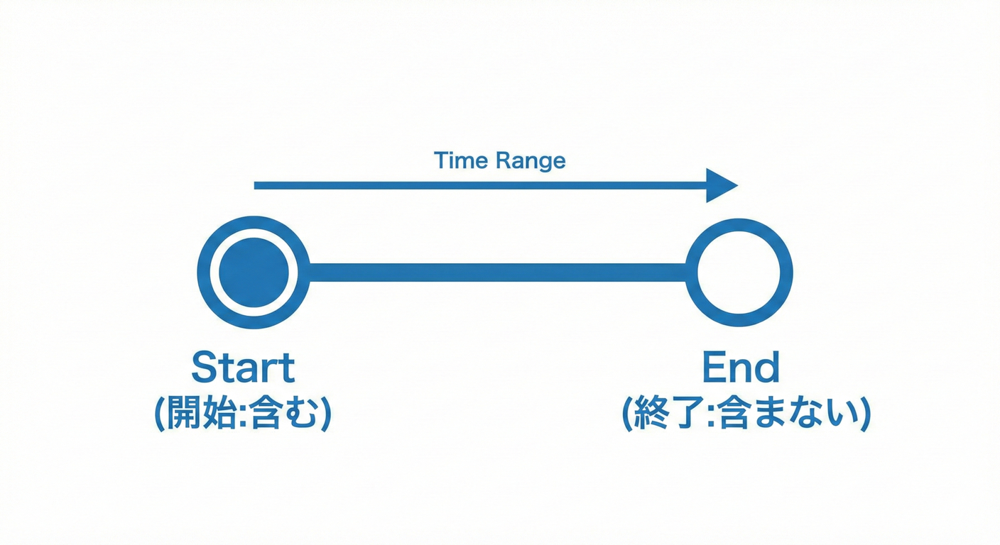
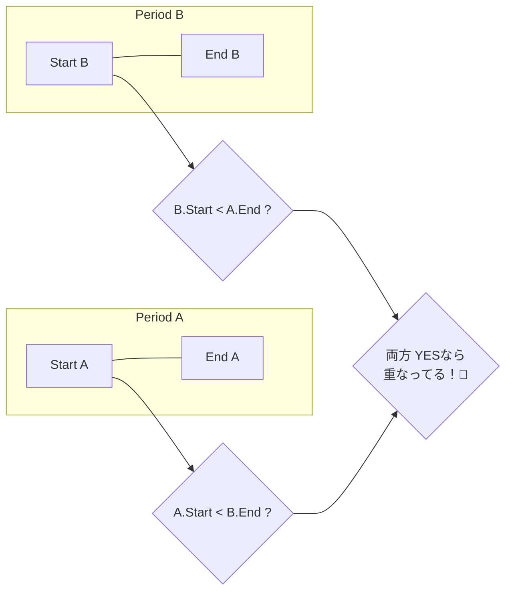

# 第10章：VO実装③「Period」みたいな“範囲の値”📅↔️✨

今日は「期間（範囲）」を **Value Object** として作るよ〜！💎
開始と終了の“整合性”って、実務だとバグの温床になりがち…🥲 だから **型と不変条件で守る** 体験をしようね🛡️😊

---

## 0) 今日のゴール🎯💖

できるようになったら勝ち〜！🏆✨

* 「期間」を **1つのVO** として表現できる📦
* **start <= end** みたいなルールを **生成時に強制** できる🔒
* `contains()` / `overlaps()` みたいな **便利メソッド** をVOに持たせられる🧩
* **境界テスト**（ギリギリの値）で安心できる🧪✨

---

## 1) Period（期間）って、なに？🧸📅

Periodは「点」じゃなくて「範囲」だよ〜！✨
たとえばこんなやつ👇

* サブスク有効期間：2026-01-01 〜 2026-02-01 💳
* 旅行：2/10〜2/12 ✈️（※“宿泊数”の考え方で end は翌朝、とかが大事）
* 割引キャンペーン：開始日時〜終了日時🎁
* 大学の履修期間：開始日〜締切日📚

---

## 2) いきなり実装しないで！まず「ルール決め」📝✨



期間って、**どっちも正しそうなルールが複数ある** のが難しいポイント😵‍💫
だから最初に “言葉と仕様” を決めちゃうのがコツだよ💡

### ✅ まず決める3つ（超重要）🚦

#### ① 終了は「含む？含まない？」🤔

よくある2パターン👇

**A. [start, end]（終了も含む）**

* 例：締切日“当日”までOK🙆‍♀️
* ただし「23:59:59…」問題が出やすい🥲

**B. [start, end)（終了は含まない）** ← 今日おすすめ💖

* 例：宿泊・サブスク・予約に強い✨
* **隙間や重なり判定がめっちゃシンプル**になる👍

図で見るとこんな感じ👇📈

* `[start, end)` は「startは入る、endは入らない」✨

---

#### ② “日付だけ” ？ “日時まで” ？⏰

* 日付だけ（例：2026-01-22）→ **PlainDate系** が相性いい😊
* 日時（例：2026-01-22T10:30）→ タイムゾーンも絡むので難度UP🔥

今回はまず **“日付だけPeriod”** でいくよ〜！🌸

---

#### ③ start と end が同じ日はOK？（空期間OK？）🫧

* OKにすると便利なこともあるけど、初心者のうちは **禁止** が安全🛡️
  → `start < end` を強制✨（start==endはエラー）

---

## 3) 期間のVOに“ありがちな事故”💥😇（先に知って勝つ！）

* `start` と `end` を別々に持って、いつの間にか片方だけ更新される😱
* `end` を含む/含まないが曖昧で、境界でバグる🥲
* `Date` で時差・丸め・不変じゃない問題が出る🌀
  → そこで今注目なのが **Temporal** だよ✨（Dateの弱点を補う目的の新しい日時API）([TC39][1])

※Temporalは **Stage 3（Draft）** の仕様で、2026-01-19時点でも Stage 3 として公開されているよ🧠✨([TC39][1])
MDNにも解説があるので、困ったら辞書みたいに見ると安心📚😊([MDNウェブドキュメント][2])

---

## 4) 実装しよう！DatePeriod VO を作るよ💎🧱

今回は **[start, endExclusive)** を採用するね💖
つまり `endExclusive` は「その日は含まない」ルール✨

### 4-1) DomainError（雑にしないエラー）⚠️

VOは「無効値を作らない」が大事だから、作れなかった理由をちゃんと出すよ〜😊

```ts
// DomainError.ts
export class DomainError extends Error {
  constructor(
    public readonly code: string,
    message: string,
  ) {
    super(message);
    this.name = "DomainError";
  }
}
```

---

### 4-2) DatePeriod（期間VO）📅↔️

```ts
// DatePeriod.ts
import { Temporal } from "@js-temporal/polyfill";
import { DomainError } from "./DomainError";

export class DatePeriod {
  private constructor(
    public readonly start: Temporal.PlainDate,
    public readonly endExclusive: Temporal.PlainDate,
  ) {}

  /** ISO文字列から作る（例: "2026-01-10"） */
  static parse(startIso: string, endExclusiveIso: string): DatePeriod {
    return DatePeriod.of(
      Temporal.PlainDate.from(startIso),
      Temporal.PlainDate.from(endExclusiveIso),
    );
  }

  /** PlainDateから作る */
  static of(start: Temporal.PlainDate, endExclusive: Temporal.PlainDate): DatePeriod {
    if (Temporal.PlainDate.compare(start, endExclusive) >= 0) {
      throw new DomainError(
        "PERIOD_INVALID",
        "start must be before endExclusive",
      );
    }
    return new DatePeriod(start, endExclusive);
  }

  /** [start, endExclusive) に入ってる？ */
  contains(date: Temporal.PlainDate): boolean {
    return (
      Temporal.PlainDate.compare(this.start, date) <= 0 &&
      Temporal.PlainDate.compare(date, this.endExclusive) < 0
    );
  }

  /** 何日ぶん？（例: 2026-01-10〜2026-01-13 は 3日） */
  days(): number {
    return this.start.until(this.endExclusive, { largestUnit: "days" }).days;
  }

  /** 重なってる？（区間の重なり判定の王道！） */
      Temporal.PlainDate.compare(other.start, this.endExclusive) < 0
    );
  }


```mermaid
flowchart LR
    subgraph A [Period A]
        StartA[Start A] --- EndA[End A]
    end
    subgraph B [Period B]
        StartB[Start B] --- EndB[End B]
    end

    Cond1{"A.Start < B.End ?"}
    Cond2{"B.Start < A.End ?"}

    StartA --> Cond1
    StartB --> Cond2
    
    Cond1 & Cond2 --> Result{両方 YESなら<br>重なってる！🔴}
```


  /** ぴったり隣り合ってる？（Aの終わり＝Bの始まり） */
  isAdjacent(other: DatePeriod): boolean {
    return (
      Temporal.PlainDate.compare(this.endExclusive, other.start) === 0 ||
      Temporal.PlainDate.compare(other.endExclusive, this.start) === 0
    );
  }

  /** 日数ぶんズラす（マイナスもOK） */
  shiftDays(days: number): DatePeriod {
    return DatePeriod.of(
      this.start.add({ days }),
      this.endExclusive.add({ days }),
    );
  }

  toString(): string {
    return `${this.start.toString()}..${this.endExclusive.toString()}(endExclusive)`;
  }
}
```

---

## 5) 使ってみよう😊✨（例）

```ts
import { DatePeriod } from "./DatePeriod";
import { Temporal } from "@js-temporal/polyfill";

const p = DatePeriod.parse("2026-01-10", "2026-01-13");

console.log(p.days()); // 3 🐣

console.log(p.contains(Temporal.PlainDate.from("2026-01-10"))); // true ✅
console.log(p.contains(Temporal.PlainDate.from("2026-01-13"))); // false ❌（endExclusiveだから）
```

---

## 6) テストしよう🧪💖（境界が命！！）

テストは **境界** を叩くのがいちばん効くよ〜！🎯
（ちょうど start / end、startの前日、endの日…みたいな）

ちなみに最近は **Vitest 4.0** が出てて、移行ガイドも更新されてるよ🧪✨([Vitest][3])

```ts
// DatePeriod.test.ts
import { describe, it, expect } from "vitest";
import { Temporal } from "@js-temporal/polyfill";
import { DatePeriod } from "./DatePeriod";

describe("DatePeriod", () => {
  it("creates when start < endExclusive", () => {
    const p = DatePeriod.parse("2026-01-10", "2026-01-13");
    expect(p.days()).toBe(3);
  });

  it("rejects start == endExclusive", () => {
    expect(() => DatePeriod.parse("2026-01-10", "2026-01-10"))
      .toThrowError(/PERIOD_INVALID/);
  });

  it("contains uses [start, endExclusive)", () => {
    const p = DatePeriod.parse("2026-01-10", "2026-01-13");

    expect(p.contains(Temporal.PlainDate.from("2026-01-09"))).toBe(false);
    expect(p.contains(Temporal.PlainDate.from("2026-01-10"))).toBe(true);
    expect(p.contains(Temporal.PlainDate.from("2026-01-12"))).toBe(true);
    expect(p.contains(Temporal.PlainDate.from("2026-01-13"))).toBe(false);
  });

  it("overlaps works", () => {
    const a = DatePeriod.parse("2026-01-10", "2026-01-13");
    const b = DatePeriod.parse("2026-01-12", "2026-01-15");
    const c = DatePeriod.parse("2026-01-13", "2026-01-20");

    expect(a.overlaps(b)).toBe(true);
    expect(a.overlaps(c)).toBe(false); // 13は含まないので重ならない
  });
});
```

---

## 7) “業務でありがち”な期間ルール候補10個🧠💡

AIに聞く前に、まず「こういうのあるよね〜」を持っておくと強い💪✨

1. 最大90日まで📏
2. 開始は今日以降のみ⏳
3. 期間が休日だけだとNG🚫
4. 申請期間は平日9:00〜17:00のみ🏢
5. 月をまたぐの禁止📆
6. 期末だけ例外あり🎓
7. 同じ利用者は期間が重複しちゃダメ🙅‍♀️
8. 変更できるのは開始前まで🛑
9. 終了日は“含む”仕様（締切日当日まで）✅
10. “空期間OK”にして「未設定」を表現したい🫧

---

## 8) 演習（手を動かすと一気に定着するよ💖）🧩✨

### 演習①（基本）🍼

`DatePeriod` に `equals(other)` を追加してみよう😊

* start と endExclusive が同じなら同じPeriod✨

### 演習②（実務っぽい）🏢

`intersection(other)` を作ろう✂️

* 重なってる部分だけのPeriodを返す
* 重なってなければ `null` でOK🙆‍♀️

### 演習③（ルール追加）🛡️

「最大30日まで」を追加してみよう！

* `days() > 30` なら `DomainError("PERIOD_TOO_LONG", "...")`

---

## 9) 小テスト（5問）📝💗

1. `[start, end)` のメリットを1つ言ってみて😊
2. `start == end` を禁止すると、何が嬉しい？✨
3. `contains(endExclusive)` が `false` なのはなぜ？🤔
4. 「期間の重なり判定」の王道条件を日本語で説明してみて🧠
5. PeriodがVOである理由を「同一性」じゃなく「値」の観点で言ってみて💎

---

## 10) AIプロンプト集🤖💬（そのままコピペOK✨）

* 「`[start, end)` を採用したPeriod VOの境界テストケースを20個出して」🧪
* 「このPeriod仕様（〜）で、バグりやすい例を5つと対策を教えて」💥
* 「`intersection` を安全に実装する手順を、初心者向けに3ステップで」✂️
* 「このドメインだと end は inclusive/exclusive どっちが自然？理由も！」🤔

---

## ちいさな最新メモ🆕✨

* TypeScriptは **5.9.3 が “Latest” として公開**されているよ📌([GitHub][4])
* Temporalは **Stage 3 Draft（2026-01-19時点）**で、Dateの課題（不変性・タイムゾーン等）を解決する方向のAPIとして整理されてるよ🕰️✨([TC39][1])

---

次の第11章では、このPeriodみたいなVOが増えてきたときの **等価性** と **コレクション（Set/List）** の話に入るよ〜🧺💎
その前に、演習②の `intersection()` いっしょに答え合わせする？😊✨

[1]: https://tc39.es/proposal-temporal/?utm_source=chatgpt.com "Temporal"
[2]: https://developer.mozilla.org/en-US/docs/Web/JavaScript/Reference/Global_Objects/Temporal?utm_source=chatgpt.com "Temporal - JavaScript - MDN Web Docs"
[3]: https://vitest.dev/blog/vitest-4?utm_source=chatgpt.com "Vitest 4.0 is out!"
[4]: https://github.com/microsoft/typescript/releases "Releases · microsoft/TypeScript · GitHub"
