```mermaid
sequenceDiagram
  participant UseCase
  participant Repo
  participant Order
  participant ACL
  
  UseCase->>Repo: findById(id)
  Repo-->>UseCase: Order (Rehydrated)
  
  UseCase->>Order: total()
  Order-->>UseCase: Money (JPY)
  
  UseCase->>ACL: charge(money) 💳
  ACL-->>UseCase: Result (Translated)
  
  alt Payment OK
    UseCase->>Order: markPaid() ✅
    UseCase->>Repo: save(order) 💾
    UseCase-->>Client: OK
  else Payment Failed
    UseCase-->>Client: Error
  end
```

# 第24章：総合ミニプロジェクト（統合）＋実務チェックリスト 🎒🏁✅

よしっ、いよいよ最終ステージだよ〜！🔥😆
この章は「いままで作ったパーツ（VO/Entity/境界/Repo/Mapper/ACL/テスト）」を、**一本のアプリとして“つなげて動かす”**回です✨

---

## 0) 今日のゴール 🎯✨

* **ドメイン（Entity/VO）**が中心にいて、外側（DB/外部API/UI）があとから差し替えられる 🧠🔁
* **境界でガード**して、変なデータを中に入れない 🚧🛡️
* **永続化はRepository＋Mapperで分離**して、DB都合でモデルを歪めない 💾🧼
* **ACLで外部APIのクセを吸収**して、ドメインを守る 🌉✨
* **テストで守り**を作って、仕様変更しても怖くない 🧪💪

---

## 1) ミニプロジェクト題材：ミニ注文（Order）🛒✨

「注文を作る → 送信 → 支払い → キャンセル」の超ミニ版だよ🍰
外部決済は“クセのあるレスポンス”が返ってくる想定にして、ACLも使うよ😉

### 使う主役たち（例）🎭

* **Entity**：Order
* **VO**：OrderId / Email / Money / Period / LineItem（VO扱いでOK）
* **境界DTO**：CreateOrderRequest / AddItemRequest / PayOrderRequest
* **Repository**：OrderRepository（interface）
* **Mapper**：Order ↔ OrderRecord（永続化用の形）
* **ACL**：PaymentGatewayAdapter（外部決済の翻訳係）

---

## 2) “2026年いま”のツール感（バージョン目安）🧰✨

この章のサンプルは、いま一般的に組みやすい構成でいくよ〜😊

* TypeScript：**5.9.3** が npm 上の最新版（2026-01 時点）✨ ([npm][1])
* Node.js：LTS に **24系**があり、例として **24.13.0 (LTS)** が出てるよ🔐 ([窓の杜][2])
* Vitest：**v4.0.x** が安定で使われてる（例：4.0.17）🧪 ([GitHub][3])
* ESLint：npm で **9.39.2** が最新として案内されてるよ🧹 ([npm][4])
* Prettier：**3.8.0**（2026-01-14のリリース）🪄 ([Prettier][5])
* typescript-eslint：**8.53.1** が最新（parser / plugin）📌 ([npm][6])

（おまけ）TypeScript は「ネイティブ実装のプレビュー（TS 7）」みたいな動きも進んでるよ🚀 ([Microsoft Developer][7])

---

## 3) 全体の形（図解イメージ）🗺️✨


ポイントはこれ👇
**ドメインは外側に依存しない**（依存の向きが“外→内”）🎯

```mermaid
graph TD
    subgraph External [External World]
        UI[UI / Web]
        DB[Database]
        API[External API]
    end

    subgraph Adapters [Interface Adapters]
        Ctrl[Controllers]
        RepoImpl[Repository Impl]
        ACL[ACL Impl]
    end

    subgraph App [Application]
        UseCase[Use Cases]
    end

    subgraph Domain [Domain Core 💎]
        Entity
        VO
        RepoInterface[Repo Interface]
    end

    UI --> Ctrl --> UseCase --> Domain
    RepoImpl --> RepoInterface
    ACL --> API
    
    style Domain fill:#fef08a,stroke:#eab308,stroke-width:2px
```



---

## 4) フォルダ構成（おすすめ）📁✨

```text
src/
  domain/
    valueObjects/
      Email.ts
      Money.ts
      OrderId.ts
      Period.ts
    entities/
      Order.ts
    errors/
      DomainError.ts
    types/
      Result.ts
  application/
    dtos/
      CreateOrderRequest.ts
      PayOrderRequest.ts
    usecases/
      CreateOrder.ts
      AddItem.ts
      SubmitOrder.ts
      PayOrder.ts
      CancelOrder.ts
  infrastructure/
    persistence/
      OrderRecord.ts
      OrderMapper.ts
      InMemoryOrderRepository.ts
      JsonFileOrderRepository.ts
    acl/
      payment/
        PaymentGatewayClient.ts
        PaymentGatewayAdapter.ts
  index.ts
tests/
  domain/
  application/
  infrastructure/
```

---

## 5) 仕様（ミニ仕様書）🧾✨

### 注文のルール（例）🚦

* Order は `Draft / Submitted / Paid / Cancelled` の状態を持つ
* `Paid` や `Cancelled` になった注文は、アイテム追加できない
* 合計金額は LineItem の合計（Money）
* 支払いは外部決済（PaymentGateway）に投げる
* 外部決済の返り値はクセがある（例：`"OK|pay_123|JPY|1200"` みたいな文字列）→ ACL で翻訳する

---

## 6) 実装ミッション（順番どおりでOK）🎮✨

### ミッション1：Result型（失敗を安全に返す）🎁⚠️

「例外投げる」より、初心者はまず **Result** でいくと迷子になりにくいよ☺️

```ts
// src/domain/types/Result.ts
export type Ok<T> = { ok: true; value: T };
export type Err<E> = { ok: false; error: E };
export type Result<T, E> = Ok<T> | Err<E>;

export const ok = <T>(value: T): Ok<T> => ({ ok: true, value });
export const err = <E>(error: E): Err<E> => ({ ok: false, error });
```

✅チェック：`if (!result.ok) return ...` が自然に書ける？

**AIプロンプト例🤖💬**

* 「TypeScriptでResult型（Ok/Err）を初心者向けに。map/andThenも欲しい！」

---

### ミッション2：VO（Email / Money / OrderId）💎🛡️

#### Email（生成時に検証）📧✅

```ts
// src/domain/valueObjects/Email.ts
import { Result, ok, err } from "../types/Result.js";
import { DomainError } from "../errors/DomainError.js";

export class Email {
  private constructor(private readonly value: string) {}

  static create(raw: string): Result<Email, DomainError> {
    const v = raw.trim();
    if (v.length === 0) return err(DomainError.invalid("email", "空はだめだよ🥺"));
    // 超ざっくり（学習用）。本気運用は専用ライブラリや要件に合わせる
    if (!v.includes("@")) return err(DomainError.invalid("email", "@ がないよ🥺"));
    return ok(new Email(v));
  }

  toString(): string {
    return this.value;
  }
}
```

#### Money（計算はVOで守る）💰➕

```ts
// src/domain/valueObjects/Money.ts
import { DomainError } from "../errors/DomainError.js";

export class Money {
  private constructor(
    private readonly amount: number,
    private readonly currency: "JPY"
  ) {}

  static jpy(amount: number): Money {
    if (!Number.isInteger(amount)) throw new Error("Moneyは整数にしてね（学習用）");
    if (amount < 0) throw new Error("マイナス禁止だよ🥺");
    return new Money(amount, "JPY");
  }

  add(other: Money): Money {
    this.assertSameCurrency(other);
    return Money.jpy(this.amount + other.amount);
  }

  multiply(qty: number): Money {
    if (!Number.isInteger(qty) || qty <= 0) throw new Error("qtyがおかしいよ🥺");
    return Money.jpy(this.amount * qty);
  }

  equals(other: Money): boolean {
    return this.currency === other.currency && this.amount === other.amount;
  }

  getAmount(): number {
    return this.amount;
  }

  getCurrency(): "JPY" {
    return this.currency;
  }

  private assertSameCurrency(other: Money) {
    if (this.currency !== other.currency) {
      throw new Error("通貨ちがうよ🥺");
    }
  }
}
```

#### OrderId（ただのstringを卒業）🪪✨

```ts
// src/domain/valueObjects/OrderId.ts
export class OrderId {
  private constructor(private readonly value: string) {}
  static create(raw: string): OrderId {
    if (raw.trim().length === 0) throw new Error("OrderId空はだめ🥺");
    return new OrderId(raw);
  }
  toString(): string {
    return this.value;
  }
}
```

✅チェック：VOは `new` で勝手に作れない？（create経由になってる？）

---

### ミッション3：Entity（Order）＋状態遷移 🚦🔄

```ts
// src/domain/entities/Order.ts
import { OrderId } from "../valueObjects/OrderId.js";
import { Email } from "../valueObjects/Email.js";
import { Money } from "../valueObjects/Money.js";
import { DomainError } from "../errors/DomainError.js";
import { Result, ok, err } from "../types/Result.js";

export type OrderStatus = "Draft" | "Submitted" | "Paid" | "Cancelled";

export type LineItem = {
  sku: string;
  unitPrice: Money;
  qty: number;
};

export class Order {
  private status: OrderStatus = "Draft";
  private items: LineItem[] = [];

  private constructor(
    private readonly id: OrderId,
    private readonly customerEmail: Email
  ) {}

  static create(id: OrderId, email: Email): Order {
    return new Order(id, email);
  }

  addItem(item: LineItem): Result<void, DomainError> {
    if (this.status !== "Draft") {
      return err(DomainError.rule("order.status", "Draftのときだけ追加できるよ🥺"));
    }
    if (item.qty <= 0) return err(DomainError.invalid("qty", "1以上ね🥺"));
    if (item.sku.trim().length === 0) return err(DomainError.invalid("sku", "空はだめ🥺"));
    this.items.push(item);
    return ok(undefined);
  }

  submit(): Result<void, DomainError> {
    if (this.status !== "Draft") return err(DomainError.rule("order.status", "Draftだけ送信OK🥺"));
    if (this.items.length === 0) return err(DomainError.rule("order.items", "商品ゼロは送信できないよ🥺"));
    this.status = "Submitted";
    return ok(undefined);
  }

  markPaid(): Result<void, DomainError> {
    if (this.status !== "Submitted") return err(DomainError.rule("order.status", "Submittedだけ支払いOK🥺"));
    this.status = "Paid";
    return ok(undefined);
  }

  cancel(): Result<void, DomainError> {
    if (this.status === "Paid") return err(DomainError.rule("order.status", "Paidは取消できないよ🥺"));
    this.status = "Cancelled";
    return ok(undefined);
  }

  total(): Money {
    return this.items.reduce((sum, it) => sum.add(it.unitPrice.multiply(it.qty)), Money.jpy(0));
  }

  // Mapper用に最低限のgetter（増やしすぎ注意！）
  getId(): OrderId { return this.id; }
  getEmail(): Email { return this.customerEmail; }
  getStatus(): OrderStatus { return this.status; }
  getItems(): LineItem[] { return [...this.items]; }
}
```

#### DomainError（エラーモデル）⚠️📌

```ts
// src/domain/errors/DomainError.ts
export class DomainError {
  private constructor(
    public readonly kind: "Invalid" | "Rule",
    public readonly field: string,
    public readonly message: string
  ) {}

  static invalid(field: string, message: string): DomainError {
    return new DomainError("Invalid", field, message);
  }
  static rule(field: string, message: string): DomainError {
    return new DomainError("Rule", field, message);
  }
}
```

✅チェック：状態遷移が `if` で散らばってない？（Orderの中に集まってる？）

---

### ミッション4：Repository（interface）🧩🧱

```ts
// src/application/usecases/ports/OrderRepository.ts
import { Order } from "../../../domain/entities/Order.js";
import { OrderId } from "../../../domain/valueObjects/OrderId.js";

export interface OrderRepository {
  findById(id: OrderId): Promise<Order | null>;
  save(order: Order): Promise<void>;
}
```

✅チェック：Usecaseは「DBの話」をしてない？

---

### ミッション5：Mapper（Order ↔ Record）🔁💾

「永続化の形」と「ドメインの形」を切り分けるよ✨

```ts
// src/infrastructure/persistence/OrderRecord.ts
export type OrderRecord = {
  id: string;
  email: string;
  status: "Draft" | "Submitted" | "Paid" | "Cancelled";
  items: { sku: string; unitPrice: number; qty: number }[];
};
```

```ts
// src/infrastructure/persistence/OrderMapper.ts
import { Order, LineItem } from "../../domain/entities/Order.js";
import { OrderId } from "../../domain/valueObjects/OrderId.js";
import { Email } from "../../domain/valueObjects/Email.js";
import { Money } from "../../domain/valueObjects/Money.js";
import { OrderRecord } from "./OrderRecord.js";

export class OrderMapper {
  static toRecord(order: Order): OrderRecord {
    return {
      id: order.getId().toString(),
      email: order.getEmail().toString(),
      status: order.getStatus(),
      items: order.getItems().map(it => ({
        sku: it.sku,
        unitPrice: it.unitPrice.getAmount(),
        qty: it.qty,
      })),
    };
  }

  static fromRecord(r: OrderRecord): Order {
    const order = Order.create(OrderId.create(r.id), Email.create(r.email).ok ? Email.create(r.email).value : (()=>{throw new Error("invalid email in DB")})());
    // status/items復元（学習用に簡略）
    r.items.forEach(it => {
      order.addItem({ sku: it.sku, unitPrice: Money.jpy(it.unitPrice), qty: it.qty });
    });
    // status復元（本気ならOrder側にrestore用factoryを作るのがキレイ）
    (order as any).status = r.status;
    return order;
  }
}
```

💡ここ、学習ポイントだよ！
`fromRecord()` で **Email.create の失敗**が起きたら「DBに壊れたデータがいる」ってこと。
実務では、**restore専用の安全な復元口**（例：`Order.restore(...)`）を作るのがおすすめ😊

---

### ミッション6：Repository実装（InMemory → JsonFile）🧠➡️💾

#### InMemory（まず動かす）🧺✨

```ts
// src/infrastructure/persistence/InMemoryOrderRepository.ts
import { OrderRepository } from "../../application/usecases/ports/OrderRepository.js";
import { Order } from "../../domain/entities/Order.js";
import { OrderId } from "../../domain/valueObjects/OrderId.js";

export class InMemoryOrderRepository implements OrderRepository {
  private store = new Map<string, Order>();

  async findById(id: OrderId): Promise<Order | null> {
    return this.store.get(id.toString()) ?? null;
  }

  async save(order: Order): Promise<void> {
    this.store.set(order.getId().toString(), order);
  }
}
```

#### JsonFile（永続化っぽくする）📄💾

（`fs`で `orders.json` に保存するだけでOK。DBはまだ要らないよ😉）

---

### ミッション7：ACL（外部決済の翻訳係）🌉💳✨

外部の返り値が **「変な文字列」**だとしても、
ドメイン側には **きれいな型**だけ渡したいよね🙂

```ts
// src/infrastructure/acl/payment/PaymentGatewayClient.ts
export type RawPaymentResponse = string; // 例: "OK|pay_123|JPY|1200"

export interface PaymentGatewayClient {
  charge(orderId: string, amount: number, currency: string): Promise<RawPaymentResponse>;
}
```

```ts
// src/infrastructure/acl/payment/PaymentGatewayAdapter.ts
import { Money } from "../../../domain/valueObjects/Money.js";

export type PaymentResult =
  | { ok: true; paymentId: string }
  | { ok: false; reason: string };

export class PaymentGatewayAdapter {
  static translate(raw: string, expected: Money): PaymentResult {
    // "OK|pay_123|JPY|1200"
    const [status, payId, cur, amt] = raw.split("|");
    if (status !== "OK") return { ok: false, reason: "決済NG😢" };
    if (cur !== expected.getCurrency()) return { ok: false, reason: "通貨が変だよ😢" };
    if (Number(amt) !== expected.getAmount()) return { ok: false, reason: "金額が変だよ😢" };
    return { ok: true, paymentId: payId };
  }
}
```

✅チェック：Usecase/Domainが raw文字列の仕様を知らない？（Adapterだけが知ってる？）

---

### ミッション8：Usecase（薄く、つなぐ）🧠🪄

例：PayOrder（支払い）

* Orderを取り出す
* 状態確認は Order に任せる
* 外部決済を呼ぶ（Client）
* 返り値を Adapter で翻訳
* OKなら `order.markPaid()`
* 保存

```ts
// src/application/usecases/PayOrder.ts
import { OrderRepository } from "./ports/OrderRepository.js";
import { OrderId } from "../../domain/valueObjects/OrderId.js";
import { Result, ok, err } from "../../domain/types/Result.js";
import { DomainError } from "../../domain/errors/DomainError.js";
import { PaymentGatewayClient } from "../../infrastructure/acl/payment/PaymentGatewayClient.js";
import { PaymentGatewayAdapter } from "../../infrastructure/acl/payment/PaymentGatewayAdapter.js";

export class PayOrder {
  constructor(
    private readonly repo: OrderRepository,
    private readonly payment: PaymentGatewayClient
  ) {}

  async execute(id: OrderId): Promise<Result<void, DomainError>> {
    const order = await this.repo.findById(id);
    if (!order) return err(DomainError.invalid("orderId", "注文が見つからないよ🥺"));

    const total = order.total();
    const raw = await this.payment.charge(id.toString(), total.getAmount(), total.getCurrency());
    const translated = PaymentGatewayAdapter.translate(raw, total);

    if (!translated.ok) {
      return err(DomainError.rule("payment", translated.reason));
    }

    const r = order.markPaid();
    if (!r.ok) return r;

    await this.repo.save(order);
    return ok(undefined);
  }
}



```

---

## 7) テスト戦略（最低限これだけで強い）🧪🍰

Vitest を前提に、テストは「薄皮ミルフィーユ」感覚でOK😊

* **VOテスト**：Email / Money の境界値（最重要）
* **Entityテスト**：状態遷移（Draft→Submitted→Paid…）
* **Mapperテスト**：toRecord/fromRecord が往復で壊れない
* **Usecaseテスト**：RepoとPaymentをスタブして PayOrder が正しく動く

（Vitest の4系が継続的に出てるよ🧪） ([GitHub][3])

---

## 8) 仕様変更を1個入れてみよう（ここが最終奥義）🪄🔁✨

### 仕様変更案（例）🎁

「クーポンで合計から100円引き（ただし合計が500円以上のときだけ）」

**影響範囲の理想**👇

* ルールは **Order（ドメイン）** に追加
* 外部決済は **合計が変わるだけ**（ACLは基本そのまま）
* 永続化は「クーポンコードを保存したい」なら Record/Mapper を少しだけ変更
* Usecaseは「DTOでクーポン受け取り→Orderへ渡す」くらい

💡つまり、**ドメイン中心**にしておくと「変更箇所が狭い」＝勝ち🏆✨

---

## 9) 実務チェックリスト（これ持ってたら強い）📋✅✨

### A. Entity/VOの切り分け 👑💎

* [ ] 「追跡が必要」なものが Entity になってる？🪪
* [ ] 「値そのもの」なのに Entity にしてない？（不要なID生えてない？）🌱
* [ ] VOは **生成時に検証**してる？（無効値を作れない？）🚫
* [ ] Moneyみたいな計算は、散らばらずVOに寄ってる？💰

### B. 不変条件と更新口 🚪🛡️

* [ ] Entityの更新はメソッド経由で、勝手に書き換えできない？🔒
* [ ] 状態遷移の禁止がテストされてる？🚦🧪
* [ ] 例外とResultの使い分けが統一されてる？（ブレると地獄😇）

### C. 境界（DTO→ドメイン）🚧

* [ ] 外から来たデータは **境界で検証**してる？
* [ ] ドメインが “stringだらけ” になってない？（VOにしてる？）

### D. 永続化（Repository/Mapper）💾🧼

* [ ] Usecase/DomainがDBの都合（カラム名等）を知らない？
* [ ] Mapperが1か所にまとまってる？
* [ ] Record ↔ Domain の往復テストある？

### E. ACL（外部API）🌉

* [ ] 外部の変な命名/単位/欠損を **ACLで吸収**してる？
* [ ] ドメインが外部レスポンスの仕様を直接触ってない？

### F. テスト 🧪

* [ ] VOの境界値テスト（OK/NG）が揃ってる？
* [ ] 状態遷移テスト（許可/禁止）が揃ってる？
* [ ] 仕様変更1つ入れても、直す場所が少ない？（設計勝ち！）

### G. 依存関係（DIP）🧲

* [ ] ドメインが infrastructure を import してない？
* [ ] interface は内側、実装は外側にいる？

### H. セキュリティ（Windowsは特に意識）🔐🪟

* [ ] 依存パッケージ更新は、差分と出所を見てる？👀
* [ ] 過去に `eslint-config-prettier` 周辺でサプライチェーン攻撃があった（Windows影響ありの話題）ので、CIでの更新は慎重にね🧯 ([CSO Online][8])

---

## 10) 小テスト（サクッと確認）📝✨

1. OrderがPaidのとき addItem を禁止するのはどこ？
   A. Controller / B. Usecase / C. Order（Entity）

2. 外部決済の `OK|pay_123|JPY|1200` を解釈するのはどこ？
   A. Domain / B. ACL / C. Repository

3. `email: string` をそのままOrderに入れるのが危ない理由は？
   （ヒント：無効値が侵入する）

4. Mapperが無いと何がつらい？（ヒント：DB都合が侵入）

✅答え（超短く）
1:C  2:B  3:無効値が入る/検証が散る  4:ドメインが汚れる/変更に弱い

---

## 11) AIプロンプト集（この章用）🤖🎀

* 「このOrderの状態遷移表を作って、禁止遷移も列挙して」🚦
* 「VO（Email/Money）の境界値テストをOK/NGで20個ずつ出して」🧪
* 「Repository interface が太すぎないかレビューして、分割案も」🧩
* 「外部APIレスポンスの危険点（欠損/単位/文字列）を洗い出して、ACL案」🌉
* 「仕様変更（クーポン）を入れたときの変更箇所をレイヤ別に教えて」🔁

---

## 12) 次に作るならどっち？😊🎀


迷ったら **「授業用本文（説明＋図解イメージ＋演習＋小テスト＋AIプロンプト集）」を先**がラクだよ〜📚✨
理由：本文ができると、ミニプロジェクト仕様書は“抜き出して整形するだけ”になりやすいから😉🪄

必要なら、この第24章の内容をベースに **「完成版のJsonFileOrderRepository」**と、**Vitestのテスト一式（そのままコピペで動く版）**まで一気に仕上げるよ🔥🧪💖

[1]: https://www.npmjs.com/package/typescript?utm_source=chatgpt.com "typescript"
[2]: https://forest.watch.impress.co.jp/docs/news/2077577.html?utm_source=chatgpt.com "「Node.js」のセキュリティリリースが年をまたいでようやく公開"
[3]: https://github.com/vitest-dev/vitest/releases?utm_source=chatgpt.com "Releases · vitest-dev/vitest"
[4]: https://www.npmjs.com/package/eslint?utm_source=chatgpt.com "eslint"
[5]: https://prettier.io/blog/2026/01/14/3.8.0?utm_source=chatgpt.com "Prettier 3.8: Support for Angular v21.1"
[6]: https://www.npmjs.com/package/%40typescript-eslint/parser?utm_source=chatgpt.com "typescript-eslint/parser"
[7]: https://developer.microsoft.com/blog/typescript-7-native-preview-in-visual-studio-2026?utm_source=chatgpt.com "TypeScript 7 native preview in Visual Studio 2026"
[8]: https://www.csoonline.com/article/4026380/prettier-eslint-npm-packages-hijacked-in-a-sophisticated-supply-chain-attack.html?utm_source=chatgpt.com "Prettier-ESLint npm packages hijacked in a sophisticated ..."
