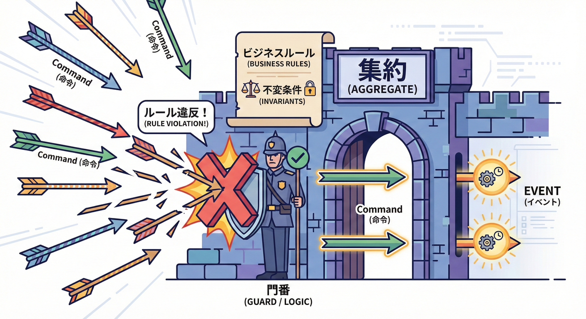
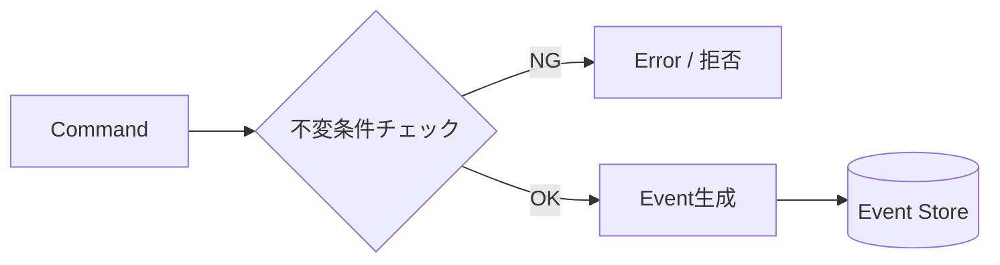

# 9章：不変条件（Invariants）超入門🧷🛡️

## この章でわかること🎯✨

* **不変条件**ってなに？（＝どんなときも絶対に守るルール）🧷
* そのルールを **どこに置くと事故らないか**（散らさない！）🧩
* イベントソーシングでの **「Command → ルールチェック → Event」** の形🧠📮
* 不変条件から **テスト観点**を作るコツ🧪👀

---

## 不変条件ってなに？🧷

不変条件（Invariants）は、ざっくり言うとこう👇

* 「アプリの世界で、**絶対に成立しててほしい状態**」
* 「これが壊れてたら、データも画面も全部信用できない😱」

たとえばショッピングカートなら

* 合計金額はマイナスにならない💰🚫
* 注文確定したカートは、もう中身を変えられない📦🔒
* 数量は 1 以上🧮✅

みたいなやつ！

---

## 超大事ポイント：型は“守ってくれるけど”、現実は型だけじゃ守れない😇🌀

TypeScript の型は超便利だけど、**実行時の現実**はこう👇

* APIや画面から来る値は、**間違ってる可能性がある**（空、マイナス、変な文字列…）😵‍💫
* 型はコンパイル時の助けであって、**実行時のデータの正しさは別問題**🧠💥

だからイベントソーシングでは特に、
**ドメイン（ルールの中心）で不変条件をガチで守る**のが超重要になるよ🛡️✨

外から来る入力の“形”をチェックしたい時は、Zodみたいな **ランタイムバリデーション**もよく使われるよ（スキーマで検証して、安全な値にする）🧾✅ ([Zod][1])

---

## 不変条件を「散らす」と起きる地獄😇🔥

## ありがちな事故パターン🙅‍♀️

1. **画面でチェック**してるけど、API直叩きで突破される📲💥
2. **APIでチェック**してるけど、バッチ処理が突破する🧹💥
3. **DB制約だけ**に頼って、エラーが意味不明＆イベントが中途半端🗄️😵
4. 同じルールがあちこちにコピーされて、片方だけ更新漏れ😇📌

---

## じゃあ、どこに置くの？答え：集約の入口🚪🧩



イベントソーシングの基本の形（この章は“概念の芯”だけ押さえるよ）👇

* Command（やりたいこと）📮
* **集約（Aggregate）の入口で不変条件チェック**🛡️
* OKなら Event（起きたこと）を作る📜
* Event を積む（保存）📦

ポイントはこれ👇
✅ **不変条件チェックは「Eventを作る前」**
✅ **Eventが保存されたら、その時点で“ルールを守った事実”になる**


```mermaid
flowchart LR
    Cmd[Command] --> Check{不変条件チェック}
    Check -- "NG" --> Err[Error / 拒否]
    Check -- "OK" --> Event[Event生成]
    Event --> Store[(Event Store)]
```

---

## 例題ドメイン：ショッピングカート🛒🍎

## まず「不変条件」を自然言語で3つ書く📝✨

例（解答例でもあるよ）👇

1. **数量は 1 以上**でなければならない🧮✅
2. **存在しない商品は変更できない**🚫
3. **Checkout 後は変更禁止**🔒📦

これがこの章の“芯”だよ🧷

---

## 実装してみよう：不変条件を1か所に集める🧩🛡️

## 1) Event と State を超ミニマムで用意📦

（イベントは「起きたこと」だけを書くのが基本だよ📜）

```ts
type CartEvent =
  | { type: "CartCreated"; cartId: string }
  | { type: "ItemAdded"; productId: string; qty: number }
  | { type: "ItemQtyChanged"; productId: string; qty: number }
  | { type: "ItemRemoved"; productId: string }
  | { type: "CheckedOut" };

type CartState = {
  cartId: string | null;
  items: Map<string, number>; // productId -> qty
  checkedOut: boolean;
};

const emptyCartState = (): CartState => ({
  cartId: null,
  items: new Map(),
  checkedOut: false,
});
```

---

## 2) Apply：イベントから状態を作る🔁🧠

Applyは「イベントを見て状態を更新するだけ」✨
ここにルールを混ぜないのがコツ！（混ぜるとぐちゃぐちゃになりやすい）😵‍💫

```ts
function apply(state: CartState, event: CartEvent): CartState {
  switch (event.type) {
    case "CartCreated":
      return { ...state, cartId: event.cartId };

    case "ItemAdded": {
      const next = new Map(state.items);
      const current = next.get(event.productId) ?? 0;
      next.set(event.productId, current + event.qty);
      return { ...state, items: next };
    }

    case "ItemQtyChanged": {
      const next = new Map(state.items);
      next.set(event.productId, event.qty);
      return { ...state, items: next };
    }

    case "ItemRemoved": {
      const next = new Map(state.items);
      next.delete(event.productId);
      return { ...state, items: next };
    }

    case "CheckedOut":
      return { ...state, checkedOut: true };
  }
}
```

---

## 3) Decide：ここが「不変条件の本丸」🛡️🔥

Decideは「コマンドを受けて、**新しいイベントを作る**」場所！
つまり **イベントを作る前に、ここでルールを守る**💪✨

```ts
type AddItemCommand = { type: "AddItem"; productId: string; qty: number };
type ChangeQtyCommand = { type: "ChangeQty"; productId: string; qty: number };
type RemoveItemCommand = { type: "RemoveItem"; productId: string };
type CheckoutCommand = { type: "Checkout" };

type CartCommand = AddItemCommand | ChangeQtyCommand | RemoveItemCommand | CheckoutCommand;

type DomainError =
  | { type: "AlreadyCheckedOut" }
  | { type: "InvalidQty"; message: string }
  | { type: "ItemNotFound" }
  | { type: "CartIsEmpty" };

type Result<T> = { ok: true; value: T } | { ok: false; error: DomainError };

function decide(state: CartState, cmd: CartCommand): Result<CartEvent[]> {
  // 不変条件①：Checkout後は変更禁止 🔒
  if (state.checkedOut) {
    return { ok: false, error: { type: "AlreadyCheckedOut" } };
  }

  switch (cmd.type) {
    case "AddItem": {
      // 不変条件②：数量は 1以上 🧮✅
      if (!Number.isInteger(cmd.qty) || cmd.qty < 1) {
        return {
          ok: false,
          error: { type: "InvalidQty", message: "qty must be an integer >= 1" },
        };
      }
      return { ok: true, value: [{ type: "ItemAdded", productId: cmd.productId, qty: cmd.qty }] };
    }

    case "ChangeQty": {
      // 不変条件②：数量は 1以上 🧮✅
      if (!Number.isInteger(cmd.qty) || cmd.qty < 1) {
        return {
          ok: false,
          error: { type: "InvalidQty", message: "qty must be an integer >= 1" },
        };
      }
      // 不変条件③：存在しない商品は変更できない 🚫
      if (!state.items.has(cmd.productId)) {
        return { ok: false, error: { type: "ItemNotFound" } };
      }
      return { ok: true, value: [{ type: "ItemQtyChanged", productId: cmd.productId, qty: cmd.qty }] };
    }

    case "RemoveItem": {
      // 不変条件③：存在しない商品は削除できない 🚫
      if (!state.items.has(cmd.productId)) {
        return { ok: false, error: { type: "ItemNotFound" } };
      }
      return { ok: true, value: [{ type: "ItemRemoved", productId: cmd.productId }] };
    }

    case "Checkout": {
      // 不変条件④：空カートは注文できない 🛒🚫
      if (state.items.size === 0) {
        return { ok: false, error: { type: "CartIsEmpty" } };
      }
      return { ok: true, value: [{ type: "CheckedOut" }] };
    }
  }
}
```

💡ここでの気持ちよさポイント😍

* ルールが **Decideに集まってる** ＝探しやすい🔍✨
* Applyはただの状態更新 ＝シンプル😺
* 「イベントが作れた＝ルールを守った」になる🛡️📜

---

## ちょい補足：入力チェックと不変条件は別モノ🧾🧷

* **入力チェック**：型や形式（空文字、数値か、など）🧾
* **不変条件**：ドメインのルール（Checkout後NG、在庫や上限、整合性）🧷

外部入力の形を安全にするには、Zodみたいなスキーマ検証もよく使うよ✅ ([Zod][1])

---

## 不変条件 → テスト観点に変換するコツ🧪👀

不変条件はテストにしやすい！✨
やり方は超単純👇

1. ルールを1行で書く📝
2. **OKケース**を1つ作る✅
3. **NGケース**を1つ作る🚫
4. NGのとき、**どのエラーになるか**を見る👀

例：「数量は 1 以上」🧮✅

* OK：qty=1 ✅
* NG：qty=0 🚫 → InvalidQty

---

## ミニ演習 1：不変条件を3つ書こう📝💖

次の状況を想像して、不変条件を3つ書いてみよう👇

* カートに商品を追加できる🛒
* 数量変更できる🧮
* 注文確定できる📦

✅ 書き方テンプレ

* 「〜のとき、〜でなければならない」

## 解答例💡

* 数量は 1 以上でなければならない🧮✅
* Checkout 後は変更できない🔒
* 存在しない商品は変更/削除できない🚫

---

## ミニ演習 2：不変条件を Decide に足そう🛡️➕

次の不変条件を追加してみよう👇

* 「1つのカートに入れられる商品種類は最大 50」🧺📦

ヒント：`state.items.size` を見る👀

## 解答例💡

```ts
type DomainError =
  | { type: "AlreadyCheckedOut" }
  | { type: "InvalidQty"; message: string }
  | { type: "ItemNotFound" }
  | { type: "CartIsEmpty" }
  | { type: "TooManyItemKinds" }; // 追加

// AddItem の中に追加
if (!state.items.has(cmd.productId) && state.items.size >= 50) {
  return { ok: false, error: { type: "TooManyItemKinds" } };
}
```

---

## ちょい実務っぽい話：テストは何を使う？🧪✨

TypeScriptのユニットテストは、最近だと **Vitest** を選ぶ人が増えてるよ（TypeScript/ESMに強くて、始めやすいのが特徴）🧪⚡ ([Vitest][2])

---

## AI活用：不変条件を“漏れなく”出すプロンプト例🤖💭✨

## 1) 不変条件の洗い出し🧷

```text
題材：ショッピングカート
機能：追加、数量変更、削除、注文確定
イベントソーシング前提で「不変条件」を10個、初心者向けに日本語で列挙して。
それぞれに「なぜ必要か」も1行で添えて。
```

## 2) 不変条件 → テスト観点へ変換🧪

```text
以下の不変条件を Given/When/Then のテスト観点に変換して。
各ルールにつき OK1つ + NG1つ。
- 数量は1以上
- Checkout後は変更不可
- 存在しない商品は変更不可
```

## 3) Decide のレビュー観点チェック🔍

```text
次の decide 関数について、
「不変条件が散らばってないか」「Applyにルールが混ざってないか」
「エラーがドメインとして分かりやすいか」を観点にレビューして。
改善案もコード差分で提案して。
```

（AI拡張は GitHub の Microsoft 製品や、OpenAI 系の開発支援ツールなどを想定でOKだよ🤖✨）

---

## 今日のTypeScript周辺の小ネタ🗞️✨

* TypeScript 5.8 系のリリースノートが公開されていて、Node向けの `--module node18` などが整理されてるよ📘 ([TypeScript][3])
* Node.js は 2025-11-11 の v25.2.0 で、TypeScript の **type stripping が stable** になった（`.ts` を直接実行できる流れが強くなってきた）⚡ ([Node.js][4])

この章の結論としては、どんな実行方法でも関係なく👇
**不変条件は「実行時に守るルール」だから、ドメインで明示的にチェックするのが正解**🛡️✨

[1]: https://zod.dev/?utm_source=chatgpt.com "Zod: Intro"
[2]: https://vitest.dev/?utm_source=chatgpt.com "Vitest | Next Generation testing framework"
[3]: https://www.typescriptlang.org/docs/handbook/release-notes/typescript-5-8.html?utm_source=chatgpt.com "Documentation - TypeScript 5.8"
[4]: https://nodejs.org/en/blog/release/v25.2.0?utm_source=chatgpt.com "Node.js v25.2.0 (Current)"
